# コミュニティをつくる

**一文でいうと**：学習者同士が関係を結び、互いの存在を学びの資源にできる共同体を育てる。

## 使いどころ・使いすぎ注意

| 観点         | 内容                                                   |
| ------------ | ------------------------------------------------------ |
| 使いどころ   | 所属感や相互支援を育てたいとき。                       |
| 使いすぎ注意 | つながりを強調しすぎると、一人で考える時間が弱くなる。 |

> 実践コミュニティは太古の昔から続く、知識を礎とした社会的枠組みである。— ウェンガー

---

## Pattern Connection

### 本パタンをハブとする子パタン群（ウェンガー『コミュニティ・オブ・プラクティス』由来）

本パタンは「なぜ・いつコミュニティをつくるか」を扱うハブパタンであり、以下の子パタンが各機能（具体的設計・運営・参加促進）を担う：

| 子パタン                                          | 担う機能                                                       |
| ------------------------------------------------- | -------------------------------------------------------------- |
| [[パタン/進化的設計]]                             | 設計は少なく実行は十分に。発展を導く触媒として有機的に育てる。 |
| [[パタン/内部と外部それぞれの視点を取り入れる]]   | 内側の知識と外部の刺激の両方を組み合わせる。                   |
| [[パタン/さまざまなレベルの参加を奨励する]]       | コア・アクティブ・周辺の3層を意識し、強制せず焚き火に引き寄せる。 |
| [[パタン/公と私それぞれのコミュニティ空間を作る]] | 全体イベントと1対1の私的つながりの両方を設計する。             |
| [[パタン/親近感と刺激を組み合わせる]]             | 安心の定例と冒険的イベントの組み合わせ。                       |
| [[パタン/コミュニティのリズムを生み出す]]         | 1日・1週間・1学期・1年のリズムが活気を作る。                   |
| [[パタン/分散型リーダーシップ]]                   | 内部のリーダーシップを糧に発展する。多様なメンバーが担う。     |
| [[パタン/公式と非公式のダンス]]                   | 公式要件と個人の情熱の緊張を正面から扱う。                     |
| [[パタン/コミュニティの価値を可視化する]]         | コミュニティにいる価値を見えるようにする。                     |
| [[パタン/既存の文化を足場とする]]                 | 1から作り直さず、既存の文化を起点として育てる。                |

これら10パタンはウェンガーの「コミュニティ設計の原則」を構成し、本パタン（コミュニティをつくる）の「どうやって育てるか」を分担する。

---

### 哲学的基盤——フィリア・目的の国・社会契約

ウェンガーの「実践コミュニティ」が「どんな関係性が学習コミュニティを作るか」を機能的に説明するのに対し、以下の3つの哲学的基盤は「なぜそれが共同体として成立するか」「正当な共同体の根拠は何か」を示す。それぞれが独立ページとしても機能するが、本パタンの哲学的根拠としてここに統合する。

- [[パタン/フィリア（共同体の友愛）]] — **共同体の感情的基盤**（アリストテレス）。「共同体は友愛によって成立する」——立法者にとって正義よりフィリアが重要。ルール・制度より先に「互いの善を望む市民的友愛」を育てることがコミュニティ形成の本質。フィリアなき共同体は、制度が崩れたとき機能しない。
- [[パタン/目的の国（互いを目的として扱う学びの共同体）]] — **共同体の道徳的構造**（カント）。理性的存在者は単なる手段ではなく目的それ自体である。教室を「全員が目的として扱われ、全員が立法者として参加する」目的の国として設計する。フィリアの哲学的翻訳でもある。
- [[パタン/社会契約（合意による共同体）]] — **共同体の正当性の根拠**（ルソー）。力（強制・罰・評価）でなく合意（一般意志）に基づく共同体だけが、教師不在の場面でも自律的に機能する。「自由であるよう強制される」——道徳的自由を育てる構造としての社会契約。

ウェンガーの3要素（共同事業・相互交流・共有の実践）は、これら哲学的基盤の上に立つ：フィリア（感情的基盤）→ 目的の国（道徳的構造）→ 社会契約（正当性の根拠）→ ウェンガーの3要素（実践的設計）。

---

### 細谷恒夫（1957）

細谷の _教育の哲学 人間形成の基礎理論_ は、「コミュニティをつくる」というこのパタンに対して、**なぜ学校コミュニティが他の集団とは異なる独自の形成力を持つのか**という哲学的根拠を与える。

- **既存パタンとの関連**：ウェンガーの実践コミュニティ（共同事業・相互交流・共有の実践）が「どのような関係性が学習コミュニティを作るか」を説明するのに対し、細谷の人間的交渉三類型は「その関係性が人間の発達においてどのような意味を持つか」を示す。
- **補強された点**：学校コミュニティが「友達と仲良くする」（共感的）でも「課題を一緒にこなす」（同僚的）でもなく、「思想・理想・問いを紐帯とする」（同志的）関係に向かうことの意味が明確になる。

**三つの人間的交渉と学校コミュニティの位置**

| 交渉類型       | 紐帯                             | 人間的性格       | 支配的な場/時期  | 人間形成的意義                       |
| -------------- | -------------------------------- | ---------------- | ---------------- | ------------------------------------ |
| **共感的交渉** | 感情・情緒                       | 全人的・非合理的 | 家庭・乳幼児期   | 習慣形成の基盤（しつけ）             |
| **同僚的交渉** | 仕事・利益（客体化可能）         | 部分的・合理的   | 職場・成人期     | 現実的な協働・合理性の形成           |
| **同志的交渉** | 思想・世界観・理想（客観理念的） | 全人的・合理的   | **学校・青年期** | 理想・価値観を自覚的に選ぶ主体の形成 |

**学校コミュニティの独自な役割**

細谷は学校コミュニティについて次のように論じる：

> 「学校においては、自らの過去によって制約された環境としての家庭を離れ、また目前の利害に繋縛されることなく、ことがらをいわばそれ自体において客観的に見ると共に、与えられたものの部分にとらわれることなく、それを包む全体なものへの目を開く機会」

つまり、学校は「家庭の感情的束縛」からも「社会・職場の利益的束縛」からも自由な中間地帯として、子どもが思想・理想・問いを純粋に追及できる唯一に近い場所なのである。

これを実践コミュニティの言語で言い換えると：学校コミュニティの「共同事業（Joint Enterprise）」は、知識の習得だけでなく、**共に問いを持ち、理想を語る**ことそのものであるべきだということになる。

**同志的交渉の危険——空洞化と退落**

細谷は同志的交渉が二つの方向に退落しうることを警告する：

1. **共感的交渉への退落**: 共通の理念を失い、単なる仲間意識や慣習的な仲間づきあいになること
2. **同僚的交渉への退落**: 理念が陰に回り、背後の利益追求を覆い隠す看板になること

これは学校コミュニティ設計への重要な警鐘である。「形だけ話し合い」「仲良くしているだけの班活動」は退落の形態である可能性がある。

- **他のパタンへの波及**：[[パタン/民主的教育]]（同志的交渉が民主的文化の基盤）・[[パタン/話し合う文化]]（同志的交渉を日常化する手続き）・[[パタン/人間形成の様式]]（学校は覚醒の条件を整える場）

---

### アリストテレス（前335年頃）——政治学 第1巻第2章・第4巻第11章

アリストテレスは共同体（ポリス）について二つの根本命題を与える：

**① ゾーン・ポリティコン（第1巻第2章）**：人間は自然本性的に共同体を形成する動物である。これはコミュニティが「人工的に作る必要があるもの」ではなく、**人間の本性を実現するもの**だという根拠になる。ウェンガーの実践コミュニティは「設計できる」と言うが、アリストテレスはその設計が人間の本性の実現であることを示す。

**② フィリア（第4巻第11章）**：「共同体というものは友愛によって成立するからである。」立法者にとって正義よりフィリアの方が重要——ルール・制度より先に友愛を育てることがコミュニティ形成の本質。

- **既存パタンとの関連**：ウェンガーの「共同事業・相互交流・共有の実践」という三要素の構造に対し、アリストテレスはその構造が成立するための前提——フィリア（互いの善への関心）と、人間がそもそも共同体を必要とする本性——を与える。
- **補強された点**：「コミュニティをつくる」という設計課題が、人間の本性の実現（ゾーン・ポリティコン）として意味を深める。また、コミュニティが機能しない場合の診断軸として「フィリアの欠落」という視点が加わる。

[[パタン/ゾーン・ポリティコン（言葉による共同体形成）]] | [[パタン/フィリア（共同体の友愛）]] | [[文献/政治学（上）（アリストテレス）]]

---

## 背景（Context）

学びは本質的に社会的な営みである。人は孤立して学ぶのではなく、共に実践する仲間との関係の中で知識・技能・アイデンティティを形成する。優れた学校はつねに実践コミュニティ（Community of Practice）だったのではないか。

## 問題（Problem）

共同体感覚のない教室では、学習は「個人の成績競争」になりやすい。仲間の失敗は自分の順位上昇として歓迎され、助け合いは「カンニング」と見なされる。その文化では、学習者は脆く孤独になる。

## 力のかたち（Forces）

- 人は帰属を感じるコミュニティのためなら努力を惜しまない
- コミュニティは自然発生的に生まれる面もあるが、意図的設計によって育てることもできる
- コミュニティの凝集力が強すぎると外部との交流が減り停滞する

## 解決（Solution）

**共有された実践・共同の目的・相互の関係性を育てることで、学習者が「私たちの学び」と感じられるコミュニティをつくる。**

ウェンガーは実践コミュニティの3要素を挙げる：

| 要素                            | 内容                                   |
| ------------------------------- | -------------------------------------- |
| 共同事業（Joint Enterprise）    | 「私たちは何をしているのか」の共通理解 |
| 相互交流（Mutual Engagement）   | 日常的な協力・対話・批評の関係         |
| 共有の実践（Shared Repertoire） | 共通の言語・道具・ルーティン・物語     |

学校での実践例：クラス会議・係活動・共同プロジェクト・読書サークル

## 結果（Consequences）

- 学習が「私たちの営み」として自走し始める
- 困っている仲間を自然に助け合う文化が生まれる
- コミュニティの歴史・物語が後続世代へ引き継がれる

## 関連パタン
- [[パタン/胚細胞的コミュニティとしての学校]]
- [[パタン/ゾーン・ポリティコン（言葉による共同体形成）]] — 人間の本性としてのコミュニティ形成能力（アリストテレス）
- [[パタン/フィリア（共同体の友愛）]] — コミュニティの感情的基盤（アリストテレス）
- [[パタン/社会契約（合意による共同体）]] — コミュニティの正当性の根拠（ルソー）。力でなく合意による共同体
- [[パタン/目的の国（互いを目的として扱う学びの共同体）]]
- [[学級経営/学級経営で使えるパタン]]
- [[パタン/誰も完璧ではない]]
- [[パタン/問い返し（リヴォイシング）]]
- [[パタン/チャンネル（問い）]]
- [[パタン/自分の学習物が学級で批評される]]
- [[パタン/授業中に学習パートナーが協働して成功を確認し改善案を示す]]
- [[パタン/他者の質問を参照できるようにする]]
- [[パタン/ジグソーパズル]]
- [[パタン/フィッシュボウル（金魚鉢）]]
- [[学級経営/文化をつくる]]
- [[パタン/社会的交渉（ソーシャル）]]
- [[パタン/アドベンチャー]]
- [[パタン/キャラクターをつくる]]
- [[パタン/コミュニティの価値を可視化する]]
- [[パタン/さまざまなレベルの参加を奨励する]]
- [[パタン/ストーリーテリング（語りの時間）]]
- [[パタン/共通概念やキャラクター（ナラティブ）の共有]]
- [[パタン/共有ビジョンのプロセス]]
- [[パタン/公と私それぞれのコミュニティ空間を作る]]
- [[パタン/公式と非公式のダンス]]
- [[パタン/子どもの尊厳]]
- [[パタン/授業後の被教育者から教育者へのフィードバック]]
- [[パタン/出版（Publishing）]]
- [[パタン/進化的設計]]
- [[パタン/人間形成の様式]]
- [[パタン/数学のクラス規範]]
- [[パタン/世界観]]
- [[パタン/贈与し合う文化]]
- [[パタン/提案する文化]]
- [[パタン/読書の底線習慣]]
- [[パタン/読書パートナーシップ]]
- [[パタン/民主的教育]]
- [[パタン/連句の座]]
- [[パタン/話し合う文化]]

- [[パタン/文化をつくる]] — 親パタン
- [[パタン/当たり前をつくる]] — コミュニティの規範化
- [[パタン/コミュニティのリズムを生み出す]] — 継続的な相互交流の土台
- [[パタン/分散型リーダーシップ]] — 多様なメンバーがコミュニティを担う
- [[パタン/内部と外部それぞれの視点を取り入れる]] — ウェンガー系子パタン。内側の知識と外部の刺激の両立
- [[パタン/既存の文化を足場とする]] — ウェンガー系子パタン。1から作り直さず既存を起点に育てる
- [[パタン/親近感と刺激を組み合わせる]] — ウェンガー系子パタン。安心の定例と冒険的イベントの組み合わせ
- [[パタン/35プラス1]] — 「学級は35+1の36人のチーム」という言語化からコミュニティを始める（小倉勝登）
- [[パタン/三行日記]] — 毎日の往復書簡が相互交流（Mutual Engagement）をつくる
- [[パタン/一人の発言をみんなに広げる]] — 一人の考えを全体の共有実践（Shared Repertoire）にする技術

- [[パタン/文学討論グループ]] — 読みを一人の理解で閉じず、グループの共同探究にする。
## このパタンが働く実践
- [[実践/リテラチャー・サークルの起動]]
- [[実践/学習する学校をつくる]]
- [[実践/詩歌の授業（詩を書く・詩を読む）]]

- [[実践/ライティング・ワークショップ年度初め]] — 作家の椅子・共有・冊子づくりが、書くコミュニティの土台になる。

## クラスター図

```mermaid
flowchart LR
    ne382b3e3839fe383a5e3838be38386e382a3e38292e381a4e3818fe3828b["コミュニティをつくる"]
    ne8839ae7b4b0e8839ee79a84e382b3e3839fe383a5e3838be38386e382a3e381a8e38197e381a6e381aee5ada6e6a0a1["胚細胞的コミュニティとしての学校"]
    ne382bee383bce383b3e383bbe3839de383aae38386e382a3e382b3e383b3efbc88e8a880e89189e381abe38288e3828be585b1e5908ce4bd93e5bda2e68890efbc89["ゾーン・ポリティコン（言葉による共同体形成）"]
    ne38395e382a3e383aae382a2efbc88e585b1e5908ce4bd93e381aee58f8be6849befbc89["フィリア（共同体の友愛）"]
    ne7a4bee4bc9ae5a591e7b484efbc88e59088e6848fe381abe38288e3828be585b1e5908ce4bd93efbc89["社会契約（合意による共同体）"]
    ne79baee79a84e381aee59bbdefbc88e4ba92e38184e38292e79baee79a84e381a8e38197e381a6e689b1e38186e5ada6e381b3e381aee585b1e5908ce4bd93efbc89["目的の国（互いを目的として扱う学びの共同体）"]
    ne8aab0e38282e5ae8ce792a7e381a7e381afe381aae38184["誰も完璧ではない"]
    ne5958fe38184e8bf94e38197efbc88e383aae383b4e382a9e382a4e382b7e383b3e382b0efbc89["問い返し（リヴォイシング）"]
    ne38381e383a3e383b3e3838de383abefbc88e5958fe38184efbc89["チャンネル（問い）"]
    ne887aae58886e381aee5ada6e7bf92e789a9e3818ce5ada6e7b49ae381a7e689b9e8a995e38195e3828ce3828b["自分の学習物が学級で批評される"]
    ne68e88e6a5ade4b8ade381abe5ada6e7bf92e38391e383bce38388e3838ae383bce3818ce58d94e5838de38197e381a6e68890e58a9fe38292e7a2bae8aa8de38197e694b9e59684e6a188e38292e7a4bae38199["授業中に学習パートナーが協働して成功を確認し改善案を示す"]
    ne4bb96e88085e381aee8b3aae5958fe38292e58f82e785a7e381a7e3818de3828be38288e38186e381abe38199e3828b["他者の質問を参照できるようにする"]
    ne382b8e382b0e382bde383bce38391e382bae383ab["ジグソーパズル"]
    ne38395e382a3e38383e382b7e383a5e3839ce382a6e383abefbc88e98791e9ad9ae989a2efbc89["フィッシュボウル（金魚鉢）"]
    ne7a4bee4bc9ae79a84e4baa4e6b889efbc88e382bde383bce382b7e383a3e383abefbc89["社会的交渉（ソーシャル）"]

    ne382b3e3839fe383a5e3838be38386e382a3e38292e381a4e3818fe3828b --- ne8839ae7b4b0e8839ee79a84e382b3e3839fe383a5e3838be38386e382a3e381a8e38197e381a6e381aee5ada6e6a0a1
    ne382b3e3839fe383a5e3838be38386e382a3e38292e381a4e3818fe3828b --- ne382bee383bce383b3e383bbe3839de383aae38386e382a3e382b3e383b3efbc88e8a880e89189e381abe38288e3828be585b1e5908ce4bd93e5bda2e68890efbc89
    ne382b3e3839fe383a5e3838be38386e382a3e38292e381a4e3818fe3828b --- ne38395e382a3e383aae382a2efbc88e585b1e5908ce4bd93e381aee58f8be6849befbc89
    ne382b3e3839fe383a5e3838be38386e382a3e38292e381a4e3818fe3828b --- ne7a4bee4bc9ae5a591e7b484efbc88e59088e6848fe381abe38288e3828be585b1e5908ce4bd93efbc89
    ne382b3e3839fe383a5e3838be38386e382a3e38292e381a4e3818fe3828b --- ne79baee79a84e381aee59bbdefbc88e4ba92e38184e38292e79baee79a84e381a8e38197e381a6e689b1e38186e5ada6e381b3e381aee585b1e5908ce4bd93efbc89
    ne382b3e3839fe383a5e3838be38386e382a3e38292e381a4e3818fe3828b --- ne8aab0e38282e5ae8ce792a7e381a7e381afe381aae38184
    ne382b3e3839fe383a5e3838be38386e382a3e38292e381a4e3818fe3828b --- ne5958fe38184e8bf94e38197efbc88e383aae383b4e382a9e382a4e382b7e383b3e382b0efbc89
    ne382b3e3839fe383a5e3838be38386e382a3e38292e381a4e3818fe3828b --- ne38381e383a3e383b3e3838de383abefbc88e5958fe38184efbc89
    ne382b3e3839fe383a5e3838be38386e382a3e38292e381a4e3818fe3828b --- ne887aae58886e381aee5ada6e7bf92e789a9e3818ce5ada6e7b49ae381a7e689b9e8a995e38195e3828ce3828b
    ne382b3e3839fe383a5e3838be38386e382a3e38292e381a4e3818fe3828b --- ne68e88e6a5ade4b8ade381abe5ada6e7bf92e38391e383bce38388e3838ae383bce3818ce58d94e5838de38197e381a6e68890e58a9fe38292e7a2bae8aa8de38197e694b9e59684e6a188e38292e7a4bae38199
    ne382b3e3839fe383a5e3838be38386e382a3e38292e381a4e3818fe3828b --- ne4bb96e88085e381aee8b3aae5958fe38292e58f82e785a7e381a7e3818de3828be38288e38186e381abe38199e3828b
    ne382b3e3839fe383a5e3838be38386e382a3e38292e381a4e3818fe3828b --- ne382b8e382b0e382bde383bce38391e382bae383ab
    ne382b3e3839fe383a5e3838be38386e382a3e38292e381a4e3818fe3828b --- ne38395e382a3e38383e382b7e383a5e3839ce382a6e383abefbc88e98791e9ad9ae989a2efbc89
    ne382b3e3839fe383a5e3838be38386e382a3e38292e381a4e3818fe3828b --- ne7a4bee4bc9ae79a84e4baa4e6b889efbc88e382bde383bce382b7e383a3e383abefbc89

    classDef hub fill:#f0f0f0,stroke:#555,color:#000,font-weight:bold
    class ne382b3e3839fe383a5e3838be38386e382a3e38292e381a4e3818fe3828b hub
```

## Actionable Insight

- クラスの「共同事業」を1つ言葉にする——「私たちのクラスは○○を目指している」という共通理解が実践コミュニティの第一歩
- 毎週「仲間のよかったところ」を1人ずつ発言する時間を作る——相互交流（Mutual Engagement）を日常化する最小の実践
- クラスの「あるある・ものがたり・共通言語」を積み上げる——共有の実践（Shared Repertoire）が文化になる

## 出典

- エティエンヌ・ウェンガー他（2002）『コミュニティ・オブ・プラクティス』翔泳社
- 動画記録：[[文献/コミュニティオブプラクティスと文化をつくるパタン（動画記録）]]
