# コミュニティをつくる

**一文でいうと**：学習者同士が関係を結び、互いの存在を学びの資源にできる共同体を育てる。

## 使いどころ・使いすぎ注意

| 観点         | 内容                                                   |
| ------------ | ------------------------------------------------------ |
| 使いどころ   | 所属感や相互支援を育てたいとき。                       |
| 使いすぎ注意 | つながりを強調しすぎると、一人で考える時間が弱くなる。 |

> 実践コミュニティは太古の昔から続く、知識を礎とした社会的枠組みである。— ウェンガー

---

## Pattern Connection

### 細谷恒夫（1957）

細谷の _教育の哲学 人間形成の基礎理論_ は、「コミュニティをつくる」というこのパタンに対して、**なぜ学校コミュニティが他の集団とは異なる独自の形成力を持つのか**という哲学的根拠を与える。

- **既存パタンとの関連**：ウェンガーの実践コミュニティ（共同事業・相互交流・共有の実践）が「どのような関係性が学習コミュニティを作るか」を説明するのに対し、細谷の人間的交渉三類型は「その関係性が人間の発達においてどのような意味を持つか」を示す。
- **補強された点**：学校コミュニティが「友達と仲良くする」（共感的）でも「課題を一緒にこなす」（同僚的）でもなく、「思想・理想・問いを紐帯とする」（同志的）関係に向かうことの意味が明確になる。

**三つの人間的交渉と学校コミュニティの位置**

| 交渉類型       | 紐帯                             | 人間的性格       | 支配的な場/時期  | 人間形成的意義                       |
| -------------- | -------------------------------- | ---------------- | ---------------- | ------------------------------------ |
| **共感的交渉** | 感情・情緒                       | 全人的・非合理的 | 家庭・乳幼児期   | 習慣形成の基盤（しつけ）             |
| **同僚的交渉** | 仕事・利益（客体化可能）         | 部分的・合理的   | 職場・成人期     | 現実的な協働・合理性の形成           |
| **同志的交渉** | 思想・世界観・理想（客観理念的） | 全人的・合理的   | **学校・青年期** | 理想・価値観を自覚的に選ぶ主体の形成 |

**学校コミュニティの独自な役割**

細谷は学校コミュニティについて次のように論じる：

> 「学校においては、自らの過去によって制約された環境としての家庭を離れ、また目前の利害に繋縛されることなく、ことがらをいわばそれ自体において客観的に見ると共に、与えられたものの部分にとらわれることなく、それを包む全体なものへの目を開く機会」

つまり、学校は「家庭の感情的束縛」からも「社会・職場の利益的束縛」からも自由な中間地帯として、子どもが思想・理想・問いを純粋に追及できる唯一に近い場所なのである。

これを実践コミュニティの言語で言い換えると：学校コミュニティの「共同事業（Joint Enterprise）」は、知識の習得だけでなく、**共に問いを持ち、理想を語る**ことそのものであるべきだということになる。

**同志的交渉の危険——空洞化と退落**

細谷は同志的交渉が二つの方向に退落しうることを警告する：

1. **共感的交渉への退落**: 共通の理念を失い、単なる仲間意識や慣習的な仲間づきあいになること
2. **同僚的交渉への退落**: 理念が陰に回り、背後の利益追求を覆い隠す看板になること

これは学校コミュニティ設計への重要な警鐘である。「形だけ話し合い」「仲良くしているだけの班活動」は退落の形態である可能性がある。

- **他のパタンへの波及**：[[パタン/民主的教育]]（同志的交渉が民主的文化の基盤）・[[パタン/話し合う文化]]（同志的交渉を日常化する手続き）・[[パタン/人間形成の様式]]（学校は覚醒の条件を整える場）

---

## 背景（Context）

学びは本質的に社会的な営みである。人は孤立して学ぶのではなく、共に実践する仲間との関係の中で知識・技能・アイデンティティを形成する。優れた学校はつねに実践コミュニティ（Community of Practice）だったのではないか。

## 問題（Problem）

共同体感覚のない教室では、学習は「個人の成績競争」になりやすい。仲間の失敗は自分の順位上昇として歓迎され、助け合いは「カンニング」と見なされる。その文化では、学習者は脆く孤独になる。

## 力のかたち（Forces）

- 人は帰属を感じるコミュニティのためなら努力を惜しまない
- コミュニティは自然発生的に生まれる面もあるが、意図的設計によって育てることもできる
- コミュニティの凝集力が強すぎると外部との交流が減り停滞する

## 解決（Solution）

**共有された実践・共同の目的・相互の関係性を育てることで、学習者が「私たちの学び」と感じられるコミュニティをつくる。**

ウェンガーは実践コミュニティの3要素を挙げる：

| 要素                            | 内容                                   |
| ------------------------------- | -------------------------------------- |
| 共同事業（Joint Enterprise）    | 「私たちは何をしているのか」の共通理解 |
| 相互交流（Mutual Engagement）   | 日常的な協力・対話・批評の関係         |
| 共有の実践（Shared Repertoire） | 共通の言語・道具・ルーティン・物語     |

学校での実践例：クラス会議・係活動・共同プロジェクト・読書サークル

## 結果（Consequences）

- 学習が「私たちの営み」として自走し始める
- 困っている仲間を自然に助け合う文化が生まれる
- コミュニティの歴史・物語が後続世代へ引き継がれる

## 関連パタン
- [[パタン/社会的交渉（ソーシャル）]]
- [[パタン/アドベンチャー]]
- [[パタン/キャラクターをつくる]]
- [[パタン/コミュニティの価値を可視化する]]
- [[パタン/さまざまなレベルの参加を奨励する]]
- [[パタン/ストーリーテリング（語りの時間）]]
- [[パタン/共通概念やキャラクター（ナラティブ）の共有]]
- [[パタン/共有ビジョンのプロセス]]
- [[パタン/公と私それぞれのコミュニティ空間を作る]]
- [[パタン/公式と非公式のダンス]]
- [[パタン/子どもの尊厳]]
- [[パタン/授業後の被教育者から教育者へのフィードバック]]
- [[パタン/出版（Publishing）]]
- [[パタン/進化的設計]]
- [[パタン/人間形成の様式]]
- [[パタン/数学のクラス規範]]
- [[パタン/世界観]]
- [[パタン/贈与し合う文化]]
- [[パタン/提案する文化]]
- [[パタン/読書の底線習慣]]
- [[パタン/読書パートナーシップ]]
- [[パタン/民主的教育]]
- [[パタン/連句の座]]
- [[パタン/話し合う文化]]

- [[パタン/文化をつくる]] — 親パタン
- [[パタン/当たり前をつくる]] — コミュニティの規範化
- [[パタン/コミュニティのリズムを生み出す]] — 継続的な相互交流の土台
- [[パタン/分散型リーダーシップ]] — 多様なメンバーがコミュニティを担う
- [[パタン/35プラス1]] — 「学級は35+1の36人のチーム」という言語化からコミュニティを始める（小倉勝登）
- [[パタン/三行日記]] — 毎日の往復書簡が相互交流（Mutual Engagement）をつくる
- [[パタン/一人の発言をみんなに広げる]] — 一人の考えを全体の共有実践（Shared Repertoire）にする技術

- [[パタン/文学討論グループ]] — 読みを一人の理解で閉じず、グループの共同探究にする。
## このパタンが働く実践
- [[実践/詩歌の授業（詩を書く・詩を読む）]]

- [[実践/ライティング・ワークショップ年度初め]] — 作家の椅子・共有・冊子づくりが、書くコミュニティの土台になる。

## クラスター図

```mermaid
flowchart LR
    ne382b3e3839fe383a5e3838be38386e382a3e38292e381a4e3818fe3828b["コミュニティをつくる"]
    ne7a4bee4bc9ae79a84e4baa4e6b889efbc88e382bde383bce382b7e383a3e383abefbc89["社会的交渉（ソーシャル）"]
    ne382a2e38389e38399e383b3e38381e383a3e383bc["アドベンチャー"]
    ne382ade383a3e383a9e382afe382bfe383bce38292e381a4e3818fe3828b["キャラクターをつくる"]
    ne382b3e3839fe383a5e3838be38386e382a3e381aee4bea1e580a4e38292e58fafe8a696e58c96e38199e3828b["コミュニティの価値を可視化する"]
    ne38195e381bee38196e381bee381aae383ace38399e383abe381aee58f82e58aa0e38292e5a5a8e58ab1e38199e3828b["さまざまなレベルの参加を奨励する"]
    ne382b9e38388e383bce383aae383bce38386e383aae383b3e382b0efbc88e8aa9ee3828ae381aee69982e99693efbc89["ストーリーテリング（語りの時間）"]
    ne585b1e9809ae6a682e5bfb5e38284e382ade383a3e383a9e382afe382bfe383bcefbc88e3838ae383a9e38386e382a3e38396efbc89e381aee585b1e69c89["共通概念やキャラクター（ナラティブ）の共有"]
    ne585b1e69c89e38393e382b8e383a7e383b3e381aee38397e383ade382bbe382b9["共有ビジョンのプロセス"]
    ne585ace381a8e7a781e3819de3828ce3819ee3828ce381aee382b3e3839fe383a5e3838be38386e382a3e7a9bae99693e38292e4bd9ce3828b["公と私それぞれのコミュニティ空間を作る"]
    ne585ace5bc8fe381a8e99d9ee585ace5bc8fe381aee38380e383b3e382b9["公式と非公式のダンス"]
    ne5ad90e381a9e38282e381aee5b08ae58eb3["子どもの尊厳"]
    ne68e88e6a5ade5be8ce381aee8a2abe69599e882b2e88085e3818be38289e69599e882b2e88085e381b8e381aee38395e382a3e383bce38389e38390e38383e382af["授業後の被教育者から教育者へのフィードバック"]
    ne587bae78988efbc885075626c697368696e67efbc89["出版（Publishing）"]
    ne980b2e58c96e79a84e8a8ade8a888["進化的設計"]

    ne382b3e3839fe383a5e3838be38386e382a3e38292e381a4e3818fe3828b --- ne7a4bee4bc9ae79a84e4baa4e6b889efbc88e382bde383bce382b7e383a3e383abefbc89
    ne382b3e3839fe383a5e3838be38386e382a3e38292e381a4e3818fe3828b --- ne382a2e38389e38399e383b3e38381e383a3e383bc
    ne382b3e3839fe383a5e3838be38386e382a3e38292e381a4e3818fe3828b --- ne382ade383a3e383a9e382afe382bfe383bce38292e381a4e3818fe3828b
    ne382b3e3839fe383a5e3838be38386e382a3e38292e381a4e3818fe3828b --- ne382b3e3839fe383a5e3838be38386e382a3e381aee4bea1e580a4e38292e58fafe8a696e58c96e38199e3828b
    ne382b3e3839fe383a5e3838be38386e382a3e38292e381a4e3818fe3828b --- ne38195e381bee38196e381bee381aae383ace38399e383abe381aee58f82e58aa0e38292e5a5a8e58ab1e38199e3828b
    ne382b3e3839fe383a5e3838be38386e382a3e38292e381a4e3818fe3828b --- ne382b9e38388e383bce383aae383bce38386e383aae383b3e382b0efbc88e8aa9ee3828ae381aee69982e99693efbc89
    ne382b3e3839fe383a5e3838be38386e382a3e38292e381a4e3818fe3828b --- ne585b1e9809ae6a682e5bfb5e38284e382ade383a3e383a9e382afe382bfe383bcefbc88e3838ae383a9e38386e382a3e38396efbc89e381aee585b1e69c89
    ne382b3e3839fe383a5e3838be38386e382a3e38292e381a4e3818fe3828b --- ne585b1e69c89e38393e382b8e383a7e383b3e381aee38397e383ade382bbe382b9
    ne382b3e3839fe383a5e3838be38386e382a3e38292e381a4e3818fe3828b --- ne585ace381a8e7a781e3819de3828ce3819ee3828ce381aee382b3e3839fe383a5e3838be38386e382a3e7a9bae99693e38292e4bd9ce3828b
    ne382b3e3839fe383a5e3838be38386e382a3e38292e381a4e3818fe3828b --- ne585ace5bc8fe381a8e99d9ee585ace5bc8fe381aee38380e383b3e382b9
    ne382b3e3839fe383a5e3838be38386e382a3e38292e381a4e3818fe3828b --- ne5ad90e381a9e38282e381aee5b08ae58eb3
    ne382b3e3839fe383a5e3838be38386e382a3e38292e381a4e3818fe3828b --- ne68e88e6a5ade5be8ce381aee8a2abe69599e882b2e88085e3818be38289e69599e882b2e88085e381b8e381aee38395e382a3e383bce38389e38390e38383e382af
    ne382b3e3839fe383a5e3838be38386e382a3e38292e381a4e3818fe3828b --- ne587bae78988efbc885075626c697368696e67efbc89
    ne382b3e3839fe383a5e3838be38386e382a3e38292e381a4e3818fe3828b --- ne980b2e58c96e79a84e8a8ade8a888

    classDef hub fill:#f0f0f0,stroke:#555,color:#000,font-weight:bold
    class ne382b3e3839fe383a5e3838be38386e382a3e38292e381a4e3818fe3828b hub
```

## Actionable Insight

- クラスの「共同事業」を1つ言葉にする——「私たちのクラスは○○を目指している」という共通理解が実践コミュニティの第一歩
- 毎週「仲間のよかったところ」を1人ずつ発言する時間を作る——相互交流（Mutual Engagement）を日常化する最小の実践
- クラスの「あるある・ものがたり・共通言語」を積み上げる——共有の実践（Shared Repertoire）が文化になる

## 出典

- エティエンヌ・ウェンガー他（2002）『コミュニティ・オブ・プラクティス』翔泳社
- 動画記録：[[文献/コミュニティオブプラクティスと文化をつくるパタン（動画記録）]]
