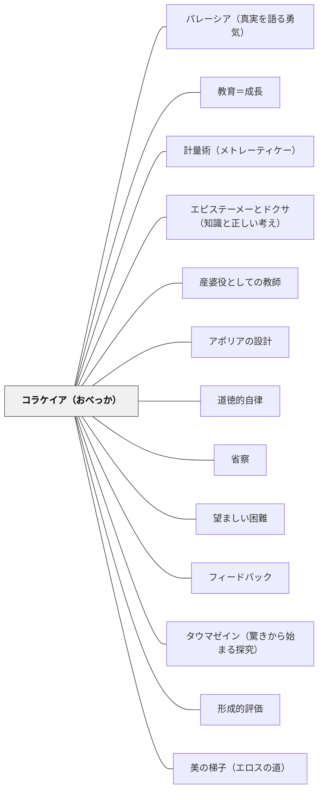

# コラケイア（おべっか）

> 快楽を与えるものと善をもたらすものは、見た目が似ていても、本質が異なる。料理術が医術の偽物であるように、「生徒を喜ばせるだけ」の授業は教育の偽物である。

---

## [Pattern Connection]

### プラトン『ゴルギアス』（前380年頃）——コラケイア：偽の技術の構造（462b〜465e）

本パタンはプラトン『ゴルギアス』の核心的概念「コラケイア（κολακεία / おべっか・追従）」から直接導出される。

ソクラテスは『ゴルギアス』の中盤（462b〜465e）で、人間の身体と魂を世話する仕事を「真の技術（テクネー）」と「偽の技術（コラケイア）」に分類する：

**身体と魂の4真の技術 vs 4偽の技術：**

| 対象 | 真の技術（相手の善を目指す） | 偽の技術（相手の快楽を目指す） |
|---|---|---|
| 身体の善 | 医術（イアトリケー） | 料理術（オプソポイイア） |
| 身体の秩序 | 体操術（ギュムナスティケー） | 装飾術（コスメティケー） |
| 魂の善 | 法律学（ノモテティケー） | ソフィスティケー（詭弁術） |
| 魂の秩序 | 政治術（ポリティケー） | 弁論術（レトリケー） |

コラケイアの3特徴（464d〜e）：
1. 相手の**快楽**だけを目指す（真の善・利益ではなく）
2. 知識を必要としない（経験・習慣・心理操作だけで機能する）
3. **善を装う**——医術や教育に似た見かけをとりながら、本当の善をもたらさない

**既存パタンとの関連：**
- **補強された点**：[[パタン/エピステーメーとドクサ（知識と正しい考え）]] に、「ドクサを生む技術としての弁論術」という具体例が加わる——コラケイアはドクサ（信念・見かけの知識）を生み出す最も典型的な実践形態である
- **波及するパタン**：[[パタン/省察]] — コラケイアを識別するには、自分の授業が「快楽を与えているか善をもたらしているか」を問い直す省察が必要；[[パタン/産婆役としての教師]] — 産婆役は「真の技術（テクネー）」の教師であり、コラケイアの正反対にある；[[文献/ゴルギアス（プラトン）]] — 本パタンの出典

---

### プラトン『饗宴』（前380年頃）——天のエロスと俗のエロス：コラケイアの対極としての「真の愛」（180c–185c）

『饗宴』のパウサニアスの演説は、コラケイアと「真の教育的愛」の違いを、エロスの二分法として直接に論じる。

**二種類のエロス（天vs俗）とコラケイアの構造的対応：**

| | 俗のエロス（パウサニアス） | コラケイア（ゴルギアス） |
|---|---|---|
| 対象 | 体（身体的快楽） | 快楽・見かけの善 |
| 動機 | 快楽の追求のみ | 生徒を喜ばせること |
| 持続性 | 体の美が失われると逃げ去る | 状況次第で変わる |
| 相手の成長 | 相手を善くしようとしない | 相手を本当によくしない |

| | 天のエロス（パウサニアス） | テクネー（真の技術）（ゴルギアス） |
|---|---|---|
| 対象 | 心・知恵・徳 | 魂の真の善 |
| 動機 | 相手の徳・知恵を育てること | 生徒を本当によくすること |
| 持続性 | 知恵は変わらないから愛も変わらない | 真の変化をもたらす |
| 相手の成長 | 相手が優秀な人になるよう導く | 魂の健康・成長をもたらす |

**「徳を得るための奴隷的行為」（184d–185b）：**
パウサニアスの重要な観察——「別の人の助けがあれば知恵などの人徳を手に入れて優秀になれると信じ、自発的に奴隷になろうとする学習者は、恥ずべきことをしているのではない」。天のエロスによる師弟関係は、コラケイアでなく「徳を産む文脈」になる。条件は「相手（教師）が実際に知恵を持ち、学習者を優秀にしようとしているかどうか」——これがテクネー（真の技術）とコラケイア（おべっか）の境界線。

**「アポロドロスのモデル」（172b）：**
宴会の語り手アポロドロスの言葉——「哲学の話はただひたすら楽しいのだが、金持ちの実業家連中の話はうんざりする」。これはコラケイア（世俗的な賞賛・実益の話）に惹かれる者とテクネー（哲学的探究）に惹かれる者の対比として読める。「本当に楽しい」はコラケイア的な快楽でなく、天のエロス的な知的探究の喜びである。

**補強点**：コラケイアの批判（ゴルギアス）が「外から見た評価基準（快楽 vs 善）」であるのに対し、饗宴の天のエロス論は「内側からの動機（誰のために・なんのために愛するか）」の次元を加える。コラケイア的な教師は「俗のエロス」の構造——快楽・体・刹那的なものを追い求め、相手の魂の成長を目指さない——として理解できる。

**波及するパタン**：[[パタン/美の梯子（エロスの道）]] — 天のエロスが導く梯子の上昇 = コラケイアの対極；[[文献/饗宴（プラトン）]] — 本統合の出典

---

## 背景（Context）

教育の場において、教師は常に「生徒のために何かをする」という姿勢で授業を行う。しかし、「生徒のため」という言葉が指し示すものには二種類ある——**生徒を喜ばせること**と**生徒を本当によくすること**である。

医師に例えれば分かりやすい。医師は「患者が食べたいものを食べさせてあげる」ことも「患者に痛い注射をする」こともできる。前者は患者を喜ばせるが健康には貢献しない場合があり、後者は患者が嫌がるが回復をもたらす。料理人（コラケイア）と医師（テクネー）は、ともに「患者の体に関わる」という意味で似ているが、目的がまったく異なる。

教室でも同じ構造が成り立つ。

## 問題（Problem）

「生徒が喜ぶ授業」と「生徒が本当によくなる授業」は、見かけが似ていても本質が異なる。しかし、多くの場合その区別は難しい。なぜなら：

- **コラケイアは善を装う**——「楽しい授業は学習効果が高い」という部分的真実を使って、快楽追求が正当化されやすい
- **即時フィードバックが快楽側に偏る**——生徒の笑顔・高い評価・その場での盛り上がりは即座に見えるが、「本当に力がついたか」は長期的にしか分からない
- **コラケイアの教師は評価されやすい**——生徒・保護者・管理職からの短期的評価は、「楽しく分かりやすい先生」に向きやすい

その結果、教育は「生徒を本当によくする」という本来の目的から離れ、「生徒を喜ばせる」という快楽提供サービスに陥るリスクがある。

## 力のかたち（Forces）

- 真の教育技術（テクネー）は相手を不快にさせることがある——難しい問い、失敗の経験、自分の誤りを直視させること
- コラケイアは即座に相手を喜ばせ、その場の関係を良くする——これは教師にとっても誘惑的
- 生徒は「快楽を与えてくれる教師」を好むことが多い——これが「人気のある先生 = よい先生」という誤解につながる
- 「楽しさ」と「快楽」は同じではない——深い学びには「難しさの中の達成感（楽しさ）」が伴うが、コラケイアの楽しさは困難を回避した快楽である
- 教師自身が生徒に嫌われることへの不安を持つとき、コラケイアへの傾斜が強まる

## 解決（Solution）

**自分の授業・指導が「生徒の快楽」と「生徒の善（成長・真の力の獲得）」のどちらを優先しているかを問い直し、真の教育技術（テクネー）として、生徒の魂の善（力の獲得・思考力・自律性）を主目的に設計する。**

---

### コラケイアの識別：問い直しの技術

教師が自分の授業・指導がコラケイアに陥っていないかを問うための問いのセット：

| 問い | コラケイア側の答え | テクネー側の答え |
|---|---|---|
| 「なぜそうするのか」 | 生徒が喜ぶから / 嫌われたくないから | 生徒の力がつくから / 長期的に善いから |
| 「難しい問いを避けているか」 | はい——生徒が嫌がるから | いいえ——難しさこそが成長の条件 |
| 「フィードバックの基準は何か」 | 生徒の反応・その場の雰囲気 | 生徒の力の変化・長期的成長 |
| 「その褒め言葉は本当か」 | よく分からないが、雰囲気が良くなるから言う | 本当に優れているから言う |
| 「生徒を傷つけることを避けているか」 | はい——関係を壊したくないから | 必要な場合は正直に言う（医師が手術するように） |

### 具体的な実践

**コラケイア的実践の典型例（識別のため）**：
- 誤りを指摘せず「すごい！」「よく頑張った！」と褒め続ける（**装飾術的**）
- 分かりにくい内容を「楽しく」見せることに終始し、深い理解を追わない（**料理術的**）
- 生徒が嫌がる繰り返し練習・難問を省いて「分かった気分」にさせる（**弁論術的**）
- 評価基準を「気持ち」「頑張り」だけにし、本当の力を測らない（**詭弁術的**）

**テクネー（真の教育技術）への転換**：

---

**例1：誤答への正直な関与**
コラケイアの教師は誤答をやんわり流す。テクネーの教師は「それは違う——なぜか考えてみよう」と正直に返す。医師が「痛いかもしれないけれど、これが必要だ」と言うように。

---

**例2：困難を設計する**
コラケイアの授業は生徒が挫折しないよう難易度を下げる。テクネーの授業は適切な困難（[[パタン/望ましい困難]]）を設計し、その中での達成感を育てる。

---

**例3：長期的成長を基準にする**
コラケイアの評価は「今日の授業の雰囲気」。テクネーの評価は「1か月後、半年後に生徒の力が変わったか」。

---

**例4：アポリアを避けない**
コラケイアの教師は「よく分からない状態」を不快として解消しようとする。テクネーの教師はアポリア（困惑）を保持させ、そこから思考が深まることを知っている（[[パタン/アポリアの設計]]）。

## 結果（Consequences）

**テクネー（真の教育技術）を実践したとき：**
- 短期的には生徒が不快になることがあるが、長期的に本当の力が育つ
- 誤りを正直に扱うことで、「自分を正直に見つめる力」が育つ
- 難しさを回避しないことで、学習者の自律性（[[パタン/道徳的自律]]）が育まれる

**コラケイアを続けたとき：**
- 生徒はその場では喜ぶが、本当の力がつかない
- 「楽しかった」という記憶は残るが、1年後には何も残っていない
- 長期的には生徒から「何も教わっていなかった」と評価されるリスクがある（ゴルギアス的政治家の末路として、ペリクレスが最終的に陶片追放されたように）

**識別の困難さを直視する：**
コラケイアと真の技術の境界は常に明確ではない——楽しさと快楽、優しさとおべっかは、表面上似ている。「コラケイアかどうか」を常に問い続ける省察の習慣そのものが、真の教育技術の条件である。

## 関連パタン
- [[パタン/パレーシア（真実を語る勇気）]]
- [[パタン/教育＝成長]]
- [[パタン/計量術（メトレーティケー）]]
- [[パタン/エピステーメーとドクサ（知識と正しい考え）]] — コラケイアはドクサ（見かけの知識）を生む最も典型的な実践形態
- [[パタン/産婆役としての教師]] — 産婆役は真の技術（テクネー）の最も優れた形——「知識を産む」のを助けるのであって、「産んだ気にさせる」のではない
- [[パタン/アポリアの設計]] — アポリア（困惑）を保持させる授業は、コラケイアの最も明確な反対
- [[パタン/道徳的自律]] — 節度（ソーフロシュネー）は魂の真の善——コラケイアが目指す快楽の逆
- [[パタン/省察]] — コラケイアを識別するには、自分の授業の目的を省察する習慣が必要
- [[パタン/望ましい困難]] — 困難を回避しないこと = テクネー；困難を回避させること = コラケイア
- [[パタン/フィードバック]] — 正直なフィードバックはテクネー；褒めるだけのフィードバックはコラケイア
- [[パタン/タウマゼイン（驚きから始まる探究）]] — 驚き・困惑から始まる探究はテクネーの出発点；驚きを与える演出だけで終わるのはコラケイア
- [[パタン/形成的評価]] — 本当の力の変化を測る評価がテクネー；雰囲気だけを測る評価はコラケイア
- [[パタン/美の梯子（エロスの道）]] — 天のエロス（饗宴180c–185c）が導く梯子の上昇はコラケイアの対極；真の愛は相手の魂の成長を目指す

---

## クラスター図

## Actionable Insight

- 今週の授業で「生徒を喜ばせるためにやったこと」と「生徒の力をつけるためにやったこと」を書き出す——コラケイア比率を自分で把握する
- 誤答があったとき「すごい、惜しい！」と流す前に「どこが違うか、一緒に考えよう」と言い直す習慣を作る——医師が「手術が必要」と正直に言うように
- 「生徒が嫌がりそうだから省いた活動」を1つ思い出し、なぜ省いたかを問い直す——コラケイアへの傾斜に気づく機会になる
- 単元末に「本当の力がついたかどうか」を測る課題を設ける——その場の「分かった気分」ではなく長期的成長を評価基準にする

---

## 出典

プラトン（中澤務訳）（2022）『ゴルギアス』光文社古典新訳文庫（K-Bフ 2-7）, pp.462b–465e.
プラトン（中澤務訳）（2013）『饗宴』光文社古典新訳文庫（Bフ 2-4）, pp.180c–185c（天のエロス vs 俗のエロス）. → [[文献/饗宴（プラトン）]]

> 「おべっかというのは、快楽だけを目指して、善と美を考慮に入れることなく、最善なものを追いかけるふりをして無知な人々を誘惑するものだ。」——プラトン『ゴルギアス』464d〜e
