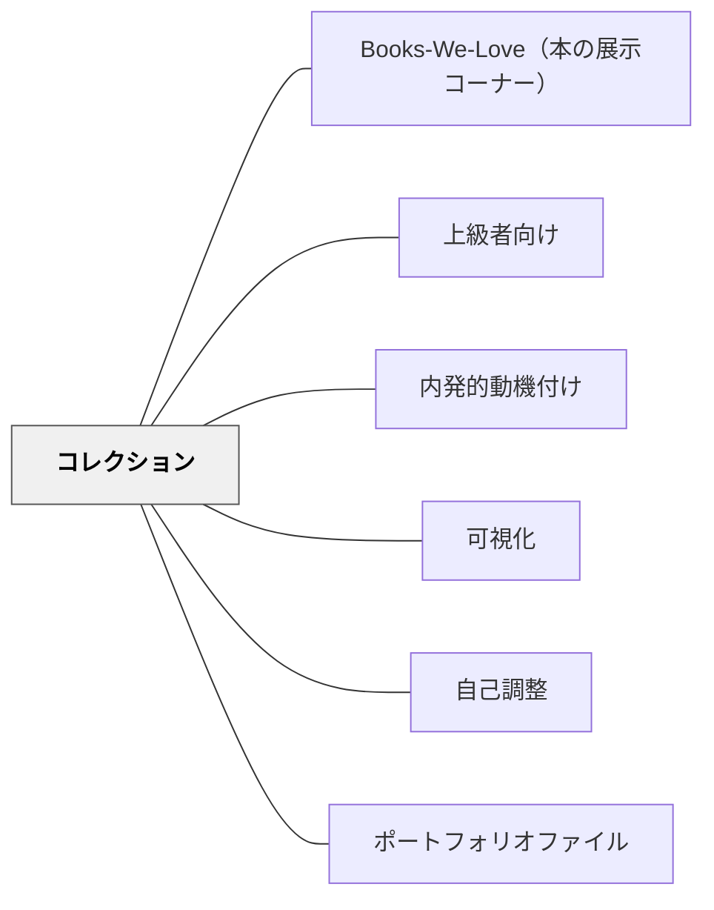

# コレクション

> 集めることが、もっとやりたいという力になる。コレクションの分厚さが達成感の証拠になる。

## 背景（Context）

ゲームにおける「コレクション」の要素——アイテムを集める、図鑑を埋める、実績を解除する——は強力な動機付け機能を持っている。これは教育においても応用できる。

子どもたちが自分の作品・記録・成果物を積み重ねていくとき、その「分厚さ」「量」「多様さ」自体が達成感を生む。コレクションとは単なるポートフォリオではなく、積み重ねの可視化であり、「もっとやりたい」という内発的動機の源泉になる。

## 問題（Problem）

上級者・早く終わる子への対応として「待つ」だけでは、その子の意欲を無駄にしてしまう。また、学習の成果が見えにくいと、達成感が生まれにくく継続の動機が弱まる。

## 力のかたち（Forces）

- 達成感は「もっとやりたい」という動機に直結する
- 分量・蓄積・多様性は目に見える成長の指標になる
- 上級者は「終わった」後に意味のある次の活動が必要
- コレクションは個人内比較——他者との比較ではなく自分の蓄積が基準になる

## 解決（Solution）

**学習の成果物を「コレクション」として積み重ねられる仕組みをつくれ。**

---

### 実践エピソード：自動車くらべ図鑑

小学校1年生の国語「自動車くらべ」（説明文）の実践。子どもたちは各自が好きな自動車（パトカー・救急車・はしご車など）を選び、説明文の同じ組み立て（「〜は〜しごとをします。そのために〜」）にあてはめて自分の説明文を書く。書いた説明文を1ページとして、図鑑に綴じていく。

早く書き終えた子には「次の自動車を調べて書いてみよう」と声をかけた。上級者の図鑑は2枚・3枚と書き重ねて分厚くなっていく——その「分厚さ」自体がコレクションとしての達成感を生む。「僕の図鑑、もうこんなに分厚い」という誇りが、さらに書きたいという意欲につながった。

---

### コレクションが機能する条件

- **自己選択がある**：コレクションするものを自分が選ぶ（自律性）
- **積み重ねが見える**：物理的・視覚的に蓄積が分かる
- **次が常に開かれている**：「もう1つ」の余地が常にある
- **他者と比べない**：「自分の図鑑」が基準——昨日の自分との比較

---

### コレクションとゲーミフィケーション

ゲーミフィケーションの「コレクション要素」（図鑑を埋める、実績バッジを集めるなど）は、学習者が「まだ見ていないものがある」「まだ達成していないことがある」という知覚から生まれる。教育でも同様に、コレクションの「空白」が次の行動への動機になる。

## 結果（Consequences）

- 「もっとやりたい」という内発的動機が育ちやすい
- 上級者・早く終わる子が意味のある活動を自律的に続けられる
- 蓄積が可視化されることで、達成感と自己効力感が高まる
- 個人の成長が個人内比較で評価されるため、他者との比較によるストレスが軽減される

## 関連パタン
- [[実践/ノート指導（読み書きハンドブック・ノート検定）]]
- [[実践/詩を紹介する・詩を創作する]]
- [[実践/書き出しのクラフト]]
- [[パタン/Books-We-Love（本の展示コーナー）]]

- [[パタン/上級者向け]] — コレクションは上級者への豊かな活動として機能する
- [[パタン/内発的動機付け]] — コレクションは自律性・有能感を通じて内発的動機を支える
- [[パタン/可視化]] — 積み重ねを見える形にすることがコレクションの核
- [[パタン/自己調整]] — 自分のペースで積み重ねていく学習の自己管理
- [[パタン/ポートフォリオファイル]] — コレクションの体系的な版

## クラスター図

## Actionable Insight

- 次の作文・説明文の単元で「自分の図鑑（本・集）をつくろう」というゴールを設定する——完成よりも「増やすこと」をゴールにする
- 「早く終わった人はもう1枚」ではなく「終わった人はコレクションに1つ追加」という言葉に変える——達成の概念が変わる
- 子どもの「コレクション」を棚や壁に置き、分厚くなる様子をクラス全体が見られるようにする——他者のコレクションも「やってみたい」という動機になる

## 出典

岩井輝久「教育のパタン・ランゲージ（上級者向け・コレクション記述）」  
Werbach, K., & Hunter, D. (2012). *For the Win: How Game Thinking Can Revolutionize Your Business*. Wharton Digital Press.（ゲーミフィケーションにおけるコレクション要素）
