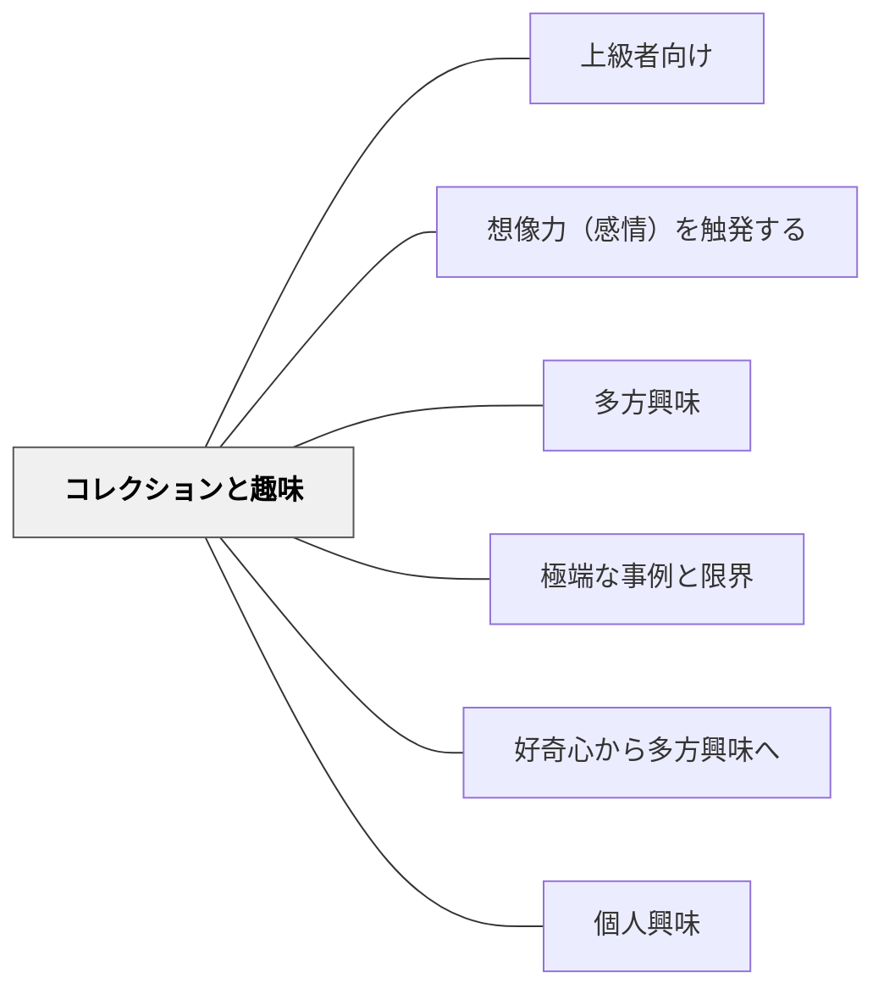

# コレクションと趣味

> 集め、分類し、揃えることへの喜びが、深い探究を生む

## 背景（Context）

子どもはビックリマンシールや切手・石など様々なものを集める。コレクション行動は単なる「もの集め」ではなく、分類・比較・体系化という認知的な喜びと結びついている。

## 問題（Problem）

学習者が「もっと知りたい」「もっと集めたい」という内発的な探究欲をもてないとき、学習は義務的な作業になりやすい。どうすれば学習内容への「コレクション的」な探究欲を引き出せるか。

## 力のかたち（Forces）

- コレクションは「揃えたい」「完成させたい」という達成欲を刺激する
- 分類・比較・命名という認知活動を自然に引き出す
- 学習内容（詩・ことわざ・実験結果・歴史的事実）もコレクションの対象になりうる
- コレクションが目的化し、意味の理解より「集めること」だけが優先される場合がある

## 解決（Solution）

学習内容をコレクションの形で設計する。国語では「お気に入りの詩を集める」活動を行い、学習者が自分のアンソロジーを作る。理科では「観察した生き物の記録集」、社会では「気になる社会問題の事例集」など、学習者が能動的に「集める」活動を組み込む。学習者同士がコレクションを見せ合い、語り合う場も設ける。

## 結果（Consequences）

- 学習者の内発的な探究欲と関与が高まる
- 分類・比較・体系化という高次の思考が自然に生まれる
- コレクション自体の質への反省的評価（「なぜこれを選んだか」）も促す必要がある

## このパタンが働く実践
- [[実践/読書への情熱を育てる実践集]]

| 実践 | どのようにコレクションと趣味が働くか |
|------|--------------------------------------|
| [[実践/俳句と短歌を楽しもう]] | 俳句と短歌のアンソロジーから気に入った作品を選び、言葉を集める楽しさを生む |
| [[実践/詩を紹介する・詩を創作する]] | おもしろい詩集を十分に用意し、紹介したくなる詩を探す活動にする |
| [[実践/言葉をよりすぐって俳句を作ろう]] | 俳句アンソロジーを単元前から読み、語彙と表現の蓄積をつくる |

## 関連パタン
- [[パタン/上級者向け]]

- [[パタン/想像力（感情）を触発する]]
- [[パタン/多方興味]]
- [[パタン/極端な事例と限界]]
- [[パタン/好奇心から多方興味へ]]
- [[パタン/個人興味]]

## クラスター図

## Actionable Insight

- 国語の授業で「今日読んだ作品から『お気に入りの一文』を選んでノートに集め続けよう」という言葉コレクションを作る——「集める」という動機が読む量と質を自発的に高める
- 理科で「観察した生き物・植物の記録集」を単元を通じて積み上げ、最後に自分のフィールドノートとしてまとめる——コレクションの完成という達成感が探究を駆動する
- コレクションを学習者同士が見せ合い「なぜこれを選んだか」を語る場を設ける——選択の理由を語る経験が「集める」から「評価する」という高次の思考へと自然に移行させる

## 出典

キアラン・イーガン（2010）『想像力を触発する教育――認知的道具を活かした授業づくり』北大路書房
