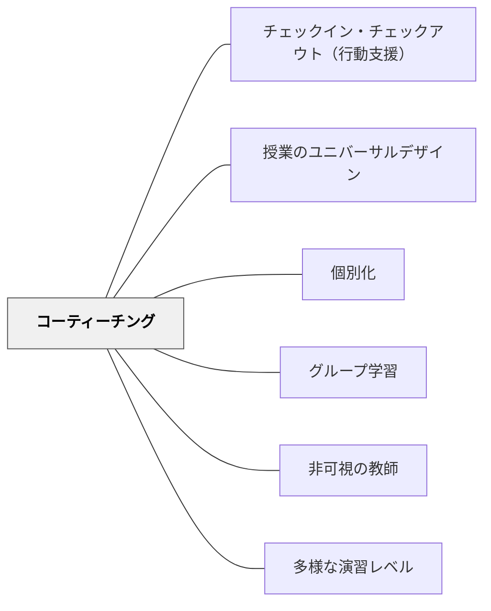

# コーティーチング

> 一人の教師が全員に届けようとするとき、必ずこぼれる子が出る。二人が設計を共有するとき、届く範囲が広がる。

## [Pattern Connection]

- **既存パタンとの関連**：[[パタン/個別化]] の「一人ひとりへの調整」を「二人の教師が分担する構造」として実装する。[[パタン/授業のユニバーサルデザイン]] を「二人の教師が共同設計する体制」として機能させる形態。
- **補強された点**：「特別支援教員は特定の子の隣にいる人」という役割理解を、「授業設計の共同パートナー」へと転換する視点を与える。役割の明確化と事前の計画共有が、コーティーチングの質を決める。
- **修正・拡張された点**：コーティーチングは「毎時間同じ形」ではなく、授業の目的・内容・子どもの状態によって4つの形態を使い分けるものとして設計する。
- **他のパタンへの波及**：[[パタン/非可視の教師]] ——サポートティーチャーが「ピアへの架け橋」になることでクラス全体が相互作用する。[[パタン/グループ学習]] ——補完的ティーチングや並行ティーチングは小グループ運営の可能性を広げる。

## 背景（Context）

インクルーシブ学級では、一般学級担任と特別支援教育教員が同じ教室で授業を行うことがある（日本では「取り出し」ではなく「入り込み」の形態）。しかし、「一人が教え、もう一人が子どもの隣に座っているだけ」という状態では、二人の専門性が十分に生かされていない。

## 問題（Problem）

二人の教師が教室にいても、役割が不明確だと「誰が主で誰が従か」が見えなくなり、授業の設計が担任一人の負担になる。あるいは、特別支援教員がただ特定の子の横に貼り付く形になり、「その子が目立つ」という逆効果が生まれることがある。

## 力のかたち（Forces）

- 二人の専門家が同じ教室にいることは大きなリソースだが、役割が決まっていないと生かせない
- 事前の計画共有なしには、二人の動きが授業中に衝突することがある
- 特定の子への個別サポートは必要だが、「常に隣にいる支援員」は子どもの自立を妨げることもある
- 毎時間同じ形（チームで教える）をしなくていい——授業の性質に合わせて変えられる

## 解決（Solution）

**コーティーチングを「4つの形態の中から選ぶ」設計として捉え、単元・授業・場面ごとに最適な形を事前に計画する。**

---

### 4つのコーティーチング形態

**① チームティーチング（Team Teaching）**

- **形態**：二人の教師が共同で授業全体を計画・実施・評価する。役割と責任を事前に分担し、共有する
- **適する場面**：全体指導、討論、双方向の活動
- **ポイント**：どちらが話しているときも、もう一人は補足・モデリング・板書など積極的な役割を持つ

**② サポートティーチング（Supportive Teaching）**

- **形態**：一人がリードし、もう一人が支援として動く。どちらがリードするかは授業によって変わる
- **適する場面**：一斉授業の中で個別支援が必要な場面
- **ポイント**：サポート役は「特定の子の隣だけ」ではなく、クラス全体を巡回する——特定の子に貼り付くと「その子が特別扱いされている」という印象が強くなる

**③ 補完的ティーチング（Supplemental Teaching）**

- **形態**：全体授業の後、クラスを小グループに分け、一方が復習・再指導・補充を担当し、他方が発展・深化を担当する
- **適する場面**：理解度に差があるとき、事前に小グループで先行指導（プレティーチング）するとき
- **ポイント**：「補完グループ＝できない子」という構造にならないよう、グループの分け方を工夫する

**④ 並行ティーチング（Parallel Teaching）**

- **形態**：二人の教師が別々のグループを同時に指導する。同じ目標・同じ単元を、異なる方法・教材・速度で教える
- **適する場面**：習熟度や学習スタイルの違いが大きいとき
- **ポイント**：二つのグループのゴールは同じにする。教材・難易度は違ってよい

---

### コーティーチングを機能させる共同設計の仕組み

**週次の短時間ミーティング（15分）**
1. 今週の子どもたちの状態の共有（5分）
2. 来週の授業でどの形態を使うかの決定（7分）
3. 試した配慮の効果確認（3分）

**授業計画書の共有フォーマット**
- 授業目標
- どの形態で行うか（チーム/サポート/補完/並行）
- 各自の具体的な役割
- 特定の子どもへの配慮・修正の内容

**役割の「入れ替わり」を定期的に行う**
- 常に同じ担任がリードすると、サポート役が「お客さん」になりやすい
- 月に数回、教科や場面によってリードを入れ替える

## 結果（Consequences）

- 二人の専門性が授業設計に反映され、より多様な学習者に届く授業になる
- 特定の子だけに注意が向く状況が減り、クラス全体の学びが豊かになる
- 特別支援教員の役割が「ついて歩く人」から「共同設計者」に変わる
- 小グループ指導の機会が増え、個別の学習確認がしやすくなる

## 関連パタン
- [[実践/インクルーシブ授業の設計]]
- [[パタン/チェックイン・チェックアウト（行動支援）]]

- [[パタン/授業のユニバーサルデザイン]] — コーティーチングはUDLを実装する体制
- [[パタン/個別化]] — 二人体制で個別化の範囲が広がる
- [[パタン/グループ学習]] — 補完的/並行ティーチングで小グループが機能する
- [[パタン/非可視の教師]] — サポートティーチャーが「ピアへの架け橋」になる形態
- [[パタン/多様な演習レベル]] — 並行ティーチングで難易度別の演習が可能になる

## クラスター図

## Actionable Insight

- 次の授業で特別支援教員と入る前に「今日は②サポートティーチングで」と一言役割を確認する——名前をつけるだけで動き方が変わる
- サポート役のとき「特定の子の隣に座り続けない」を意識する——5分おきに違う子の近くに移動するだけで、サポートの目立ち方が変わる
- 月に1回、「今月のコーティーチングでうまくいったこと・難しかったこと」を5分だけ話す機会を設ける

## 出典

Hammeken, P. A. (2007). *The Teacher's Guide to Inclusive Education: 750 Strategies for Success!* Corwin Press. (2nd ed.)

> "Team Teaching: The teaching responsibilities are predetermined and shared. Supportive Teaching: One teacher leads and the second adult provides support. Supplemental Teaching: The lesson may be presented to the class as a whole and then the class divided into smaller groups to reinforce, re-teach or provide enrichment. Parallel Teaching: Each teacher delivers the lesson to a group of the students." — Hammeken (2007), Chapter 2
