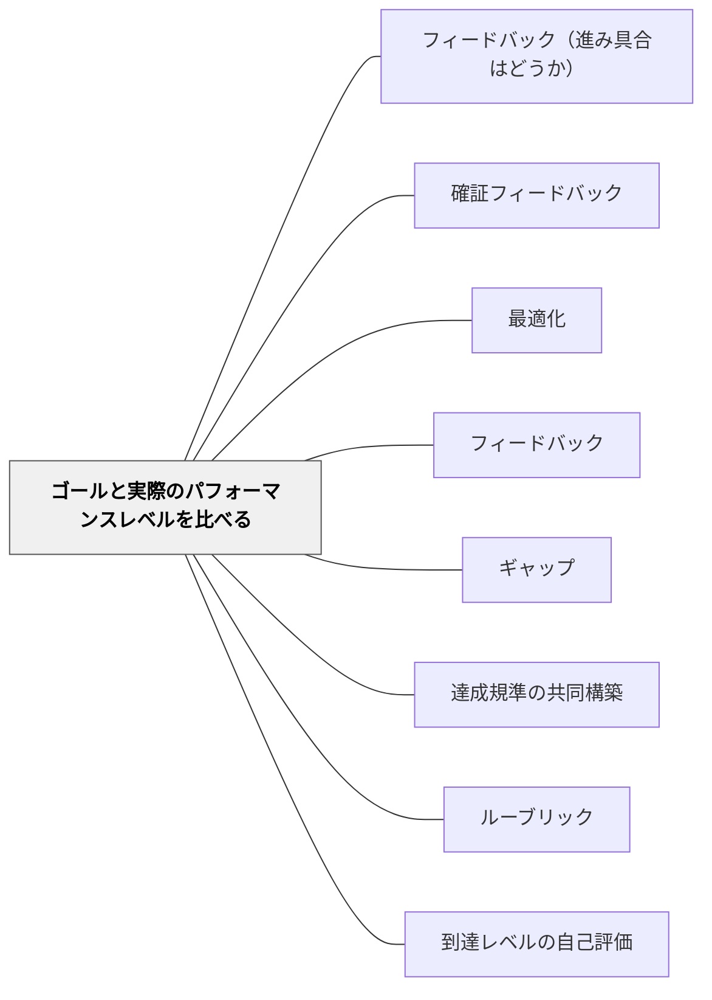

# ゴールと実際のパフォーマンスレベルを比べる

> 理想と現状のギャップを認識することが、改善への動力になる。

## 背景（Context）

ゴールの概念を持った学習者は、次に「今の自分はどこにいるか」を把握する必要がある。ゴールと現状を並べて比較することで、ギャップが明確になり、改善のための具体的な情報が生まれる。

## 問題（Problem）

自分の現状が見えていないと、何を改善すべきかわからない。また、ゴールと現状を別々に意識するだけでは、ギャップは生まれない。二つを「比べる」動作が必要である。

## 力のかたち（Forces）

- 自分のパフォーマンスを客観視することは難しく、支援が必要
- 比較は「批判」になりやすい；「情報」として扱う文化的土台が必要
- ゴールと現状の比較は、過去の自分との比較でも機能する

## 解決（Solution）

**ゴール（達成規準）と現在の作品・パフォーマンスを並べて見ることで、ギャップを可視化する。**

実践例：
- 達成規準チェックリストと自分の作品を照合する
- 優れた実例（モデル）と自分の作品を並べる
- 以前の自分の作品と現在を比べる（ポートフォリオ）
- ルーブリックを使って現在のレベルを確認する

## 結果（Consequences）

- 学習者が改善すべき点を自分で特定できるようになる
- 自己評価の精度が上がり、メタ認知が育つ

## クラスター図

## Actionable Insight

- 達成規準チェックリストを配布し、自分の作品と照合して「できている・まだ」を自分でチェックさせる——二つを並べる動作が「比較」としてギャップを可視化する
- 優れた実例（モデル）と自分の作品を物理的に隣に置き「一番違うところはどこか」と問う——モデルとの比較が批判でなく情報として機能する比較の経験になる
- 以前の自分の作品と現在の作品を並べて「どこが変わったか」を言語化させる——過去の自分との比較がギャップを「批判」でなく「成長」として捉える自己評価の文化をつくる

## 出典

- 一つの教育のパタン・ランゲージ（岩井輝久）

## 関連パタン
- [[パタン/フィードバック（進み具合はどうか）]]
- [[パタン/確証フィードバック]]
- [[パタン/最適化]]

- [[パタン/フィードバック]] — 親パタン
- [[パタン/ギャップ]] — 比較によって生まれるギャップ
- [[パタン/達成規準の共同構築]] — 比較の基準を作る
- [[パタン/ルーブリック]] — 比較を構造化するツール
- [[パタン/到達レベルの自己評価]] — 比較に基づく自己評価
