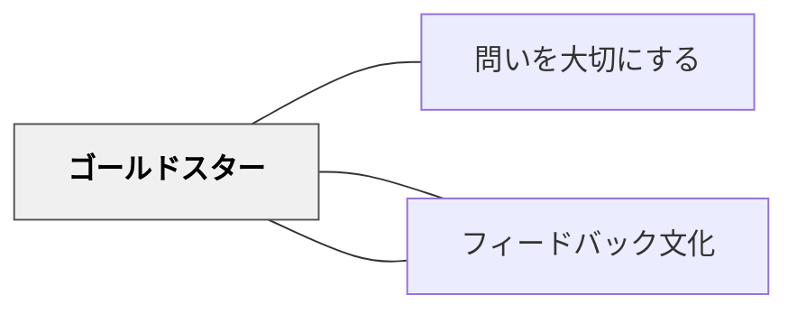

# ゴールドスター

> 優れた行動・成果・姿勢を公の場で称えることが、学習文化を形づくる。

## [Pattern Connection]

- **既存パタンとの関連**：[[パタン/フィードバック]] における「確証フィードバック」の一形態として機能する。また [[パタン/フィードバック文化]] の土台を積み上げる具体的な実践でもある。
- **補強された点**：賞賛は「自己レベルのフィードバック」として効果が低いとされる（ハッティ）が、本パタンが強調するのは「何を称えるか」の一貫性と公開性である。何に対して星を与えるかが学習文化の方向を示す。
- **修正・拡張された点**：「褒める」ではなく「価値の可視化」として捉えると、ゴールドスターは評価文化ではなく学習文化のパタンとなる。
- **他のパタンへの波及**：[[パタン/問いを大切にする]] と組み合わせることで、「問うことが評価される文化」が生まれる。

## 背景（Context）

学習者は優れた仕事をしたとき、それが認められることを必要としている。教師は何が「良い学習」であるかを直観的に知っているが、それを学習者全体に伝える機会を意図的に設けなければ、その価値観は広まらない。

通常、個人への評価やコメントは個別に・非公開で行われる。しかし、学習共同体を育てるためには、「何が価値ある行動か」をコミュニティ全体に示す必要がある。

## 問題（Problem）

学習者は自分が正しい方向にいるかどうか、何が「良い学習者の姿」なのかを常に把握できているわけではない。特に「問いを立てること」「間違いを認めること」「丁寧に仕事すること」など、成果物だけでは見えにくい行動の価値は、明示的に示されなければ伝わらない。

また、称賛が個人的・私的なものだけであれば、学習者全体の焦点が定まらず、何を目指せば良いかが不明瞭なままになる。

## 力のかたち（Forces）

- 学習者は称賛を求めており、それは主要な動機づけ要因の一つである
- 通常の評価構造は非公開であり、「何が価値あるか」が共有されにくい
- 何を称えるかを公に示すことで、他の学習者の焦点を形成できる
- 年齢・発達段階を問わず（博士課程の学生にも）、公の称賛は効果を持つ
- 予期しない称賛は、予期された称賛よりも大きな効果をもたらすことがある
- 文化的文脈によって、公の称賛の受け取られ方は異なる

## 解決（Solution）

**学習者が優れた行動・作業をしたとき、それを公の場で称えよ。** 称えるものは成果物（プロジェクト・作品）だけでなく、学習プロセス上の行動（質問を立てること、失敗から学ぶこと、粘り強く取り組むこと）も含む。

---

### 称えるものの具体例

- 鋭い問いを立てた
- クラス全体の理解に貢献する発言をした
- 丁寧・誠実に作業を完成させた
- 困っている仲間を助けた
- 難しい課題に粘り強く取り組んだ

---

### ゴールドスターの形

**トークン型（物理的・象徴的）**
- 黄色いシール・スタンプ（特に小学校で有効）
- 賞状・カード・修了証

**記録型**
- 学級ニュースレターや掲示板への掲載
- クラスのウェブサイト・学級通信への掲載
- 学習記録への正式な記載

**称賛型**
- 朝の会・帰りの会での口頭での称賛
- 授業中の「みんな、○○さんの問いを聞いてください」

---

### 実践例：問いへのゴールドスター

Joe Berginは、授業で最も多くのゴールドスターを「問いを立てた学習者」に与えると明言している。これは「問うことが評価される」という文化的メッセージを強力に送る実践である。

---

### 注意点

- **一貫性**：何に対して星を与えるかのルールを一定に保つ。恣意的な称賛は不信感を生む。
- **否定しない**：他の学習者の出来の悪さを貶めることは絶対にしない。
- **文化的感受性**：公の称賛が居心地悪く感じる文化・個人があることを理解する。
- **難易度段階**：困難な課題ではゴールド・シルバー・ブロンズのように段階をつけることもできる。

## 結果（Consequences）

- 称えられた学習者の動機づけが高まる
- クラス全体が「何が価値あるか」を理解し、焦点が定まる
- 「問うことが安全である」「間違いを認めることが評価される」という文化が醸成される
- 予期していなかった称賛は特に効果が高く、学習者の記憶に長く残る
- 称えるタイミングと一貫性がずれると、不公平感が生じるリスクがある

## 関連パタン

- [[パタン/問いを大切にする]] — 問いに対してゴールドスターを与えることで問いの文化が育つ
- [[パタン/フィードバック]] — ゴールドスターは公的・確証的フィードバックの一形態
- [[パタン/フィードバック文化]] — 称賛の文化が心理的安全とフィードバック文化の土台になる

## クラスター図

## Actionable Insight

- 今週の授業で「一番良い問いを立てた人」を一人、授業の終わりに名前を挙げて称えてみる——何を称えるかを明示することがそのままクラスへのメッセージになる
- 学習プロセス（粘り強さ・助け合い・問いを立てること）に対して称賛する機会を意図的に作る——成果物だけを称えていないか振り返る
- シール・スタンプなどの小道具を一つ用意し、週に1回「今週のゴールドスター」を渡す習慣を始めてみる——小さくても物理的なトークンは象徴的な意味を持つ

## 出典

Bergin, J., Eckstein, J., Volter, M., Sipos, M., Wallingford, E., Marquardt, K., Chandler, J., Sharp, H., & Manns, M. L. (2012). *Pedagogical Patterns: Advice For Educators*. Joseph Bergin Software Tools. (CC BY-SA 3.0)  
https://www.pedagogicalpatterns.org/

> "As known by every elementary school teacher, this works for young children. It is often unexpected by young adults, and this alone can account for some of its effectiveness." — Bergin et al. (2012)

> "Joe Bergin gives most stars for asking questions." — Bergin et al. (2012)
