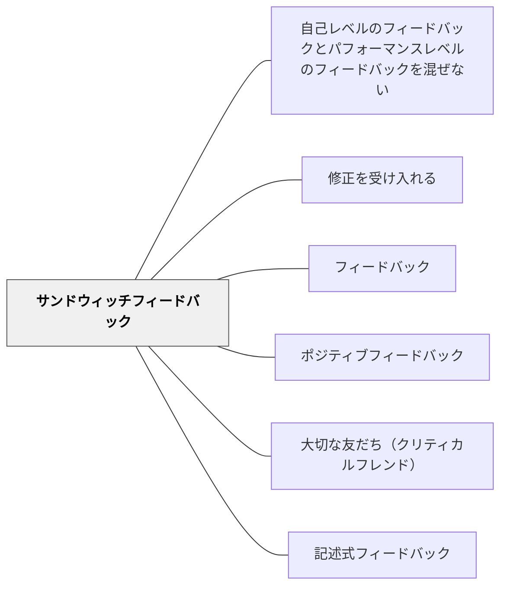

# サンドウィッチフィードバック

> 「よかった点→改善点→よかった点」という順序でフィードバックを構造化する。批評を受け入れやすくする工夫だが、使いすぎると形式化する。

## [Pattern Connection]

Bergin et al.（2012）の **Feedback Sandwich \*\*** パタンは、[[パタン/ピアフィードバック]] の実施プロトコルとして明示的に位置づけられる。

- **補強点**：PPでは「ピアフィードバックを導入するとき、まずフィードバックの与え方を丁寧に教え、建設的なものにすること」と明記——サンドウィッチフィードバックはピアフィードバック文化を安全に立ち上げるための最初のプロトコルとして機能する
- **拡張点**：PPのコンテキストでは、パタン・カンファレンスのライターズワークショップ（著者が同席し、グループが厳格な評価ルールに従ってレビューする）がサンドウィッチフィードバックの実践例として示されている——これは批評が「攻撃」にならない文化的モデル
- **他のパタンへの波及**：[[パタン/修正を受け入れる]] — サンドウィッチで受け取ったフィードバックを成果物改善に使う。[[パタン/ゴールドスター]] — ポジティブ部分を「公開称賛」として拡張するオプション

---

## 背景（Context）

フィードバックを伝えるとき、特に改善を求める批評的な内容を含む場合、受け取る側が防衛的になったり傷ついたりするリスクがある。そのため、批評をどのような順序・文脈で伝えるかは、フィードバックの効果に大きく影響する。

サンドウィッチフィードバック（Hamburger Feedback、Shit Sandwich とも呼ばれることがある）は、「ポジティブ→ネガティブ→ポジティブ」の三層構造でフィードバックを組み立てる方法として広く知られている。感情的なクッションを用意することで、批評の部分を伝えやすくする意図がある。

## 問題（Problem）

改善点だけを伝えると、学習者が防衛的になったり自信を失ったりすることがある。一方で、ポジティブな言葉でネガティブな内容を包むと、重要な改善点が印象に残りにくくなるという問題がある。学習者は「最初と最後のポジティブな言葉」を記憶し、中間の改善点を軽視することがある。

また、このパターンを習慣的に使いすぎると、学習者は「ポジティブな言葉の後に必ず批評が来る」と学習し、最初の称賛を「批評の前置き」として構えて聞くようになる。形式化すると本来の効果が失われる。

## 力のかたち（Forces）

- ポジティブから始めると受け取る側の防衛反応が和らぎ、批評を聞く余地が生まれる
- 改善点を中間に置くと、記憶に残りにくく行動変容につながりにくい
- 繰り返し使うと学習者がパターンを見抜き、形式的な儀式として機能しなくなる

## 解決（Solution）

サンドウィッチフィードバックは、関係性が浅い場合や、フィードバックの文化がまだ育っていない段階で批評を伝えるための足場として活用する。ただし、改善点を「真ん中だから軽い」という印象にしないよう、改善点の部分を具体的かつ行動可能な形で明確に述べることが重要である。

フィードバック文化が成熟し、[[パタン/大切な友だち（クリティカルフレンド）]]のような関係性が育ってきたら、構造に頼りすぎず内容で勝負するフィードバックへ移行することを検討する。サンドウィッチは手段であり目的ではない。改善点が確実に伝わっているかを確認するために、学習者が自分の言葉で改善点を言い直す機会を設けると有効である。

## 結果（Consequences）

- 関係性が浅い場面では批評を伝えやすくなる
- 使いすぎると儀式化し、改善点が伝わらない「形式的なフィードバック」になる
- 学習者が構造を先読みすることで、ポジティブな言葉の信頼性が損なわれる場合がある

## 関連パタン
- [[パタン/自己レベルのフィードバックとパフォーマンスレベルのフィードバックを混ぜない]]
- [[パタン/修正を受け入れる]]

- [[パタン/フィードバック]] — 親パタン
- [[パタン/ポジティブフィードバック]] — サンドウィッチのポジティブ部分に対応
- [[パタン/大切な友だち（クリティカルフレンド）]] — 構造に頼らない誠実なフィードバック関係
- [[パタン/記述式フィードバック]] — 内容の具体性を高める手段

## クラスター図

## Actionable Insight

- フィードバック文化が育っていない初期の段階で、改善点を伝えるときのみサンドウィッチ構造を使う——慣れてきたら構造に頼らず内容で直接伝える関係へ移行する
- サンドウィッチの中間の改善点を「次にどうするか」という具体的な行動として書く——改善点が曖昧だとサンドウィッチは儀式化して何も伝わらなくなる
- フィードバックを受けた後「改善点を自分の言葉で言い直す」機会を設ける——重要な情報が届いているか確認することでサンドウィッチの弱点を補える

## 出典

Stone, D. & Heen, S. (2014). *Thanks for the Feedback*. Viking.
