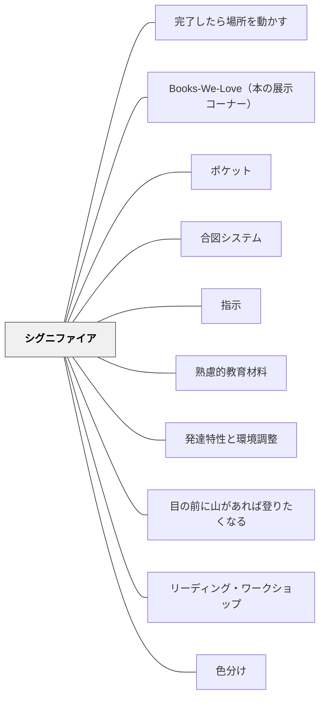

# シグニファイア

> 「何ができるか」が分かる教材が、学習者を自然に導く。— D.A. ノーマン

## Pattern Connection

### 岩井輝久（2023）——シグニファイアは可視化の小パタン

> 「シグニファイアは可視化の一部だな。可視化にもいろいろなパタンがあるけど、可視化という大パタンの中の一つの小パタン。そういう関係になっていそうだ。」（岩井輝久、2023）

- **既存パタンとの関連**：[[パタン/可視化]] はすでに「アフォーダンス・シグニファイア（教材の可視化）」を内部アプローチ②として記述している。岩井の洞察はこの構造を明示的に言語化したもの——シグニファイアは「見えないことをボトルネックとする」という大パタン・可視化の具体的実装である
- **補強された点**：シグニファイアをノーマンの概念として独立させるだけでなく、「大パタンの中の小パタン」として位置づけることで、パタン・ネットワーク上の構造的な立ち位置が明確になる。これはパタン・ランゲージを「大パタンから小パタンへ」という階層として読む視点（[[自分のパタンを作る]] の三層構造）とも対応する
- **他のパタンへの波及**：[[パタン/可視化]]（親パタン——シグニファイアはその実装の一形態）・[[パタン/目の前に山があれば登りたくなる]]（「次ができることを知覚させる」という機能でシグニファイアと重なる）

---

## 背景（Context）

D.A. ノーマン（「デザインと人間行動」）の概念。シグニファイアとは、ある道具・教材を知覚した時に「これで何ができるか・何をするか」を示す指標となる要素のこと。良い教材は、学習者が見ただけで「どう使うか」が分かるようにシグニファイアが設計されている。対応づけ・概念モデルとも深く関連する。

## 問題（Problem）

教材の使い方が分かりにくいと、学習者は教材の操作そのものに認知的エネルギーを使ってしまい、本来の学習に集中できない。

## 力のかたち（Forces）

- 直感的に使えるシグニファイアが学習者の認知負荷を下げる
- 名前を書く欄・ポケット・色分けもシグニファイアの一例
- 過剰なシグニファイアはかえって混乱を生む

## 解決（Solution）

**教材の各要素が「何をするためのものか」を学習者が見ただけで理解できるよう、視覚的・構造的なシグニファイアを設計する。**

実践例：
- 名前を書く欄がある（「自分のもの」という所有の知覚）
- ポケットがある（「ここに入れる」という行動を誘導）
- 色分けで意味の違いを示す
- 矢印・番号で手順を示す

## 結果（Consequences）

- 学習者が教材の使い方を直感的に理解できる
- 教材の説明時間が減り、学習時間を確保できる

## 関連パタン
- [[パタン/完了したら場所を動かす]]
- [[教科/算数]]
- [[学級経営/オンボーディング]]
- [[特別支援/TEACCHとシグニファイア]]
- [[特別支援/特別支援級の算数指導]]
- [[実践/個別教材の設計]]
- [[実践/発達特性別の環境調整]]
- [[パタン/Books-We-Love（本の展示コーナー）]]
- [[パタン/ポケット]]
- [[パタン/合図システム]]
- [[パタン/指示]]
- [[パタン/熟慮的教材教具]]
- [[パタン/発達特性と環境調整]]
- [[パタン/目の前に山があれば登りたくなる]]

- [[パタン/リーディング・ワークショップ]] — 読書コーナーの設計にシグニファイアが働く
- [[パタン/色分け]] — 色による意味の伝達

## このパタンが働く教材

| 教材 | どのようにシグニファイアとして働くか |
|------|--------------------------------------|
| [[教材/リーディング・ワークショップの小さい付箋]] | 本文中の話したい箇所、根拠になる箇所、分からなかった箇所を目に見える印として示す |

- [[パタン/熟慮的教材教具]] — 親パタン
- [[パタン/対応づけ]] — シグニファイアの詳細実装
- [[パタン/概念モデル]] — 使い方のメンタルモデル
- [[パタン/名前を書く欄がある]] — シグニファイアの実例

## クラスター図

## Actionable Insight

- 新しいワークシートを渡すとき「名前を書く欄・記入欄・参照欄」を視覚的に区別して設計する——学習者が見ただけで使い方が分かる教材は説明時間を減らし学習時間を増やす
- 教材の手順を矢印や番号で示す——「次に何をすべきか」を学習者が自分で判断できる構造が自律的な活動を支える
- 色分けや形の違いで「これとこれは意味が違う」ことを示す——視覚的な差異が認知的負荷を下げ本来の学習に集中させる

## 出典

- D.A. ノーマン（1990）『誰のためのデザイン？――認知科学者のデザイン原論』新曜社
- [[文献/熟慮的教育材料のパターンリスト（動画記録）]]
