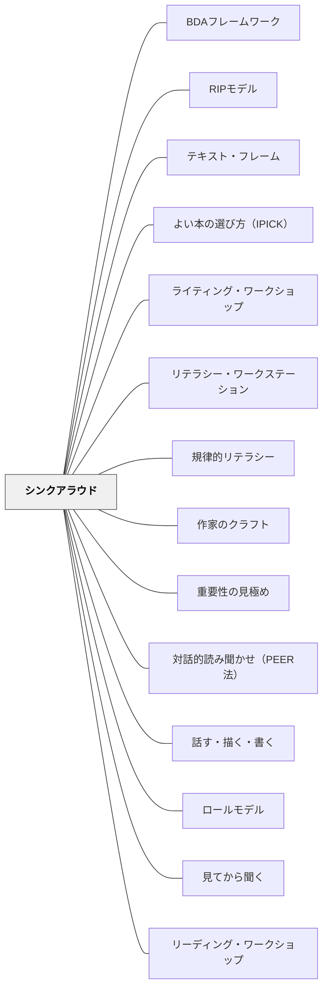

# シンクアラウド

> 「今、こんなことを考えています」——教師が声に出して考えるだけで、見えなかった読みの過程が子どもたちに届く。

## [Pattern Connection]

Harvey & Goudvis（2007）の **Strategies That Work** は、読解ストラテジー指導の中核に「シンクアラウド（Think-Aloud）」を置く。教師が読みながら声に出して考えることで、熟練した読者がテキストに対してどう関わるかを「見える化」する。これは既存の [[パタン/見てから聞く]] の「まず体験」の逆——読書においては、教師の「思考のモデル」を先に見てから、子どもたちが自分で試す。

- **補強点**：[[パタン/ロールモデル]] に「読みの思考過程を開示する教師」という具体的な形態を与える
- **拡張点**：シンクアラウドは単独の技術でなく、「段階的手放しモデル（Gradual Release of Responsibility）」の入口として機能する——教師のモデリング → ガイドされた練習 → 協働練習 → 独立実践
- **他のパタンへの波及**：[[パタン/リーディング・ワークショップ]]・[[パタン/読みとつながる]]・[[パタン/推論する（インファリング）]]

**Harvey & Goudvis（2007）Authentic Application 追補（2026-05-17）：**

*Strategies That Work* 第2版は、段階的手放しモデルの最終段階「Authentic Application（本物の場面での応用）」が実際にどう見えるかを教室事例で示す。

Glenda Clearwater（4〜5年複式学級）の事例：読解ストラテジーの指導から数ヶ月後、子どもたちは独立読書中に自分が選んだ本でストラテジーを使い始めた——推論の付箋を貼りながら笑い、「先生、この本すごいつながりがある」と声をかけてくる。Glenda はそれに対し「どんなつながり？」と問いを返す。授業の構造の外で、子どもたちが自分から考え始めている——これが Authentic Application の姿である。

**ノンフィクションでのシンクアラウド**：

Harvey & Goudvis は理科・社会のテキスト（教科書・説明文）でのシンクアラウドも重視する。フィクションとは異なり、ノンフィクションのシンクアラウドでは：

- テキスト特徴（見出し・グラフ・太字）を見て「I Wonder」を声に出す
- 「この見出しを見て……私はこういうことを予想します」とOverviewing を示す
- 「この図と本文のつながりが分からない——Huh?（立ち止まって図のキャプションを読む）」

Margaret Bobb（5年生理科担当）の事例：地球科学の教科書を使い、生徒の前で「地球の内部構造」の図を見ながら「この図は何を示しているか？」と声に出して推論する Think-Aloud を行った。生徒たちは教科書を「覚えるもの」ではなく「考えるもの」として見始めた。

- **補強された点**：シンクアラウドはフィクションだけでなく、すべての教科の説明テキストに使える。「教科書を読む」という授業でも教師のシンクアラウドは有効
- **拡張された点**：Authentic Application では教師は「観客」になる——子どもが自分でストラテジーを使うとき、教師の役割は質問・確認・フィードバックへと変わる

**Buehl（2017）統合（2026-05-15）：**

*Classroom Strategies for Interactive Learning* は、シンクアラウドを **BDA フレームワーク（[[パタン/BDAフレームワーク]]）の During（読む間）フェーズ** に位置づける。

- **補強された点**：シンクアラウドは「どんなストラテジーも教えるときに使えるモデリング技法」としてだけでなく、「読む間の思考を可視化するテクニック」として During の主要方略の一つになる——特に新しいテキスト・フレーム（[[パタン/テキスト・フレーム]]）や読解方略を初めて教えるときの入口として機能する
- **拡張された点**：シンクアラウドで声に出す内容が、Before で設定した問い（アンティシペーション・ガイドへの回答）や During でのテキスト・コーディングと連動して、読みの全体像を子どもに見せられる
- **他のパタンへの波及**：[[パタン/アンティシペーション・ガイド]] — Before での問いが During のシンクアラウドに持ち込まれる。[[実践/BDA読解授業の設計]] — シンクアラウドが BDA 授業設計の During 方略として使われる

**Buehl（2014）Chapter 4統合（2026-05-19）——規律的リテラシーのシンクアラウド：**

Buehl は Chapter 4 で、シンクアラウドを**規律的リテラシー（disciplinary literacy）の指導において最も強力なツール**と位置づける。教科の専門家（歴史家・科学者・数学者）がどのように読むかを、教師がシンクアラウドで「見える化」することが段階的手放しモデルの出発点になる。

- **補強された点**：シンクアラウドは「読み方の一般的なモデリング」を超え、**教科固有のレンズ（disciplinary lens）を内面化させるための媒介**として機能する——数学教師が「著者はここで何を読者がすでに知っていると仮定しているか？」と声に出すことが、数学テキストの読み方のモデルになる
- **数学テキストのシンクアラウド例**（絶対値の単元より）：「Integers——著者はここで whole numbers を定義せずに使っている。読者がすでに知っていると仮定しているんだ。Absolute value——これが少し混乱する。もう一度丁寧に読み直してみます。'distance from 0'——0からの距離、ということは絶対値は常に正の数として表されるはずだ」
- **拡張された点**：教科横断的なシンクアラウドの設計基準が生まれた——どの教科でも「著者が読者に何を知っていると前提しているか」という問いが Hidden Knowledge（隠れた前提知識）を浮かび上がらせる共通の問いとして使える
- **他のパタンへの波及**：[[パタン/規律的リテラシー]] — 10の disciplinary lens は、それぞれのシンクアラウドの内容の型として機能する

Debbie Miller（2002）の **Reading with Meaning** はこのパタンに重要な視点を加える。Miller の中核原理 **「読者を教える、読みを教えない（Teach the reader, not the reading）」** は、シンクアラウドの目的を明確にする——特定の本の読み方を教えるためではなく、どんな本にも通用する「読者としての力」を育てるためにモデリングする。Gradual Release の最終段階「Authentic Application（本物の場面での応用）」を明示したのも Miller であり、「独立した実践」で終わらず「自分の好きなテキストで自然にストラテジーを使う」ところまで見届けることを強調する。

**Miller（2002）シンクアラウドの詳細（2026-05-18追補）：**

- **計画の必要性**：Miller は最初に The Wall（Eve Bunting）でシンクアラウドを試みて失敗——計画なしに始めると思考がテキストに入り込まず、「つながりを作っているふり」になってしまった。「The Wall の失敗」として振り返り、事前に本を選び、どこで立ち止まるかを計画することが必須と学んだ
- **真正性の原則**：シンクアラウドは「教師が作り話をすること」ではなく「自分が本当に体験していることを声に出すこと」——The Relatives Came で実際に思い出した親族訪問の記憶を語る。Night Sounds, Morning Colors で実際の El Capitán 列車の思い出（カンザスの平原・食堂車のシナモンロール）を語る。自分の本当の体験・記憶を語ることが子どもに届く
- **書籍選択の基準**：シンクアラウドに向く本は「自分が本当に考えながら読む本」。テキストが子どもの生活と十分なつながりを持てること、複数のストラテジーが自然に生まれること
- **GRR との接続**：Miller の授業では「一緒に考える（Having at it）」が全体指導の中心——教師がシンクアラウドを終えたらすぐに「あなたの番、eye-to-eye and knee-to-knee で話して」と渡す

---

## 背景（Context）

読解は、頭の中で起きる見えないプロセスである。熟練した読者は、読みながら自分の経験と結びつけ、問いを立て、先を予測し、意味が崩れたら立ち止まり、イメージを作り、推論する。しかし初心者の読者には、このプロセスが見えない。

学校では「本文を読んで問いに答えなさい」という指示が多いが、どのように考えればよいかを示すことが少ない。子どもたちは「読んで考える」という作業を、試行錯誤なく独力でやることを求められている。

## 問題（Problem）

読解ストラテジーを「教える」だけでは、子どもたちはそれを自分の読書に応用できない。「つながりをつくりなさい」と指示しても、何をすることか分からない。熟練した読者の思考過程が見えないために、初心者は「どこに向かって考えればいいか」が分からない。

## 力のかたち（Forces）

- 思考は目に見えない——「考え方」を見せる方法が必要
- モデリングは「やり方を教える」ではなく「考えの様子を開示する」——正解を示すのでなく、混乱も含めて思考を見せる
- 長すぎるモデリングは逆効果——子どもたちは聴衆になってしまう（「指導は短く、実践は長く」Harvey & Goudvis）
- 段階的に責任を移行しないと、子どもたちは「教師がやること」と見なす

## 解決（Solution）

**読みながら声に出して考えることで思考過程を見える化し、段階的に学習者へ主体を移していく。**

### 段階的手放しモデル（Gradual Release of Responsibility）

| 段階 | 教師の役割 | 子どもの役割 |
|------|-----------|-------------|
| **Teacher Modeling（教師のモデリング）** | 声に出して考える（2〜3分） | 観察・聴く |
| **Guided Practice（ガイドされた練習）** | 全体の対話を誘導・足場がけ | 考え、試し、共有する |
| **Collaborative Practice（協働的練習）** | グループを見回り、個別に応答 | ペア・小グループで思考を共有 |
| **Independent Practice（独立した実践）** | フィードバックを与える | 一人でストラテジーを試す |
| **Authentic Application（本物の読書場面）** | 環境を整える | 好きなテキストで自由に使う |

> 「ほとんどの指導時間はガイドされた練習に使う。モデリングは2〜3分で切り上げ、すぐに子どもたちを実践へ送り出す」——Harvey & Goudvis（2007）

---

具体例①：「つながり」のシンクアラウド

先生が絵本を読みながら声に出す：

> 「（読み止まって）あ、今ここを読んだら、去年家族でキャンプに行ったときのことを思い出しました。この登場人物もテントを張っているから。これは自分の体験とのつながり（Text-to-Self）ですね。こういうつながりが浮かぶと、登場人物の気持ちがよりよく分かる気がする」

子どもたちは「ああ、先生もそういうことを考えながら読んでいるんだ」と知る。

---

具体例②：「Huh?」のシンクアラウド（モニタリング）

> 「（読み止まって）あれ、今ここが全然わからなくなった。なんで急に別の場面に飛んだんだろう。（付箋を取り出して）『Huh?』って書いて貼っておきます。混乱したことを記録しておくと、後で戻ってきたときに確認できるから」

---

具体例③：「推論」のシンクアラウド

> 「この写真では笑っていないけど、でもプレゼントを受け取っている。嬉しくない? それとも写真が苦手なのかな? テキストにははっきり書いていないけど、この子はプレゼントを嬉しいと思っていると私は推論しています。なぜかというと…」

---

## 結果（Consequences）

- 「読むこと」の見えない思考プロセスが学習者に見える
- 「先生も混乱することがある」「わからないのは普通のこと」という文化が生まれる
- 子どもたちが自分の読書にストラテジーを転用し始める
- 読書が「答えを出す作業」から「考えを構築する過程」に変わる

## 関連パタン
- [[実践/テキストコーディング]]
- [[実践/ライティング・ワークショップ年度初め]]
- [[実践/リテラシー・ワークステーションの起動]]
- [[実践/思考の記録サイクル]]
- [[実践/書き出しのクラフト]]
- [[パタン/BDAフレームワーク]]
- [[パタン/RIPモデル]]
- [[パタン/テキスト・フレーム]]
- [[パタン/よい本の選び方（IPICK）]]
- [[パタン/ライティング・ワークショップ]]
- [[パタン/リテラシー・ワークステーション]]
- [[パタン/規律的リテラシー]]
- [[パタン/作家のクラフト]]
- [[パタン/重要性の見極め]]
- [[パタン/対話的読み聞かせ（PEER法）]]
- [[パタン/話す・描く・書く]]

- [[パタン/ロールモデル]] — 思考過程を開示することの上位パタン
- [[パタン/見てから聞く]] — 体験先行の授業設計との対比・接続
- [[パタン/リーディング・ワークショップ]] — シンクアラウドが機能する授業構造
- [[パタン/メタ認知的モニタリング]] — 「Huh?」コードの理論的基盤
- [[パタン/読みとつながる]] — シンクアラウドで最も教えやすいストラテジー
- [[パタン/推論する（インファリング）]] — 行間を読む思考をモデリングする
- [[パタン/会話から問いを引き上げる（Lifting a Prompt）]] — 対話から引き上げた問いにシンクアラウドでモデルを示すときの接続
- [[パタン/能動的関与]] — 段階的手放しが能動的関与を生む
- [[パタン/アンカーチャート]] — シンクアラウドで生まれた思考を教室に定着させる
- [[実践/カンファリング（読書会議）]] — 子どもが自分の読みを言語化する1対1の場
- [[パタン/可視化]] — 思考の見える化の上位パタン
- [[パタン/段階的手放し]] — Gradual Release モデルの全体設計パタン
- [[パタン/読解の7プロセス]] — シンクアラウドで教える読解ストラテジーの体系
- [[パタン/思考の可視化]] — 声に出すことで思考が他者に届く
- [[パタン/ミニレッスン・サイクル]] — シンクアラウドはミニ・レッスンのモデリングパートを担う
- [[パタン/問いをもつ（クエスチョニング）]] — シンクアラウドで最も頻繁にモデリングされるストラテジー
- [[パタン/統合する（シンセサイジング）]] — 読書全体を通した思考の統合をシンクアラウドで示す
- [[パタン/作家のように読む]] — 書き手の視点で読むことをシンクアラウドでモデルにする
- [[パタン/共有読書（Shared Reading）]] — 全体での声に出しての読みとモデリングの場

## クラスター図

## Actionable Insight

- 今週の読み語りで1回だけ「（立ち止まって）今こんなことを考えました」と声に出してみる——子どもたちの顔が変わる瞬間がある
- モデリングは2〜3分で切り上げる——「先生が長く話す」は子どもが「聴衆」になるサイン
- 「わからなくなった」「混乱した」を声に出すことが最も強いモデリング——完璧な読者を演じるより、正直な思考過程を見せる
- 算数の文章問題を解くとき「まず読んで気づいたことを声に出す」デモを1回行う——読解だけでなく算数思考のモデリングにもなる
- 子ども同士がペアでシンクアラウドし合う10分を設ける——聴き手になることで自分の思考との違いが見える
- 「先生はここで迷いました」という迷いの言語化を意識する——正解への道より「考えること」そのものの手本を見せる

## 出典
- [[文献/Teaching for Deep Comprehension（Dorn & Soffos）]]
- [[文献/Classroom Strategies for Interactive Learning（Buehl）]]

Harvey, S., & Goudvis, A. (2007). *Strategies That Work: Teaching Comprehension for Understanding and Engagement* (2nd ed.). Stenhouse Publishers.

> "We model for only a few minutes, just long enough to get our point across, and then quickly engage kids in guided practice. Most of our instructional time is spent in guided practice."

Miller, D. (2002). *Reading with Meaning: Teaching Comprehension in the Primary Grades*. Stenhouse Publishers.

> "Teach the reader, not the reading."

[[文献/Strategies That Work（Harvey & Goudvis）]]
[[文献/Reading with Meaning（Miller）]]
