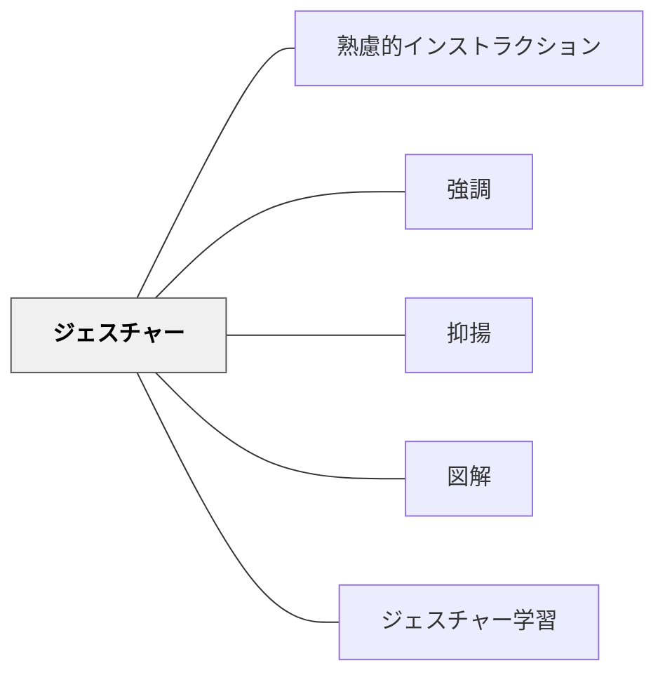

# ジェスチャー

> 身体動作で言語メッセージを補完し、理解と記憶を助ける。

## 背景（Context）
コミュニケーションはマルチモダールである。言語情報だけでなく、身体動作（ジェスチャー）は意味の伝達において重要な役割を果たす。認知科学の研究では、ジェスチャーを伴う説明は言語のみの説明より理解・記憶が促進されることが示されている。教育の場でジェスチャーは自然に使われているが、意図的に設計されることは少ない。

## 問題（Problem）
言語だけでは伝わりにくい大きさ・形・方向・順序・関係性などの情報がある。ジェスチャーなしで「大きな円を描くように」「順番に並べて」と言葉だけで説明すると、受け手が具体的なイメージを掴みにくい。言語と身体動作が乖離していると、受け手に矛盾したメッセージが届く。

## 力のかたち（Forces）
- ジェスチャーは言語を補完するが、過剰なジェスチャーは注意を分散させる
- 文化によってジェスチャーの意味が異なることがある
- ジェスチャーは無意識に出ることが多いが、意識的に使うことで教育効果が高まる
- 学習者のジェスチャーを読むことで理解状況の把握にも使える

## 解決（Solution）
**「大きさ」を両手で示す、「順番」を指で数える、「方向」を腕で指し示す、「二つの対比」を左右の手で表すなど、言語メッセージに合わせた意図的なジェスチャーを使う。**
説明の前に自分が使うジェスチャーを意識し、言語と身体動作を一致させる。抽象的な概念には身体で表現できるアナロジーを使う（例：「重なる」概念を両手を重ねて示す）。学習者自身にジェスチャーを使って説明させることで、身体的な記憶の定着を促すこともできる。

## 結果（Consequences）
- 言語情報と身体情報の統合により理解と記憶が促進される
- 多様な認知スタイルを持つ学習者への対応力が高まる
- 教師の表現が豊かになり、説明への注意・関心が持続しやすくなる

## クラスター図

## Actionable Insight

- 「大きさ」を両手で示す、「順番」を指で数えるなど、言語メッセージに合わせた意図的なジェスチャーを使う——言語情報と身体情報の統合により理解と記憶が促進される
- 抽象的な概念には身体で表現できるアナロジーを使う（例：「重なる」を両手を重ねて示す）——身体的な表現が抽象的な概念への手がかりになる
- 学習者自身にジェスチャーを使って説明させる——身体的な記憶の定着を促す

## 出典

- 一つの教育のパタン・ランゲージ（岩井輝久）

## 関連パタン
- [[パタン/熟慮的インストラクション]] — 親パタン
- [[パタン/強調]] — 強調手段としてのジェスチャー
- [[パタン/抑揚]] — 声とジェスチャーの組み合わせ
- [[パタン/図解]] — 空間・関係の視覚化との連動
- [[パタン/ジェスチャー学習]] — 学習者自身がジェスチャーで学ぶパタン
