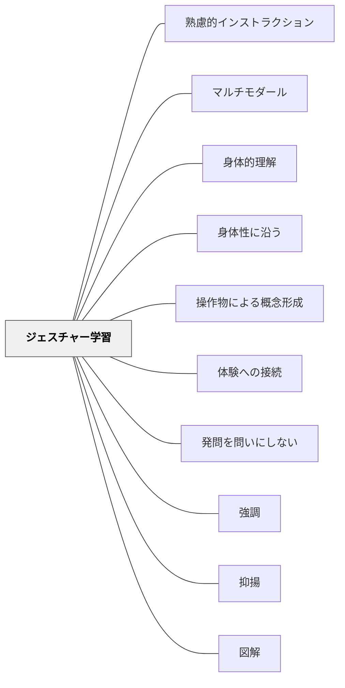

# ジェスチャー学習

> 教師が意図的なジェスチャーで言語を補い、学習者がジェスチャーを使って概念・感情・関係性を身体で表現することで、理解と記憶を深める。

## 背景（Context）

※旧パタン「ジェスチャー」を本ページに統合（2026-06-13）

[[パタン/身体性に沿う]] として、身体の動きを学びに組み込みたい。物を手に取れない場面でも、自分の身体そのものを使って概念・感情・関係性を表現することができる。研究によれば、学習者がジェスチャーを使いながら考えるとき、言語化が難しい「理解の途中段階」が手の動きに現れることがある。

コミュニケーションはマルチモダールである。言語情報だけでなく、身体動作（ジェスチャー）は意味の伝達において重要な役割を果たす。認知科学の研究では、ジェスチャーを伴う説明は言語のみの説明より理解・記憶が促進されることが示されている。教育の場でジェスチャーは自然に使われているが、意図的に設計されることは少ない。

## 問題（Problem）

言語だけで概念を処理しようとすると、言葉にまだなっていない直感的理解が見えなくなる。また「わかった」かどうかが本人にも教師にもわかりにくい。身体表現の機会がないと、学習が「聞く・書く」だけに偏り、身体が学びから切り離される。

言語だけでは伝わりにくい大きさ・形・方向・順序・関係性などの情報がある。ジェスチャーなしで「大きな円を描くように」「順番に並べて」と言葉だけで説明すると、受け手が具体的なイメージを掴みにくい。言語と身体動作が乖離していると、受け手に矛盾したメッセージが届く。

## 力のかたち（Forces）

- ジェスチャーは言語化の前に現れることがある（Goldin-Meadowの研究）—手が「理解の窓」になる
- 動作表現は場の雰囲気をほぐし、参加への心理的ハードルを下げることもある
- やりすぎると授業のリズムが崩れたり、照れが参加を妨げたりする
- 全員が同じジェスチャーをする場面と、自分なりの表現をする場面は分けて設計する
- ジェスチャーは言語を補完するが、過剰なジェスチャーは注意を分散させる
- 文化によってジェスチャーの意味が異なることがある
- ジェスチャーは無意識に出ることが多いが、意識的に使うことで教育効果が高まる
- 学習者のジェスチャーを読むことで理解状況の把握にも使える

## 解決（Solution）

### 教師のジェスチャー使用

**「大きさ」を両手で示す、「順番」を指で数える、「方向」を腕で指し示す、「二つの対比」を左右の手で表すなど、言語メッセージに合わせた意図的なジェスチャーを使う。**

説明の前に自分が使うジェスチャーを意識し、言語と身体動作を一致させる。抽象的な概念には身体で表現できるアナロジーを使う（例：「重なる」概念を両手を重ねて示す）。教師自身が「こんな感じかな」と動きで示すことで、言葉だけの説明を補い、学習者の理解に橋をかける。

### 学習者のジェスチャー活動

**概念・感情・関係性を、身体の動きや表情・ジェスチャーで表現する活動を学習に組み込む。**

「答えをジェスチャーで示す」「登場人物の気持ちを体で表す」「リズムに乗って音読する」など、手・腕・顔・全身を使った表現を意図的に取り入れる。

**実践例：**
- 算数：数の大きさを両手の間隔で示す、足し算を「くっつける」動作で表す
- 国語：登場人物の感情を顔の表情とジェスチャーで表してから言葉にする
- 体育：技のコツを「こういう感じ」と動きで見せ合い、言語化する
- 理科：地球の公転を体の動きで模倣する（自転しながら周回）
- 音読：詩をリズム・抑揚・身振りをつけて読む
- 意見表明：「賛成は親指up・反対は親指down」でまず身体で表し、その後理由を言う

## 結果（Consequences）

- 言語情報と身体情報の統合により理解と記憶が促進される
- 「言葉にならない理解」が手の動きに現れることで、教師が学習者の理解状態を読み取りやすくなる
- 多様な認知スタイルを持つ学習者への対応力が高まる
- 教師の表現が豊かになり、説明への注意・関心が持続しやすくなる
- 身体を使う活動が気分を切り替え、集中力の維持につながる
- 表現の敷居が下がり、「まず動く・感じる・そして言葉にする」という順序で思考が深まる

## クラスター図

## Actionable Insight

- 「大きさ」を両手で示す、「順番」を指で数えるなど、言語メッセージに合わせた意図的なジェスチャーを使う——言語情報と身体情報の統合により理解と記憶が促進される
- 抽象的な概念には身体で表現できるアナロジーを使う（例：「重なる」を両手を重ねて示す）——身体的な表現が抽象的な概念への手がかりになる
- 概念を導入した後「体でどう表すか」を30秒で考えさせ2人で見せ合う——ジェスチャー化が言葉にならない理解を引き出す
- 授業中に意見を「親指up/down」で身体で示してから言語化する——身体表現が先になることで発言への心理的ハードルが下がる

## 出典

- 一つの教育のパタン・ランゲージ（岩井輝久）

## 関連パタン
- [[パタン/熟慮的インストラクション]] — 親パタン（教師の意図的なジェスチャー使用の文脈）
- [[パタン/マルチモダール]] — 身体・言語・視覚の複合的な学習チャンネル
- [[パタン/身体的理解]] — ジェスチャーを通じた身体知の形成
- [[パタン/身体性に沿う]] — 身体的インタラクションを学びに組み込む上位パタン
- [[パタン/操作物による概念形成]] — 物を使う補完的な身体的学習
- [[パタン/体験への接続]] — ジェスチャーで表した体験が記憶の手がかりになる
- [[パタン/発問を問いにしない]] — 教師のジェスチャー・表情が「問わないつぶやき」になる
- [[パタン/強調]] — 強調手段としてのジェスチャー
- [[パタン/抑揚]] — 声とジェスチャーの組み合わせ
- [[パタン/図解]] — 空間・関係の視覚化との連動
