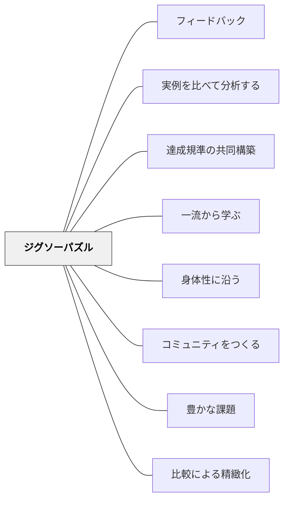

# ジグソーパズル

> 優れた作品を切り刻んで組み立てることで、その構造が見えてくる。

## 背景（Context）

優れた新聞記事・詩・論文などの作品を小さな断片に切り、それをグループで並べ替えて元の構造を復元する活動。ジグソーパズルのように組み立てることで、「優れた作品の構造・流れ・配置の原則」が体験的に理解される。

## 問題（Problem）

優れた作品を読むだけでは、その「構造」「なぜそこにその要素があるか」は見えにくい。

## 力のかたち（Forces）

- 物理的な操作（切る・並べる）が理解を深める
- グループでの議論が多様な視点を引き出す
- 復元できなかった場合、それ自体が「構造の発見」になる

## 解決（Solution）

**優れた作品（新聞記事・詩・論文・作文など）を段落・文・要素単位で切り刻み、グループで元の順番・構造に組み立て直す。その過程での議論から達成規準を構築する。**

実践例：
- 新聞記事の段落を切って並べ替える（逆ピラミッド構造の発見）
- 詩の行を並べ替える（リズム・意味の流れの発見）
- 議論文の構成要素を並べ替える（主張・根拠・まとめの順序の発見）

## 結果（Consequences）

- 作品の構造的な「良さ」が体験的に理解される
- 自分の作品を書く際に構造を意識するようになる

## クラスター図

## Actionable Insight

- 新聞記事の段落を切ってグループで並べ替える活動をする——物理的な操作と議論の中から「逆ピラミッド構造」の原則が体験的に発見される
- 詩の行を切って並べ替え「この順番だとどんな流れになる？」と問いながら議論させる——並べ替えの議論がリズム・意味・感情の流れへの感覚を育てる
- 組み立て直せなかった部分について「なぜここに置いたか」を説明させる——正解でなくとも理由を語る経験が優れた作品の構造への深い理解を生む

## 出典

- 一つの教育のパタン・ランゲージ（岩井輝久）

## 関連パタン

- [[パタン/フィードバック]] — 親パタン
- [[パタン/実例を比べて分析する]] — 分析による達成規準構築
- [[パタン/達成規準の共同構築]] — 活動を通じた共同構築
- [[パタン/一流から学ぶ]] — 優れた作品を素材にする
- [[パタン/身体性に沿う]] — 物理的に切り・並べる操作が身体的理解を生む
- [[パタン/コミュニティをつくる]] — 組み立てる協働活動がコミュニティ形成を促す
- [[パタン/豊かな課題]] — 優れた作品の構造復元が豊かな課題になる
- [[パタン/比較による精緻化]] — 異なる並べ方の比較が達成規準の精緻化を生む
