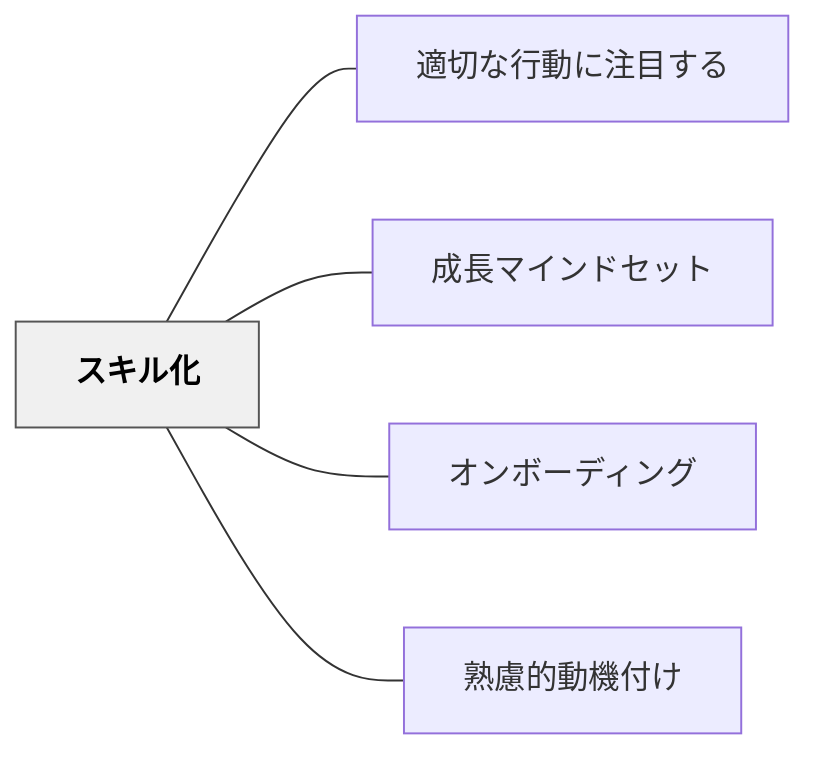

# スキル化

> 問題をスキル化せよ。問題をスキル化することによって、ネガティブな誤った自己概念と悪循環に陥ることを防ぐことができる。

## 背景（Context）

私たちは良いことばかりではなく、様々な問題や失敗に直面する。その時に**2つの方向**がある。

- **ネガティブな方向**：「自分には絶対無理だ」「自分はダメな人間だ」「自分は変われない」——誤った信念を固めていく
- **ポジティブな方向**：「努力が足りなかったからだ」「スキルが足りなかったからだ」——変われるところに着目していく

この方向の違いで、その人の未来は大きく変わっていく。

## 問題（Problem）

困難に直面したとき、自信をなくし「努力しても無駄」「自分は変わることができない」という信念を固めてしまうと、できることもできなくなっていく悪循環にはまる。どうすればネガティブな自己概念の悪循環を防ぎ、困難を成長の機会に変えられるか。

## 力のかたち（Forces）

- 困難・失敗をその人の「性格」や「能力の欠如」として見ると、変える手がかりが見えなくなる
- 「スキルがまだ身についていない」と見ると、何を学べばよいかが見えてくる
- 悪い行動を「やめる」ことは難しいが、より適切な行動に「置き換える」ことは比較的できる
- 問題をスキルに言い換えるだけで、関わり方が批判から支援へと変わる

## 解決（Solution）

**問題をスキルへ変換せよ。**

**ベン・ファーマンのフィンランド式キッズスキル**（2013）は、新しいスキルを身につけることで困難を乗り越えられるようにする方法だ。この方法の考え方の核心：**私たちの問題は、スキルをまだ学習していないために起こる。スキルを学べば、問題は解消する。**

フィンランド式キッズスキルには15のステップがある。最も重要なのが**ステップ1：問題をスキルへ変換する**——問題を乗り越えるためにどんなスキルを身につける必要があるかを見つける。

---

### 具体例①：悪い癖とスキル置き換え

自分の悪い癖をやめたり、他の人の悪い癖をやめさせたりすることがどれだけ難しいか——よく知っていることだろう。**悪い癖は、やめることよりも、より適切な行動に置き換える方が簡単だ。**

「お酒を控える」という問題をスキル化すると→**「ノーアルコールスキル」**——お酒の代わりに他の飲み物を飲む。「お酒をやめる」のではなく「他の飲み物を飲む」スキルを身につけると考えると、取り組みやすくなる。

---

### 具体例②：岩井自身への適用

スキル化は岩井自身が自分自身に対しても日常的に適用している。様々な問題や失敗があっても、**「どういうスキルが足りないのか」「どういうスキルを身につければ問題が解決するのか」**というポジティブな視点で考える。教育の計画や実践においても、この問いを立てることが大事なパターンの一つになっている。

---

### 子どもを見る視点としてのスキル化

子どもたちを見るときも、「どうスキル化して問題を解決できるのか」という視点で見ると、**よりよくなっていくための建設的な軌道に乗れる**。問題を起こしている子どもを「問題のある子」ではなく「まだそのスキルを身につけていない子」として見ることで、教育者の関わり方が批判・管理から支援・スキル習得の促進へと変わる。

---

### しなやかマインドセットとの接続（キャロル・ドゥエック）

スキル化はキャロル・ドゥエックの**しなやかマインドセット（グロースマインドセット）**と通じる考え方だ。

| マインドセット | 困難への見方 |
|------------|-----------|
| コチコチマインドセット（固定型） | 能力は固定——失敗は「自分はダメ」という証拠 |
| しなやかマインドセット（成長型） | 能力は伸びる——失敗は「まだ学習中」というサイン |

スキル化は「まだ学習していない」という視点に立つことで、しなやかマインドセットを実践に落とし込む具体的な方法だといえる。

## 結果（Consequences）

- 問題をスキルに言い換えることで、ネガティブな誤った自己概念と悪循環を防ぐことができる
- 「何を学べばよいか」が見えるため、困難が成長の手がかりになる
- 子どもへの関わり方が批判・管理から、スキル習得の支援へと変わる
- 教育者自身も問題・失敗をポジティブに捉え直し、建設的な実践の軌道に乗れる

## 関連パタン

- [[パタン/適切な行動に注目する]] — 問題行動の代わりに適切な行動に目を向けるポジティブアプローチ
- [[パタン/成長マインドセット]] — しなやかマインドセットと理論的に接続
- [[パタン/オンボーディング]] — まだ土台に乗っていない学習者への支援設計
- [[パタン/熟慮的動機付け]] — ポジティブなアプローチが内発的動機づけを支える

## クラスター図

## Actionable Insight

- 子どもが繰り返す問題行動に直面したとき「この子はまだどのスキルを学んでいないのか」と問い直す——問題をスキル不足として捉えると支援の方向が変わる
- 「○○しない」ではなく「○○できるようになる」という言葉で目標を言い換える——やめることより新しいスキルを身につけることの方が現実的
- フィンランド式キッズスキルのステップ1「問題をスキルへ変換する」を週に1回意識して子どもの困りごとに向き合う

## 出典
- [[文献/一つの教育のパタン・ランゲージ]]

ベン・ファーマン（2013）『フィンランド式キッズスキル』ダイヤモンド社  
キャロル・ドゥエック（しなやかマインドセット／グロースマインドセット理論）  
岩井輝久「岩井輝久『一つの教育のパタン・ランゲージ』」（2026-04-29 vault収録）  
岩井輝久「パタン　スキル化（動画記録）」https://youtu.be/146prhHUtBc
