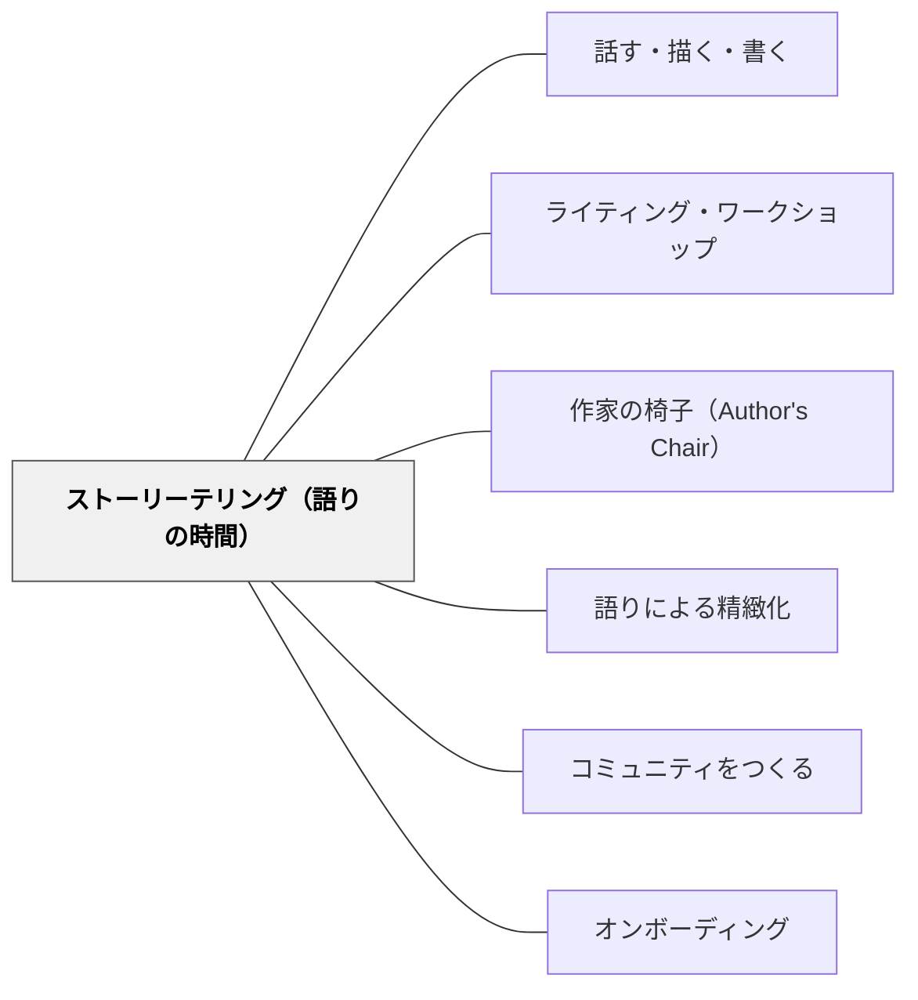

# ストーリーテリング（語りの時間）

> すべての子どもはストーリーを持っている——「話して」と言うだけで、どんな子もクラスの語り手になれる。

---

## Pattern Connection

**出典**: Horn, M. & Giacobbe, M. E.（2007）*Talking, Drawing, Writing: Lessons for Our Youngest Writers*. Stenhouse Publishers. Ch.1「Why Start with Storytelling?」（統合：2026-05-18）

- **既存パタンとの関連**：[[パタン/話す・描く・書く]] の「まず話す」という原則を、クラス全体の場の設計として具体化したパタン。[[パタン/作家の椅子（Author's Chair）]] が「書いた作品を発表する」場であるのに対し、本パタンは「書く前に、自分の経験を語る」場である
- **補強された点**：Johnston（2004）「すべての人は生まれながらの語り手である」という認識が、「すべての子どもが参加できる」場づくりとして具体化される。語り手の椅子（Storytelling Chair）は書く技術も絵の技術も必要とせず、子どもをありのままで「作家の仲間」として招く
- **他のパタンへの波及**：[[パタン/コミュニティをつくる]] ——誰かが「自転車に乗れる子」「おばあちゃんのいる子」として知られることで、クラスの人間関係が生まれる。[[パタン/語りによる精緻化]] ——語ることで子ども自身がストーリーを「発見」し、書くことへのアイデアが生まれる

---

## 背景（Context）

幼稚園・1年生のライティング・ワークショップで「さあ書いて」と言うと、多くの子どもが「何を書けばいいかわからない」と止まってしまう。特別な体験（旅行・誕生日・運動会）だけが書くに値するトピックだと思い込んでいる子どもは多い。

Horn & Giacobbe（2007）は、書くことの最初の入口を「口頭のストーリーテリング」に置いた。理由は単純で、話すことはすべての子どもがすでにできる行為だからである——文字を書く技術も、絵を描く技術も必要ない。「あなたの話を聞かせて」と言われれば、どんな子どもも語り手になれる。

## 問題（Problem）

書くことへのアクセスが、文字を書く技術・絵を描く技術・「書くに値するトピックがあること」という三重の関門で絞り込まれてしまう。この状況では、その三つがそろった子だけが書き始め、残りの子は「書けない子」として認識され始める。

## 力のかたち（Forces）

- 話すことは文字・絵の技術より先に習得され、すべての子どもがアクセスできる
- 口頭のストーリーテリングで「詳細を加える」「順序を整える」という書き手のクラフトを、書く前に練習できる
- しかし、ただ「話しなさい」では抑制のある子は話せない——聴き手と場の設計が必要
- 読み聞かせの後に「本と同じテーマで話して」と言うと、「本より面白い自分の話」が封じられる
- 発表者の選び方が固定されると（毎回挙手など）、同じ子しか話さなくなる

## 解決（Solution）

**ライティング・ワークショップの開始前に「ストーリーテリングの時間」を設け、一人の子どもが特別な椅子（Storytelling Chair）に座ってクラス全体に自分の経験を語る。場の設計が語り手を生む。**

---

### Storytelling Chair の設計

**空間の設計**：
- 発表者（子ども）が特別な椅子（ストーリーテリング・チェア）に座り、クラス全体を向く
- 教師はその隣にやや低い位置に座る——子どもの目線の高さか、子どもを見上げる位置。これは「教師が聴衆の一人になる」というシグナルになる
- クラスの全員が語り手を見て、聴く姿勢をとる

**語り手の選び方**：
- 「洗濯バサミバスケット（Clothespin Basket）」：全員の名前が書かれた洗濯バサミをバスケットに入れ、教師がランダムに引いて発表者を決める
- 引かれた洗濯バサミはバスケットの外に出し、全員が一度語ったら戻す——「まだ話していない子」が必ずいることを全員が意識する
- この仕組みで「いつも同じ子が話す」が防がれ、「自分の番はいつか来る」という期待感が生まれる

**語り手へのサポート**：
- 教師は語り手の「聴き手」として機能する——「それからどうなったの？」「誰と行ったの？」という問いで話を引き出す
- Marina Miranda の事例：口頭ストーリーテリングが11分続き、教師が引き出し役になって話が展開した。「電車に乗ってフィラデルフィアに行って……」という話は、教師の問いかけで場所・一緒にいた人・見たもの・感じたことへと広がった
- 教師は短い確認の言葉（"Tell us more about..."、"What did you see when..."）で、語り手が自分のストーリーをさらに掘り下げるのを助ける

---

### 読み聞かせとストーリーテリングの区別

書くワークショップの前に読み聞かせをしてから「さあ話してみよう」と言うとき、重要な原則がある：

**教師は本とは違うテーマの自分の話を語ってみせる**（Danita Kelley-Brewster の事例）。

たとえば、ペットについての本を読んだ後、教師が「私も飼っていたペットの話をします——でも本とは違う、私自身の話です」と語り出す。子どもたちは「あ、本の内容じゃなくて自分の話でいいんだ」と知る。

もし「本と同じテーマ」を求めると：
- 本に似た経験のある子しか話せなくなる
- 「本の話」の影響下に入り、自分のオリジナルの語りが抑制される
- 「本の続き」として語ることになり、作家として自立した語り手になれない

---

### ストーリーテリングから書くことへの橋渡し

語った後に書く時間が来たとき：

- 「今日あなたが話してくれたこと、紙に書いてみましょう」という橋渡しが自然にできる
- すでに「何について書くか」が決まっているため、「書けない」状態が起きにくい
- 発表を聞いたクラスの仲間は、その子の作品を読むとき「あの話だ」という文脈を持って読める

---

具体例①：Marina Miranda の11分のストーリーテリング

教師の問いかけの記録（抜粋）：

> **子ども**：「先生、フィラデルフィアに電車で行ったんだよ」
> **教師**：「電車で？どんな電車？」
> **子ども**：「大きい電車。座るとこがいっぱいあって」
> **教師**：「誰と行ったの？」
> **子ども**：「おかあさんと、いとこと、おばあちゃん」
> **教師**：「フィラデルフィアに着いたとき、最初に何を見たの？」
> ……（以下11分続く）

この会話が終わった後、Marina は「今日書くこと」を完全に持っていた。

---

具体例②：洗濯バサミバスケットの運用

月曜日の朝、教師がバスケットを持ってくる：

> 「今日のストーリーテラーは……（バサミを引いて）Jasonです！」

Jason がストーリーテリング・チェアに来る。教師は「聴き手」として隣に座る。

引かれた洗濯バサミはバスケットの外に置く。クラスの子どもたちは「まだ自分のバサミは中にある」と知っている。これが「自分の番が来る」という期待感になる。

---

## 結果（Consequences）

- すべての子ども——書く技術も絵の技術も関係なく——が「書き手のコミュニティ」に参加できる
- 「この子は自転車が得意な子」「この子にはおばあちゃんがいる子」という個性がクラスに広まり、人間関係が生まれる
- 語ることで子どもは自分のトピックを発見し、書く時間に止まることが減る
- ただし、語りの時間が長くなりすぎると書く時間を圧迫する——1人あたり5〜10分が目安

## 関連パタン

- [[パタン/話す・描く・書く]] — 本パタンの「まず話す」を授業構造全体に組み込む上位パタン
- [[パタン/ライティング・ワークショップ]] — ストーリーテリングが位置づけられる授業構造
- [[パタン/作家の椅子（Author's Chair）]] — 書いた後に発表する場（本パタンの「書く前に語る」と対をなす）
- [[パタン/語りによる精緻化]] — 語ることが理解を整理する認知原理
- [[パタン/コミュニティをつくる]] — ストーリーテリングがクラスを「語りあう仲間」にする
- [[パタン/オンボーディング]] — すべての子どもが参加できる入口設計

---

## クラスター図

## Actionable Insight

- 週に1〜2回、書くワークショップの前の5分に「ストーリーテリングの時間」を設ける——全員の名前を書いた箸や名刺をカップに入れてランダムに引くだけで「洗濯バサミバスケット」の代替になる
- 読み聞かせの後に「さあ書いて」と言う前に、教師が「本とは違う自分の話」を30秒語ってみせる——「自分の経験を話していい」というモデルになる
- 「何を書けばいいかわからない」と言ってきた子には「隣の人に30秒話してみて」と言う——話し終わった後「それを書いてみて」につながる

---

## 出典

Horn, M., & Giacobbe, M. E. (2007). *Talking, Drawing, Writing: Lessons for Our Youngest Writers*. Stenhouse Publishers. (Ch. 1: Why Start with Storytelling?)

Johnston, P. H. (2004). *Choice Words: How Our Language Affects Children's Learning*. Stenhouse Publishers.

> "All children have stories to tell." —Horn & Giacobbe（2007）

> "Human beings are natural storytellers." —Johnston（2004, p.30）

[[文献/Talking, Drawing, Writing（Horn & Giacobbe）]]
[[パタン/話す・描く・書く]]
