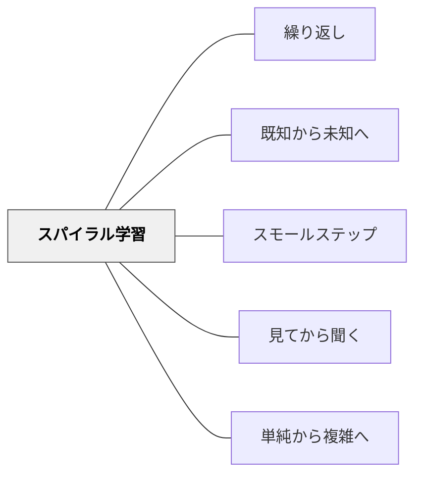

# スパイラル学習

> 全体を完璧に教えてからにしよう、と思う限り、学習者は面白い問題に出会えないまま退屈する。

## [Pattern Connection]

Bergin et al.（2012）の **Spiral** パタンは、[[パタン/繰り返し]]の「なぜ繰り返すのか」という問いに対し、「意味ある問題解決への早期アクセスを可能にするため」という設計論的な答えを与える。

- **補強点**：学習指導要領の「螺旋的・反復的な指導」と原理的に一致。Berginはこれを「コース設計のパタン」として言語化した
- **拡張点**：単なる「繰り返し」ではなく、**各サイクルで新しいトピックも追加しながら既習事項を深める**という二重運動が特徴
- **他のパタンへの波及**：[[パタン/繰り返し]]・[[パタン/既知から未知へ]]・[[パタン/スモールステップ]]

---

## 背景（Context）

一つの科目の中のトピックは互いに絡み合っている。論理的な順序で一つずつ完全に教えようとすると、「面白い問題」に必要なツールが揃うまでに学習者が退屈し、動機を失う。学習者は実際に何かを「する」（作る・解く・試す）ときに最もよく学ぶ。

## 問題（Problem）

全トピックを線形に「完全に終わらせてから次へ」という配列では、意味ある問題解決が後回しになり、学習者が早期に退屈・脱落する。

## 力のかたち（Forces）

- 意味ある問題には多くのツール（知識・スキル）が必要
- 全ツールが揃うまで待つと学習者の動機が続かない
- 早すぎる問題解決には未習の内容が含まれてしまう
- 既習事項を深化しつつ新しい内容も追加する設計は、教師の準備コストが高い

## 解決（Solution）

**各トピックを最初のサイクルでは「問題解決に使える最小限の形」で導入し、複数のトピックを並行して進める。その後、各サイクルで各トピックを深化させ、新しいトピックも追加していく。**

スパイラルの設計：
1. **第1サイクル**：各トピックを「現時点で意味ある問題が解けるギリギリのシンプルさ」で導入。細部は省略。複数トピックを短期間で扱い、早期に問題解決に使えるようにする。
2. **第2サイクル以降**：第1サイクルで扱ったトピックを深化。より詳細・より複雑な側面に踏み込む。同時に新しいトピックを追加する。
3. **各サイクルを問題設定で駆動**：「今の道具で解けるどんな問題があるか」から逆算してトピックの深さを決める。

---

具体例①：算数「分数」（小学校3〜6年）
3年：「半分・4分の1」という日常感覚で分数に出会う（第1サイクル）
4年：分数の大きさ比較・等価分数（第2サイクル）
5年：分数の加減計算（第3サイクル）
6年：分数の乗除計算（第4サイクル）
各サイクルで「今の知識でできる問題」を解き、次のサイクルで深める。

具体例②：国語「物語の読み方」
1学期：あらすじを追う（登場人物・出来事）
2学期：心情の変化を読む（第2サイクル、より深い読み）
3学期：主題・作者の意図を読む（第3サイクル）

具体例③：特別支援「社会的スキル」
「あいさつ」を第1サイクルで教えた後、「場面によって挨拶の仕方が変わる」（第2サイクル）、「断り方・頼み方」（第3サイクル）と深化。各サイクルで「今使えるスキル」で実際の場面に参加させる。

---

## 結果（Consequences）

- 学習者が早期から「意味ある問題」に取り組み、学習の動機が持続する
- トピック間の関係が各サイクルで明確になる
- 既習事項の定着が各サイクルの「深化」によって強化される
- 教師はコース全体のアーキテクチャを俯瞰して設計する必要がある

## 関連パタン

- [[パタン/繰り返し]] — スパイラルの「繰り返す」次元
- [[パタン/既知から未知へ]] — 各サイクルで既習から未習へと進む
- [[パタン/スモールステップ]] — 第1サイクルを最小限にする設計
- [[パタン/見てから聞く]] — 各サイクルの最初に体験を置く
- [[パタン/単純から複雑へ]] — スパイラルの深化次元

## クラスター図

## Actionable Insight

- 単元設計を「完全に理解してから次へ」ではなく「使えるレベルで出会ってから深める」に変える——特に初期導入の「シンプルさ」を許す勇気を持つ
- 単元の終わりではなく「次の単元で戻ってくる約束」を学習者に伝える——「今日は入り口だけ」という見通しが安心感を与える
- 第2サイクル以降の授業冒頭に「前に出会ったこと、覚えてる？」と問う——前のサイクルとの接続が螺旋の「深化」を感じさせる

## 出典

Bergin, J. et al.（2012）"Spiral." *Pedagogical Patterns: Advice For Educators.* Joseph Bergin Software Tools.（Joseph Bergin）

> "Organize the course to introduce topics to students without covering them completely at first viewing so that a number of topics can be introduced early and then used."
[[文献/Pedagogical Patterns Advice For Educators（Berginほか）]]
