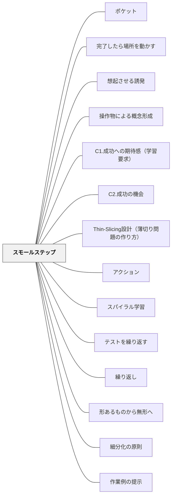

# スモールステップ

**一文でいうと**：課題を小さな成功の連続に分け、つまずきながらも前進できる道筋を作る。

## 使いどころ・使いすぎ注意

| 観点         | 内容                                       |
| ------------ | ------------------------------------------ |
| 使いどころ   | 最初の成功を作りたいとき。                 |
| 使いすぎ注意 | 細かくしすぎると、挑戦や全体感が弱くなる。 |

## 背景（Context）

[[パタン/オンボーディング]] によって、すべての学習者が学習の土台に乗れるようにしたい。しかし、学習の入り口には「ここから始めればいいか」が見えにくい状況がある。課題の全体像が大きすぎると、学習者はどこから手をつければいいかわからず、立ち止まってしまう。

## 問題（Problem）

学習の入り口が「高すぎる一段」であるために、最初の一歩を踏み出せない学習者が生まれる。やる気があっても、ステップが大きすぎて失敗の連続になると、学習への意欲そのものが損なわれる。

## 力のかたち（Forces）

- 学習者によって既有知識・スキルの幅は大きく異なる
- 大きな課題は挑戦的だが、準備のない学習者には障壁になる
- 細かすぎる分割は、全体像を見失わせ動機づけを下げることもある
- 教師には「一つのステップにかけられる時間」という制約がある

## 解決（Solution）

**課題・活動・説明を、確実に達成できる小さな単位（ステップ）に分割して提示する。**

それぞれのステップが「やればできる」という成功体験につながるように設計することで、学習者は次のステップへの手がかりを自分で得られるようになる。

**実践例：**

- 作文を「書く」のではなく「一文だけ書く」から始める
- 算数の文章題を「数字だけ抜き出す」「式だけ立てる」「計算する」に分割する
- 体育の技を「部分動作→つなぎ→全体」の順に積み上げる
- 新しい単元は「前回学んだことと何が似ている？」という問いから入る（既有知識への接続）

## 結果（Consequences）

- 「最初の一歩」を全員が踏み出せるようになり、学習への参加率が高まる
- 小さな成功の積み重ねが自己効力感を育て、次の挑戦への動機になる
- 教師は詰まっている箇所（ボトルネック）を早期に発見しやすくなる

ただし、ステップを細かくしすぎると「やらされ感」が強まり、内発的動機づけが低下する危険がある。ステップの細かさは学習者の状態と目的に応じて調整が必要。

## このパタンが働く実践
- [[実践/個別教材の設計]]

| 実践                                    | どのようにスモールステップが働くか                               |
| --------------------------------------- | ---------------------------------------------------------------- |
| [[実践/言葉をよりすぐって俳句を作ろう]] | カルタ、三文日記、読み比べ、作句、推敲、句会へ段階を踏んで進める |

## クラスター図

## Actionable Insight

- 「作文を書きなさい」ではなく「まず一文だけ書いてみよう」から始める——最初のステップを小さくするだけで全員が参加できるようになる
- 算数の文章題で「数字を丸で囲む」「式だけ書く」「計算する」の3段階に分けて提示する——段階が見えると詰まっている場所が特定しやすくなる
- 体育の技を部分動作→つなぎ→全体の順に積み上げる——ステップが明確なほど「次は何をすれば良いか」が学習者に見えてくる

## 出典

- 一つの教育のパタン・ランゲージ（岩井輝久）

## 関連パタン
- [[パタン/ポケット]]
- [[パタン/完了したら場所を動かす]]
- [[パタン/想起させる誘発]]
- [[パタン/操作物による概念形成]]
- [[特別支援/インクルーシブ教育]]
- [[パタン/C1.成功への期待感（学習要求）]]
- [[パタン/C2.成功の機会]]
- [[パタン/Thin-Slicing設計（薄切り問題の作り方）]]
- [[パタン/アクション]]
- [[パタン/スパイラル学習]]
- [[パタン/テストを繰り返す]]
- [[パタン/繰り返し]]
- [[パタン/形あるものから無形へ]]
- [[パタン/細分化の原則]]
- [[パタン/作業例の提示]]
- [[パタン/熟慮的配列]]
- [[パタン/足場がけへの誘発]]
- [[パタン/多様な演習レベル]]
- [[パタン/単純から複雑へ]]
- [[パタン/動かす指示]]
- [[パタン/必然性から楽しさへ]]
- [[パタン/予測差分（期待値差分）の調整]]
- [[パタン/オンボーディング]] — スモールステップを積み上げて土台に乗せる上位パタン
- [[パタン/知識から技能へ]] — 知識の習得段階にスモールステップを活用する

### 上位パタン

- [[パタン/熟慮的配列]] — 難易度軸の配列原則（簡単から難しいへ）
- [[パタン/オンボーディング]] — 土台に乗せるための上位パタン

### 関連

- [[パタン/作業例の提示]] — 「こうやればいい」という見本を示して最初の一歩を支える
- [[パタン/ボトルネック]] — どのステップが詰まっているかを特定する
- [[パタン/スキル化]] — 全体を要素スキルに分解する設計
- [[パタン/知識から技能へ]] — ステップの設計には知識理解が先行する
- [[特別支援/太田ステージ]] — ステージに合った難易度設計の根拠理論
- [[特別支援/特別支援級の算数指導]] — 学年別プリント設計のスモールステップ実装
