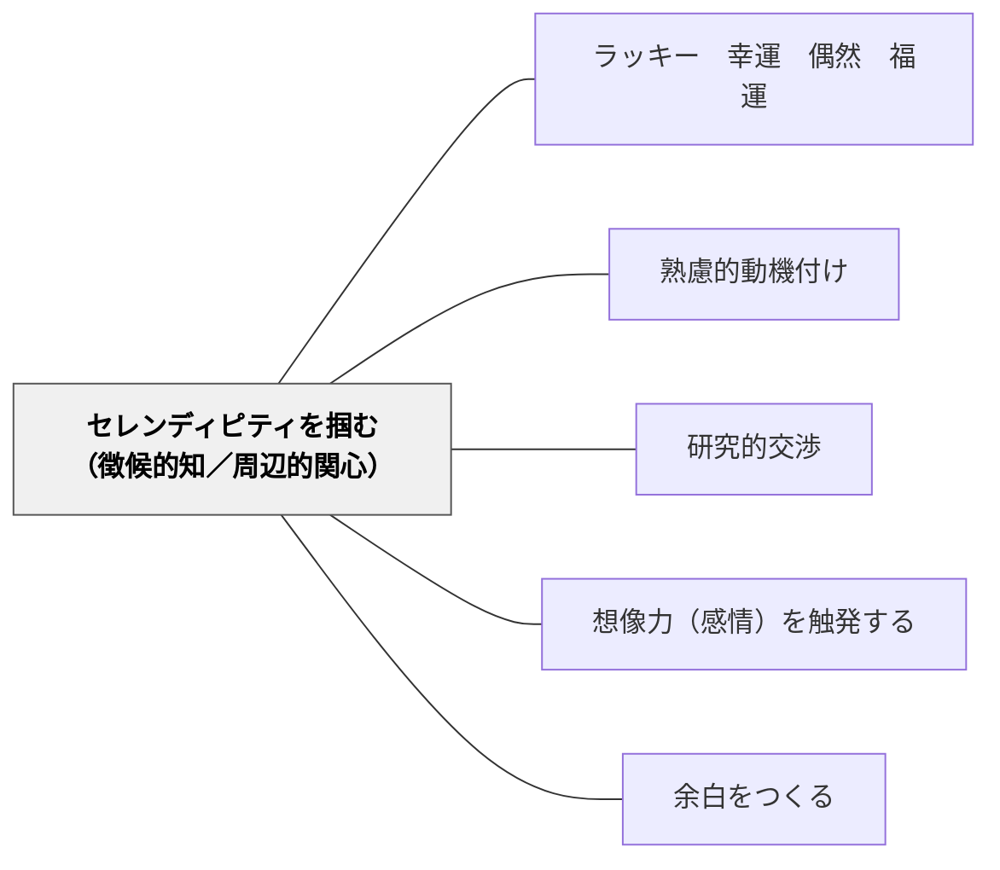

# セレンディピティを掴む（徴候的知／周辺的関心）

> 「ちょっと気になる」という周辺的な関心が、新しい学びへの動機の種になる。

## 背景（Context）
セレンディピティ（偶然の幸運な発見）を意図的に掴む能力と姿勢に関するパタン。イタリアの記号論者カルロ・ギンズブルグの「徴候的知」（小さな手がかりから全体を読む推理的な認識様式）や、ポランニーの「周辺的関心」（焦点的関心の外にある意識の周辺にあるもの）の概念が基盤となる。

## 問題（Problem）
学習が設定されたカリキュラムだけに収まると、予期しない発見・偶然の気づきが動機になる機会が失われる。「これは関係ない」として無視されてきた小さな引っかかりが、実は深い探究の入り口だったことがある。

## 力のかたち（Forces）
- セレンディピティは準備された心にだけ訪れる（パスツール）
- 周辺的関心に気づくには、意識的に「余白」を持つ必要がある
- 学習の効率化を追求するとセレンディピティの余地が失われる
- 「なぜ気になるのか」を問い、探究につなげるスキルが必要

## 解決（Solution）
**「ちょっと気になった」「なんか引っかかる」という周辺的な関心を大切にし、それを探究の入り口として育てる環境と文化をつくる。**

授業の余白で「今日気になったことは何か」を問う。学習者が「気になる」を記録するノートやタグを持つことを促す。偶然の発見を共有できる場（クラス全体・ペア）を設ける。徴候的な手がかりから全体を推理するような活動を設計する。

## 結果（Consequences）
- 学習者が偶発的な気づきを動機に変える力が育まれる
- 探究の入り口が拡がり、学習の多様性が生まれる
- 「気になること」を大切にする学習文化が形成される

## クラスター図

## Actionable Insight

- 授業の末尾に「今日気になったことは何か」を問い、学習者が周辺的関心を記録する——偶発的な気づきを動機に変える力が育まれる
- 「気になること」を記録するノートを持つことを促す——「ちょっと引っかかる」が探究の種になる文化をつくる
- 偶然の発見を共有できる場（クラス全体・ペア）を設ける——「気になること」を大切にする学習文化が形成される

## 出典

- 一つの教育のパタン・ランゲージ（岩井輝久）

## 関連パタン
- [[パタン/ラッキー　幸運　偶然　福運]]
- [[パタン/熟慮的動機付け]] — 親パタン
- [[パタン/研究的交渉]] — 探究への動機と連動
- [[パタン/想像力（感情）を触発する]] — 驚き・発見の動機を扱うパタン
- [[パタン/余白をつくる]] — セレンディピティのための余白の設計
