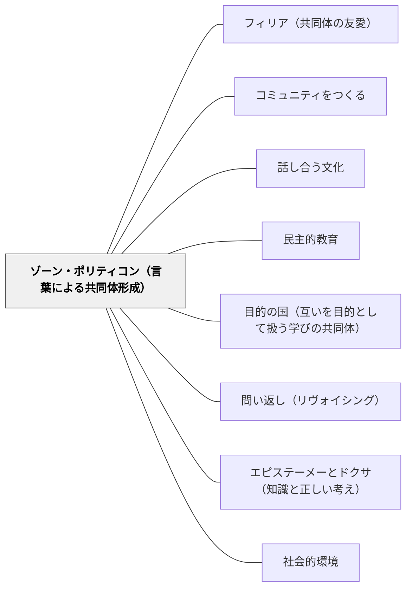

# ゾーン・ポリティコン（言葉による共同体形成）

> 人間は自然本性的に国家を形成する動物である。それは、言葉によって善悪・正義・不正義を共有できるからである。——アリストテレス（第1巻第2章）

## Pattern Connection

### アリストテレス（前335年頃）——政治学 第1巻第2章

> 「人間は自然本性的に国家を形成する動物である。」（ゾーン・ポリティコン）

> 「言葉の役割は、有益性と有害性を明示するところにあり、したがってまた、正義と不正も明示できる。」

アリストテレスは、人間が「声（フォーネー）」だけでなく「言葉（ロゴス）」を持つことが共同体の本質的な根拠だと論じる。動物も声で快と苦を表せるが、人間はロゴスによって**有益・有害・正義・不正義**を表し、他者と共有できる。この価値の言語的共有こそが共同体（ポリス）を成立させる。

- **既存パタンとの関連**：[[パタン/話し合う文化]] が「話し合いを日常化する」という実践を示すなら、本パタンはその哲学的根拠——「話し合い（ロゴスによる価値共有）こそが共同体を成立させる」——を与える。[[パタン/コミュニティをつくる]] の実践コミュニティ論は「何の実践か」を問うが、本パタンは「ロゴスによる価値の共有こそが人間の共同体の本質」と答える。
- **補強された点**：学習活動での「話し合い」「議論」「言語化」を、単なる「学び方の工夫」ではなく、人間が共同体を形成するという本質的な営みとして捉え直す根拠になる。話し合いは「方法」ではなく「人間の本性の実現」である。
- **エレクトロニクス時代への拡張**：デジタル空間でのロゴスはどうか。SNSの「いいね」は声（フォーネー）に近く、快・苦の表明である。真のロゴスは「なぜ正義なのか・なぜ不正なのか」を言語化できることを要求する。デジタル環境が「フォーネーに特化した空間」になる中、学校でのロゴスの練習は一層重要になる。

---

## 背景（Context）

アリストテレスによれば、人間はポリス（共同体）なしに生きられない。孤独に生きられる存在は「神か獣か」であって、人間ではない。なぜ人間はこれほど強く共同体を必要とするのか。その根拠はロゴス（言葉・理性）にある。

人間だけが、善悪・正義・不正という価値概念を言葉にして他者と共有できる。この価値の言語的共有が共同体の紐帯である。

## 問題（Problem）

授業での話し合い・議論・言語化活動が「方法の一つ」に留まり、その本質的意義が見えていない。また、デジタル環境の「いいね」「反応」は快・苦の表明（声=フォーネー）に留まり、ロゴスによる価値の共有には至らない。「話し合えているようで、実は価値を共有していない」教室・社会が生まれる。

## 力のかたち（Forces）

- 人間は本性的に共同体を形成する——孤立した個人学習は人間の本性に反する面がある
- 共同体の紐帯はロゴス（価値の言語的共有）——ルールや制度より言語が根本
- 声（フォーネー）とロゴスは違う——「好き嫌い」の反応と「善悪・正不正の共有」は別の水準
- デジタル環境はフォーネーを激増させる——ロゴスの練習場としての学校の役割が増す
- 言葉で価値を共有した経験が共同体帰属感を生む——「なぜそれが正しいか」を言えた経験

## 解決（Solution）

**学習活動の中に「善悪・正義・不正義を言葉で共有する」場を作る。話し合い・議論・言語化を「方法」としてではなく、人間が共同体を形成するという本質的な営みとして位置づける。**

### ロゴスを育てる三つの実践

**① 「なぜそれが正しいか」を言葉にする**

意見の提示だけでなく、「なぜそれが正しいと思うのか」「どんな価値に基づいているのか」を言語化する練習。正解の共有ではなく、価値根拠の共有が目標。

> 実践例：「あなたはなぜそれが公平だと思うのか、一文で言えますか」——この問いが声（フォーネー）をロゴスへ引き上げる。

**② 価値の衝突を歓迎する**

異なる価値観が衝突したとき、それを問題として収束させるのではなく、「それぞれが何の価値を大切にしているのか」を明示化する機会として扱う。

> 「AさんとBさんは意見が違うけれど、どちらも大切なことを言っているね。Aさんが大切にしているのは○○で、Bさんが大切にしているのは△△。どちらも正しい価値だ。」

**③ デジタルとロゴスの対比**

「SNSのいいね（フォーネー）と、授業での議論（ロゴス）は何が違うか」を子どもと考える。快・苦の反応と、善悪・正不正の言語化の違いが見えてくる。

## 結果（Consequences）

- 話し合い活動が「深い学びの手法」から「人間の本性の実現」へと意味が変わる
- 授業での言語化体験が「共同体に参加する」体験として蓄積される
- デジタル環境の「いいね文化」と学校の「言語化文化」の意識的な対比が生まれる
- 「なぜそれが正しいか」を言える力——公共的ロゴス——が育まれる

## 関連パタン
- [[パタン/政体の原理と教育目標]]
- [[パタン/副次的学習]]

- [[パタン/フィリア（共同体の友愛）]] — ロゴスを共有する共同体の感情的基盤
- [[パタン/コミュニティをつくる]] — ゾーン・ポリティコンの哲学的根拠を提供する
- [[パタン/話し合う文化]] — ロゴスによる価値共有の日常的実践
- [[パタン/民主的教育]] — ゾーン・ポリティコンの政治的表現
- [[パタン/目的の国（互いを目的として扱う学びの共同体）]] — カントとアリストテレスの共同体概念の接続
- [[パタン/問い返し（リヴォイシング）]] — 声（フォーネー）をロゴスへ引き上げる教師の技法
- [[パタン/エピステーメーとドクサ（知識と正しい考え）]] — 正しい考え（ドクサ）をロゴスで吟味する
- [[パタン/社会的環境]] — 社会的環境が価値のロゴスによる共有の場
- [[パタン/複数の教育源]] — ロゴスの場としての学校vs声（フォーネー）の場としてのデジタル
- [[文献/政治学（上）（アリストテレス）]] — 本パタンの出典

## クラスター図

<!-- cluster: manual -->

## Actionable Insight

- **「なぜそれが正しいか」を一文で書かせる**：意見発表の後に「その理由を一文で書いてみよう」を加える——声（フォーネー）からロゴスへの最小ステップ
- **価値の言語化タイム**：道徳・学活で「今日の話し合いで、自分が大切にしていることは何だとわかったか」を一文で書かせる——共同体としての価値語彙が蓄積される
- **「いいね」と「なぜ」の違いを話題にする**：高学年向けに「SNSで反応するときと、授業で意見を言うときの違いは何か」を問う——フォーネーとロゴスの区別が生まれる

## 出典

アリストテレス、三浦洋一訳（2023）『政治学（上）』光文社古典新訳文庫. 第1巻第2章.

[[文献/政治学（上）（アリストテレス）]]

> 「人間は自然本性的に国家を形成する動物である。」（第1巻第2章）

> 「言葉の役割は、有益性と有害性を明示するところにあり、したがってまた、正義と不正も明示できる。」（第1巻第2章）
