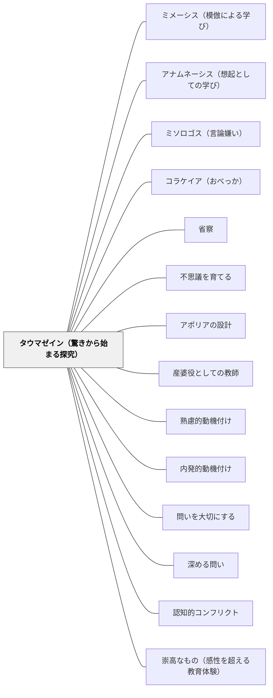

# タウマゼイン（驚きから始まる探究）

> 驚くことは哲学の始まりではなく、唯一の始まりである。知恵を愛することに、これ以外の出発点はない。

## [Pattern Connection]

### プラトン『テアイテトス』（前369年頃）——タウマゼイン（驚き）：探究の唯一の起点

プラトン『テアイテトス』155dでソクラテスはテアイテトスの「驚き」を見て言う：

> 「その状態、つまり不思議に思うこと（タウマゼイン）は、知恵を愛する者に固有の経験だからだ。というのも、これ以外に知恵を愛することの始まりはない。」（155d）

「哲学の始まりのひとつはタウマゼインだ」ではなく「これ以外に始まりはない」——驚きは探究の入り口のひとつではなく、唯一の入り口である。アポリア・問い・探究・知識への渇望——これらはすべてタウマゼインから始まる。

**タウマゼインの文脈（155b〜d）：**
「同じものが6個の中では大きく、4個の中では小さい。私は大きくも小さくもなっていないのに、相対的に『なった』と言われる」——この逆説にテアイテトスが「驚いた（めまいがする）」と言い、ソクラテスがこの状態を「タウマゼイン」と呼ぶ。

**「教えることができないもの」としてのタウマゼイン：**
タウマゼインは「驚きなさい」と命令して起こせるものではない。驚きが生まれる「場」の設計——逆説・矛盾・意外性・「なぜ？」が浮かぶような素材と状況——が教師の仕事である。

**既存パタンとの関連：**
- **補強点**：[[パタン/不思議を育てる]] のWonder Boxが「驚きを集める文化」を作るならば、タウマゼインは「驚きが生まれる」源泉の概念を提供する。Wonder Boxが機能するのは、タウマゼインが起きているから。
- **接続点**：[[パタン/アポリアの設計]] がアポリア（困惑・分からなくなること）を設計するとしたら、タウマゼインはそのアポリアへの入り口にある「驚き」の設計である。「なぜ？」という驚きなしにアポリアは生まれない。
- **波及するパタン**：[[パタン/産婆役としての教師]] — 産婆術の前提にタウマゼインがある：ソクラテスが助けるのは「驚きを感じた魂」が知識を産む過程；[[パタン/熟慮的動機付け]] — タウマゼインは内発的な知的好奇心の哲学的源泉

---

### プラトン『饗宴』（前380年頃）——エロスとタウマゼイン：探究を駆動する二つの力

プラトン『テアイテトス』がタウマゼイン（驚き）を探究の入り口として示すとすれば、『饗宴』はその驚きを前進させる**エロス（欠如から生まれる欲求）**を哲学的に定義する。

**エロスの本性（201d–204c）：**
ディオティマはエロスを「知恵と愚かさの間にいるもの」として定義する。完全な知恵を持つ者（神々）は探究しない——すでに知っているから。完全な愚か者（アマティア）も探究しない——欠けていることに気づかないから。探究するのは「自分に欠けていると知っている者」——エロスはこの「知恵と無知の間」に生きる。

**タウマゼインとエロスの関係：**

| | タウマゼイン（テアイテトス155d） | エロス（饗宴202e） |
|---|---|---|
| 役割 | 探究の唯一の入り口 | 探究を前進させる動力 |
| 機能 | 「これはおかしい」という気づき | 「手に入れたい」という欲求 |
| 構造 | 逆説・矛盾が引き金になる | 欠如の認識が引き金になる |
| 教師の仕事 | タウマゼインが生まれる場の設計 | エロスが生き続ける学習環境の設計 |

タウマゼインは「今あるものの不思議さへの驚き」であり、エロスは「まだないものへの欲求」——この二つは探究の入り口（驚き）と出口（欲求）として相補的に機能する。驚きが欠如を浮かび上がらせ、浮かび上がった欠如がエロス（欲求）を生む。

**「哲学の話はただひたすら楽しい」（アポロドロス、172b）：**
宴会の語り手アポロドロスが冒頭で言う：「哲学の話となると、自分で話をするときでも人の話を聞くときでも、それがもたらしてくれる効用なんて抜きにして、もうただひたすら楽しいのだ」——これがタウマゼイン×エロスが機能している状態の現象学的記述である。驚きが欲求を生み、欲求が喜びになる。

**補強点**：タウマゼインが「探究の唯一の入り口」であることに加え、その後の探究を駆動する動力がエロス（欠如への欲求）であることが明らかになる。教師は「驚きの場（タウマゼイン）」だけでなく「欠如感と策略の場（エロス）」を設計する必要がある。

**波及するパタン**：[[パタン/美の梯子（エロスの道）]] — タウマゼインが美の梯子の「一段目（一つのものへの没入）」への入り口；[[パタン/無知の知]] — エロス＝知恵と無知の間＝無知の知の哲学的深化；[[文献/饗宴（プラトン）]] — 本統合の出典

---

### プラトン『パイドン』（前380年頃）——死の直前まで驚きながら探究する：タウマゼインの究極形（115b–118a）

パイドンのソクラテスの最後の姿は、タウマゼイン（驚きから始まる探究）の**究極的な実践形態**を示す。

**「死について知らない——だから怖れない」というタウマゼインの態度：**

ソクラテスは処刑の直前、「死後がどうなるか知っている」とは一切言わない。「死について知らない——だから、それが善いものである可能性を排除して怖れるのは、知恵がないのに知恵があると思いこむことだ」（弁明29a参照）という不知の自覚を最後まで保つ。

これは「驚き」の最深の形である——**知らないことへの怖れでなく、知らないことへの開かれた驚きと希望を同時に持つ態度**。タウマゼインは若者の学習でのみ起きるのでなく、2400年前の哲学者が毒を飲む直前まで保ち続けた姿勢である。

**「善き希望がある」（114c–d）：**

> 「この生涯において、徳や才智に与るためにあらゆることを為すべきなのだ。褒賞は美しく、希望は大きいのだから。」（114c–d）

「善き希望」とは「死後が良いと知っている」ではない——「知らないからこそ、探究し続けた者に善いものが来るかもしれない」という開放的な期待。これがタウマゼインの終生形態：不確かさへの怖れでなく、不確かさへの驚きと希望。

**「語り方が魂に影響する」（115e）：**

> 「立派でない仕方で語ることは、それ自体で調子はずれなだけでなく、なんらかの悪を魂のうちに作り込むのだ。」（115e）

タウマゼインは「内側からの驚き」であると同時に、教師の語り方・問いの立て方・言葉の選び方という**外部の言語行為**によっても形成・変容される。驚きを生む語り方と驚きを殺す語り方がある。

**フーコーの証言（1984年最終講義）：**

ミシェル・フーコーは死の直前（1984年2月〜3月）の最終講義でパイドンのソクラテスの最後の言葉に執着した。エイズで死を目前にした哲学者が「異様な月並みさのなかにとどまっている」とこの言葉を評したという事実——哲学者の驚きと探究は死によっても終わらない。これがタウマゼインの生涯を貫く形態の現代的証言である。

**補強点**：タウマゼインが「若い学習者の学習の入り口」だけでなく、**生涯を貫く哲学的態度**であることが明らかになる。教師がタウマゼインを「授業の入り口テクニック」としてでなく、自分自身の知的態度として体現するとき、それは学習者に伝わる。

**波及するパタン**：[[パタン/無知の知]] — 「死について知らない」という終生の不知の自覚；[[パタン/ミソロゴス（言論嫌い）]] — タウマゼインがあればミソロゴスを乗り越えられる；[[パタン/アナムネーシス（想起としての学び）]] — 驚きがアナムネーシスの感情的出発点；[[文献/パイドン（プラトン）]] — 本統合の出典

---

### プラトン『ソクラテスの弁明』（前399年・執筆前390年代）——「吟味されない生」：タウマゼインの社会的・生涯的宣言（38a, 39c–d）

タウマゼインが「授業のテクニック」でなく**生き方**であることを最も明確に示す文献が『ソクラテスの弁明』である。

**「吟味されない生は人間として生きるに値しない」（38a）：**

ソクラテスが弁明で語るこの命題は、タウマゼイン（驚きから始まる探究）の**生涯宣言**である。「吟味（驚き→問い→探究）」なしの生は、人間として生きることの資格を欠くとまで言う——タウマゼインを「子どもの学習の入り口」から「人間の生の本質的な様式」へと格上げする。

**「ソクラテスより知恵ある者はいない」という神託が生んだ驚き（21a）：**

神託を聞いたソクラテスの反応は純粋なタウマゼイン：

> 「神は一体何をおっしゃっているのだろう。何の謎かけをしておられるのだろう。私は、知恵ある者であるとは、自分ですこしも意識していないのだから。」（21a）

この驚きが40年にわたる問答の探究を起動した。タウマゼインとはこのような「予期せぬ謎への開放的な困惑」——驚いた後に拒絶するのでなく、探究へと向かう態度。

**「予言：哲学の子供たちが続く」（39c–d）：**

> 「私のやっているような解放こそ、もっとも立派でもっとも容易なのです。それは、他の人をおとしめることなく、自分自身ができるだけ善い者になるように励ます、そういう解放です。」（39d）

死刑判決を受けたソクラテスは「哲学する者（驚き・問い・吟味する者）はどんどん多くなる」と予言する。タウマゼインは個人の学習を超えて社会を変える力として機能する。

**補強点**：タウマゼインが「授業の入り口テクニック」でなく「人間として生きることの様式」として理解されるとき、教師自身がその体現者でなければならないことが明らかになる。「吟味されない生」を日々営んでいる教師から、タウマゼインは生まれない。

**波及するパタン**：[[パタン/パレーシア（真実を語る勇気）]] — 驚きから生まれた問いを公的に語る勇気；[[パタン/無知の知]] — 「知らない」という驚きが探究の起点；[[文献/ソクラテスの弁明（プラトン）]] — 本統合の出典

---

### アリストテレス『詩学』（前335年頃）——ペリペテイア・アナグノーリシス・「わかることの快」：タウマゼインの構造的分析

プラトンがタウマゼインを「驚き」という哲学的態度として定義するとすれば、アリストテレス『詩学』はタウマゼインを生む**物語の構造的メカニズム**を分析する。

**「驚くべき展開」としてのペリペテイア（第11章）：**

ペリペテイア（逆転）は「今起きていることとは反対の方向への行為の逆転」であり、最良の悲劇に欠かせない要素である：

> 「驚くべき展開こそが、憐れみや怖れを強め悲劇的であったり、人間愛を呼び起こしたりする。驚くべき展開は確かにより大きな喜びをもたらす。」（第9章末）

タウマゼインは個人の内面的な「驚き」だが、ペリペテイアは物語の構造から必然的に生まれる「驚き」を設計する——教師は授業設計においてペリペテイア的な「逆転の瞬間」を意図的に組み込むことができる。

**アナグノーリシス（再認）——「無知から知への移行」（第11・16章）：**

アナグノーリシスとは「無知から知への移行、すなわちある事物の認識への移行」であり、最高の再認は「出来事そのものから生じる再認で、もっともな展開によって驚駭を生み出す場合」（第16章）。

驚きは「この像は、あの人を模倣したものだ」と推論しわかるとき最も強い——アリストテレスの「わかることの快」（第4章）は、タウマゼインの認知的基盤を与える：

> 「模倣による像を見ることが最も快い理由は、それを見ながら、推論しわかること——たとえば、これはあの人だ——が起きるからである。」（第4章）

**補強点**：タウマゼインが「驚き」という態度（プラトン）であることに加え、「驚き」を生む物語構造（ペリペテイア・アナグノーリシス）と「わかることの快」という認知的メカニズム（アリストテレス）が加わる。教師は「驚きの場を設計する」だけでなく、「驚き→推論→わかる」という認知的快楽のシークエンスを設計できる。

**波及するパタン**：[[パタン/ミメーシス（模倣による学び）]] — わかることの快は模倣的学習の核心メカニズム；[[パタン/アナムネーシス（想起としての学び）]] — アナグノーリシス（再認）はアナムネーシスの一形態；[[文献/詩学（アリストテレス）]] — 本統合の出典

---

### Dewey（1910）How We Think 統合（2026-05-31）：felt difficulty——タウマゼインの心理学的・教育学的翻訳

プラトンが「驚き（タウマゼイン）」を探究の唯一の哲学的起点として定義したとすれば、Deweyは *How We Think*（1910）Ch.6で同じ概念を**教育学的・心理学的言語**に翻訳した。Deweyが反省的思考の第一段階として置いた「felt difficulty（困難を感じること）」は、タウマゼインの現代的教育版である。

**タウマゼインとfelt difficultyの対応表：**

| | タウマゼイン（プラトン, 前369年） | felt difficulty（Dewey, 1910） |
|---|---|---|
| 文脈 | 哲学的対話・探究の起点 | 教育的思考プロセスの第一段階 |
| 機能 | 「これはおかしい」という驚きへの開かれ | 「困難・疑問・不確かさを感じること」 |
| 性質 | 命令できない——場の設計で引き出す | 問題がないところに思考は生まれない |
| 教師の仕事 | タウマゼインが生まれる逆説・矛盾の場を設計する | felt difficulty を起動する認知的コンフリクトを設計する |

**驚きは命令できない——場の設計が仕事（共通点）：**  
プラトンが「驚きは命令できない」と暗示するように、Deweyも「好奇心（curiosity）は命令で生まれない——場の設計で引き出す」と述べる（Preface）。タウマゼインもfelt difficultyも、「強制できない内側の状態」であり、教師の仕事は「その状態が生まれやすい場を設計すること」である。

**「質問のかみつき」——felt difficulty を起動する道具としての問い：**  
Deweyは Ch.15 でこう述べる：

> "The shock, the bite, of a question will force the mind to go wherever it is capable of going, better than will the most ingenious pedagogical devices unaccompanied by this mental ardor."（Ch.15）

この「質問のかみつき（shock, bite）」は、felt difficulty を人工的に設計する教師の道具である。良い問いがタウマゼインを起動する——プラトンの「逆説・矛盾が引き金になる」という主張と同一の構造をもつ。

- **補強された点**：タウマゼインが「哲学的態度」であることに加え、felt difficulty として「教育設計可能なもの」であることが明確になる。「驚き」を起動する具体的な道具（問いのかみつき・認知的コンフリクト）の設計論が加わる
- **修正・拡張された点**：タウマゼインは「哲学的語彙」、felt difficulty は「教育学的語彙」——同じ現象の二つの呼び名として扱うことで、プラトン（哲学的起源）とDewey（教育学的実装）を橋渡しするパタンとして本ページが機能する
- **他のパタンへの波及**：[[パタン/反省的思考の5段階]] — felt difficulty は5段階の第一段階；[[パタン/熟慮的問い]] — 「問いのかみつき」を設計する；[[文献/How We Think（Dewey）]] — 本統合の出典

---

### 北大路翼（2019）生き抜くための俳句塾 統合（2026-06-02）：怒り・不満・余差——タウマゼインの俗語形

哲学者がタウマゼイン（驚き）を「探究の唯一の起点」と言うとき、その驚きは高尚な知的困惑として描かれやすい。しかし北大路翼は歌舞伎町を拠点とした俳人の言葉で、タウマゼインの俗語形を記述した。

> 「不満がなければ表現なんてやる必要はない。」——北大路翼（2019）第一講

> 「本当の詩は世の中が捨てた中にある。」——第五講（種田山頭火「さくらまんかいにして刑務所」への言及）

北大路翼の言う「余差（不満・怒り・悩み）」は、プラトンのタウマゼイン（これはおかしい、という驚き）の感情的・生活的な形態である。「さくらまんかいにして刑務所」という句が持つ力——花盛りと刑務所という矛盾した現実の衝突——は、逆説・矛盾からタウマゼインが生まれるという構造と一致する。「世の中が捨てた場所」にこそ驚くべき現実がある。

**教育的含意：**
- 子どもの「怒り・不満・なんで？」はタウマゼインの学習版——「先生はなぜこんなことを教えるの」という感情を排除せず、探究の入口として迎える
- 「常識の外」に驚きがある——北大路翼の「常識は詩の敵」はタウマゼインの設計原理の詩的表現。常識通りの授業にタウマゼインは生まれない
- 「驚くべき事実はゴミ箱の中にある」——子どもが見落とす・価値がないと思う対象に驚きが宿る可能性

- **既存パタンとの関連**：プラトンの「逆説・矛盾がタウマゼインを生む」に対し、北大路翼は「怒り・不満・余差」という情動的・生活的な形でタウマゼインを体現する。「世の中が捨てた中にある」という発見の場所の論理——世間が当然視するものの外に驚きがある——はタウマゼインの設計における「場の選び方」の実践論
- **補強された点**：タウマゼインは「知的な驚き」だけでなく「感情的・生活的な不満・怒り・余差」としても起動する。子どもの怒りや不満が探究の起点たりうるという根拠
- **他のパタンへの波及**：[[パタン/内発的動機付け]] — 余差（不満）が内発的動機の感情的源泉；[[文献/生き抜くための俳句塾（北大路翼）]] — 本統合の出典

---

### ベルクソン（1934）思考と動き 統合（2026-06-02）：哲学的直観——生涯を貫くタウマゼインの成熟形

タウマゼインが「若い学習者の探究の入り口における驚き」であるとすれば、ベルクソンが『思考と動き』で示した**哲学的直観**は「一人の探究者が生涯をかけて保ち続ける、一つの本質的な驚き」として読める。

> 「偉大な哲学者はみな、ただ一つの本質的な直観を持ち、生涯をかけてそれを言葉にしようとする。その直観は限りなく単純だが、言語での表現は複雑にならざるをえない」——ベルクソン（1934/2013）

ベルクソンが言う「哲学的直観」は、タウマゼインの**成熟形**である：
- タウマゼイン（テアイテトス155d）：「これはおかしい」という驚きが探究の唯一の入り口を開く
- 哲学的直観（ベルクソン）：探究者が掴んだ「ただ一つの大事なもの」が、生涯の探究を方向付ける

どちらも「命令できない内側の状態」であり、どちらも「場の設計」でしか引き出せない。

**「哲学するとは、思考の習慣的な方向を逆転することである」（ベルクソン, 形而上学入門）：**  
これはタウマゼインを起こす「逆説・矛盾・意外性の設計」が、単に動機付けのテクニックでなく、**思考の方向を逆転させる認識論的操作**であることを示す。タウマゼインは「驚く」だけでなく「これまで当然だったことを問い直す」——ベルクソンはその哲学的深みを与える。

**教師版のタウマゼイン：**  
ベルクソンの哲学的直観は「教師自身の探究」への問いを引き出す。「自分はどんな直観（ただ一つの大事なこと）を持っているか」——この問いは教師のタウマゼインの深化形態である。教師が自分のタウマゼインを体現するとき、学習者にそれは伝わる（パイドン115e「語り方が魂に影響する」との共鳴）。

- **既存パタンとの関連**：プラトン的タウマゼイン（驚きの瞬間）とベルクソン的哲学的直観（生涯の探究軸）は同一構造の二つの時間スケールで現れる——瞬間のタウマゼインと、それが生涯の一つの問いへ凝縮した直観
- **補強された点**：「タウマゼインは授業の入り口テクニック」という理解を超えて、探究者が生涯保ち続けるべき態度（弁明「吟味されない生は」との共鳴）の哲学的深化として読める
- **他のパタンへの波及**：[[パタン/反省的思考の5段階]] — デューイの分析的5段階にベルクソンの直観先行原理を加える

[[文献/思考と動き（ベルクソン）]]

---

### 土屋陽介（2019）僕らの世界を作りかえる哲学の授業——「哲学は驚きから始まる」のP4Cへの継承

P4Cは「アリストテレスの言葉」を哲学対話の哲学的正当化として明示的に引用する。

> 「直異することによって人間は、今日でもそうであるがあの最初の場合にもあのように、知恵を愛求し[哲学し]始めた」——アリストテレス『形而上学』（本書に引用）

タウマゼインがテアイテトス155dで「哲学の唯一の始まり」として定義されるとすれば、P4Cはその精神を現代の教室で制度化したものとして読める。

**タウマゼインとP4Cの構造的対応：**

| タウマゼイン（プラトン/アリストテレス） | P4C（土屋陽介） |
|---|---|
| 驚きは命令できない——場の設計で引き出す | 「出来合いの答えが見える素材」はNG。ジレンマのある素材を選ぶ |
| 驚きが「なぜ？」という問いを生む | ステップ3：問いを子ども自身が作る |
| 「アポリア（困惑・分からなくなること）」が深化のサイン | 「無知の気づき」（世界が不透明化）は哲学的深化の証 |
| タウマゼインは「強制できない内側の状態」 | 「手を挙げて発言するより、よく考えることを大事にする」（心得①） |

**P4Cがタウマゼイン設計に加えること：**

- ソクラテスの「30人31脚——真理というゴールへの協力プレイ」という比喩が示すように、タウマゼインは一人で起きるだけでなく、他者と共に起きるとき独自の深まり方をする（「論敵」が最良の思考の助け）。
- Qワード（「たとえば？」「本当に？」「どうして？」）は、他者のタウマゼインを引き出す言語的道具として機能する。
- 哲学対話の「問いを選ぶ」プロセス（ステップ3）は、クラス全員のタウマゼインを一つの問いに収斂させる集合的な行為である。

**既存パタンとの関連：**
- **補強点**：タウマゼインが「個人の内的状態」だけでなく、「集合的な場に向けて設計・収斂させる教育的行為」として理解できるようになる。
- **接続点**：[[パタン/哲学対話（P4C）]] — タウマゼインが生まれる場を作るための制度的枠組みとしてP4Cが機能する
- **波及するパタン**：[[文献/僕らの世界を作りかえる哲学の授業（土屋）]] — 本統合の出典

---

### Fletcher（1996）A Writer's Notebook 統合（2026-06-02）：Fierce Wonderings——「底なし沼」の問いとタウマゼイン

プラトンがタウマゼインを「哲学的驚き」として定義し、北大路翼が「怒り・不満・余差」という感情的形態として示したとすれば、Ralph Fletcherは *A Writer's Notebook*（1996）第2章「Fierce Wonderings」で、タウマゼインの**書くことを通じた実践形態**を示した。

> 「私は長い間、自分の不思議に思うことについて書いてきた。この問いは、正確な答えが出ないような問いだ——まるで石を湖に投げ入れたら底がなかったような感じ。永遠に沈み続ける。」——Fletcher（1996）Ch.2

Fletcherの「Fierce Wonderings（激しい問い・深い不思議）」は、タウマゼイン（驚き）の書くことへの変換である：

- タウマゼインが「これはおかしい」という驚きの瞬間ならば、Fierce Wonderingはその驚きが「ずっと追いかけてくる問い」として定着したもの
- 「底なし沼」の比喩——石を投げても底に届かない問い——は、一義的な答えが出ないタウマゼインの継続形態
- 「自分を長い間悩ませてきたことについて書く」という勧めは、北大路翼の「余差（不満・怒り）」からタウマゼインが生まれるという主張と同構造

**「Fierce Wonderingsは勇気がいる」：**
FletcherはBrianaという生徒の例を挙げる——養子に出された経緯・本当の両親への問い・「なぜ捨てられたのか」という問い——これを書くことへの「勇気」が必要だと述べる。タウマゼインが「安全な驚き」でなく、「自分の核心に触れる驚き」であるとき、それを書くには誠実さと勇気がいる。

**「何があなたを長い間悩ませているか？」：**
Fletcherが生徒に問う：「What has haunted you for a long time?」——これはタウマゼインを授業で引き出す最も直接的な問いの一つである。「驚いたことを書きなさい」ではなく「何があなたを長い間悩ませているか」という問いが、子どもの生活に根ざしたタウマゼインを引き出す。

- **既存パタンとの関連**：北大路翼の「不満がなければ表現はやる必要がない」が感情的・生活的な余差としてのタウマゼインを示すとすれば、Fletcherは「底なし沼の問い」という継続形態を示す。どちらも「一度驚いたら終わり」でなく、長く追いかけてくる問いとしてタウマゼインを位置づける
- **補強された点**：タウマゼインを「教室の導入テクニック」から「子どもが自分の内側に持っている継続的な問い」へと転換する視点が加わる。「何があなたを長い間悩ませているか」という問いが、タウマゼインを日常から引き出す実践的な道具になる
- **他のパタンへの波及**：[[パタン/書くように生きる]] — 「Fierce Wonderings」はライターズ・ノートに書くことで「書くように生きる」の内容を形成する；[[パタン/ライターズ・ノート]] — 「底なし沼の問い」はノートに書き続けるべき最良の素材；[[文献/A Writer's Notebook（Fletcher）]] — 本統合の出典

---

### 今井むつみ・秋田喜美（2023）言語の本質——音象徴の「合わない組み合わせ」がタウマゼインを起動する

本書は、「驚き」が学習の認知科学的な入口であることを、乳幼児研究と神経科学の実証データで裏付ける。

**赤ちゃんがN400反応を示す——身体が「違和感」に気づく：**
赤ちゃんに「ギザギザ」という音とつるつるした図形を同時に提示すると、N400（意味的違和感を示す脳波）が現れる。「ギザギザ」とつるつる図形は「合わない」——この「合わない組み合わせへの違和感」は生後間もない乳児にも存在する。タウマゼイン（驚き・違和感）は教育されるのでなく、人間の認知に生得的に備わっている。

**「音象徴の普遍性」——違和感の学習入口機能：**
「ボウバ/キキ実験」（丸い形はどちら？）では、言語を問わず多くの人が「ボウバ＝丸い」「キキ＝とがった」と感じる。予測に反する組み合わせ（「キキ」と丸い形）が提示されると違和感（タウマゼイン的反応）が生まれ、その違和感が「なぜ？」という問いと注意の方向付けを起動する。

**本書自体がタウマゼインの実演：**
本書は「なぜ外国語のオノマトペはわかりにくいのか？」「なぜ日本語には雨の降り方を表すオノマトペが100以上あるのか？」という素朴な驚きから出発し、言語進化・記号接地・ヒト固有性という大問題へと広がる。著者自身がアブダクション的にタウマゼインを持ち続け探究する姿が本書全体を貫く——タウマゼインの「学術的実演」として読めるテキスト。

**補強点**：タウマゼインが「哲学的態度」（プラトン）・「felt difficulty」（Dewey）・「余差」（北大路翼）として様々に示されてきたことに加え、「音象徴の違和感」という神経科学的・認知科学的な根拠が加わる。驚きは「学習者の内側に生得的に備わっている認知能力」であり、教師はその能力を「起動させる状況」を設計するだけでよい。

**修正点**：タウマゼインを「意図的に教師が作り出すもの」として設計するだけでなく、「学習者がすでに持っている違和感センサーを、正しい素材で起動させる」という設計観が加わる。

**波及するパタン**：[[メタパタン/アブダクション（仮説形成）]] — 驚くべき事実がアブダクションの出発点；[[パタン/記号接地（Symbol Grounding）]] — 音象徴は記号接地の始まり；[[文献/言語の本質（今井むつみ・秋田喜美）]] — 本統合の出典

---

### ドゥルーズ（1990）記号と事件——「思考の危険」と「真問題を立てること」：タウマゼインの哲学的深化

プラトンが「驚きは探究の唯一の入り口」と示したとすれば、ドゥルーズは「思考とは危険を冒すことだ」という命題で、タウマゼインの代償と深さを示す。

> 「思考するというのは、危険を冒すことだ。思考したとき、何かが変わる。何かが変わってしまう。だから人は思考を恐れる。」——ドゥルーズ（記号と事件, 哲学について）

**タウマゼインと「思考の危険」の接続：**
タウマゼイン（驚き）が探究を起動するとき、それは「変わらない自分のまま何かを知る」プロセスではない——「変わってしまう」危険を冒すプロセスだ。だから人は驚きを恐れ、「すでに知っていること」の確認（情報処理）にとどまろうとする。授業がタウマゼインを起動するとき、教師も生徒も「変わってしまう」リスクを引き受けている。

**「真問題（vrai problème）」と「仮問題（faux problème）」の区別：**
ドゥルーズは哲学的思考において「真問題を立てること」自体が思考の核心だと論じた。これはタウマゼインパタンを深化させる：

| | タウマゼインの深さ |
|---|---|
| **仮問題** | 「驚いているふり」「形式的な問い」——答えが最初から決まっている問いへの「驚き演技」 |
| **真問題** | 「本当に誰も知らなかった問い」——答えを探すことで思考者が変わる |

タウマゼインが「仮問題」（答えがすでに決まっている問いへの反応）にとどまるとき、思考の危険は回避される。真のタウマゼインは「真問題」——誰も事前には知らなかった問い——から起きる。

**「授業は情報ではない」との接続：**
ドゥルーズの「授業と情報の区別」（「誰も知らなかったことを説明すること vs 誰もがすでに知っていることを確認すること」）は、タウマゼインが「真問題を立てる授業」でのみ起きることを示す。「情報」の場にタウマゼインは起きない——「すでに知っていること」に驚く必要はないから。

**補強点**：タウマゼインが「驚かせる授業技法」から「思考者が変わってしまう場の設計」へと格上げされる。教師が「驚かせよう」とするとき、それが「仮問題」（演出された驚き）でなく「真問題」（誰も知らなかった問い）として設計されているかを自問する基準を提供する。

**波及するパタン**：[[パタン/授業と情報の区別]] — 真問題が起きる授業と情報処理の区別；[[パタン/仲介者（メディエーター）]] — 真問題の出現を助ける仲介者；[[文献/記号と事件（ドゥルーズ）]] — 本統合の出典

---

### ウィトゲンシュタイン（1921）論理哲学論考——Das Mystische：語りえない驚きとタウマゼイン

プラトンがタウマゼインを「逆説・矛盾から生まれる認知的驚き」として定義したとすれば、ウィトゲンシュタインは『論理哲学論考』（6.44, 6.522）において、タウマゼインのより根源的な形態——**存在論的驚き（Das Mystische）**——を示す。

> 「世界が如何にあるかではなく、ただ世界があるということ、それが神秘的なものである。」——命題6.44

> 「語りえないものが存在する。それは自らを示す。これが神秘的なものである。」——命題6.522

**「如何にあるか」と「あること」の区別：**

| | タウマゼイン（プラトン） | Das Mystische（ウィトゲンシュタイン） |
|---|---|---|
| 起点 | 「なぜこれはこうなのか」——逆説・矛盾から生まれる | 「なぜ世界があるのか」——存在そのものへの驚き |
| 解消可能性 | 探究によって（部分的に）解消できる | 解消されえない——問いへの答えは世界の外にある |
| 言語との関係 | 問いとして語ることができる | 語りえない——示されるだけ |
| 教育的機能 | 探究の入り口を開く | 探究そのものが意義を持つことの根拠を示す |

**Das Mystischeとタウマゼインの接続：**
プラトンのタウマゼインが「これはどうなっているのか」という問いを起動するとすれば、Das Mystischeは「なぜ世界があるのか」「なぜ何もないのではなく何かがあるのか」という問いであり、答えは原理的に世界の外にある（命題6.41「世界の意義は世界の外になければならない」）。

この「答えのない驚き」は、タウマゼインの最も深い形態である——解消されず、探究し続けることそのものが意義を持つ状態。

**「示される（zeigt sich）」タウマゼイン：**
ウィトゲンシュタインは「語りえないものは示される」（6.522）と言う。Das Mystischeは言語によって伝えることができず、ただ示されるだけ。これはタウマゼイン（驚き）の伝達の問題にも重なる——「驚きなさい」とは命令できない（プラトン/Deweyが共通して示す洞察）。驚きは語られるのでなく、示されることによってのみ生まれる。

**補強された点**：タウマゼインは「認知的コンフリクト（逆説・矛盾）」からだけ生まれるのではない。「世界があること」そのものへの驚き（Das Mystische）という形態もある——この形態は解消されえない問いであり、授業の導入テクニックを超えた「哲学的な驚きの生き方」を示す。

**修正・拡張された点**：タウマゼインが「認知的な疑問を解消する探究」へ向かう力であるとすれば、Das Mystischeは「答えのない問いとともに生きる」力として補完する。解消できない問い（「なぜ世界があるのか」）への開かれたまま探究し続けることが、タウマゼインの終生的な形態として位置づく。

**他のパタンへの波及**：[[パタン/語ることと示すこと（言語の限界）]] — Das Mystischeは語られず示される——タウマゼインを「示す」教師の存在の哲学的根拠；[[パタン/道徳的自律]] — 「世界の意義は世界の外にある」（6.41）：教育の究極目的も「世界の外」から問われる；[[文献/論理哲学論考（ウィトゲンシュタイン）]] — 本統合の出典

---

### ベンヤミン（1927–1940）——弁証法的像（dialektisches Bild）：思考が静止する「驚きの瞬間」

ヴァルター・ベンヤミンは「パサージュ論」の方法論として「弁証法的像」という概念を展開した。この概念は、タウマゼイン（驚き）の「授業設計的」側面に、「思考の静止」という哲学的深みを加える。

**弁証法的像の定義：**

> 「思考には運動とともに想念の静止も含まれている。思考が緊張に充ち満ちた布置において静止するに至る地点、そこに弁証法的像が現われる。それは思考の運動における中間休止である」——『パサージュ論』覚え書き

「弁証法的像」とは、矛盾した要素が緊張状態で一点に収束し、思考が「止まる」瞬間に現れる認識の閃光である。それは：

- 思考の流れが「止まる（静止する）」瞬間に現れる
- 流れているあいだは見えない——止まることで初めて見える
- 任意の場所ではなく「緊張が充満した布置」でのみ起きる

**タウマゼインと弁証法的像の対比：**

| 次元 | タウマゼイン（プラトン） | 弁証法的像（ベンヤミン） |
|---|---|---|
| 契機 | 逆説・矛盾との出会い | 思考の緊張が静止に至る点 |
| 機能 | 探究の唯一の出発点 | 認識の「閃光」が現れる場所 |
| 時間性 | 問いの始まり | 流れの中断・停止 |
| 教育的実践 | 驚きが生まれる場の設計 | 授業の「止まり」の意図的設計 |

**「静止の瞬間」を授業に設計する：**

ベンヤミンは「弁証法的像」を歴史認識の方法として論じたが、授業においても同型の瞬間がある。「ねえ、ちょっと待って——さっきと矛盾してない？」という子どもの声で授業が止まる瞬間。教師が「ここで考えを止めてみよう」と場を沈黙させる瞬間。これらは、思考の流れが「緊張に充ち満ちた布置」で静止し、弁証法的像が現れる可能性がある。

タウマゼインが「驚きの感情的な起点」を示すなら、弁証法的像は「その驚きが認識として結晶する構造的条件」を示す。

**補強された点**：タウマゼインの「驚き」は「起きるか起きないかわからない偶発的なもの」として記述されてきたが、弁証法的像は「緊張に充ち満ちた布置」という設計可能な条件を示す。矛盾・対立・逆説が「収束する場」を設計することで、弁証法的像（＝タウマゼインの認識的完成）が起きやすくなる。

**修正・拡張された点**：タウマゼインは「入り口（驚き）」として論じられてきたが、弁証法的像は「驚きが認識として結晶する瞬間」——つまりタウマゼインの**到着点**の構造も示す。「ハッとする」「止まる」「見え方が変わる」という授業の「転換点」のデザインが、タウマゼインの設計として捉え直せる。

**他のパタンへの波及**：[[パタン/経験と語りの質（ErfahrungとErlebnis）]] — 弁証法的像の瞬間がErfahrungの核心になりうる——語り得る「あの時、ハッとした」を設計する；[[パタン/認知的コンフリクト]] — 認知的コンフリクトは「緊張に充ち満ちた布置」の設計として読める；[[文献/闇を歩く批評（ベンヤミン・柿木伸之）]] — 本統合の出典

---

### 鶴見俊輔（2010）思い出袋——「定義のふちをあふれ出る」「黒い丸の中の白い丸」「落とした問題だけが残る」：タウマゼインの日本的批評形態

哲学者が「タウマゼイン（驚き）」を抽象的に論じ、Deweyが「felt difficulty（困難を感じること）」として教育学的に翻訳したとすれば、鶴見俊輔は『思い出袋』（2010）でタウマゼインの日本的な失敗形態と成功形態を具体的なエピソードで描いた。

**「定義のふちをあふれ出る」体験——タウマゼインの認知的記述（思い出袋 第3知見）：**

> 「自分の定義でとらえることができないとき、経験が定義のふちをあふれそうになる……そのときの手ごたえ、そのはずみを得て、考えがのびてゆく。」——鶴見（2010）

鶴見がここで描くのは、タウマゼインの認知的メカニズムの言語化である。試験学習は「定義にすっぽりはまる快感」を与えるが、その快感には「はずみ」がない——驚きと問いが生まれない。タウマゼインが起きるのは「定義のふちをあふれ出る」瞬間であり、ベンヤミンの「弁証法的像（思考が緊張に充ち満ちた布置で静止する）」と同型の構造を示す。

**「黒い丸の中の白い丸」——予期しない解への感心（思い出袋 第4知見）：**

算数の授業で先生が「丸を書いて」と言ったとき、一人の子が黒く塗りつぶした中に白い丸を残した。

> 「先生は、じっと立って感心していた。抽象にはいろいろある。自分の出した問題は一つではない。その答えも一つではないはずだ」——鶴見（2010）

この先生の「じっと立って感心する」姿勢はタウマゼインの教師版である。予期しない解に驚き、「これはどういうことか」と立ち止まる。「それは間違い」でなく「それは自分が見ていなかった抽象の形だ」という開かれ——これがタウマゼインを設計する教師のモデルである。

**「落とした問題だけが心に残る」——68年後も残る驚き（思い出袋 第5知見）：**

鶴見はハーバード大学の試験でうまく書けた問題は「きれいに忘れ」、落とした問題だけが68年後も記憶に残ると書く。「解けた問いは快感とともに消え、解けなかった問いだけが残る」——これはタウマゼインの時間論である。

「すっぽりはまる快感」（解けた問いの快感）は短期的に強いが持続しない。「ふちをあふれ出る手ごたえ」（解けない問いの残存）こそが長期的な思考の種になる。タウマゼインが機能するためには、「解けなかった驚き」を保存する文化が必要である。

**念写との対比——タウマゼインを奪う構造：**

鶴見は「念写する優等生＝転向の常習犯」という批判でタウマゼインを奪う構造を鋭く描いた。「先生の正解を念写する」習慣が定着すると、「定義のふちをあふれ出る」体験は「エラー」として処理され、タウマゼインは消える。念写しないこと——[[パタン/念写しない（自分の問いを守る）]] — がタウマゼインの前提条件として機能する。

- **既存パタンとの関連**：Deweyが「felt difficulty」として教育学的に翻訳したタウマゼインを、鶴見は「定義のふちをあふれ出る体験」という体感的・日本語的な言語で再記述する。「試験学習は『すっぽりはまる快感』を与えるがはずみがない」という批判は、「felt difficulty がない授業は思考を起動しない」というDeweyの主張の日本的批評版として読める。
- **補強された点**：タウマゼインが生まれない教育の典型として「念写型学習」が加わる。単に「驚きが生まれる場の設計」だけでなく、「驚きを奪う構造（念写・正解への圧力・解けた問いの忘却）を解除する」という二重の設計問題として理解できるようになる。
- **他のパタンへの波及**：[[パタン/念写しない（自分の問いを守る）]] — 念写しないことがタウマゼインの前提条件；[[パタン/産婆役としての教師]] — 「黒い丸の中の白い丸」を感心する先生がタウマゼインを受け取る産婆役の姿；[[文献/思い出袋（鶴見俊輔）]] — 本統合の出典

---

### Kern（2026）——懐疑論的驚きとタウマゼイン：二つの「驚き」の区別

Andrea Kern *Wittgenstein and Skepticism*（2026）は、タウマゼイン（驚き）の**二つの形態**を区別する視点を提供する。ウィトゲンシュタインの懐疑論批判の分析から、「健全な驚き」と「病理的な驚き」の違いが見えてくる。

**懐疑論的驚き（懐疑論者の「これは本当に知れるのか？」）：**

懐疑論者の驚きは一見タウマゼインと似ているが、構造が異なる：

> 「懐疑論者は、誰もが持たざるを得ない知識を否定する——否定できないものを否定する行為」（Kern, 2026）

懐疑論者の「私は本当に自分の手があることを知れるのか？」という問いは：
- 探究の入り口を開くのではなく、**知識そのものを閉じる**
- 「これはどうなっているのか」という問いでなく、**「知ることができない」という結論への道**
- 問い続けることでなく、**問いそのものを使って探究を停止させる**

**二つの驚きの比較表：**

| | タウマゼイン（健全な驚き） | 懐疑論的驚き（病理的な驚き） |
|---|---|---|
| 契機 | 「これはおかしい——どうなっているのか？」 | 「私は本当にこれを知れるのか？」 |
| 方向 | 探究を開く・前に進む | 知識そのものを閉じる |
| 前提 | 知識の可能性を疑わない | 知識の可能性を疑う |
| 教育との関係 | 学びの唯一の入り口 | 学びそのものを停止させる |
| ウィトゲンシュタインの対応 | 育む・設計する | 修復（restore）する |

**教育への転用——学習者の「どうせわからない」を見分ける：**

学習者の「わからない」には、タウマゼイン型と懐疑論型の二種類がある：

- **タウマゼイン型の「わからない」**：「これはどうなっているんだろう？」——探究への入り口。この「わからない」は前に向かう動力を持つ
- **懐疑論型の「わからない」**：「どうせ自分にはわからない」「自分は理解できない人間だ」——能力そのものを否定する行為。この「わからない」は探究を停止させる

後者に対しては「情報を追加して論駁する」のでなく、ウィトゲンシュタインの意味で「修復（restore）する」——「すでに持っている能力を自分で発動できる状態に戻す」指導が必要になる。

**既存パタンとの関連：**

- **補強点**：[[パタン/アスペクトの気づき（もう見えていたのに見えていなかった）]] — 健全なタウマゼインがアスペクト転換を引き起こす。本統合はその「入り口となる驚きの質」を問う
- **接続点**：[[パタン/能力としての知識（知ることはできることだ）]] — 懐疑論型の「わからない」への教師の応答として「能力の修復」論が機能する
- **波及するパタン**：[[パタン/無知の知]] — 「否定の不能（denial of the undeniable）」との対比；[[パタン/アポリアの設計]] — アポリアはタウマゼイン型の「わからない」から来る；[[文献/Wittgenstein and Skepticism（Kern）]] — 本統合の出典

---

## 背景（Context）

子どもたちは「なぜ？」「どうして？」という驚きを本来持っている。しかし授業が「正しい答えを出すこと」を中心に設計されると、驚きは「授業の進みを遅らせるもの」として扱われやすい。「今は関係ない」「後で調べて」と言われると、子どもは「驚いてはいけない」というメッセージを受け取る。

プラトンが前369年頃に書いた対話篇『テアイテトス』で、ソクラテスはテアイテトスの「めまいがする（驚き）」という状態を哲学の唯一の起点として価値づけた。「驚き」は答えを持つことより大切——この洞察は2400年後の教室でも問われ続けている。

## 問題（Problem）

答えを素早く出すことへの圧力が、驚きを生む余地を奪う。「なぜこうなるの？」と立ち止まる前に次の問題へ進む。「驚き（タウマゼイン）」が授業の流れを妨げると教師が感じると、その「驚き」は消される。

しかし驚きが消された教室では、「答えを処理する」ことはできても「問いを持ち続ける」ことができない学習者が育つ。探究の唯一の始まりを排除した学習は、表面的な正解の処理に終わりやすい。

## 力のかたち（Forces）

- タウマゼインは「教えられるもの」ではなく「生まれるもの」——場の設計によって引き出されるが、強制はできない
- 驚きは逆説・矛盾・意外性・「なぜ？」を刺激する素材によって生まれやすい
- タウマゼインの後には「アポリア（困惑）」が来る——驚きが問いになり、問いが「分からなくなること」への耐性が必要
- 「驚いた！」を価値として認める学習文化がなければ、驚きは内側に隠れる
- 驚きは「答えがない問い」からも生まれる——美的理念（カント §49）を持つ素材が驚きを持続させる

## 解決（Solution）

**驚き（タウマゼイン）が生まれる場を設計する。逆説・矛盾・意外な事実・「なぜ？」が浮かぶ素材と状況を用意し、驚きを「探究の唯一の始まり」として価値づける文化をつくる。**

---

**ステップ1：驚きを生む素材を選ぶ**

「なぜ？」が一回で終わらない素材——一義的な答えが出ない問い・逆説的な事実・意外な結果——を意図的に選ぶ。「全員が1回答えたら終わり」の素材は、タウマゼインを生みにくい。

**ステップ2：驚きを「止まる権利」として制度化する**

授業中に「ちょっと待って、不思議に思った」と言える文化をつくる。「今は関係ない」ではなく「その驚きを書いておいて」という返し方が、驚きを殺さずに保存する。

**ステップ3：驚きをアポリアへつなぐ**

「不思議に思ったこと」を「ではどうして？」に変換する。驚きを問いに育て、問いを「分からない（アポリア）」という状態へ導く——「分からなくなった」ことを「以前より優れた状態」として評価する。

**ステップ4：驚きを共有する**

「私の驚き」を全体で共有する時間を設ける。同じ事実に驚く人・驚かない人の違いが、「なぜ驚くか・驚かないか」という新たな驚きを生む。

---

**具体例1：算数「なぜ0で割れないの？」**

「10÷2＝5」を習った後に「10÷0はいくつ？」と問う。「計算できません」という答えの後に「なぜ計算できないの？」と問い返す。「÷0ができない理由」を考え始めたとき——そこにタウマゼインが生まれている。

**具体例2：国語「同じ音で正反対の意味」**

「はやい」は「速い」と「早い」で違う漢字になることに注目させる。「どちらも同じ読みなのにどう違うの？」——言語の不思議への驚きが、語感・語源・言葉の成り立ちへの探究につながる。

**具体例3：理科「重いものも軽いものも同時に落ちる」**

「重いものと軽いものを同時に落とすとどっちが速く落ちる？」——多くの子が「重い方が速い」と答える。実験で同時に落ちることを見せたとき、「えっ？なんで？」というタウマゼインが生まれる。

## 結果（Consequences）

- 「答えを処理する」から「問いを持つ」へと学習文化が変わる
- 「分からなくなること」が価値として認識され、探究への耐性が育つ
- 驚きを共有することで、子どもたちが互いの「なぜ？」を学習の燃料にできる
- タウマゼインから始まる探究は内発的動機に基づく——外から課された目標より持続しやすい
- ただし、タウマゼインだけでは探究が完結しない——驚きをアポリアへ、アポリアを探究へつなぐ設計が必要

## 関連パタン
- [[パタン/ミメーシス（模倣による学び）]]
- [[パタン/アナムネーシス（想起としての学び）]]
- [[パタン/ミソロゴス（言論嫌い）]]
- [[パタン/コラケイア（おべっか）]]
- [[パタン/省察]]
- [[パタン/不思議を育てる]] — Wonder Box：タウマゼインを日常的に集め育てる実践
- [[パタン/アポリアの設計]] — 発展: 驚きが、知っているつもりを揺さぶる「分からなさ」へ深まる
- [[パタン/産婆役としての教師]] — 産婆術の前提：驚いた魂が知識を産む過程を助ける
- [[パタン/熟慮的動機付け]] — タウマゼインは内発的な知的好奇心の哲学的源泉
- [[パタン/内発的動機付け]] — 驚きは外から与えられない内発的な状態
- [[パタン/問いを大切にする]] — 驚きが問いになる過程を大切にする
- [[パタン/深める問い]] — タウマゼインから生まれた問いを深める
- [[パタン/認知的コンフリクト]] — 逆説・矛盾がタウマゼインを生む
- [[パタン/崇高なもの（感性を超える教育体験）]] — 崇高（カント）もタウマゼインも「概念を超えた」体験から始まる
- [[パタン/美の梯子（エロスの道）]] — タウマゼインが美の梯子の一段目（一つのものへの没入）への入り口
- [[パタン/無知の知]] — タウマゼインが無知の知を生み、無知の知がエロスを生む（饗宴203e–204b）
- [[パタン/エピステーメーとドクサ（知識と正しい考え）]] — 発展: 驚きから始まった探究が、思い込みと知識を区別する知の吟味へ進む
- [[パタン/パレーシア（真実を語る勇気）]] — 驚きから生まれた問いを公的に語る勇気
- [[文献/ソクラテスの弁明（プラトン）]] — 「吟味されない生は人間として生きるに値しない」（38a）の出典
- [[パタン/反省的思考の5段階]] — felt difficulty はタウマゼインの教育学的翻訳として5段階の第一段階を構成する
- [[文献/How We Think（Dewey）]] — タウマゼインとfelt difficultyを橋渡しする出典（1910）
- [[文献/思考と動き（ベルクソン）]] — 哲学的直観（タウマゼインの生涯スケール成熟形）・「哲学するとは思考の習慣的方向を逆転すること」
- [[文献/生き抜くための俳句塾（北大路翼）]] — 余差（怒り・不満）＝タウマゼインの感情的・生活的形態（北大路翼, 2019）
- [[パタン/語ることと示すこと（言語の限界）]] — Das Mystischeは語られず示される——タウマゼインを「示す」教師の存在の哲学的根拠
- [[文献/論理哲学論考（ウィトゲンシュタイン）]] — Das Mystische（6.44, 6.522）：語りえない驚き・世界があること自体の神秘（ウィトゲンシュタイン, 1921）
- [[パタン/経験と語りの質（ErfahrungとErlebnis）]] — 弁証法的像の瞬間（「ハッとした」）がErfahrungの核心として語り継がれる——驚きが経験として結晶する条件
- [[文献/闇を歩く批評（ベンヤミン・柿木伸之）]] — 弁証法的像（dialektisches Bild）：思考が静止する「驚きの瞬間」の構造（ベンヤミン, 1927–1940）
- [[パタン/能力としての知識（知ることはできることだ）]] — 懐疑論型の「わからない」への応答：能力の修復として指導を捉え直す（Kern, 2026）
- [[パタン/アスペクトの気づき（もう見えていたのに見えていなかった）]] — 健全なタウマゼインがアスペクト転換を引き起こす——驚きが「見え方の変化」として結実する（Kern, 2026）
- [[文献/Wittgenstein and Skepticism（Kern）]] — 懐疑論的驚きとタウマゼインの区別・能力としての知識・修復的教師論（Kern, 2026）

## クラスター図

## Actionable Insight

- 単元の導入で「これっておかしくない？」と感じる事実・逆説・矛盾を1つ提示する——「えっ？なんで？」という驚きが単元全体の探究エンジンになる
- 子どもが「なぜ？」と言ったとき、「今は関係ない」と言う代わりに「その驚きを付箋に書いておこう」と返す——驚きを殺さず保存するだけで、次の探究への燃料が残る
- 授業の最後に「今日驚いたことは何ですか？」を問う——「今日正解できたこと」を問うより、驚きを評価する文化が「タウマゼイン」を教室に育てる

---

## 出典

プラトン（渡辺邦夫・立花幸司訳）（2022）『テアイテトス』光文社古典新訳文庫（Bフ 2-5）, pp.155d.
→ [[文献/テアイテトス（プラトン）]]

プラトン（中澤務訳）（2013）『饗宴』光文社古典新訳文庫（Bフ 2-4）, pp.201d–204b.
→ [[文献/饗宴（プラトン）]] — エロスとタウマゼインの共鳴：欠如の認識が驚きを生む

> 「その状態、つまり不思議に思うこと（タウマゼイン）は、知恵を愛する者に固有の経験だからだ。というのも、これ以外に知恵を愛することの始まりはない。」——プラトン『テアイテトス』155d
