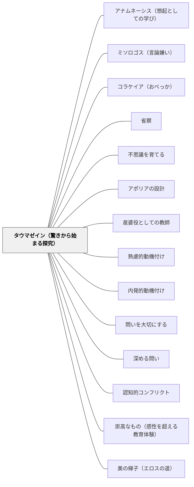

# タウマゼイン（驚きから始まる探究）

> 驚くことは哲学の始まりではなく、唯一の始まりである。知恵を愛することに、これ以外の出発点はない。

## [Pattern Connection]

### プラトン『テアイテトス』（前369年頃）——タウマゼイン（驚き）：探究の唯一の起点

プラトン『テアイテトス』155dでソクラテスはテアイテトスの「驚き」を見て言う：

> 「その状態、つまり不思議に思うこと（タウマゼイン）は、知恵を愛する者に固有の経験だからだ。というのも、これ以外に知恵を愛することの始まりはない。」（155d）

「哲学の始まりのひとつはタウマゼインだ」ではなく「これ以外に始まりはない」——驚きは探究の入り口のひとつではなく、唯一の入り口である。アポリア・問い・探究・知識への渇望——これらはすべてタウマゼインから始まる。

**タウマゼインの文脈（155b〜d）：**
「同じものが6個の中では大きく、4個の中では小さい。私は大きくも小さくもなっていないのに、相対的に『なった』と言われる」——この逆説にテアイテトスが「驚いた（めまいがする）」と言い、ソクラテスがこの状態を「タウマゼイン」と呼ぶ。

**「教えることができないもの」としてのタウマゼイン：**
タウマゼインは「驚きなさい」と命令して起こせるものではない。驚きが生まれる「場」の設計——逆説・矛盾・意外性・「なぜ？」が浮かぶような素材と状況——が教師の仕事である。

**既存パタンとの関連：**
- **補強点**：[[パタン/不思議を育てる]] のWonder Boxが「驚きを集める文化」を作るならば、タウマゼインは「驚きが生まれる」源泉の概念を提供する。Wonder Boxが機能するのは、タウマゼインが起きているから。
- **接続点**：[[パタン/アポリアの設計]] がアポリア（困惑・分からなくなること）を設計するとしたら、タウマゼインはそのアポリアへの入り口にある「驚き」の設計である。「なぜ？」という驚きなしにアポリアは生まれない。
- **波及するパタン**：[[パタン/産婆役としての教師]] — 産婆術の前提にタウマゼインがある：ソクラテスが助けるのは「驚きを感じた魂」が知識を産む過程；[[パタン/熟慮的動機付け]] — タウマゼインは内発的な知的好奇心の哲学的源泉

---

### プラトン『饗宴』（前380年頃）——エロスとタウマゼイン：探究を駆動する二つの力

プラトン『テアイテトス』がタウマゼイン（驚き）を探究の入り口として示すとすれば、『饗宴』はその驚きを前進させる**エロス（欠如から生まれる欲求）**を哲学的に定義する。

**エロスの本性（201d–204c）：**
ディオティマはエロスを「知恵と愚かさの間にいるもの」として定義する。完全な知恵を持つ者（神々）は探究しない——すでに知っているから。完全な愚か者（アマティア）も探究しない——欠けていることに気づかないから。探究するのは「自分に欠けていると知っている者」——エロスはこの「知恵と無知の間」に生きる。

**タウマゼインとエロスの関係：**

| | タウマゼイン（テアイテトス155d） | エロス（饗宴202e） |
|---|---|---|
| 役割 | 探究の唯一の入り口 | 探究を前進させる動力 |
| 機能 | 「これはおかしい」という気づき | 「手に入れたい」という欲求 |
| 構造 | 逆説・矛盾が引き金になる | 欠如の認識が引き金になる |
| 教師の仕事 | タウマゼインが生まれる場の設計 | エロスが生き続ける学習環境の設計 |

タウマゼインは「今あるものの不思議さへの驚き」であり、エロスは「まだないものへの欲求」——この二つは探究の入り口（驚き）と出口（欲求）として相補的に機能する。驚きが欠如を浮かび上がらせ、浮かび上がった欠如がエロス（欲求）を生む。

**「哲学の話はただひたすら楽しい」（アポロドロス、172b）：**
宴会の語り手アポロドロスが冒頭で言う：「哲学の話となると、自分で話をするときでも人の話を聞くときでも、それがもたらしてくれる効用なんて抜きにして、もうただひたすら楽しいのだ」——これがタウマゼイン×エロスが機能している状態の現象学的記述である。驚きが欲求を生み、欲求が喜びになる。

**補強点**：タウマゼインが「探究の唯一の入り口」であることに加え、その後の探究を駆動する動力がエロス（欠如への欲求）であることが明らかになる。教師は「驚きの場（タウマゼイン）」だけでなく「欠如感と策略の場（エロス）」を設計する必要がある。

**波及するパタン**：[[パタン/美の梯子（エロスの道）]] — タウマゼインが美の梯子の「一段目（一つのものへの没入）」への入り口；[[パタン/無知の知]] — エロス＝知恵と無知の間＝無知の知の哲学的深化；[[文献/饗宴（プラトン）]] — 本統合の出典

---

### プラトン『パイドン』（前380年頃）——死の直前まで驚きながら探究する：タウマゼインの究極形（115b–118a）

パイドンのソクラテスの最後の姿は、タウマゼイン（驚きから始まる探究）の**究極的な実践形態**を示す。

**「死について知らない——だから怖れない」というタウマゼインの態度：**

ソクラテスは処刑の直前、「死後がどうなるか知っている」とは一切言わない。「死について知らない——だから、それが善いものである可能性を排除して怖れるのは、知恵がないのに知恵があると思いこむことだ」（弁明29a参照）という不知の自覚を最後まで保つ。

これは「驚き」の最深の形である——**知らないことへの怖れでなく、知らないことへの開かれた驚きと希望を同時に持つ態度**。タウマゼインは若者の学習でのみ起きるのでなく、2400年前の哲学者が毒を飲む直前まで保ち続けた姿勢である。

**「善き希望がある」（114c–d）：**

> 「この生涯において、徳や才智に与るためにあらゆることを為すべきなのだ。褒賞は美しく、希望は大きいのだから。」（114c–d）

「善き希望」とは「死後が良いと知っている」ではない——「知らないからこそ、探究し続けた者に善いものが来るかもしれない」という開放的な期待。これがタウマゼインの終生形態：不確かさへの怖れでなく、不確かさへの驚きと希望。

**「語り方が魂に影響する」（115e）：**

> 「立派でない仕方で語ることは、それ自体で調子はずれなだけでなく、なんらかの悪を魂のうちに作り込むのだ。」（115e）

タウマゼインは「内側からの驚き」であると同時に、教師の語り方・問いの立て方・言葉の選び方という**外部の言語行為**によっても形成・変容される。驚きを生む語り方と驚きを殺す語り方がある。

**フーコーの証言（1984年最終講義）：**

ミシェル・フーコーは死の直前（1984年2月〜3月）の最終講義でパイドンのソクラテスの最後の言葉に執着した。エイズで死を目前にした哲学者が「異様な月並みさのなかにとどまっている」とこの言葉を評したという事実——哲学者の驚きと探究は死によっても終わらない。これがタウマゼインの生涯を貫く形態の現代的証言である。

**補強点**：タウマゼインが「若い学習者の学習の入り口」だけでなく、**生涯を貫く哲学的態度**であることが明らかになる。教師がタウマゼインを「授業の入り口テクニック」としてでなく、自分自身の知的態度として体現するとき、それは学習者に伝わる。

**波及するパタン**：[[パタン/無知の知]] — 「死について知らない」という終生の不知の自覚；[[パタン/ミソロゴス（言論嫌い）]] — タウマゼインがあればミソロゴスを乗り越えられる；[[パタン/アナムネーシス（想起としての学び）]] — 驚きがアナムネーシスの感情的出発点；[[文献/パイドン（プラトン）]] — 本統合の出典

---

## 背景（Context）

子どもたちは「なぜ？」「どうして？」という驚きを本来持っている。しかし授業が「正しい答えを出すこと」を中心に設計されると、驚きは「授業の進みを遅らせるもの」として扱われやすい。「今は関係ない」「後で調べて」と言われると、子どもは「驚いてはいけない」というメッセージを受け取る。

プラトンが前369年頃に書いた対話篇『テアイテトス』で、ソクラテスはテアイテトスの「めまいがする（驚き）」という状態を哲学の唯一の起点として価値づけた。「驚き」は答えを持つことより大切——この洞察は2400年後の教室でも問われ続けている。

## 問題（Problem）

答えを素早く出すことへの圧力が、驚きを生む余地を奪う。「なぜこうなるの？」と立ち止まる前に次の問題へ進む。「驚き（タウマゼイン）」が授業の流れを妨げると教師が感じると、その「驚き」は消される。

しかし驚きが消された教室では、「答えを処理する」ことはできても「問いを持ち続ける」ことができない学習者が育つ。探究の唯一の始まりを排除した学習は、表面的な正解の処理に終わりやすい。

## 力のかたち（Forces）

- タウマゼインは「教えられるもの」ではなく「生まれるもの」——場の設計によって引き出されるが、強制はできない
- 驚きは逆説・矛盾・意外性・「なぜ？」を刺激する素材によって生まれやすい
- タウマゼインの後には「アポリア（困惑）」が来る——驚きが問いになり、問いが「分からなくなること」への耐性が必要
- 「驚いた！」を価値として認める学習文化がなければ、驚きは内側に隠れる
- 驚きは「答えがない問い」からも生まれる——美的理念（カント §49）を持つ素材が驚きを持続させる

## 解決（Solution）

**驚き（タウマゼイン）が生まれる場を設計する。逆説・矛盾・意外な事実・「なぜ？」が浮かぶ素材と状況を用意し、驚きを「探究の唯一の始まり」として価値づける文化をつくる。**

---

**ステップ1：驚きを生む素材を選ぶ**

「なぜ？」が一回で終わらない素材——一義的な答えが出ない問い・逆説的な事実・意外な結果——を意図的に選ぶ。「全員が1回答えたら終わり」の素材は、タウマゼインを生みにくい。

**ステップ2：驚きを「止まる権利」として制度化する**

授業中に「ちょっと待って、不思議に思った」と言える文化をつくる。「今は関係ない」ではなく「その驚きを書いておいて」という返し方が、驚きを殺さずに保存する。

**ステップ3：驚きをアポリアへつなぐ**

「不思議に思ったこと」を「ではどうして？」に変換する。驚きを問いに育て、問いを「分からない（アポリア）」という状態へ導く——「分からなくなった」ことを「以前より優れた状態」として評価する。

**ステップ4：驚きを共有する**

「私の驚き」を全体で共有する時間を設ける。同じ事実に驚く人・驚かない人の違いが、「なぜ驚くか・驚かないか」という新たな驚きを生む。

---

**具体例1：算数「なぜ0で割れないの？」**

「10÷2＝5」を習った後に「10÷0はいくつ？」と問う。「計算できません」という答えの後に「なぜ計算できないの？」と問い返す。「÷0ができない理由」を考え始めたとき——そこにタウマゼインが生まれている。

**具体例2：国語「同じ音で正反対の意味」**

「はやい」は「速い」と「早い」で違う漢字になることに注目させる。「どちらも同じ読みなのにどう違うの？」——言語の不思議への驚きが、語感・語源・言葉の成り立ちへの探究につながる。

**具体例3：理科「重いものも軽いものも同時に落ちる」**

「重いものと軽いものを同時に落とすとどっちが速く落ちる？」——多くの子が「重い方が速い」と答える。実験で同時に落ちることを見せたとき、「えっ？なんで？」というタウマゼインが生まれる。

## 結果（Consequences）

- 「答えを処理する」から「問いを持つ」へと学習文化が変わる
- 「分からなくなること」が価値として認識され、探究への耐性が育つ
- 驚きを共有することで、子どもたちが互いの「なぜ？」を学習の燃料にできる
- タウマゼインから始まる探究は内発的動機に基づく——外から課された目標より持続しやすい
- ただし、タウマゼインだけでは探究が完結しない——驚きをアポリアへ、アポリアを探究へつなぐ設計が必要

## 関連パタン
- [[パタン/アナムネーシス（想起としての学び）]]
- [[パタン/ミソロゴス（言論嫌い）]]
- [[パタン/コラケイア（おべっか）]]
- [[パタン/省察]]
- [[パタン/不思議を育てる]] — Wonder Box：タウマゼインを日常的に集め育てる実践
- [[パタン/アポリアの設計]] — タウマゼインの後に来る「困惑」を設計する
- [[パタン/産婆役としての教師]] — 産婆術の前提：驚いた魂が知識を産む過程を助ける
- [[パタン/熟慮的動機付け]] — タウマゼインは内発的な知的好奇心の哲学的源泉
- [[パタン/内発的動機付け]] — 驚きは外から与えられない内発的な状態
- [[パタン/問いを大切にする]] — 驚きが問いになる過程を大切にする
- [[パタン/深める問い]] — タウマゼインから生まれた問いを深める
- [[パタン/認知的コンフリクト]] — 逆説・矛盾がタウマゼインを生む
- [[パタン/崇高なもの（感性を超える教育体験）]] — 崇高（カント）もタウマゼインも「概念を超えた」体験から始まる
- [[パタン/美の梯子（エロスの道）]] — タウマゼインが美の梯子の一段目（一つのものへの没入）への入り口
- [[パタン/無知の知]] — タウマゼインが無知の知を生み、無知の知がエロスを生む（饗宴203e–204b）

## クラスター図

## Actionable Insight

- 単元の導入で「これっておかしくない？」と感じる事実・逆説・矛盾を1つ提示する——「えっ？なんで？」という驚きが単元全体の探究エンジンになる
- 子どもが「なぜ？」と言ったとき、「今は関係ない」と言う代わりに「その驚きを付箋に書いておこう」と返す——驚きを殺さず保存するだけで、次の探究への燃料が残る
- 授業の最後に「今日驚いたことは何ですか？」を問う——「今日正解できたこと」を問うより、驚きを評価する文化が「タウマゼイン」を教室に育てる

---

## 出典

プラトン（渡辺邦夫・立花幸司訳）（2022）『テアイテトス』光文社古典新訳文庫（Bフ 2-5）, pp.155d.
→ [[文献/テアイテトス（プラトン）]]

プラトン（中澤務訳）（2013）『饗宴』光文社古典新訳文庫（Bフ 2-4）, pp.201d–204b.
→ [[文献/饗宴（プラトン）]] — エロスとタウマゼインの共鳴：欠如の認識が驚きを生む

> 「その状態、つまり不思議に思うこと（タウマゼイン）は、知恵を愛する者に固有の経験だからだ。というのも、これ以外に知恵を愛することの始まりはない。」——プラトン『テアイテトス』155d
