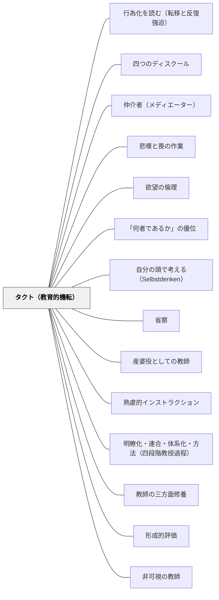

# タクト（教育的機転）

> 理論は「何をすべきか」を教え、タクトは「今、この瞬間に何をするか」を決める——ヘルバルト

## [Pattern Connection]

**ヘルバルト（1806）教育学綱要——タクトの直接の定式化：**

ヘルバルトは「多面性成立の条件」を論じる中で、教育者の不可欠な徳としてタクトを明示した。

> 「実際の行為決定は常に不確定要素を含み、洞察と機略（タクト）の結合が要求される。タクトは譲渡不能の徳であるが、経験の蓄積がこれを補い得る。」（第08節）

> 「タクト（Takt）：状況を即時に把握し適切に振る舞う勘所・機転。ヘルバルトは教育者の不可欠徳とみなした。」（原書注記）

**洞察（Insight）との関係**：ヘルバルトは「洞察とは、単なる情報でなく、事象相互の関連を把握し、そこから行為を方向づける高次理解」と定義した。タクトはこの洞察と機略（Klugheit）が統合されて初めて生まれる。どちらが欠けても教育的行為はぎこちなくなる。

- **「譲渡不能」の意味**：理論から直接タクトを「手渡す」ことはできない。師が持つタクトを師から授業で見て、実践を繰り返し、省察するなかで自ら育てるしかない。
- **経験の蓄積との関係**：タクトは生得的才能ではなく、理論と経験と省察の反復で育てることができる——これが教育者の専門性発達の核心。
- **波及するパタン**：[[パタン/省察]]・[[パタン/産婆役としての教師]]・[[パタン/教師の三方面修養]]；[[文献/教育学綱要（ヘルバルト）]] — 本パタンの出典

---

## 背景（Context）

[[パタン/熟慮的インストラクション]]の実践次元。教育には「理論が正しく、計画が完璧でも、うまくいかない」瞬間がある。教室は複雑系であり、同じ課題・同じ指示でも子どもの反応は毎回異なる。ヘルバルトが提示した統御・教授・訓練の三軸はいずれも、実践の瞬間には「この状況で今どうすべきか」という即時判断を要求する。

## 問題（Problem）

理論を学んでも「それが教室の特定の瞬間にどう適用できるか」は理論が直接は教えてくれない。「教育書に書いてある通りにしたのに上手くいかなかった」「あの場面でもっと良い判断をすれば……」という経験は教師誰もが持つ。理論と実践の間には、状況の読み取りと即時判断という橋が必要である。この橋がタクトであり、それなしには理論は「絵に描いた餅」にとどまる。

## 力のかたち（Forces）

- 理論は一般則を示すが、特定の瞬間の適用方法は無数にある
- 教室の状況は常に変化しており、「正解を探す時間」はない
- タクトは「慣れ」「感覚」ではなく、理論を体化した判断力——根拠のない直感とは異なる
- 経験なしにタクトは育たない——しかし経験だけでは不十分で、省察がなければ同じ判断ミスを繰り返す
- タクトが欠けると、理論通りにやって失敗するか、感覚任せで一貫性を失うかのどちらかになる
- タクトは「正しい判断をすること」ではなく「状況から判断を生む能力」である——完璧な判断を求めすぎると動けなくなる

## 解決（Solution）

**理論・経験・省察の三段階の反復を通じて、タクトを意識的に育てる。「今この瞬間に何をするか」を後から言語化し、次の実践に活かすサイクルを持ち続ける。**

---

### タクトの三つの発現場面

**1. 統御場面のタクト（児童の状態を読む）**

> A児が課題から離れて他を見ている。今は注意するか、課題を変えるか、そのまま様子を見るか——3秒で判断する。

「叱る」という選択肢の前に「状況を読む」。疲れているのか、理解できていないのか、別のことを考えているのかによって最適な介入は異なる。タクトは「この子は今どこにいるか」を一瞬で読む力である。

**2. 教授場面のタクト（授業の流れを調整する）**

> 「明瞭化」を進めようとしていたが、数人の顔から「もう分かった」という反応が読める。今は「連合」に移るべきか。

[[パタン/明瞭化・連合・体系化・方法（四段階教授過程）]]の四段階は計画ではなく地図である。今クラスがどこにいるかを常に読み、地図上の現在地に合わせて動く——これが教授場面のタクトである。

**3. 訓練場面のタクト（介入と手放しの判断）**

> B児が問いに詰まっている。今助言するか、もう少し待つか。介入が早ければ学習機会を奪い、遅ければ諦めを生む。

[[パタン/産婆役としての教師]]の核心は「タイミングよく介入する」ことである。その「タイミング」を測る力がタクトである——教育的機転なしに産婆役は成立しない。

---

### タクトを育てる三角形

```
     理論
    （ヘルバルト・
      ブルーナー・
      現代の教育学）
        △
       / \
      /   \
  省察 ──── 経験
（授業後の    （日々の
  振り返り）    実践）
```

理論だけでは「知っているが使えない」。経験だけでは「感覚的だが根拠がない」。省察だけでは「反省するが変化しない」。三者が循環するときタクトは育つ。

---

## 結果（Consequences）

- 理論知識が「使えない抽象論」から「実践を方向づける指針」へと変わる
- 「あの瞬間に何をすべきだったか」が授業後に言語化でき、次の実践の精度が上がる
- タクトが育つにつれ、「教室の空気を読む」感覚が根拠のある判断力へと深化する
- 同僚との省察的対話が豊かになる——「あの場面でどう判断したか」を語れる言語が生まれる

- [[パタン/偶発の瞬間を活かす（コンティンジェンシー）]] — 同じ現象の設計側。タクトが「起きたときにどう振る舞うか」なら、こちらは「起きる場所をどこに作るか」
- [[パタン/予想される反応を先に書く（応答の幅を絞る）]] — 一瞬の判断の負荷を、あらかじめ下ろしておく手立て
- [[パタン/練り上げ（比較検討の全体交流）]] — タクトが最も濃く要求される場面

## クラスター図



## Actionable Insight

- 授業後に「タクトが働いた瞬間」を1行メモする——「○○の反応を読んで、連合段階に早めに移った」のように具体的に書く。これがタクトの省察の最小単位
- 「あの場面でもっと良い判断をすれば……」という後悔のある授業を記録し、「次回同じ状況なら何をするか」を一文書く——省察がタクトを磨く
- 優れた授業者の授業を参観するとき、「何を教えているか」より「いつ・どう介入を変えたか」を観察する——タクトは見ることでも学べる

## 関連パタン
- [[パタン/行為化を読む（転移と反復強迫）]]
- [[パタン/四つのディスクール]]
- [[パタン/仲介者（メディエーター）]]
- [[パタン/悲嘆と喪の作業]]
- [[パタン/欲望の倫理]]
- [[パタン/「何者であるか」の優位]]
- [[パタン/自分の頭で考える（Selbstdenken）]]

- [[パタン/省察]] — タクトを磨く最も重要な実践。省察なき経験はタクトを育てない
- [[パタン/産婆役としての教師]] — タクトは産婆役の「タイミングよく介入する」技術の核心
- [[パタン/熟慮的インストラクション]] — インストラクションの設計に先立つ状況判断の力
- [[パタン/明瞭化・連合・体系化・方法（四段階教授過程）]] — タクトは四段階の「今どこか」を読む力
- [[パタン/教師の三方面修養]] — タクトを育てる修養の三方面（理論・経験・省察）
- [[パタン/形成的評価]] — タクトの即時版；授業中の判断が形成的評価そのもの
- [[パタン/非可視の教師]] — タクトが高まると「見えない教師」として最適なタイミングで現れられる
- [[パタン/内発的動機づけ]] — タクトは学習者の興味状態（六種の興味のどれが活きているか）を読む力でもある
- [[パタン/漸進主義（時と地の読み）]] — タクト（今この瞬間）・フロネーシス（行為の質）と補完する三者。中長期的変革の方向と歩幅を判断する（中江兆民）

## 出典

Herbart, J. F. (1806). *Allgemeine Pädagogik aus dem Zweck der Erziehung abgeleitet* 第08節. → [[文献/教育学綱要（ヘルバルト）]]

> 「実際の行為決定は常に不確定要素を含み、洞察と機略（タクト）の結合が要求される。タクトは譲渡不能の徳であるが、経験の蓄積がこれを補い得る。」——ヘルバルト（第08節）
