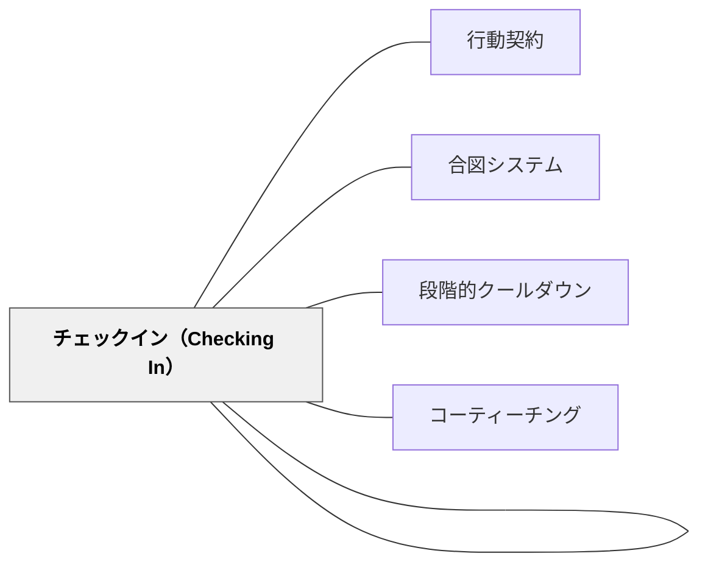

# チェックイン・チェックアウト（行動支援）

> 朝、今日の目標を確認する。放課後、今日の達成を振り返る——短い2回の接触が、一日の学びをつないだ線にする。

---

## Pattern Connection

> **同名パタンとの区別**：[[パタン/チェックイン（Checking In）]] はAtwell（2016）の読書指導における**毎日の読書ゾーン確認**であり、独立読書中に教師が全員に2〜3分で声をかける実践である。本パタン「チェックイン・チェックアウト（行動支援）」はHammeken（2007）による**行動支援・学習支援の文脈**での朝の目標設定と放課後の振り返りであり、支援ニーズのある子どもと特別支援教員・支援員・スクールカウンセラーが構造的に関わる仕組みを指す。両者は「チェックイン」という語を共有しつつ、文脈・目的・協働者・頻度すべてにおいて異なる。

**出典**: Hammeken, P. A. (2007). *The Teacher's Guide to Inclusive Education: 750 Strategies for Success!* Corwin Press. (Strategy #689)

- **既存パタンとの関連**：[[パタン/行動契約]] の「目標の明確化」と連動する——行動契約で設定した目標を、チェックイン・チェックアウトの毎日の確認で運用する。[[パタン/合図システム]] と組み合わせることで、授業中と授業外の行動支援を一体化できる。
- **補強された点**：[[パタン/段階的クールダウン]] は問題行動が起きた後の対応であるのに対し、本パタンは一日の始まりと終わりに目標と振り返りを設けることで問題行動を予防する機能を持つ。
- **修正・拡張された点**：行動支援を「問題が起きたときだけ介入する」構造から「毎日構造的に関わる」構造へ転換する。
- **他のパタンへの波及**：[[実践/インクルーシブ授業の設計]] の「協働体制の設計」セクションにおいて、担任×特別支援教員の日常的な接続点として機能する。

---

## 背景（Context）

行動面や学習面に支援ニーズのある子どもは、「今日何をするか」「今日何ができたか」という見通しと振り返りが、授業参加と自己調整にとって特に重要である。

一方、担任一人がすべての子どもの目標管理を行うことは時間的・専門的に難しい。特別支援教員や支援員、スクールカウンセラーが関与する体制を設けることで、子どもへの接触が日常的なルーティンになる。

## 問題（Problem）

支援ニーズのある子どもが、目標をもたないまま一日を過ごし、何がうまくいって何がうまくいかなかったかを誰にも確認されないまま下校する。これが繰り返されると、自己調整の感覚が育たず、行動支援が「問題が起きたとき」の対応だけになる。

## 力のかたち（Forces）

- 朝の目標設定は「今日の見通し」を作り、ランダムに反応する一日から意図的な一日へ変える
- 放課後の振り返りは「成功の記録」を積み上げ、自己効力感を育てる
- 担任以外の大人（特別支援教員・支援員・カウンセラー）との短い接触が、子どもに「見られている安心感」を与える
- 構造化（決まった時間・場所・人・形式）が、子どもにとって「何をすればよいか」を明確にする
- 毎日行うことで、目標と行動の因果が子ども自身に見えるようになる

## 解決（Solution）

**毎朝1〜3分の「チェックイン」と放課後1〜3分の「チェックアウト」を設ける。担当者は特別支援教員・支援員・カウンセラーのいずれかが担う。**

---

### チェックインの構造（朝）

| 要素 | 内容 |
|------|------|
| 時間 | 登校後・1時間目開始前の1〜3分 |
| 場所 | 廊下・支援室・教室の一角（安定した場所） |
| 担当者 | 特別支援教員・支援員・カウンセラーのいずれか |
| 内容 | 今日の目標を1つ確認する（「今日は〇〇を頑張る」） |
| 記録 | チェックインシートに目標を書く |

**チェックイン時の問い（例）**：
- 「今日一番頑張りたいことは何？」
- 「今日難しそうなことはある？」
- 「昨日の〇〇、よかったね——今日も続けてみる？」

---

### チェックアウトの構造（放課後・下校前）

| 要素 | 内容 |
|------|------|
| 時間 | 下校前の1〜3分 |
| 場所 | 同じ場所（安定性が重要） |
| 担当者 | 同じ大人 |
| 内容 | 今日の目標の達成を確認し、成功点を見つける |
| 記録 | チェックアウトシートに記録 |

**チェックアウト時の問い（例）**：
- 「今日の目標、どれくらいできた？」
- 「今日一番よかったことは何？」
- 「明日、同じことをまた続ける？それとも別の目標にする？」

---

### チェックイン・チェックアウトシートの最小版

```
名前：＿＿＿＿　日付：＿＿＿＿

【朝のチェックイン】
今日の目標：
（例：算数の時間、席を離れずに座り続ける）

【放課後のチェックアウト】
目標の達成度：　1　2　3　4　5
よかったこと：
明日の目標：
```

このシート1枚が、毎日の行動支援の「記録」と「継続」を可能にする。

---

### 担任との連携

チェックインで得た情報は、その日の授業に入る前に担任へ一言伝える：

> 「今日〇〇は『算数で席を離れない』を目標にしています。休憩が必要そうなら合図システムを使うよう伝えました。」

この一言が、[[パタン/合図システム]] や [[パタン/段階的クールダウン]] と接続し、担任の授業中の対応をより意図的にする。

## 結果（Consequences）

- 子どもが毎日「今日何を目指すか」を言語化する習慣が育つ
- 「今日もできた」という小さな成功の積み重ねが自己効力感を育てる
- 担任以外の大人との毎日の接触が、子どもに安心感と見守られている感覚を与える
- 問題行動の発生頻度が減る——見通しのある一日が「何が起きるか分からない不安」を取り除くため
- ただし、チェックインが「尋問」や「叱責の場」になると逆効果——成功を探す視点を担当者が持ち続けることが鍵

## 関連パタン

- [[パタン/行動契約]] — チェックイン・チェックアウトの「目標」を行動契約で設定する
- [[パタン/合図システム]] — 授業中の行動支援との接続
- [[パタン/段階的クールダウン]] — 問題が起きた後の対応（本パタンは予防的設計）
- [[パタン/コーティーチング]] — 担任×特別支援教員の協働体制の一部として位置づける
- [[パタン/チェックイン（Checking In）]] — 読書指導の文脈でのチェックイン（本パタンとは文脈が異なる）
- [[実践/インクルーシブ授業の設計]] — 協働体制の設計との接続

---

## クラスター図



## Actionable Insight

- 来週から、支援ニーズのある子ども1人について「朝に目標を1つ聞く」「下校前に達成を確認する」の2ステップを試してみる——特別なシートがなくても、会話と一言メモで始められる
- チェックインシートを手作りする前に、「今日の目標は？」「今日よかったことは？」の2問を口頭で始め、記録の形は後で決める
- 特別支援教員または支援員と「朝1〜3分の接触をいつにするか」を曜日・場所込みで決める——時間を決めることが継続の最大の条件

---

## 出典

Hammeken, P. A. (2007). *The Teacher's Guide to Inclusive Education: 750 Strategies for Success!* Corwin Press. (Strategy #689)

> "Check-in and check-out times are important for the student. Enlist the support of the special education teacher or paraprofessional if the student has special needs. If not, obtain the support of the school social worker or counselor."——Hammeken (2007, Strategy #689)

[[文献/The Teacher's Guide to Inclusive Education（Hammeken）]]
