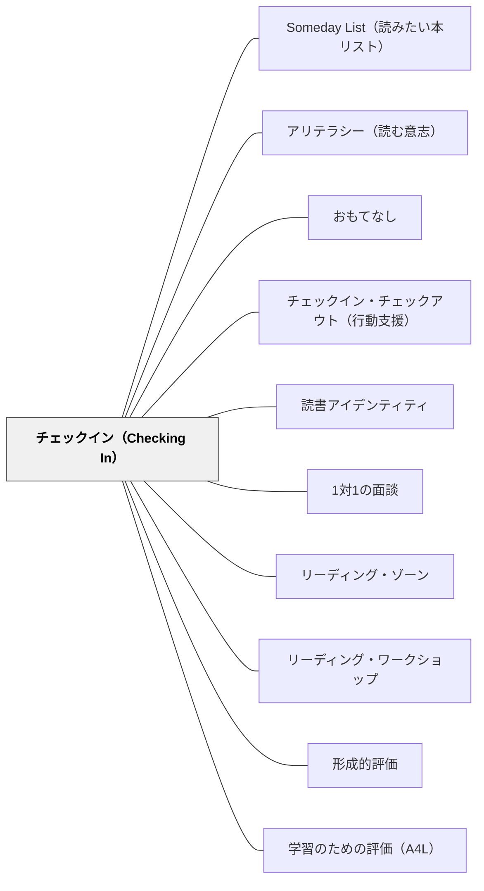

# チェックイン（Checking In）

> 「カンファランス（正式な面談）」ではなく「チェックイン（ゾーン確認）」——毎日・短く・全員に行うことで、読書から取り残される子を一人も出さない。

---

## Pattern Connection

> **同名パタンとの区別**：[[パタン/ダイアログ]] に記述される**Sengeの「チェックイン」**は、グループミーティングの冒頭で参加者が現在の状態を一言ずつ共有する組織的・対話的儀式であり、学習する組織のプラクティスとして位置づけられる。本パタンの「チェックイン」はAtwell（2016）の読書指導における**個別の読書確認実践**であり、両者は文脈・目的・形式すべてにおいて異なる。教師が一人ひとりの読者に毎日2〜3分で声をかける行為をAtwell版、会議・対話の開始儀式をSenge版と区別して参照されたい。

**出典**: Atwell, N., & Atwell Merkel, A. (2016). *The Reading Zone* (2nd ed.). Scholastic.

- **既存パタンとの関連**：[[パタン/1対1の面談]] と構造的に似ているが、チェックインは毎日・2〜3分・ゾーン確認中心という点で明確に異なる実践として定位する。面談が「深い読書対話」であるのに対し、チェックインは「読書の健康診断」である。[[パタン/リーディング・ゾーン]] の状態を毎日確認する手段として機能する。
- **補強された点**：「週1回の正式なカンファランス」という誤解が、教師が日々の対話を省略する原因になっていたことをアトウェル自身が認識し、用語を変えた経緯がある。チェックインという名称変更は、実践の頻度・深度・目的すべてを再定義する。[[パタン/形成的評価]] の「今どこにいるか」を毎日確認する行為として明確に位置づけられる。
- **修正・拡張された点**：「カンファランス」という語が持つ「特別なイベント」感が、日常的な短い対話を阻害していた。ステータス・オブ・ザ・クラスの記録と連動させることで、全員の状態を把握する体制が整う。
- **他のパタンへの波及**：[[パタン/学習のための評価（A4L）]] の「フィードバックの即時性」、[[パタン/リーディング・ワークショップ]] の「独立読書中の教師の動き」に直接接続する。

---

## 背景（Context）

ナンシー・アトウェルは長年「カンファランス（conference）」という語を使って読書中の個別対話を指してきた。しかし「conference」という語は教師に「週1回の正式な面談」を連想させ、毎日の短い対話を「省略してよいもの」として軽視させる誤解を生んでいた。

アトウェルは2016年版（第2版）において、この語を「チェックイン（checking in）」に変更した。チェックインとは、独立読書の時間中に教師が教室を歩き回り、一人ひとりの読書者に短く声をかける行為である。目的は深い読書対話ではなく、「ゾーンに入れているか」の確認と維持にある。

ステータス・オブ・ザ・クラス（status of the class）——クラス全員の読書状況を記録する一覧表——と連動して行われることで、教師は全員の状態をリアルタイムで把握し続けることができる。

## 問題（Problem）

読書の時間を確保しても、教師がすべての読者に毎日目を向けることができず、読書から取り残される子どもが見えなくなることがある。

「カンファランス」という語のもつ「特別感・正式感」が、教師が毎日短い対話を行うことを心理的に妨げる。「今日はカンファランスできなかった」という罪悪感が積み重なり、逆に何もしない状態が続く。

一方、「今週末に全員と面談する」という計画は、読書につまずいている子どもへの即時対応を遅らせる。

## 力のかたち（Forces）

- 毎日の短い接触は、週1回の長い面談よりも「取り残し」を防ぐ力が強い
- 「チェックイン」という名称は、目的（ゾーン確認）を明確にし、深い対話を求めなくてよい心理的許可を与える
- 2〜3分という短さが、全員を一巡できる現実的な量を保証する
- 決まった質問（常時質問）を持つことで、教師が問いを考えるコストを下げ、継続しやすくなる
- 記録（ステータス・オブ・ザ・クラス）が蓄積することで、個々の読書の流れ（ペース・好み・傾向）が見えてくる
- チェックインの存在が、学習者に「今日も先生が来る」という安心感と適度な緊張感を与える

## 解決（Solution）

**独立読書の時間中、毎日全員に2〜3分のチェックインを行う。目的は「ゾーンにいるか確認する」こと。**

---

### チェックインの7カテゴリ質問

アトウェルは以下の7カテゴリの質問を設計している：

**ALWAYS（常時質問）**：毎回必ず聞く
- "What are you reading?"（何を読んでいる？）
- "Are you in the zone?"（ゾーンに入れている？）
- "What's your pace?"（どんなペースで読んでいる？）
- "What's the rating?"（今何点をつける？）
- "When will you finish?"（いつ読み終わりそう？）
- "What's next?"（次は何を読む？）

**MOSTLY（ほぼ毎回）**：状況に応じて加える質問群

**AUTHOR QUERIES（著者への問い）**：書き方・語り口への気づきを引き出す

**CRITICAL QUERIES（批評的な問い）**：本の評価・分析を深める

**PROCESS QUERIES（読書プロセスの問い）**：どのように読んでいるかを問う

**WHEN THERE'S LITTLE OR NO ZONE（ゾーンに入れていないとき）**：つまずきへの対応

**FINIS（読み終わったとき）**：読後の反応と次の選書を確認する

---

### 実際の会話例（Atwell, 2016より）

Ellaとのチェックイン（Ella is reading *The Watsons Go to Birmingham—1963*）:

> 「ゾーンに入れている？」「ほぼ入れてる。でも昨日は入れなかった」「何があったの？」「机の周りがうるさくて。でも今日は大丈夫」

このやりとりは2分以内で終わる。教師はEllaがゾーンに入れていること、昨日の障害（周囲の騒音）、今日の状態の改善を把握できる。

---

### ステータス・オブ・ザ・クラスとの連動

チェックインの記録を「ステータス・オブ・ザ・クラス」として一覧表に記録する。

| 名前 | 書名 | ページ | 評価 | 次の本 | コメント |
|------|------|--------|------|--------|----------|
| ○○  | ○○  | 87     | 8    | 未定   | ゾーン○  |
| △△  | △△  | 12     | 5    | —      | 入れていない→明日再確認 |

この記録が蓄積することで：
- 読書ペースが遅い子どもへの早期介入が可能になる
- 「ゾーンに入れない」が続く場合は本の交換を提案できる
- クラス全体の読書量の傾向が見えてくる

---

### 主目的を忘れない

> "The primary purpose is making sure that everyone is okay—in the reading zone and happy to be there."——Atwell & Atwell Merkel（2016）

チェックインは評価ではなく「確認」である。評価的なまなざしで接すると、学習者はゾーンから引き離される。「今どこにいる？」「何が邪魔している？」という問いが中心になる。

## 結果（Consequences）

- 毎日全員に声をかける習慣が、読書から取り残される子どもの早期発見を可能にする
- 「チェックイン」という軽い名称が、教師が継続しやすい心理的ハードルを保つ
- 学習者は「今日も先生が話しかけてくれる」という安心感の中で読書を続けられる
- ステータス・オブ・ザ・クラスの記録が、成績評価や面談での根拠となる
- ただし、質問が尋問のようになると逆効果——「ゾーンを確認する」という目的に立ち返ることが重要

## 関連パタン
- [[パタン/Someday List（読みたい本リスト）]]
- [[パタン/アリテラシー（読む意志）]]
- [[パタン/おもてなし]]
- [[パタン/チェックイン・チェックアウト（行動支援）]]
- [[パタン/読書アイデンティティ]]

- [[パタン/1対1の面談]] — チェックインとの差分：深い読書対話vs.日常的なゾーン確認
- [[パタン/リーディング・ゾーン]] — チェックインの主目的：ゾーンにいるか確認する
- [[パタン/リーディング・ワークショップ]] — 独立読書時間中に行う教師の動きとして位置づける
- [[パタン/形成的評価]] — 毎日の即時確認が形成的評価の最小単位
- [[パタン/学習のための評価（A4L）]] — 「今どこにいるか」を毎日確認する評価実践

---

## クラスター図

## Actionable Insight

- 今週の独立読書中に「ゾーンに入れた？」「今何を読んでいる？」の2問だけ全員に聞いて回る——深い対話は不要、2分以内で全員一巡することを目標にする
- ステータス・オブ・ザ・クラスの記録表を紙1枚で作る（名前・本のタイトル・ページ・評価1〜10・コメント欄）——1週間記録するだけで、誰が止まっているかが見えてくる
- 「カンファランス」という語をやめ、「チェックイン」と呼び直す——名前を変えるだけで、毎日行う心理的ハードルが下がる

---

## 出典

Atwell, N., & Atwell Merkel, A. (2016). *The Reading Zone* (2nd ed.). Scholastic.

> "The primary purpose is making sure that everyone is okay—in the reading zone and happy to be there."——Atwell & Atwell Merkel (2016, p. XX)

[[文献/The Reading Zone（Atwell）]]
