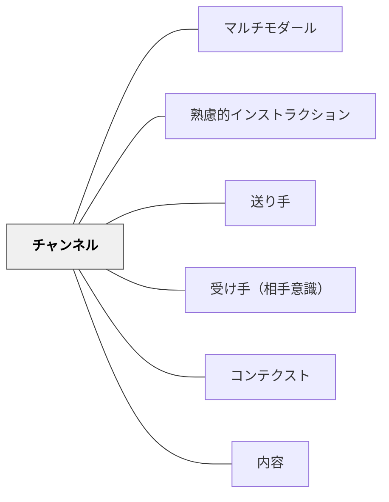

# チャンネル

> 内容を変えずに、伝達手段を受け手と状況に合わせて選ぶ。

## 背景（Context）
インストラクションの「チャンネル」とは、メッセージをどのような形式・手段で伝えるかである。言葉・絵・図表・映像・書面・直接・間接など、多様な手段が存在する。チャンネルの選択は内容とは独立しており、同じ内容を異なるチャンネルで伝えることができる。

## 問題（Problem）
送り手はしばしば自分が慣れているチャンネルだけを使う。口頭だけ、文字だけ、図だけ——と一種類のチャンネルに頼ると、そのチャンネルが合わない受け手には届かない。チャンネルと内容を混同すると、「伝え方を変えた」だけで「内容も変えた」と錯覚しやすい。

## 力のかたち（Forces）
- 受け手によって情報を処理しやすいチャンネルが異なる
- コンテクスト（騒がしい場所・読む時間がない場面など）がチャンネルの有効性を左右する
- 複数のチャンネルを組み合わせることで伝達の確実性が高まる
- チャンネルを変えることは内容を変えることではない

## 解決（Solution）
**内容を固めた後、受け手の特性とコンテクストに合わせて最適なチャンネルを選択し、必要であれば複数のチャンネルを組み合わせる。**

「この人には話して伝えるのがよいか、書いて渡すのがよいか」「この場面では図で示すほうが速いか」と意識的に問う。同じ内容を口頭で伝えた後に板書で補う、映像で示した後に手順書を配るなど、複数チャンネルの組み合わせが理解を深める。

## 結果（Consequences）
- 受け手の多様性に対応でき、届く範囲が広がる
- チャンネルの選択意識が高まることで「伝わらない」の原因分析が明確になる
- 内容とチャンネルを分けて考えることで設計の自由度が上がる

## クラスター図

## Actionable Insight

- 同じ指示を「口頭だけ→板書も追加→図解も追加」と段階的に試し「どれが一番伝わったか」を振り返る——複数チャンネルの組み合わせが伝達の確実性を高めることを実感できる
- 「この子には口頭より視覚的に見せた方が届く」という受け手の特性を意識して伝え方を選ぶ——受け手に合わせたチャンネル選択が「伝えた」と「届いた」の差を縮める
- 「伝わらなかった」と感じたとき「内容が悪かったのか、チャンネルが合わなかったのか」を分けて分析する——チャンネルと内容を切り離した分析が的確な改善につながる

## 出典

- 一つの教育のパタン・ランゲージ（岩井輝久）

## 関連パタン
- [[パタン/マルチモダール]]
- [[パタン/熟慮的インストラクション]] — 親パタン
- [[パタン/送り手]] — チャンネルを選択する主体
- [[パタン/受け手（相手意識）]] — チャンネル選択の基準となる存在
- [[パタン/コンテクスト]] — チャンネルの有効性を左右する場面・背景
- [[パタン/内容]] — チャンネルとは独立した要素
