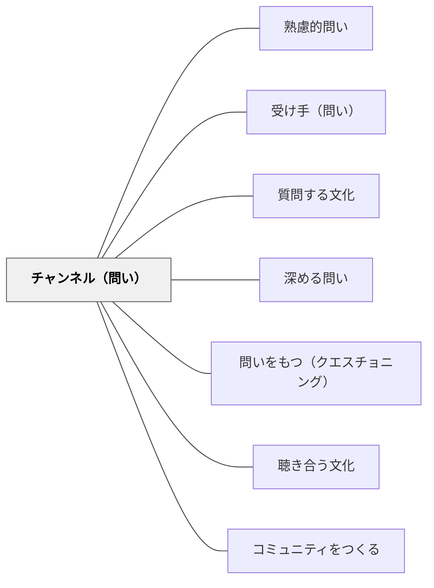

# チャンネル（問い）

> 問いの内容が同じでも、どんな形式・方法・媒体で届けるかが学びの質を変える。

## 背景（Context）

問いは口頭でも書面でも、個人に対しても集団に対しても問うことができる。また、問いを書かせる・話し合わせる・描かせるなど、問う形式は多様である。同じ問いでも、チャンネル（届け方）が変われば、学習者の関与の深さや思考のプロセスが大きく異なる。

## 問題（Problem）

問いの内容や意図が適切でも、その届け方（チャンネル）が学習者の特性や学習の目的に合っていないと、問いの力が十分に発揮されない。口頭での即答を迫るだけでは熟考が育たず、書くだけでは対話的思考が生まれにくい。

## 力のかたち（Forces）

- 一斉授業での口頭の問いは素早い応答を促すが、じっくり考える時間を奪いやすい。
- 書くことで思考が整理される学習者がいる一方、話すことで思考が深まる学習者もいる。
- グループでの問いは社会的思考を促すが、個人の深い内省には個別の問いが有効な場合もある。

## 解決（Solution）

問いの目的・内容・受け手の特性に合わせて、問いのチャンネル（口頭・筆記・ペア・グループ・個人・ICTなど）を意図的に選択する。例えば、深い熟考を促したいときは「まず個人で書いてから話し合う」という複数チャンネルの組み合わせが有効である。届け方そのものを設計の一部として扱う。

## 結果（Consequences）

チャンネルを意識的に選ぶことで、同じ問いでも学習者の関与・思考の深さ・表現の豊かさが変わる。ただし多様なチャンネルを用意しすぎると授業の流れが複雑になるため、目的に応じて絞り込むことが重要である。

## 関連パタン
- [[パタン/熟慮的問い]] — 親パタン
- [[パタン/受け手（問い）]] — 受け手の特性に合わせる
- [[パタン/質問する文化]] — 安心して問えるチャンネルの整備

- [[パタン/深める問い]] — 適切なチャンネルが深い探究を引き出す
- [[パタン/問いをもつ（クエスチョニング）]] — 問いを出すチャンネル設計の上位パタン
- [[パタン/聴き合う文化]] — 問いを受け取る文化的土台
- [[パタン/コミュニティをつくる]] — 安心して問えるコミュニティの土台
## クラスター図

## Actionable Insight

- 深く考えてほしい問いは「まず個人で1分書いてから話し合おう」と設計する——書く時間が熟考を促し、その後の対話の質を高める
- 「今日の問いはペアで」「今日は一人でじっくり」と問いのチャンネルを意識的に変える——形式の変化が同じ問いでも引き出す思考の深さと種類を変える
- 口頭での問いかけと「書いて答える」の両方を試し「どちらが深く考えられたか」を学習者に問う——チャンネルが思考に与える影響への気づきが自律的な学習スタイルの選択につながる

## 出典
- [[文献/熟慮的問いのパターンリスト（動画記録）]]
