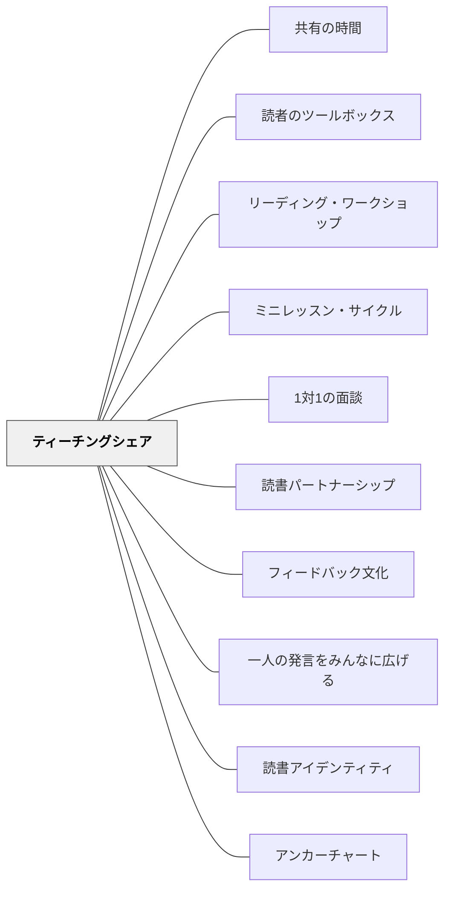

# ティーチングシェア

> 独立した活動の後に全員が集まり、その日の学びを「教えることとして共有」することで、ミニレッスンの意図が教室全体に浸透する。

---

## 背景（Context）

リーディング・ワークショップの最後の5〜10分に行う「Teaching Share Time（ティーチングシェア）」は、単なる感想発表会ではない。教師がその日のミニレッスンや観察したカンファランスをもとに、「クラスに伝えたい一場面」を取り上げ、子ども自身の言葉と行動を全体の学びに変える時間だ。

## 問題（Problem）

ワークショップの最後を「全員で感想を言う」時間にすると、発言できる子が限られ、教師が意図した学習の深化が起きにくい。また、子どもたちが独立読書で発見したことが次の授業につながらず、「一回で終わり」の学びになってしまう。

## 力のかたち（Forces）

- 全体に何かを「教えたい」と思ったとき、もう一度全員を集めることで授業が自然に閉じる
- しかし終わりの時間は疲れがたまりやすく、長い話し合いは機能しない
- 「誰の発言を取り上げるか」の選択がティーチングシェアの効果を決定する
- カンファランスで観察した場面をそのまま全体化するのは個人情報の扱いに注意が必要

## 解決（Solution）

Collins（2004）は Teaching Share Time を4部構成のワークショップの最終パートとして設計する。

**目的**：その日のミニレッスンの意図を、独立読書中に実践した「本物の場面」で確認・補強する。

---

### ティーチングシェアの3つのパターン

**①「Stefanoはこうしていました」型**
カンファランスで観察した子の行動を全体に紹介する。事前に本人の許可を得るか、「誰かが〜しているのを見ました」と匿名化する。

例：「今日の読書中に、Stefanoが本の絵を注意深く見て、何のお話かを考えていました。それを教えてもらえますか？」→ Stefanoが自分の方法を説明→「これはみなさんにも使える方法です」

**②「パートナーで確認する」型**
シェアの時間の最初にパートナーで「今日何を試したか」を30秒話させる。次に2〜3組に全体で話してもらう。

**③「次のミニレッスンへの橋渡し」型**
「今日みんなが試したことを聞いて、明日はその先のことを話そうと思います」と次の授業への期待をつなぐ。

---

### ミニレッスンとの循環構造

```
ミニレッスン（教師が教える）
    ↓
独立読書・パートナー読み（子どもが実践する）
    ↓
ティーチングシェア（実践した子の言葉で全体に伝わる）
    ↓
次のミニレッスン（観察した課題を出発点にする）
```

この循環が機能することで、「教師が教えたこと」が「クラスが学んだこと」に育つ。

---

### 具体例（Collins, 2004 より）

**流暢さの単元でのティーチングシェア**：
ミニレッスンで「ロボット声ではなくtaking voiceで読む」を教えた日。独立読書中にEmersonが声を変えて読んでいるのをカンファランスで観察。

ティーチングシェア：「Emersonが今日すごいことをしていたので、みんなに聞かせてもらいます。Emerson、あのやり方をみんなに見せてくれる？」→ Emersonが同じページをロボット声と会話声の両方で読む→「どちらが物語を感じられる？」とクラスに問う

**Reader's Toolboxの単元でのティーチングシェア**：
「どんな方法で難しい言葉に取り組んだか」を各自がパートナーに話す→「今日Julianが絵を使って言葉の意味を考えていました。明日はその方法をみんなで詳しく見てみましょう」

---

### 短さの原則

**5〜10分に収める**。長くなると集中が切れる。「一つのことだけ共有する」という原則で設計する。

## 結果（Consequences）

- ミニレッスンの意図が独立読書を通じて実践され、シェアによって全体に共有される——学びの循環が完成する
- 自分の読書場面が取り上げられた子どもは「自分が教えた」という経験をし、読書への自信が生まれる
- 教師はカンファランスで観察した場面を「教材」として活用できる——観察の精度が上がる動機になる

## 関連パタン
- [[パタン/共有の時間]]
- [[パタン/読者のツールボックス]]

- [[パタン/リーディング・ワークショップ]] — ティーチングシェアが組み込まれる4部構造の最終パート
- [[パタン/ミニレッスン・サイクル]] — 前のミニレッスンとシェアが次のミニレッスンへとつながる
- [[パタン/1対1の面談]] — カンファランスで観察した場面がシェアの素材になる
- [[パタン/読書パートナーシップ]] — シェアでパートナーと話す時間が先にある
- [[パタン/フィードバック文化]] — 子どもの実践が全体の学びになる文化
- [[パタン/一人の発言をみんなに広げる]] — ティーチングシェアは1×1を1×全員に広げる技術
- [[パタン/読書アイデンティティ]] — 自分の実践が取り上げられる体験がアイデンティティを強化する
- [[パタン/アンカーチャート]] — シェアの内容をチャートに蓄積することで翌日以降も参照できる

---

## クラスター図



## Actionable Insight

- ティーチングシェアのために、カンファランス中に「今日のシェアに使えそうな場面」を1つメモしておく習慣をつける
- 「誰が取り上げられるかわからない」という緊張感ではなく「自分もやったことが認められるかも」という期待感を作るため、シェアの前に「今日試したこと1分パートナーに話して」を挟む
- 週に1回は「明日のミニレッスンへの橋渡し」型で終わると、子どもが次の授業を楽しみに帰る

---

## 出典

Collins, K.（2004）*Growing Readers: Units of Study in the Primary Classroom*. Stenhouse Publishers.
