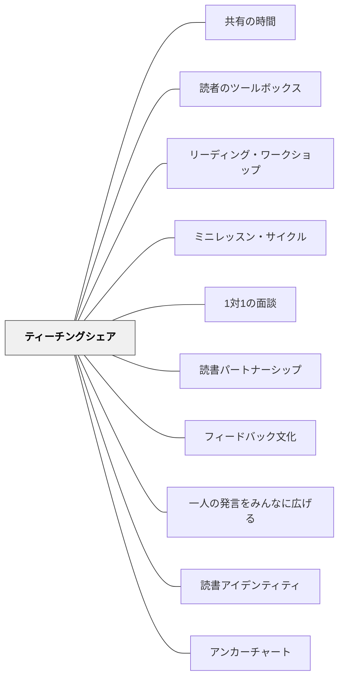

# ティーチングシェア

> 独立した活動の後に全員が集まり、その日の学びを「教えることとして共有」することで、ミニレッスンの意図が教室全体に浸透する。

---

## 背景（Context）

リーディング・ワークショップの最後のおよそ5分に行う「Teaching Share Time（ティーチングシェア）」は、単なる感想発表会ではない。教師がその日のミニレッスンや観察したカンファランスをもとに、「クラスに伝えたい一場面」を取り上げ、子ども自身の言葉と行動を全体の学びに変える時間だ。

## 問題（Problem）

ワークショップの最後を「全員で感想を言う」時間にすると、発言できる子が限られ、教師が意図した学習の深化が起きにくい。また、子どもたちが独立読書で発見したことが次の授業につながらず、「一回で終わり」の学びになってしまう。

## 力のかたち（Forces）

- 全体に何かを「教えたい」と思ったとき、もう一度全員を集めることで授業が自然に閉じる
- しかし終わりの時間は疲れがたまりやすく、長い話し合いは機能しない
- 「誰の発言を取り上げるか」の選択がティーチングシェアの効果を決定する
- カンファランスで観察した場面をそのまま全体化するのは個人情報の扱いに注意が必要

## 解決（Solution）

Collins（2004）は Teaching Share Time を4部構成のワークショップの最終パートとして設計する。

**目的**：その日のミニレッスンの意図を、独立読書中に実践した「本物の場面」で確認・補強する。

---

### ティーチングシェアの4つの使い方

Collins（2004）は、共有の時間の使い方を四つ挙げている。

**① ミニレッスンを補強する（Reinforcement）**
その日のミニレッスンで教えたことを、実際にやっていた子の姿で確かめる。例：表紙を見て読む準備をするミニレッスンの日に、それをしていた二人の様子を全体に演じて見せ、「ほかのみんなも、表紙がどう役に立ったかを隣の人に話してみて」と促す。

**② ミニレッスンに付け足す（Add-on）**
カンファランスで、ミニレッスンを補うことをしている子に気づいたら、それを紹介して教えたことに足す。例：表紙の作者名に気づいて「この本はきっとおもしろい」と予想した子を紹介し、「読む準備のためにすること」のチャートを作ろうと持ちかける。

**③ 次のミニレッスンを予告する（Preview）**
カンファランスで一人の子に教えたことや、一人の子が見つけたやり方が、次に全体に教える予定のことだったとき、共有の時間でそれを予告する。例：「今日○○さんは、本の中をちょっとのぞいて読む準備をしていました。明日は、みんなにそのやり方を教えます。」

**④ うまくいかなかったことを話し合う（Problem-Solving）**
その日の読書がうまくいかなかったとき（多くは運営の問題）、共有の時間でそれを話し合う。例：うるさくて集中できなかったと聞いた日に、「図書館の声」とは何か、なぜ大事かを隣の人と話し、そのあと5分、読む時間を足して練習する。

子どもの場面を全体に取り上げるときは、本人に確かめてからにするか、「誰かが〜しているのを見ました」と名前を出さずに紹介する。

---

### ミニレッスンとの循環構造

```
ミニレッスン（教師が教える）
    ↓
独立読書・パートナー読み（子どもが実践する）
    ↓
ティーチングシェア（実践した子の言葉で全体に伝わる）
    ↓
次のミニレッスン（観察した課題を出発点にする）
```

この循環が機能することで、「教師が教えたこと」が「クラスが学んだこと」に育つ。

---

### 具体例（Collins, 2004 より）

**Reader's Toolboxの単元でのティーチングシェア**：
「今日、みんなが言葉を読み解くのにいろいろな道具を使っているのを見ました。StefanoとJulianは、絵を手がかりに言葉を読み解くのがとても上手です。明日は、二人が絵をただ見るだけでなく、じっくり調べて、お話で何が起きているかを考えて言葉を読み解いたやり方を見せますね」→ 取り上げるのは気づいたことを一つだけにし、翌日のミニレッスンの予告として使う。翌日のミニレッスンで、二人がしたことを全体に見せる

---

### 短さの原則

**およそ5分に収める**。長くなると集中が切れる。「一つのことだけ共有する」という原則で設計する。

## 結果（Consequences）

- ミニレッスンの意図が独立読書を通じて実践され、シェアによって全体に共有される——学びの循環が完成する
- 自分の読書場面が取り上げられた子どもは「自分が教えた」という経験をし、読書への自信が生まれる
- 教師はカンファランスで観察した場面を「教材」として活用できる——観察の精度が上がる動機になる

## 関連パタン
- [[パタン/共有の時間]]
- [[パタン/読者のツールボックス]]

- [[パタン/リーディング・ワークショップ]] — ティーチングシェアが組み込まれる4部構造の最終パート
- [[パタン/ミニレッスン・サイクル]] — 前のミニレッスンとシェアが次のミニレッスンへとつながる
- [[パタン/1対1の面談]] — カンファランスで観察した場面がシェアの素材になる
- [[パタン/読書パートナーシップ]] — シェアでパートナーと話す時間が先にある
- [[パタン/フィードバック文化]] — 子どもの実践が全体の学びになる文化
- [[パタン/一人の発言をみんなに広げる]] — ティーチングシェアは1×1を1×全員に広げる技術
- [[パタン/読書アイデンティティ]] — 自分の実践が取り上げられる体験がアイデンティティを強化する
- [[パタン/アンカーチャート]] — シェアの内容をチャートに蓄積することで翌日以降も参照できる

---

## クラスター図


```mermaid
flowchart LR
    ne38386e382a3e383bce38381e383b3e382b0e382b7e382a7e382a2["ティーチングシェア"]
    ne585b1e69c89e381aee69982e99693["共有の時間"]
    ne8aaade88085e381aee38384e383bce383abe3839ce38383e382afe382b9["読者のツールボックス"]
    ne383aae383bce38387e382a3e383b3e382b0e383bbe383afe383bce382afe382b7e383a7e38383e38397["リーディング・ワークショップ"]
    ne3839fe3838be383ace38383e382b9e383b3e383bbe382b5e382a4e382afe383ab["ミニレッスン・サイクル"]
    n31e5afbe31e381aee99da2e8ab87["1対1の面談"]
    ne8aaade69bb8e38391e383bce38388e3838ae383bce382b7e38383e38397["読書パートナーシップ"]
    ne38395e382a3e383bce38389e38390e38383e382afe69687e58c96["フィードバック文化"]
    ne4b880e4babae381aee799bae8a880e38292e381bfe38293e381aae381abe5ba83e38192e3828b["一人の発言をみんなに広げる"]
    ne8aaade69bb8e382a2e382a4e38387e383b3e38386e382a3e38386e382a3["読書アイデンティティ"]
    ne382a2e383b3e382abe383bce38381e383a3e383bce38388["アンカーチャート"]

    ne38386e382a3e383bce38381e383b3e382b0e382b7e382a7e382a2 --- ne585b1e69c89e381aee69982e99693
    ne38386e382a3e383bce38381e383b3e382b0e382b7e382a7e382a2 --- ne8aaade88085e381aee38384e383bce383abe3839ce38383e382afe382b9
    ne38386e382a3e383bce38381e383b3e382b0e382b7e382a7e382a2 --- ne383aae383bce38387e382a3e383b3e382b0e383bbe383afe383bce382afe382b7e383a7e38383e38397
    ne38386e382a3e383bce38381e383b3e382b0e382b7e382a7e382a2 --- ne3839fe3838be383ace38383e382b9e383b3e383bbe382b5e382a4e382afe383ab
    ne38386e382a3e383bce38381e383b3e382b0e382b7e382a7e382a2 --- n31e5afbe31e381aee99da2e8ab87
    ne38386e382a3e383bce38381e383b3e382b0e382b7e382a7e382a2 --- ne8aaade69bb8e38391e383bce38388e3838ae383bce382b7e38383e38397
    ne38386e382a3e383bce38381e383b3e382b0e382b7e382a7e382a2 --- ne38395e382a3e383bce38389e38390e38383e382afe69687e58c96
    ne38386e382a3e383bce38381e383b3e382b0e382b7e382a7e382a2 --- ne4b880e4babae381aee799bae8a880e38292e381bfe38293e381aae381abe5ba83e38192e3828b
    ne38386e382a3e383bce38381e383b3e382b0e382b7e382a7e382a2 --- ne8aaade69bb8e382a2e382a4e38387e383b3e38386e382a3e38386e382a3
    ne38386e382a3e383bce38381e383b3e382b0e382b7e382a7e382a2 --- ne382a2e383b3e382abe383bce38381e383a3e383bce38388

    classDef hub fill:#f0f0f0,stroke:#555,color:#000,font-weight:bold
    class ne38386e382a3e383bce38381e383b3e382b0e382b7e382a7e382a2 hub
```

## Actionable Insight

- ティーチングシェアのために、カンファランス中に「今日のシェアに使えそうな場面」を1つメモしておく習慣をつける
- 「誰が取り上げられるかわからない」という緊張感ではなく「自分もやったことが認められるかも」という期待感を作るため、シェアの前に「今日試したことをパートナーに話して」を挟む
- 週に1回は「次のミニレッスンの予告」の使い方で終わると、子どもが次の授業を楽しみに帰る

---

## 出典

Collins, K.（2004）*Growing Readers: Units of Study in the Primary Classroom*. Stenhouse Publishers.
