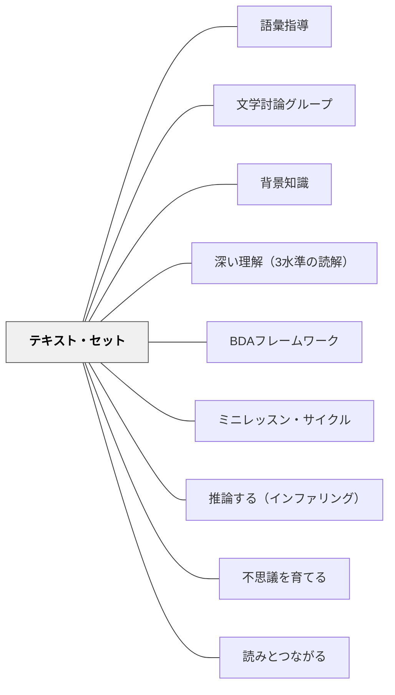

# テキスト・セット

> 1冊の本を深く読むより、同じテーマの3冊を読んだ後の読みのほうが深い——それは知識が積み重なるからではなく、比べる目が生まれるからだ。

---

## Pattern Connection

**出典**: Dorn, L. J., & Soffos, C.（2005）*Teaching for Deep Comprehension: A Reading Workshop Approach*. Stenhouse Publishers.

- **既存パタンとの関連**: [[パタン/背景知識]] が「知識の長期的蓄積が読解の基盤になる」という理論を提供するのに対して、テキスト・セットは「**授業の中で短期的に背景知識を構築する**」という操作的な実装を提供する。Willingham の「知識の蓄積は何年もかかる」という指摘を補完するかたちで、「この単元・この授業内で必要な知識をテキストで補う」という短期的戦略として機能する。[[パタン/BDAフレームワーク]] の Before フェーズに「関連テキストを先に読む」というフロントローディングの一形態として組み込める
- **補強された点**: [[パタン/ミニレッスン・サイクル]] の「傘テーマ」の下にテキストを束ねるという発想が、テキスト・セットによって「本の選び方の原則」として具体化された——傘テーマに対して最もアクセスしやすいテキストから順に配置するという設計が、サイクル計画の本選び問題を解決する
- **修正・拡張された点**: 従来の「1冊を深く読む」という読書指導の前提を「複数のテキストを比較・統合しながら読む」という前提に転換する。[[パタン/深い理解（3水準の読解）]] の応用的理解（第3水準）——比較・判断・評価——は、複数テキストの存在なしには起動しにくい
- **他のパタンへの波及**: [[パタン/推論する（インファリング）]] — テキスト間の推論（セット内の前の本で得た知識が次の本の推論を深める）。[[パタン/不思議を育てる]] — 複数テキストを通じて「問いが育つ」体験が自然に生まれる。[[パタン/リテラチャー・サークル]] — セット内のどれを選ぶかが生徒の選択になりうる

---

## 背景（Context）

読解力とは「何も知らないテキストを読んで理解する力」ではなく、「知識・語彙・経験を持った読者がテキストと出会う行為」だ。同じテキストを、その分野を知っている読者が読む場合と、全く知らない読者が読む場合では、理解の深さが根本的に異なる。

しかし教師は多くの場合、1冊の本を選んで単元を設計する——その1冊を読む前に、子どもたちがどれだけの背景知識を持っているかは問わない。結果として「読めるが理解できない」または「文字は追えるが意味が薄い」読書が起きる。

Dorn & Soffos（2005）が提案する**テキスト・セット（Text Sets）**は、この問題への実践的な答えだ——単一のテキストではなく、テーマ・トピック・本質的な問いで束ねた複数のテキストを順序立てて読むことで、読み進めるにつれて背景知識が積み上がり、理解が深まる仕組みを設計する。

## 問題（Problem）

1冊のテキストを単独で使う読書指導では：

- テキストに関する背景知識がない状態で読み始めると、語彙も概念も定着しにくい
- 「深い理解（応用的理解）」——比較・判断・評価——が起動しにくい（比べるものがないから）
- 読む前のフロントローディングが教師の補足説明に依存し、生徒の主体的な知識構築にならない
- 単一テキストで終わると、学んだ知識・語彙の転移が次の読書に活きにくい

## 力のかたち（Forces）

- 同じトピックを複数のテキストで繰り返し接触すると、語彙と概念が定着する
- 比較できるテキストが存在すると、「こっちはこう書いているのに、あちらは別の視点だ」という第3水準の思考が自然に生まれる
- アクセスしやすいテキスト（短い・イラスト豊富・概念がシンプル）から始めて難易度を上げると、失敗なく深い読みへ移行できる
- テキスト・セットを教師が設計することで、教科書外の多様なテキスト形式（ノンフィクション・詩・グラフィック等）が授業に入る
- セット内の本のつながりが「問いの連続」を作り、読むことへの動機が持続する

## 解決（Solution）

**テーマ・著者・ジャンル・本質的な問いのどれかを軸に3〜5冊のテキストを束ね、アクセスしやすい順（短い・平易・具体的）から読み進める設計をする。**

---

### テキスト・セットの4タイプ

**① トピック型（最も一般的）**

同じ話題を複数の角度から扱ったテキストのまとまり：

```
例：「水と環境」テキスト・セット

1冊目：絵本「川がよごれた日」（簡単・具体的なエピソード）
2冊目：図鑑「水の循環としくみ」（図解・概念的な知識）
3冊目：ノンフィクション「世界の水問題」（社会的・複雑な視点）
4冊目：詩集から「水の詩」（感情・印象的な表現）
5冊目：新聞記事「地元の川の現状」（現実・批評的な視点）
```

1冊目で入口となる具体的エピソードを得る → 2冊目で概念的知識を得る → 3冊目で複合的視点を持つ → 4冊目で審美的・感情的な反応をする → 5冊目で現実と批評的思考を持つ

**② 著者型（著者研究）**

1人の著者の複数作品を通して、スタイル・テーマ・視点を深く探求する：

```
例：宮沢賢治 著者研究セット

1冊目：「やまなし」（教科書所収の代表作）
2冊目：「注文の多い料理店」（ユーモアと皮肉）
3冊目：「銀河鉄道の夜」（死と希望のテーマ）
4冊目：詩「雨ニモマケズ」（著者の価値観・信念）
参照：著者の生涯・岩手の自然との関係
```

目的：「この作家はなぜこのテーマを繰り返すのか？」という問いが生まれ、作品理解が著者理解と一体になる

**③ ジャンル比較型**

同じテーマをフィクション・ノンフィクション・詩などで読み比べる：

```
例：「移民と故郷」ジャンル比較セット

物語：「ニューヨークへ来た少女」（移民の子どもの物語）
ノンフィクション：「移民の歴史」（事実と統計）
詩：「祖国への手紙」（感情と記憶）
絵本：「両親の国と私の国」（アイデンティティの葛藤）
```

目的：同じテーマでも、フィクションは感情・ノンフィクションは事実・詩は印象を運ぶ——ジャンルによる表現の違いが見えてくる

**④ 本質的な問い型（最も挑戦的）**

一つの本質的な問いを核に、多様なテキストを束ねる：

```
例：「人はなぜ戦うのか」

絵本：「かえれ、戦争くん」（平和の願い）
歴史：「太平洋戦争の子どもたち」（事実と体験）
物語：「ヒロシマの少女」（個人の視点から）
詩：戦争詩集から数篇
現代：「ウクライナの子どもたちの声」
```

目的：問いへの答えが一つでないことを、複数テキストで体験する——応用的理解の訓練場になる

---

### 設計の原則

**① 最もアクセスしやすいテキストから始める**

最初のテキストは：
- 短い（絵本・詩・1〜2ページの記事）
- 具体的（抽象概念より感覚的なエピソード）
- 難易度が低め（語彙が親しみやすい）

知識が積み上がるにつれ、難易度・抽象度を上げる。

**② 各テキストで「何を得るか」を設計する**

| テキスト | 期待する知識・思考 |
|---|---|
| 1冊目 | トピックへの入口・基本語彙 |
| 2冊目 | 概念的知識の深化 |
| 3冊目 | 複合的・対立的視点 |
| 4冊目以降 | 批評・評価・統合 |

**③ セット全体を貫く「問い」を先に決める**

セットの前に「このセットを読み終えたとき、どんな問いを持っていてほしいか」を教師が設計する——問いが読む理由になる。

---

### 授業での使い方

**小単元（3〜5時間）として使う：**

```
1時間目：1冊目を共有読書で読み、知識の地図を作る
2時間目：2冊目で概念的知識を深める（ペアトーク・クイックライト）
3時間目：1冊目と2冊目を比較する（「同じこと・違うこと・気づいたこと」）
4時間目：3冊目以降を読む（文学討論グループ or 独立読書）
5時間目：セット全体を振り返る（「問いへの今の答え」を書く）
```

**テキスト・セットを読む前の問い（Before）:**
- 「このテーマについて今何を知っていますか？」
- 「このセットを読み終えたとき、何が知りたいですか？」

**テキスト・セットを読んだ後の問い（After）:**
- 「1冊目と3冊目で、何が変わりましたか？（知識・考え方・感情）」
- 「全体を通して、最も大切だと思ったことは何ですか？」
- 「この問いへのあなたの答えは今どうなりましたか？」

---

## 結果（Consequences）

- 読むにつれて背景知識が積み上がり、セットの後半テキストはより深く読める
- 比較という認知活動が自然に生まれ、第3水準（応用的理解）が起動する
- 語彙が繰り返し異なる文脈で登場し、定着が加速する
- ジャンルや視点の多様性が、「同じテーマにも多面的な見方がある」という認識を育てる
- ただし、テキスト・セットの設計には教師の準備（本の選定・順序・問いの設計）が必要——最初から完璧を目指さず、2〜3冊から始める

## 関連パタン
- [[パタン/語彙指導]]
- [[パタン/文学討論グループ]]

- [[パタン/背景知識]] — テキスト・セットが短期的な背景知識構築を実現する
- [[パタン/深い理解（3水準の読解）]] — 第3水準（比較・判断・評価）がセットで起動する
- [[パタン/BDAフレームワーク]] — Before フェーズに短いテキストを置くフロントローディング
- [[パタン/ミニレッスン・サイクル]] — サイクルの「本の山」をセットとして設計する
- [[パタン/推論する（インファリング）]] — セット内の前のテキストで得た知識が次の推論を支える
- [[パタン/不思議を育てる]] — 複数テキストを通じて問いが育つ
- [[パタン/読みとつながる]] — セット内のテキスト間のつながり（TT: Text to Text）
- [[実践/文学討論グループの設計]] — テキスト・セットを討論グループで使う

---

## クラスター図



## Actionable Insight

- 次の国語単元の1冊に、同じテーマの短い絵本かノンフィクション記事を「1冊前」に置く——教科書の本文を読む前にその1冊を読むだけで、理解の入口が変わる
- 「著者研究」を年に一度試す——同じ作家の本を2冊読んで「この作家の好きなテーマは何か？」と問うだけで、著者型テキスト・セットの体験になる
- テキスト・セットの「問い」を先に書き出す——「このセットを読み終えたとき、子どもたちにどんな問いを持っていてほしいか」を1つ決めることが、セット設計の最初の一歩

---

## 出典
- [[文献/Teaching for Deep Comprehension（Dorn & Soffos）]]

Dorn, L. J., & Soffos, C. (2005). *Teaching for Deep Comprehension: A Reading Workshop Approach*. Stenhouse Publishers.

> 「テキスト・セットは背景知識を構築するだけでなく、比較という認知行為そのものを授業に組み込む——そして比較こそが深い理解への入口だ。」——Dorn & Soffos（2005）
