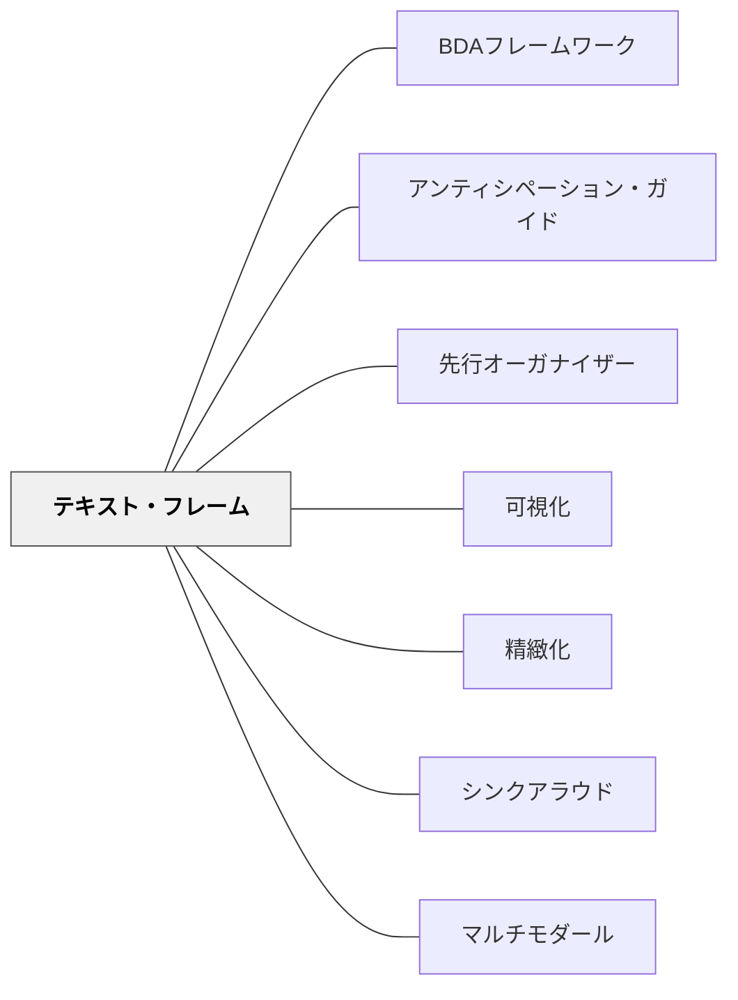

# テキスト・フレーム

> 「このテキストは問題と解決の構造で書かれています」——文章の骨格を事前に示すだけで、子どもたちは「何を探して読めばいいか」が分かり、読みの密度が変わる。

---

## Pattern Connection

**出典**: Buehl, D.（2017）*Classroom Strategies for Interactive Learning* (4th ed.). Stenhouse Publishers.

- **既存パタンとの関連**: [[パタン/BDAフレームワーク]] の Before フェーズで使う中核ツール。[[パタン/先行オーガナイザー]] のテキスト理解版——文章構造の提示が「何を探して読むか」という認知的準備になる。[[パタン/可視化]] の「見えない構造を見える形にする」実践として機能する
- **補強された点**: 説明文・論説文の指導が「段落を読む・要約する」という操作から「構造を読む・構造に沿って整理する」という理解へとシフトする根拠が明確になった
- **修正・拡張された点**: テキスト・フレームは国語（説明文・意見文）にとどまらない——理科・社会・算数のテキスト（教科書・資料集・問題文）にも同じ6つの構造が使える。教科横断的な読解指導ツールとして拡張される
- **他のパタンへの波及**: [[パタン/精緻化]] — フレームに沿って情報を整理することで知識の構造化が起きる。[[パタン/マルチモダール]] — テキスト・フレームを視覚化した「構造マップ（グラフィック・オーガナイザー）」が視覚的学習を支援する

---

## 背景（Context）

説明文・論説文・教科書・ノンフィクションには、「著者が情報をどう組み立てるか」という骨格がある。Buehl（2017）はほとんどのアカデミックなテキストが6種類のうちの1つ（または組み合わせ）の構造で書かれていると整理する。

**テキスト・フレーム（Text Frame）** は、この文章構造を読む前に読者に意識させることで、「何を探して読めばいいか」という読みの目的をつくる。

熟練した読者は無意識にこの構造を使って読む——「あ、これは問題と解決の文章だな」と直感的に把握し、「どんな問題か」「どんな解決策か」を探しながら読む。しかし初心者の読者はこのスキャフォールドを持っていない。テキスト・フレームはそのスキャフォールドを明示的に提供する。

## 問題（Problem）

説明文指導の多くは「内容を理解する」「段落をまとめる」「重要語句を探す」という操作に終始しがちだ。しかし文章全体の「骨格（構造）」を意識しないまま部分を拾うと、全体の意味がつながらない。

「読んだのに何が書いてあったか言えない」という状態は、語彙・背景知識の問題だけでなく、「文章の骨格を把握していない」ことから来ていることが多い。

## 力のかたち（Forces）

- 文章構造は限られている——6種類のフレームがほとんどのテキストをカバーする
- 構造を知ると「どこに何があるか」の見通しが立ち、認知負荷が下がる
- フレームを可視化したグラフィック・オーガナイザーが読みの補助輪になる
- 同じフレームが理科・社会・算数など複数の教科で機能する
- テキストが複数の構造を混在させている場合は「主要な構造」を選ぶ判断が必要になる

## 解決（Solution）

**読む前に「このテキストはどの構造で書かれているか」を示し、構造に対応したグラフィック・オーガナイザー（構造マップ）を使って読みながら情報を整理する。**

---

### 6つのテキスト・フレーム

| フレーム名 | 問いかける問い | 典型的なテキストの例 |
|---|---|---|
| **原因と結果** | 何が起きた？なぜ起きた？結果は何か？ | 理科の自然現象・歴史上の出来事の説明 |
| **概念と定義** | この概念は何か？特徴は？例は？ | 辞典的説明・新しい概念の紹介 |
| **問題と解決** | 何が問題か？どうすれば解決できるか？ | 社会問題・環境問題・工学的文章 |
| **比較と対比** | 2つはどう似ているか？どう違うか？ | 比較説明文・2つの事象の対比 |
| **目標・行動・結果** | 何を達成しようとしたか？どう行動したか？結果は？ | 伝記・歴史的人物・プロジェクト記録 |
| **主張と根拠** | 主張は何か？それを支える証拠・理由は何か？ | 意見文・論説文・議論のあるテキスト |

---

### フレームごとのグラフィック・オーガナイザーの例

**原因と結果（理科・社会で頻出）**：
```
     原因1  ─┐
     原因2  ─┼─→ 出来事・現象 ─→ 結果1
     原因3  ─┘                  結果2
```

**問題と解決（社会問題・環境問題）**：
```
  問題の定義 → 問題の原因 → 提案された解決策 → 結果・評価
```

**比較と対比（2つのものを比べる）**：
```
          対象A    共通点    対象B
特徴1     ______   ○/✗    ______
特徴2     ______   ○/✗    ______
特徴3     ______   ○/✗    ______
```

**主張と根拠（意見文・論説文）**：
```
主張：「______________________」
  根拠①：
  根拠②：
  根拠③：
反論への応答：
```

---

### 授業でのテキスト・フレームの使い方（Before〜During）

**Step 1：Before（読む前）——フレームを提示する**

「今日読む説明文は『問題と解決』の構造で書かれています。読みながら、どんな問題が書かれているか、どんな解決策が提案されているかを探してみましょう」

この一言だけで、子どもたちの読みに目的ができる。

**Step 2：During（読む間）——構造マップに記入しながら読む**

対応するグラフィック・オーガナイザーに書き込みながら読む。「問題は何だろう？」「解決策はどこに書かれている？」という問いを持ち続ける補助になる。

**Step 3：After（読んだ後）——フレームを使って整理・発表する**

構造マップを使って「この文章は○○という問題を△△で解決しようとしている説明文です」と一文でまとめる。

---

### テキスト・フレームと教科リテラシー

| 教科 | 頻出フレーム | 応用例 |
|---|---|---|
| **国語（説明文）** | 問題と解決・主張と根拠 | 説明文の読み取り・意見文の書き方指導 |
| **理科** | 原因と結果・概念と定義 | 実験結果の考察・理科用語の理解 |
| **社会** | 原因と結果・目標・行動・結果 | 歴史上の変化・産業の説明 |
| **算数（文章題）** | 問題と解決 | 文章題の問いと解法を分けて読む |

---

### テキスト・フレームを子どもに教える段階的手順

1. **1つのフレームから始める**：最初は「問題と解決」か「比較と対比」——分かりやすい構造から
2. **教師がシンクアラウドでモデリング**：「このテキストを読むとき、私は……」と声に出して構造を見つけるプロセスを示す
3. **全員で1つのテキストを分析する**：クラス全体で構造マップを埋める
4. **ペアで試す**：2人組で新しいテキストに同じフレームを当ててみる
5. **独立して使う**：一人で適切なフレームを選んで読む

---

## 結果（Consequences）

- 「何が書いてあったか分からない」という読み後の茫漠感が減る——構造に沿った整理が「理解できた」実感を生む
- 説明文・論説文の指導が「段落の内容を確認する」から「文章全体の骨格を把握する」へと深まる
- グラフィック・オーガナイザーが多様な習熟度の子どもへの足場になる（書く量・詳細度で調整できる）
- 理科・社会で同じテキスト・フレームを使うことで、読解力が教科をまたいで育つ
- ただし、全てのテキストが1つのフレームに収まるわけではない——複数の構造が混在するテキストには「主な構造」を判断する力が必要

## 関連パタン

- [[パタン/BDAフレームワーク]] — テキスト・フレームは Before フェーズで使うフロントローディング・ツール
- [[パタン/アンティシペーション・ガイド]] — Before フェーズの別のフロントローディング方略
- [[パタン/先行オーガナイザー]] — テキスト・フレームの提示は先行オーガナイザーとして機能する
- [[パタン/可視化]] — グラフィック・オーガナイザーが構造を視覚化する
- [[パタン/精緻化]] — フレームに沿った整理が知識の構造化を促す
- [[パタン/シンクアラウド]] — フレームを使った読みのモデリング
- [[パタン/マルチモダール]] — 視覚的な構造マップが言語+視覚の二重符号化を支援する

---

## クラスター図



## Actionable Insight

- 次の説明文指導の前に「この文章は（原因と結果 / 問題と解決 / 比較と対比）の構造で書かれています」と一言添える——構造を知るだけで読みの目的が生まれる
- 理科・社会のテキストを扱うとき「このテキストのフレームは何？」と子どもに聞いてみる——国語と教科が「読み方」でつながる
- 算数の文章題に「問題と解決フレーム」を当てる：「問題は何で、解決策（解き方）は何か」——読解指導が算数指導になる瞬間

---

## 出典

Buehl, D. (2017). *Classroom Strategies for Interactive Learning* (4th ed.). Stenhouse Publishers.

> 「テキスト・フレームを意識した読者は、著者が情報をどう組み立てているかを把握しながら読む——これが深い読解の構造的基盤になる。」——Buehl（2017）
