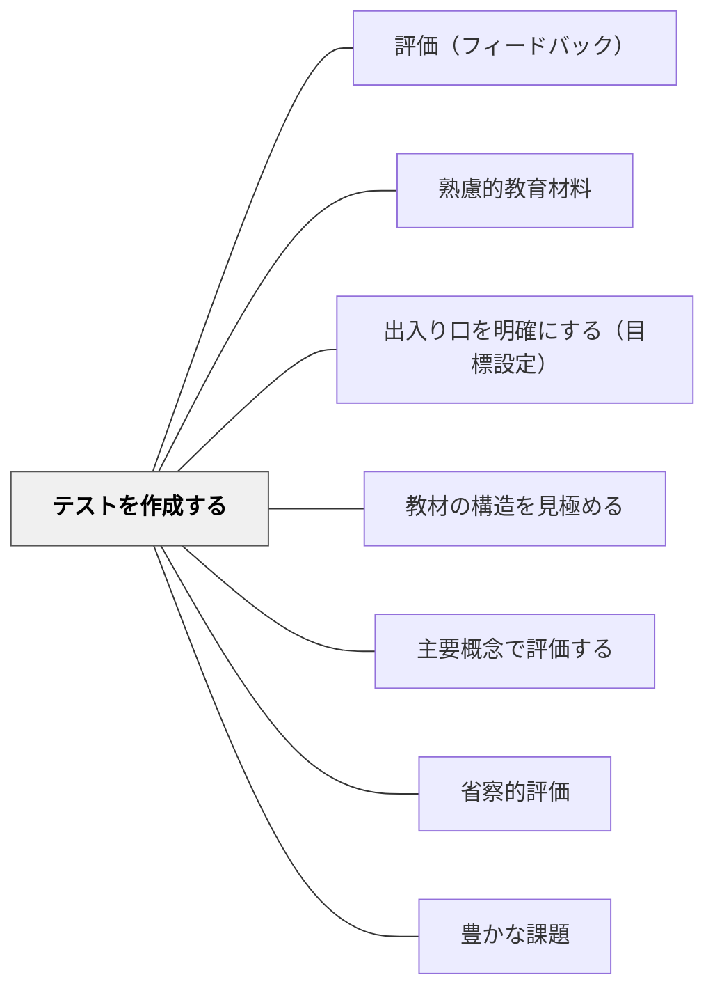

# テストを作成する

> 教材を作る前にテスト（評価）を先に作ることで、目標が明確になる。

## 背景（Context）

鈴木克明「教材設計マニュアル」及び逆向き設計（ウィギンズ&マクタイ「Understanding by Design」）のアプローチ。目標を設定したら、その達成を確認するための評価（テスト・課題）を先に設計する。評価が先にあることで、教材で何を教えるべきかが明確になる。

## 問題（Problem）

教材を作ってから評価を後付けすると、「教えたこと」と「評価すること」がずれやすく、本当の目標達成が確認できない。

## 力のかたち（Forces）

- 評価先行が目標の具体化を強制する
- 学習者への公平性・透明性も高まる
- 評価の設計に時間がかかる

## 解決（Solution）

**教材設計の初期段階で「学習後にどんな評価問題に答えられるか」を設計し、その評価に対応した教材内容・活動を組み立てる。**

## 結果（Consequences）

- 目標・教材・評価の一貫性が生まれる
- 無駄な内容を含まないシンプルな教材設計ができる

## 関連パタン
- [[実践/学習科学の6方略]]
- [[パタン/評価（フィードバック）]]

- [[パタン/熟慮的教材教具]] — 親パタン
- [[パタン/出入り口を明確にする（目標設定）]] — 前のステップ
- [[パタン/教材の構造を見極める]] — 次のステップ

- [[パタン/主要概念で評価する]] — テスト設計が主要概念の重みを反映する
- [[パタン/省察的評価]] — テスト結果の振り返りが教材改善に活きる
- [[パタン/豊かな課題]] — 豊かな課題の評価ツールとしてのテスト
## クラスター図

## Actionable Insight

- 単元設計の最初に「この単元の最後に学習者に答えられてほしい問題を3つ書く」という逆向き設計から始める——評価を先に設計することが目標・教材・評価の一貫性をつくる
- 授業前に「今日の授業後にこの問いに答えられるようになっているか」をチェックポイントとして設定する——評価問題を先に持つことが「何を教えるか」の優先順位を整理する
- 単元末の評価問題を学習者に事前に見せる——ゴールが見えた状態での学習が目的意識と透明性を高める

## 出典

- 鈴木克明（2002）『教材設計マニュアル――独学を支援するために』北大路書房
