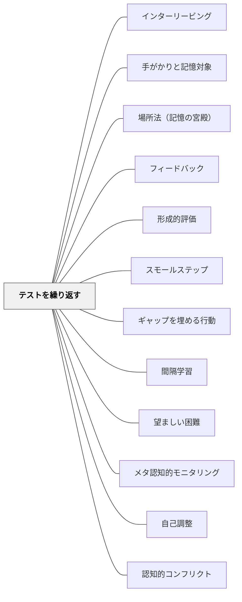

# テストを繰り返す

> テストは学習の終わりではなく、記憶を強化する最良の練習だ。

---

## Pattern Connection

**Weinstein & Sumeracki（2018）統合（2026-05-14）：**

*Understanding How We Learn*（東京書籍, 2022）は、検索練習（Retrieval Practice）を6つの学習方略の1つとして体系化し、エビデンスと教室実装の両面から整理している。

- **補強された点**：本パタンの「低リスク・高頻度テスト」の実装方法（エグジットチケット・自由再生・ペア説明・穴埋め）が具体化された。「書く・話す・キーワードから展開する」など形式の多様化が明確になった。
- **接続した概念**：「望ましい困難（Desirable Difficulties）」——想起が難しく感じられるほど記憶が強化される。完全に覚えている状態での再読より、思い出しにくい状態での検索の方が効果的。
- **他のパタンへの波及**：[[パタン/間隔学習]] と組み合わせることで「間隔を空けた検索練習」という最強の組み合わせになる。[[実践/学習科学の6方略]] で6方略の文脈に位置づけられた。
- **再統合（2026-05-20）：フリーリコールとロエディガー実験**：
  - **フリーリコール（free recall）**：何も見ずに覚えているすべてを白紙に書き出す——最もシンプルかつ強力な検索練習の形式。「脳が何を知っていて何を知らないか」を正確に明示するため、メタ認知の向上にも寄与する。「教科書を閉じて、今日学んだことを全部書いてみよう」がその最小実装。
  - **ロエディガー＆カーピキ（2006）の実験**：テキストを4セッション学習する4条件（SSSS/SSST/STTT/TTTT）で比較。5分後の即時テストではSSSSが最高。しかし**1週間後**にはSTTT・TTTTが圧倒的に優れていた——「勉強した感」と「実際の記憶」は乖離する。
  - **望ましい困難との接続**：[[パタン/望ましい困難]] — 検索練習は「まだ完全に覚えていない状態を露出させる」ため難しく感じる。しかしその困難感こそが記憶を強化する。
  - **多肢選択問題の注意点**：誤答選択肢が記憶に残る「誤情報効果」がある。即座に正答フィードバックを与えることでこの効果を打ち消せる。

---

## 背景（Context）

認知心理学の研究は、情報を「思い出す」行為（検索練習・想起練習）が記憶の定着に極めて効果的であることを繰り返し示してきた。これを「テスト効果（Testing Effect）」または「検索練習効果（Retrieval Practice Effect）」と呼ぶ。

ジョン・ハッティのメタ分析においても、テストを繰り返す実践は高い効果量（約0.54）を示しており、学習内容の長期記憶への定着において、再読や復習よりも有効なことが明らかになっている。テストは「評価のため」だけでなく、「学習のため」の強力なツールだ。

## 問題（Problem）

多くの教育現場では、テストは「学習の終わりに何を覚えたかを確認する」ためのものとして位置づけられている。このため、テストは学習者にとって不安や緊張の源となり、学習を促進するのではなく阻害する存在になりやすい。

また、一度だけのテストでは記憶の定着には不十分で、「テストのために詰め込んだが、後で忘れた」という経験が繰り返される。テストの持つ学習促進機能が活かされていない。

## 力のかたち（Forces）

- テストは学習者に心理的プレッシャーを与えることがあり、不安が高い学習者には逆効果になる
- 低リスク・形成的なテストを繰り返すことで、テストへの恐怖を減らしながら学習効果を得られる
- テストの間隔（spaced practice）と組み合わせることで、忘却曲線に対抗する記憶定着が可能になる

## 解決（Solution）

テストを評価のためだけでなく、想起練習（Retrieval Practice）として設計する。具体的には、授業の冒頭に「前回学んだことを三つ書く」というウォームアップ、授業の終わりに「今日学んだ重要なことを書く」というエグジットチケット、週1回の短い小テスト（採点は速やかにフィードバックとして返す）などを組み込む。

重要なのは、これらのテストが「評価（成績に入る）」としてではなく「学習の練習」として学習者に理解されることだ。低リスク・高頻度のテストを繰り返し、間隔を空けて（翌日・1週間後・1ヶ月後）同じ内容を問うことで、長期記憶への定着が促進される。

## 結果（Consequences）

- 学習内容の長期記憶への定着が向上し、忘却が緩やかになる
- テストが「評価の恐怖」ではなく「学習の道具」として機能するようになる
- 形成的なフィードバックとして機能し、学習者と教師の双方が理解状況を把握できる

## 関連パタン
- [[パタン/インターリービング]]
- [[パタン/手がかりと記憶対象]]
- [[パタン/場所法（記憶の宮殿）]]

- [[パタン/フィードバック]] — 親パタン
- [[パタン/形成的評価]] — テストを形成的に活用する実践
- [[パタン/スモールステップ]] — 小さな単位での繰り返しの練習と組み合わさる
- [[パタン/ギャップを埋める行動]] — テスト結果が明らかにしたギャップへの対応
- [[パタン/間隔学習]] — 組み合わせると「間隔を空けた検索練習」になる
- [[パタン/望ましい困難]] — 検索練習の困難感は望ましい困難の典型
- [[パタン/メタ認知的モニタリング]] — フリーリコールが「何を知っていて何を知らないか」を明示する
- [[実践/学習科学の6方略]] — 6方略の文脈
- [[文献/認知心理学者が教える最適の学習法（Weinstein & Sumeracki）]] — 一次資料
- [[パタン/自己調整]] — テスト結果が自己調整サイクルへの形成的フィードバックになる
- [[パタン/認知的コンフリクト]] — 想起練習が既有概念との矛盾を見える化し認知的コンフリクトを生む

## クラスター図

## Actionable Insight

- 授業の最初に「前回学んだことを3つ書く」想起練習を3分間行う——検索練習は再読より効果的に長期記憶への定着を促す
- 週1回の短い確認テスト（5問・5分）を採点プレッシャーなしで行う——低リスク・高頻度のテストがテストへの恐怖を減らしながら記憶を強化する
- 同じ内容を翌日・1週間後・1ヶ月後の3回確認する間隔を設ける——間隔を空けた想起練習が忘却曲線に対抗する最も有効な方法

## 出典

Roediger, H. L. & Karpicke, J. D. (2006). Test-Enhanced Learning. *Psychological Science*, 17(3), 249–255.
Hattie, J. (2009). *Visible Learning*. Routledge.
Brown, P. C., Roediger, H. L., & McDaniel, M. A. (2014). *Make It Stick*. Harvard University Press.
