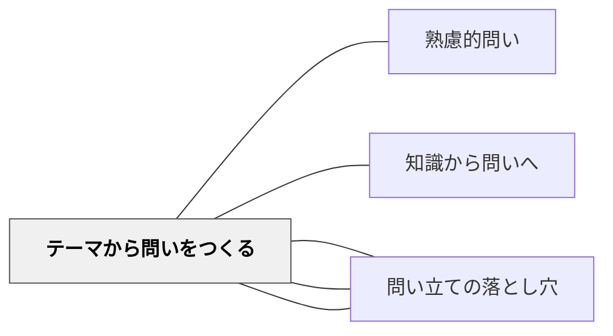

# テーマから問いをつくる

> キーワード・テーマ・トピックを与えて、そこから問いを作る活動。

## 背景（Context）
問いを立てる力は自然に育つものではなく、意識的な練習によって伸びる。
テーマや題材を与えられた状態から問いを生成する活動は、問いの作り方そのものを学ぶ機会となる。
問いを作ることで、学習者はテーマを能動的に読み解き、何が分からないかを自覚する。
探究学習・PBL・論文研究など、問い（リサーチクエスチョン）の質が学びの深さを決める場面は多い。

## 問題（Problem）
学習者が問いを「教師から与えられるもの」として捉え、自分で問いを立てる力が育っていない。
テーマを与えられても「何を問えばよいか分からない」という状態になりやすい。
問いを立てる活動が一度きりで終わり、問い方のパターンや技法が身につかない。

## 力のかたち（Forces）
- 問いはテーマとの対話から生まれる。テーマを深く読むほど問いが精緻になる。
- 問いの作り方には型（5W1H・比較・原因・可能性等）があり、型の学習が助けになる。
- 問いを複数立てることで、どの問いが最も重要かを考える機会が生まれる。
- 「良い問いとはどんな問いか」という問いへの問いが、問い作りの学習を深める。

## 解決（Solution）
「このテーマ（キーワード）について、どんな問いが立てられますか？」と問い、できる限り多くの問いを出させる。
まず発散（量）を優先させ、その後で整理・評価（質）に移る二段階の活動を設計する。
問いの型（「〇〇はなぜか」「〇〇と〇〇はどう違うか」「〇〇するとどうなるか」など）を教え、型を意識した問い作りを練習させる。
他者の問いを読み、「自分が気づかなかった角度」を発見する相互学習の場を設ける。

## 結果（Consequences）
学習者が能動的に問いを立てる力を獲得し、探究の主体性が育まれる。
テーマへの理解が深まり、何が自分にとって未知かが明確になる。
問いの型を知ることで、様々な文脈で応用できる汎用的なスキルが身につく。
問いの量を出すだけで満足してしまうと、問いの質を高める段階に進まないリスクがある。

## 関連パタン
- [[パタン/熟慮的問い]] — 親パタン
- [[パタン/知識から問いへ]] — 既有知識を起点に問いを立てる
- [[パタン/問いを整理する]] — 立てた問いを構造化する
- [[パタン/問いを評価する]] — 立てた問いの質を吟味する
- [[パタン/問い立ての落とし穴]] — 問いを生成した後、NGパターンで評価・除外する次のステップ

## クラスター図

## Actionable Insight

- 単元の導入でキーワードを提示し「このテーマについて思いつく問いを3分でできるだけたくさん書こう」と指示する——量を優先する発散が問いを立てる筋力をつける
- 問いの型（「なぜ〜か」「〜と〜はどう違うか」「もし〜したらどうなるか」）を黒板に示してから問いを作らせる——型の意識が「何を聞けばいいかわからない」を解消する
- 立てた問いを「すぐ調べれば分かるもの」「調べても難しいもの」「意見が分かれるもの」に分類させる——問いの質の違いへの気づきが探究に価値ある問いを選ぶ力を育てる

## 出典
- [[文献/熟慮的問いのパターンリスト（動画記録）]]
