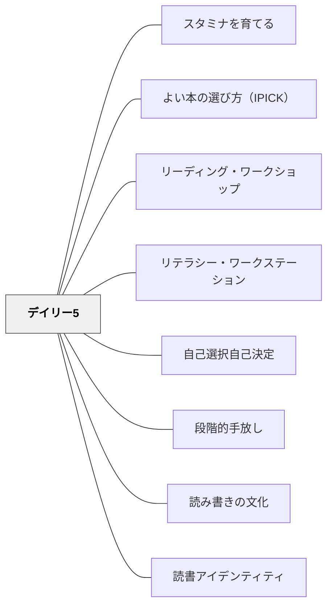

# デイリー5

> 生徒が選んだリテラシー活動に自律的に取り組んでいる間、教師は小グループや個人と向き合う——独立性という土台があってこそ、指導が深くなる。

---

## Pattern Connection

**出典**: Boushey, G., & Moser, J.（2014）*The Daily 5: Fostering Literacy Independence in the Elementary Grades*（2nd ed.）. Stenhouse Publishers.

- **既存パタンとの関連**: [[パタン/リーディング・ワークショップ]] の「独立読書時間」に「5つの選択肢・複数ラウンド・スタミナ構築」という具体的な構造を加える。RWが「ミニレッスン→読む時間→共有」という授業サイクル全体を扱うのに対して、デイリー5は独立実践の時間を「どう管理・拡張するか」に特化したサブシステムとして機能する。[[パタン/リテラシー・ワークステーション]]（Diller）との最大の違いは「生徒が毎回自由に選ぶ」「ローテーションなし」「独立性の構築を最優先目標にする」点
- **補強された点**: 小グループ指導（ガイデッド・リーディング・カンファリング）を行うための「生徒が独立していられる時間」を体系的に確保する方法として、既存のワークショップ実践に直接接続する。「教師が生徒全員を管理しながら小グループ指導をする」という矛盾を、デイリー5の独立性構築が解消する
- **修正・拡張された点**: 「独立性は要求するものではなく、教えるもの」という視点が加わった——これは既存パタンの前提を転換する。[[パタン/段階的手放し]] の「I Do → You Do」に、**行動期待値の共同作成（I-チャート）とスタミナの段階的構築**という具体的な操作が加わる。**第2版での重要な変更**：Step 3（I-チャートの作り方）が「生徒と一緒にブレインストームする」から「教師が5つの具体的な行動をあらかじめ書く」に変更——実施の一貫性を高めるための改訂。Work on Writing が「Read to Self と同様に毎日行う非交渉コンポーネント」に格上げされ、ラウンド数も実践に合わせて2〜3回が現実的と修正された（初版の理想値5回から）
- **他のパタンへの波及**: [[パタン/スタミナを育てる]] — デイリー5の独立パタンとして分離。[[パタン/よい本の選び方（IPICK）]] — Read to Self の質を保証する選書パタン。[[パタン/自己選択自己決定]] — 5択が「構造の中の選択」として機能する

---

## 背景（Context）

教師が「小グループ指導（ガイデッド・リーディング）や個別カンファリングに集中できない」という問題の根本は、残りの生徒たちが独立して活動できていないことにある。教師が1グループと関わっていると「先生、終わった！」「隣の子がうるさい！」「何をしたらいい？」が絶え間なく届く——これでは指導の質が保てない。

Gail Boushey と Joan Moser（The Sisters）は、この問題が「独立性を体系的に教えていないこと」に起因すると診断した。そして独立性を育てるための具体的な構造として **Daily 5** を開発した。

Daily 5 の核心：**5つのリテラシー活動を「いつでも選べる選択肢」として提供し、生徒が自律的に取り組み続けられるまでスタミナを育てる——そのプロセスそのものが読み書き力を育てる。**

## 問題（Problem）

独立学習の時間を設けようとするとき：

- 活動の「順番待ち」「ローテーション」が生徒を管理コストの高い状態にする
- 活動が週ごとに変わると、「何をするか」を常に把握するコストが教師と生徒の両方にかかる
- 生徒が「与えられた活動を終えること」を目的にすると、深い練習が起きない
- 教師が全員を管理し続けると、小グループ指導・個別支援の時間が生まれない

## 力のかたち（Forces）

- 同じ5択が一年中続くことで「次は何をするか」のコストがゼロになる
- 生徒が選ぶことで「自分の決断」という所有感が生まれ、持続時間が延びる
- 独立して取り組む行動そのものが、最初は「教える必要があるスキル」だ
- 小グループ指導の質は、他の生徒が独立していられる時間に直結する
- ラウンド制（短い独立練習を複数回繰り返す）は、集中と休憩のサイクルを作る

## 解決（Solution）

**5つのリテラシー活動を「いつでも選べる選択肢」として常時提供する。生徒は毎ラウンドの前にどれをするかを決め、教師に申告する。その時間に教師は小グループ指導やカンファリングを行う。**

---

### 5つのコンポーネント

| コンポーネント | 活動内容 | 育てるもの |
|---|---|---|
| **自分で読む（Read to Self）** | 自分で選んだ「よい本」を黙読する | 読書スタミナ・読書アイデンティティ |
| **誰かに読む（Read to Someone）** | ペアで交互に読み聴かせ合う（EEKK体勢：Elbow to Elbow, Knee to Knee） | 流暢さ・理解の確認・聴く力 |
| **聴いて読む（Listen to Reading）** | 録音・デジタル音声を聴きながらテキストを目で追う | 流暢さのモデリング・語彙強化 |
| **書く仕事をする（Work on Writing）** | 自分で選んだトピック・形式で書き続ける（評価のためでなく書き手として） | 作家としての持続力・表現力 |
| **言葉の仕事（Word Work）** | 語のパターン・高頻度語・語彙を操作的教材（磁石文字・砂書き・ブロック）で探求する | 語彙・スペリングの自動化 |

---

### 基本構造：ラウンド制

Daily 5 はリテラシーブロック（約90〜120分）の中で複数の「ラウンド」として実施される：

```
リテラシーブロックの例（115分）

ミニレッスン（全体）   20〜30分
──────────────────────────────
ラウンド1          15〜25分
  └ チェックイン（2分）→ 全員独立活動 → 静かな合図で終了
  └ 教師：小グループ指導 or カンファリング

グループ振り返り（5分）

ラウンド2          15〜25分
  └ チェックイン（2分）→ 全員独立活動 → 静かな合図で終了
  └ 教師：小グループ指導 or カンファリング

グループ振り返り（5分）

ラウンド3（任意）   15〜25分
```

1日3〜4ラウンドが理想だが、時間に応じて2ラウンドでも機能する。

---

### チェックイン：ラウンド開始の申告

各ラウンドの前に全員が集合場所に集まり、そのラウンドで何をするかを教師に申告する：

- 生徒が「今日は Read to Self をします」と申告
- 教師が簡単なコード（R / RS / L / W / WW）で記録する
- 申告に要する時間：クラス全体で1〜1.5分
- これにより生徒は「自分が何をするか決めた」という所有感を持ってラウンドに入る

---

### 教師の役割：指導に集中する

Daily 5 の時間、教師がすること：

- **小グループ指導**（4〜6人のガイデッド・リーディング・グループとの読書指導）
- **個別カンファリング**（一人の生徒と1対1で読書・書く仕事を話し合う）
- **CAFE 観察**（Comprehension・Accuracy・Fluency・Expand vocabulary の観察記録）

教師がしないこと：
- ラウンド中の全体管理・口頭指示
- 独立活動中の生徒への個別声かけ（カンファリングで予定されているもの以外）
- 新しい全体指導（ミニレッスンはラウンド前に行う）

---

### Daily 5 vs. ワークステーション（Diller, 2005）

| 観点 | デイリー5 | ワークステーション（Diller） |
|---|---|---|
| 活動の一貫性 | 同じ5択を一年中 | 週・月ごとに変わる材料・タスク |
| 生徒の動き | 毎回自由選択（ローテーションなし） | 教師アサイン or 時間で回る |
| 主な目標 | **独立性とスタミナを育てる** | **教えた特定スキルを練習させる** |
| I Can リスト | なし（選択は5択そのもの） | あり（活動内の選択肢） |
| 教師準備 | 最小限（同じ5択） | 毎回の新しい材料が必要 |
| 哲学 | 生徒を信頼し選択と責任を与える | 教師が適切なタスクを設計・管理する |

**どちらかではなく、組み合わせることもできる**：Daily 5 の独立性構築を先に行い、安定したら Diller のワークステーションで特定スキルの練習を加えるという設計も有効。

---

### 管理の基盤：I-チャートと静かな合図

**I-チャート**（各コンポーネントの行動期待値）：
- 「生徒はどう見えるか・どう聴こえるか」「教師はどう見えるか・どう聴こえるか」を2列で示す
- 必ず生徒と一緒に作る——事前に作ってラミネートしたものは「教師のルール」になる
- すべてのコンポーネントに1枚ずつ用意する

**静かな合図（Quiet Signal）**：
- 声で呼びかけない——声でクラスを止めようとするとノイズレベルが上がる
- ベル・ライト・ハンドサイン等、全員が学んだ無言の合図を使う
- 合図が出たら5秒以内に全員が集合場所に戻る——これもスタミナと同様に練習する

---

### 7つのコア・ビリーフ

Daily 5 の全体を支える7つの信念。実践の設計思想の基盤。

| ビリーフ | 内容 |
|---------|------|
| **信頼と尊重（Trust and Respect）** | 子どもは自分で選択・行動できるという信頼を先に置く。管理より信頼 |
| **コミュニティ（Community）** | クラス全体が相互に支え合う文化。バロメーター・チルドレンがクラスの体温計になる |
| **選択（Choice）** | 毎ラウンドの5択が所有感と責任感を生む |
| **説明責任（Accountability）** | チェックイン申告が「自分の決断に責任を持つ」経験を日々積み上げる |
| **脳科学（Brain Research）** | Wesson「集中持続≒年齢（分）」、Medina「10分ルール」、Routman「80/20読書時間」、Anderson-Wilson-Fielding の読書量データが設計根拠（→ [[パタン/スタミナを育てる]] 参照） |
| **移行は脳の休憩（Transitions as Brain Breaks）** | ラウンド間の全体共有・身体移動が脳をリセットし次の集中を準備する |
| **独立性を教える10ステップ** | 段階的に独立行動を教える構造化手順（第2版で Step 3 変更） |

**Jenna の話（信頼と尊重）**：Daily 5 の初日、Jenna はカーペット時間が終わる前に立ち上がり自分の読書スポットへ向かった。The Sisters は「戻りなさい」と言わず見守った——「彼女は準備ができていた」。この判断が Daily 5 における「信頼」の実践的意味を体現する。

---

### 各コンポーネントのファウンデーション・レッスン

各 Daily 5 コンポーネントを機能させるために最初に教える基礎レッスン。

**Read to Self**

| レッスン | 内容 |
|---------|------|
| **Three Ways to Read a Book（本を読む3つの方法）** | ①文字を読む、②絵を読む、③前に読んだ話を語り直す——文字が読めない子も「読み手」として参加できる |
| **IPICK（よい本の選び方）** | 自分に合う本を5つの問いで選ぶ（→ [[パタン/よい本の選び方（IPICK）]]） |

**Work on Writing**

| レッスン | 内容 |
|---------|------|
| **Think-About（考えの種に戻る）** | 書くことに詰まったら紙を置いてシード・アイデアを思い出す——完璧主義が勢いを止めないための最初の対処法 |
| **アンダーライン・アンド・ムーブ・オン** | 分からない言葉は下線を引いて先へ進む |

**Read to Someone**

| レッスン | 内容 |
|---------|------|
| **EEKK（Elbow Elbow Knee Knee）** | ペアで肘と膝を密着させて座る——声が漏れにくく、ページが両方から見やすい |
| **Coaching or Time?（コーチングか時間か）** | パートナーが詰まったとき、すぐ教えない——「コーチングしてほしい？それとも少し時間が必要？」と聞いてから助ける |
| **How Partners Read（4つの読み方）** | ①エコー読み（1文ずつ後追い）、②コーラス読み（一緒に）、③私→あなた交互読み、④あなた→私交互読み |
| **How to Choose a Partner（5つの選び方）** | ①肩タップ、②目合わせ＋うなずき、③事前決定パートナー、④近くにいる人、⑤教師指定 |

---

### バロメーター・チルドレン

クラスには必ず「独立性の崩壊を最初に示す」指標となる生徒がいる。この子たちを「問題」ではなく「クラスの体温計」として捉え、4段階のサポートで対応する。

| レベル | サポート内容 | いつ使うか |
|--------|------------|-----------|
| **Level 1：観察** | 特別な支援なし。通常の観察継続 | 概ね安定している |
| **Level 2：追加サポート** | 追加チェックイン・近い位置での見守り・ラウンドを短縮 | 少し離脱傾向あり |
| **Level 3：授業内調整** | 布片（個人スペースの視覚化）・砂時計（個人目標）・フィジェット（身体の落ち着き） | より強い支援が必要 |
| **Level 4：段階的手放し** | 一対一から始め段階的に集団活動へ戻す | 通常設定では機能しない |

**Jeffery の例（Level 3）**：Jeffery は独立学習中に手が止まり、隣の子に話しかけてしまう。Level 3 の支援として「ストップウォッチで自分のスタミナを計る」「I Spy 本（集中できる視覚探索）」「フィジェット（手の操作で落ち着く）」を組み合わせた結果、スタミナが安定した。バロメーター・チルドレンへの支援が整うと、クラス全体が安定する。

---

## 結果（Consequences）

- 生徒が「独立して取り組む力」を体系的に育てた結果、教師が小グループ指導・カンファリングに集中できる時間が確保される
- 5択の一貫性が「次に何をするか」の認知コストをゼロにし、深い実践に入れる
- チェックインの申告が「自分の選択に責任を持つ」経験を毎日積み重ねる
- ただし、スタミナが育つ前に Daily 5 を「完成形」で動かそうとすると崩壊する——起動に4〜6週間をかける覚悟が必要
- 「独立性を先に教える」設計は日本の学校文化と相性が良い部分（集団規律）と摩擦が生じる部分（画一的管理の慣習）の両方がある——最初は Read to Self だけから始めると導入しやすい

## 関連パタン

- [[パタン/スタミナを育てる]] — Daily 5 の独立パタン：「短く・成功」で時間を育てる
- [[パタン/よい本の選び方（IPICK）]] — Read to Self の質を保証する選書パタン
- [[パタン/リーディング・ワークショップ]] — Daily 5 が機能する上位の授業構造
- [[パタン/リテラシー・ワークステーション]] — 並行システム（比較：独立性 vs. スキル練習）
- [[パタン/自己選択自己決定]] — 5択が「構造の中の選択」として内発動機を生む
- [[パタン/段階的手放し]] — 10ステップは段階的手放しの具体的実装
- [[パタン/読み書きの文化]] — Daily 5 が機能する文化的土台
- [[パタン/読書アイデンティティ]] — Read to Self が「自分は読む人間だ」を日々強化する
- [[実践/デイリー5の起動]] — 4週間の段階的起動ガイド

---

## クラスター図



## Actionable Insight

- 今週、読書時間の前に「今日はどんな読み方をしますか？」と生徒に一人ずつ聞いてから始める——このチェックインの一歩が Daily 5 の出発点になる
- 「Read to Self だけ」でデイリー5を始める——5択を一気に導入せず、1コンポーネントのスタミナが10分を超えてから次を加える
- I-チャートを授業中に生徒と一緒に作る——「Read to Self のとき、どう見えますか？」と問いながら一緒に書く5分が、次の独立学習を機能させる

---

## 出典

Boushey, G., & Moser, J. (2014). *The Daily 5: Fostering Literacy Independence in the Elementary Grades* (2nd ed.). Stenhouse Publishers.

> 「Daily 5 は信頼をまったく別の水準に引き上げる——生徒が何をするかを自分で選ぶという信頼だ。」——Boushey & Moser（2014）
