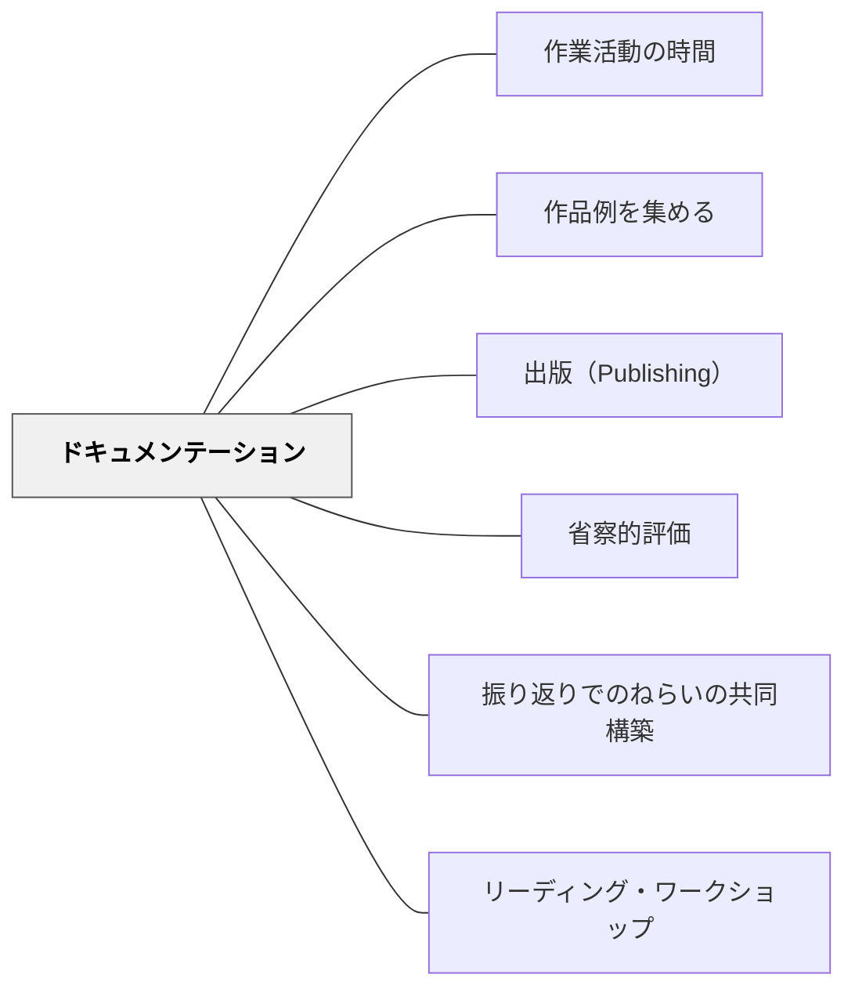

# ドキュメンテーション

> 記録されない学びは、風に消える。記録された学びは、次の問いの種になる。

## 背景（Context）

学習の過程は、完成した成果物だけに宿るのではない。考えた跡、試みた跡、失敗した跡、対話の跡——これらの過程こそが、学びの本質的な姿だ。ドキュメンテーションは、こうした学習の過程を写真・映像・文章・音声などで記録し、可視化する実践だ。

イタリアのレッジョ・エミリア・アプローチでは、子どもたちの学びの過程を記録し、それを教師・子ども・保護者・コミュニティと共有することが教育の中心的な実践として位置づけられている。記録することは、観察すること、解釈すること、そして学びを深めることと一体だ。

## 問題（Problem）

学習の過程が記録されない場合、その経験は学習者の記憶の中にのみ存在し、振り返りや共有が難しくなる。特に幼い学習者にとって、言語だけでは自分の学びを表現し切れないことが多く、写真や映像が「自分が何をしたか」を思い起こすための手がかりになる。

また、教師が学習者の思考プロセスを把握するためにも、結果物だけでなく過程の記録が必要だ。どの段階でどのような思考が起きていたかを知ることで、次の指導の設計が精緻になる。

## 力のかたち（Forces）

- 記録には時間とリソースが必要であり、記録することが目的化すると学びが阻害される
- 一方、記録される意識が「見られている」プレッシャーになる場合もある
- 記録を学習者自身が行うことで、観察と言語化のスキルが育まれる

## 解決（Solution）

学習の節目（活動の途中・完了時・振り返り時）に、写真・短い文章・音声メモなどで学びの軌跡を記録する。記録は教師だけでなく、学習者自身も担い手となる。「今日学んだことを一枚の写真で表すとしたら？」「この作品がどのように変わったかを三枚の写真で示してください」という問いかけが、学習者の観察力と言語化を促す。

記録されたドキュメンテーションは展示・共有・振り返りに活用する。廊下への展示、保護者向けの学習ニュースレター、クラスのポートフォリオなど、記録が「見られる」場をつくることで、学習の価値が可視化される。

## 結果（Consequences）

- 学習者が自分の学びの過程を振り返る言語とツールを手に入れる
- 教師が学習者の思考プロセスを把握し、次の指導に活かすことができる
- 学習コミュニティ全体が、学びの文化を可視化・共有できるようになる

## 関連パタン
- [[実践/言葉をよりすぐって俳句を作ろう]]
- [[パタン/作業活動の時間]]
- [[パタン/作品例を集める]]
- [[パタン/出版（Publishing）]]
- [[パタン/省察的評価]]
- [[パタン/振り返りでのねらいの共同構築]]

- [[パタン/リーディング・ワークショップ]] — 読書の過程を記録・掲示して学びを可視化する

## このパタンが働く教材

| 教材 | どのように記録として働くか |
|------|----------------------------|
| [[教材/リーディング・ワークショップの小さい付箋]] | 読書中に心が動いた箇所や考えの根拠を、本文上に残る記録として保存する |
| [[教材/読書反応の書き出しの手引き]] | 付箋や読書ノートに書いた考えと理由を、あとで読み返せる記録として残す |

- [[パタン/フィードバック]] — 親パタン
- [[パタン/ポートフォリオファイル]] — ドキュメンテーションを時系列で蓄積したもの
- [[パタン/コミュニティの価値を可視化する]] — ドキュメンテーションがコミュニティの価値を示す
- [[パタン/作品例を集める]] — ドキュメンテーションが将来の学習者のモデルになる

## クラスター図

## Actionable Insight

- 活動の途中で「今日学んだことを一枚の写真で表すとしたら？」と問い、スマートフォンで撮影させる——写真選択という行為が観察と言語化のメタ認知を促す
- 授業の節目ごとに「気づいたこと・疑問に思ったこと」を付箋に1文書かせて貼り出す——記録の可視化が個人の学びをコミュニティの学習資源にする
- 単元終了後に学習の過程写真を並べて「どう変わったか」を学習者自身に語らせる——過程の可視化が振り返りの言語を育て、次の学習への連続性を生む

## 出典

Rinaldi, C. (2006). *In Dialogue with Reggio Emilia*. Routledge.
Helm, J. H., Beneke, S., & Steinheimer, K. (2007). *Windows on Learning: Documenting Young Children's Work*. Teachers College Press.
