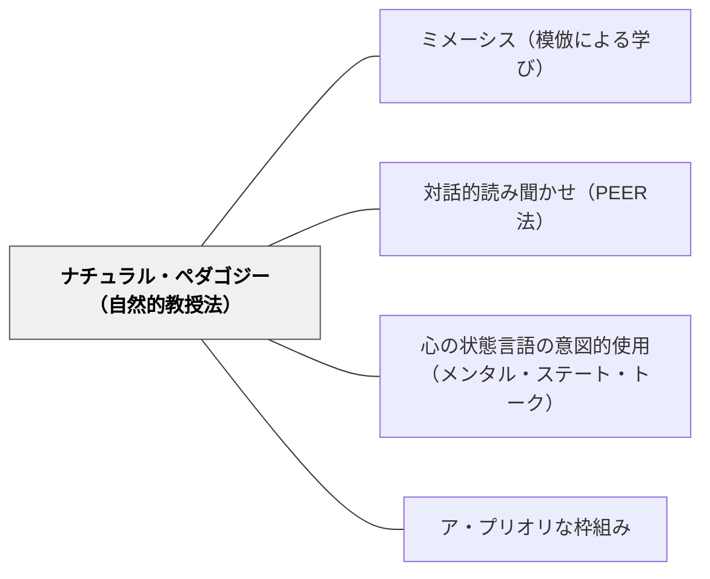

# ナチュラル・ペダゴジー（自然的教授法）

> 「よく見ていてね」——名前を呼んで目を合わせてから技を示す。それだけで子どもは「全部を学ぶべき文化的知識だ」と受け取り、大人が思う以上に丁寧に、すべての動きを模倣する。

## Pattern Connection（Csibra & Gergely, 2011 / Carruthers, 2026）

**理論的位置づけ**：Csibra & Gergely（2011）は「ナチュラル・ペダゴジー（自然的教授法）」を「人間が文化的知識を次世代に伝達するために進化した生得的なコミュニケーション・学習システム」と定義した。送り手（教える側）は**呈示的シグナル**（ostensive signals）を送り、受け手（学ぶ側）はそのシグナルを「これは私に向けられた一般化すべき文化的知識の伝達だ」と解釈して、完全な文化的模倣モードに入る。

**Carruthers（2026）による統合**：Carrutherはこのシステムを「文化可能な人間本性」の中核として位置づける（Section 5）。チンパンジーや呈示的シグナルなしの子どもは「インストゥルメンタル・コピー」（機能的に重要な動作のみ）をする。呈示的シグナルを受けた子どもは「オーバーイミテーション（過剰模倣）」——因果的に無関係な手順まで含む完全模倣——をする。この違いは能力ではなく**モード切り替え**である。

**他のパタンへの波及**：[[パタン/ミメーシス（模倣による学び）]] が「模倣の快楽」という哲学的動機を示すとすれば、本パタンはその模倣が「文化的伝達として作動する条件」を示す。[[パタン/対話的読み聞かせ（PEER法）]] の呼びかけ（子どもの名前・アイコンタクト）はナチュラル・ペダゴジーの呈示的シグナルそのものである。

---

## 背景（Context）

人間の子どもは、他の霊長類と比べてはるかに広い範囲の文化的行動・知識・技術を学ばなければならない。しかも多くの場合、その行動の「なぜ機能するのか」は目に見えない（不透明な因果構造を持つ）。矢の削り方の細部、料理の手順、言葉の使い方——これらは一から個人が試行錯誤するのではなく、手本を見て完全に「受け継ぐ」ことで伝達される。

この文化的伝達のために、人間は進化的に特殊化したコミュニケーション・学習システムを持つ（Csibra & Gergely 2011）。このシステムは「送り手のシグナル」と「受け手の解釈」の両方に生得的な構造を持つ。

## 問題（Problem）

教師が技術・手順・言葉の使い方を示すとき、子どもは「これは見て全部真似すべきものか」「それとも今この状況での一時的な行動か」を区別しなければならない。

区別できなければ：
- 学ぶべき手順を「別に覚えなくていい」と処理する
- 偶然の行動（席をずらす、咳払いをする）まで模倣する
- 伝達の意図が子どもに「届いていない」まま授業が進む

子どもの「学習モード」は自動的には文化的模倣モードにならない。

## 力のかたち（Forces）

- 呈示的シグナルを受けると、子どもは自動的に「文化的知識の受け取りモード」に切り替わる——これは生後数ヶ月から作動する生得的なシステムである（Senju & Csibra 2008）
- 子どもは呈示的シグナルなしでは「機能的に重要な動作だけ」を選択的に模倣する傾向がある
- 逆に、シグナルありの場面では「なぜそうするのか分からない動作」まで含めて完全模倣する（オーバーイミテーション）
- 異文化（カラハリ・ブッシュマンの子どもたち）でも同様のオーバーイミテーションが確認されており、後天的な文化習慣ではない（Nielsen & Tomaselli 2010）
- チンパンジーはシグナルの有無に関わらず機能的コピーをするだけで、オーバーイミテーションをしない

## 解決（Solution）

**伝えたい技術・手順・言語使用を示す前に、呈示的シグナル（意図的アイコンタクト・名前の呼びかけ・子ども向け語りかけトーン）を意図的に使い、「これは文化的知識として受け取るべきものだ」と伝える。**

---

### 呈示的シグナルの3要素

| シグナル | 具体的な行動 | 機能 |
|---|---|---|
| **意図的なアイコンタクト** | 「見ていてね」と言いながら目を合わせる | 「私はあなたに向けて何かを伝えようとしている」という信号 |
| **名前・呼びかけ** | 「〇〇さん、見てて」「みんな、注目」 | 受け手が「自分に向けられた情報だ」と解釈する |
| **子ども向け語りかけトーン（CDS）** | ゆっくり・やや強調した話し方 | 「これは重要・学習対象だ」という指標 |

---

### 過剰模倣を生かした技術伝達

伝えたいことを手順として分解し、呈示的シグナルの後に：

1. **全手順を一度見せる**（オーバーイミテーションで完全な手順が伝わる）
2. **各ステップを言葉で呼ぶ**（「今、こうやって折る——ここが大事」）
3. **一緒にやる**（最初は教師と並行して手を動かす）

授業後の模倣精度は、シグナルの有無で大きく変わる。

---

### シグナルの「使いすぎ」を避ける

すべての場面でシグナルを使うと、どれが本当に重要かが分からなくなる。

- 文化的知識として伝えたい場面：**シグナルあり**（手洗いの仕方、ノートの書き方、音読の仕方）
- 子どもの自由探索・実験的活動：**シグナルなし**（自分で試してほしい場面では指定しない）

この使い分け自体が「これは模倣、これは探索」という学習モードの切り替え指導になる。

---

## 結果（Consequences）

**利点**
- 伝えたい技術・手順が確実に「文化的知識として」受け取られる——授業の定着率が上がる
- 子どもが「なぜこの手順か分からなくても」まず完全に受け取れる——意味の理解は後で深まる
- 生得的なシステムを活用しているため、余分な説明なく効果が得られる

**注意・リスク**
- 呈示的シグナルは「学ぶべき内容の範囲」を指定する——シグナルが広すぎると、偶然の行動まで学習対象になる
- 過剰模倣は文化的知識の伝達には有効だが、批判的思考・問い直しの場面では阻害要因になりうる——「なぜそうするのか？」という問い直しは別の場面で設計する
- 年齢が上がると（思春期以降）呈示的シグナルへの反応性が変化する可能性がある。低学年・乳幼児に特に有効

## 関連パタン

- [[パタン/ミメーシス（模倣による学び）]] — 模倣が人間の自然本性的な学習経路であることを示す哲学的根拠。本パタンはその模倣が「文化的伝達として作動する条件」を示す
- [[パタン/対話的読み聞かせ（PEER法）]] — PEER法の呼びかけ・指示（Prompt）はナチュラル・ペダゴジーの呈示的シグナルの実践形態
- [[パタン/心の状態言語の意図的使用（メンタル・ステート・トーク）]] — 呈示的シグナルを伴って心の状態言語を使うことで、その言語習慣が「一般化すべき文化的知識」として受け取られやすくなる
- [[パタン/ア・プリオリな枠組み]] — ナチュラル・ペダゴジーのシステムは生得的コア知識システムの一部として機能する。先行枠組みへの接続と同時に成り立つ

## クラスター図

## Actionable Insight

- 技術や手順を示す前に「よく見ていてね、〇〇さん」と名前を呼び、目を合わせる——それだけで子どもは「文化的知識を受け取るモード」に入る
- 新しいことを示すときは「ゆっくり・強調して」話す——子ども向け語りかけトーンは「これは重要な伝達だ」というシグナルになる
- 探索・実験の場面では逆に呈示的シグナルを使わない——「自分で試してほしい」場面でシグナルを出すと、子どもは真似することが正解だと受け取ってしまう

## 出典

Csibra, G. & Gergely, G. (2011). Natural pedagogy as an evolutionary adaptation. *Philosophical Transactions of the Royal Society B*, 366, 1149–1157.

Carruthers, P. (2026). *Innateness in Mind*. Cambridge University Press. DOI: 10.1017/9781009506076 (Section 5)

Nielsen, M. & Tomaselli, K. (2010). Over-imitation in Kalahari bushman children and the origins of human cultural cognition. *Psychological Science*, 21, 729–736.

Senju, A. & Csibra, G. (2008). Gaze following in human infants depends on communicative signals. *Current Biology*, 18, 668–671.
