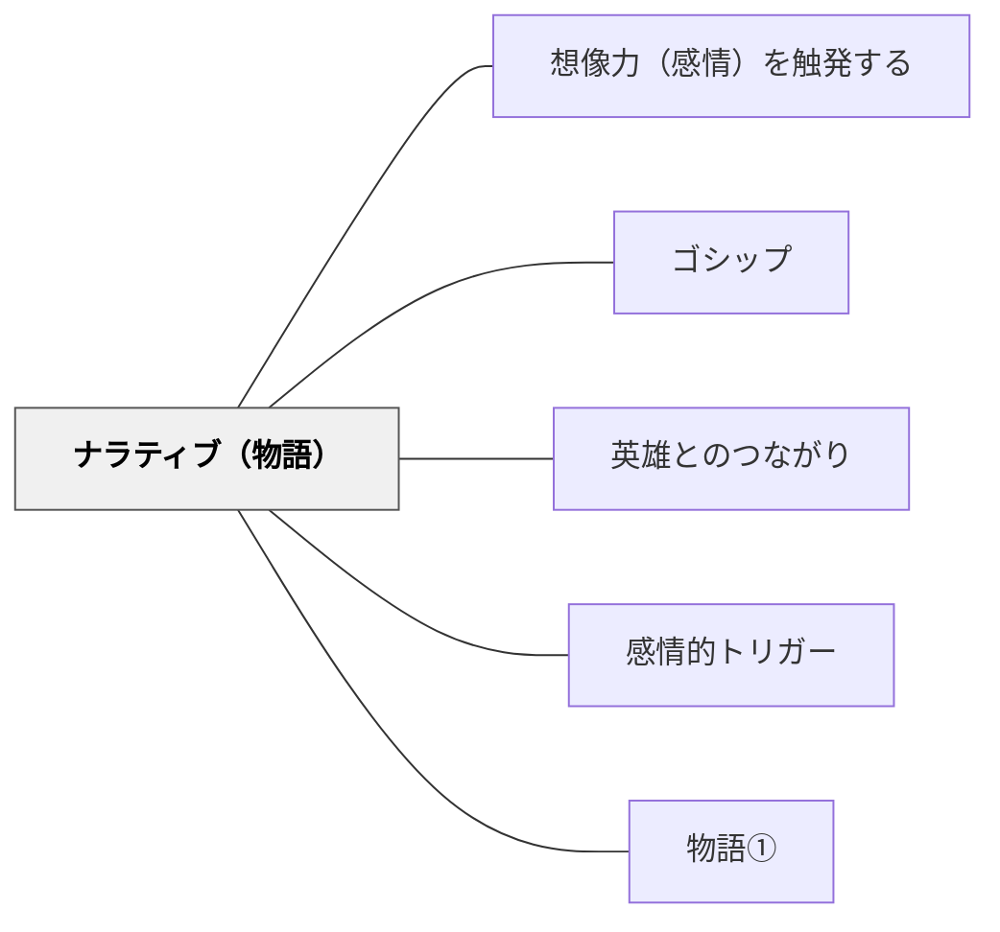

# ナラティブ（物語）

> 物語は情報を覚えやすい形にするとともに、感情を方向づける

## 背景（Context）

人間は太古から物語によって知識・価値観・文化を伝えてきた。物語は単なる「娯楽」ではなく、認知と感情を同時に動かす最強の認知的道具である。

## 問題（Problem）

授業で提示された情報が断片的にしか記憶されず、感情的な関与も薄い。どうすれば学習者が内容を「自分のこと」として感じ、長期的に記憶できるようになるか。

## 力のかたち（Forces）

- 物語には「始まり・展開・結末」という構造があり、記憶に残りやすい（ストーリー記憶術）
- 登場人物への感情移入が、内容への関与を生む
- 物語は「情報を覚えやすい形で伝える」と「感情を方向づける」という2つの作業を同時に行う
- どんな教科の内容も物語として語り直すことができる

## 解決（Solution）

学習内容を物語の構造で提示する。算数の授業では絵本（例:『お待たせクッキー』）を使い、数の概念を物語の文脈の中で体験させる。社会や理科でも、発見の歴史・人物のドラマ・問題が生まれた経緯を物語として語ることで、学習者の感情的関与を引き出す。学習者自身に物語を作らせることも有効。

## 結果（Consequences）

- 学習内容が感情と結びつき、長期記憶に残りやすくなる
- 学習者の探究意欲と「続きが知りたい」という感覚が生まれる
- 物語の「教訓」に引きずられ、複雑な現実を単純化しすぎる危険がある

## 関連パタン

- [[パタン/想像力（感情）を触発する]]
- [[パタン/ゴシップ]]
- [[パタン/英雄とのつながり]]
- [[パタン/感情的トリガー]]
- [[パタン/物語①]]

## クラスター図

## Actionable Insight

- 科学の発見を「科学者の苦悩・失敗・ひらめきの物語」として語る——人物の感情的なドラマが情報を感情と結びつけ長期記憶に残りやすくする
- 概念の説明を「昔々、〇〇という問題があった。そこに〇〇が登場した」という物語の構造で始める——始まり・展開・結末の構造が記憶の定着を助ける
- 学習者自身に「今日学んだことを物語の形にして」と書かせる——自分で物語にする経験が内容の構造的理解と創造的応用を同時に促す

## 出典

キアラン・イーガン（2010）『想像力を触発する教育――認知的道具を活かした授業づくり』北大路書房
