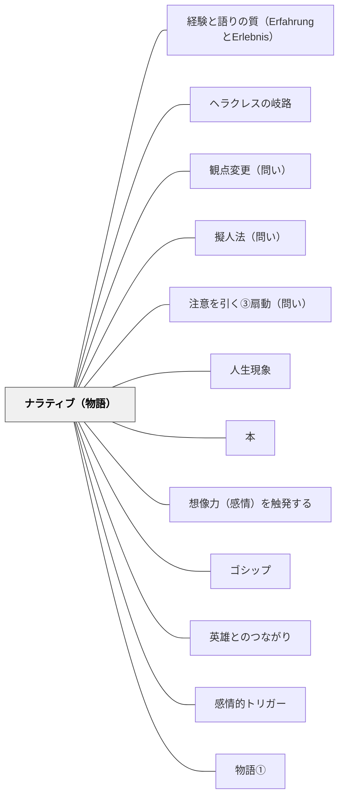

# ナラティブ（物語）

> 物語は情報を覚えやすい形にするとともに、感情を方向づける

## [Pattern Connection]

### ベンヤミン（1936）——「物語作家（der Erzähler）」：物語はErfahrungの伝承媒体

ヴァルター・ベンヤミンは「物語作家」論文（1936年）で、物語の機能を「情報の伝達」や「感情の喚起」より根本的な次元で捉え直した。物語とは**Erfahrung（語り得る経験）**の伝承媒体である。

**「語り手の痕跡が残る」——物語の本質：**

> 「経験を伝える物語は、ちょうど陶器の皿に陶工の手の跡が残っているように、語り手の痕跡をとどめている」——「物語作家」

物語は「情報を覚えやすくする容器」（現在の[[パタン/ナラティブ（物語）]]の定義）以上のものだ。物語の中には語り手の経験が宿り、聴き手はその経験を「自分の経験として」受け取る。皿を手にした人が陶工の手仕事を「感じる」ように、物語を聴いた人は語り手の経験を「引き継ぐ」。

**物語の消滅——Erfahrungの喪失と表裏一体：**

ベンヤミンは「物語作家の消滅」を近代の根本的な文化的変容として分析した。理由は二つ：

第一に、**第一次世界大戦**が人間から「経験を語る力」を奪った。最新技術の戦争を体験した帰還兵は「押し黙ったまま帰って来た」——語り得る経験（Erfahrung）ではなく、語り得ない衝撃（Erlebnis）しか持ち帰れなかったから。

第二に、**情報の台頭**が物語を駆逐した。情報は「それ自体で説明される」が、物語は「聴き手が自分のなかに住まわせる」ことで生きる。情報が速く流れる社会では、物語が生きる時間的・空間的余白が失われる。

| | 物語（ナラティブ） | 情報（インフォメーション） |
|---|---|---|
| 語り手の痕跡 | 残る | 残らない |
| 聴き手の関与 | 自分の内側に住まわせる | 検証・処理・消費 |
| 伝承 | 次世代に生きた形で伝わる | 使い捨て |
| 教育的機能 | Erfahrungを生む | Erlebnisに留まる |

**教室での物語の回復——授業に「陶工の手の跡」を：**

- 教師が「科学者の苦悩・失敗・ひらめきの物語」として語るとき、語り手（教師）の経験が授業に宿る
- 子どもが自分の言葉で物語を語るとき、Erlebnisだった体験がErfahrungとして結晶する
- 「陶工の手の跡が残る記録」——正解だけを書く日記でなく、「語り手としての自分」が見える記録

- **既存パタンとの関連**：現在のパタンが「物語は情報を覚えやすくし感情を方向づける」と定義するのに対し、ベンヤミンは「物語はErfahrungの媒体である」というより根本的な機能を加える
- **補強された点**：「なぜ物語が教育に有効か」の説明が「認知・感情の効率」から「経験の伝承」へと深化する。物語の目的は「記憶定着」ではなく「経験の継承」
- **他のパタンへの波及**：[[パタン/経験と語りの質（ErfahrungとErlebnis）]] — 物語作家の語りがErfahrungの形式；[[パタン/三行日記]] — 「語り手の痕跡が残る」日々の記録；[[文献/闇を歩く批評（ベンヤミン・柿木伸之）]] — 本統合の出典

---

### 結城浩（2013）数学ガールの誕生——「橋渡し（interpreter）」としての物語と「たったひとりのあなたへの手紙」

結城は『数学ガールの誕生』で、物語が「知識と学習者の間を橋渡しする」最も有効な媒体であることを実践的に示す。

**interpreter（橋渡し・注解者）としての物語（p.212–214）：**

> 「新しい理論を作るのではなく、理論を考える人と知りたい人の間をつなぐ橋渡しが私の仕事。私は注解者であり仲介者」——結城（2013）

ガロアの群論・ゼータ関数・オイラーの公式という難解な数学概念を「高校生の対話・ガロアの決闘前夜・電車の中の女の子」という物語の文脈に埋め込む。物語は「理論を考える人（数学者）」と「知りたい人（読者・学習者）」の間に立つ橋渡しとして機能する。ベンヤミンの「陶工の手の跡」が「語り手の経験の伝承」として物語を定義するとすれば、結城の物語は「概念を生きた体験として届ける橋」として機能する。

**「たったひとりのあなたへの手紙」としての物語設計（p.219）：**

> 「自分が書いた本を読む読者——たった一人のあなた——に向けての手紙を書く。それが本を書く上で大切なことだと思います。」——結城（2013）

授業での物語も「このクラス全員に向けた物語」として設計するとき、誰にも届かなくなる。「目の前のこの一人に届く物語」として語るとき、普遍的なつながりが生まれる。「たったひとり」への具体的な語りかけが、全員の「自分のことを言われている」という感覚を生む。

**「嘘はつかないが飛ばす」——物語の省略設計（p.214）：**

> 「説明で嘘はつかない。でもやさしいところは適切に飛ばす。うまい飛び石をポン・ポン・ポンと読者に飛んでもらって『なるほど！』と思ってもらう」——結城（2013）

物語として学習内容を語るとき、すべてを説明しようとしない。「飛び石」を置いて、学習者自身が間を飛ぶ余地を残す。省略は失敗でなく設計の一部である——学習者が「飛び石を飛んだ」という体験が、理解の所有感を生む。

- **補強された点**：「物語はなぜ教育に有効か」の説明に「橋渡し（interpreter）機能」が加わる。情報の伝達でも経験の伝承でもなく、「知識と学習者の間の媒介」として物語の機能が定位される。ベンヤミン（伝承）・結城（橋渡し）・イーガン（認知道具）という三つの物語論が相互補完する。
- **他のパタンへの波及**：[[パタン/発見を委ねる（自分で見つけたものこそ燃え上がる）]]（「飛び石」は発見の余白を作る設計と同型）；[[パタン/産婆役としての教師]]（「橋渡し」はダイモン的媒介者と重なる）；[[文献/数学ガールの誕生（結城浩）]]

---

## 背景（Context）

人間は太古から物語によって知識・価値観・文化を伝えてきた。物語は単なる「娯楽」ではなく、認知と感情を同時に動かす最強の認知的道具である。

## 問題（Problem）

授業で提示された情報が断片的にしか記憶されず、感情的な関与も薄い。どうすれば学習者が内容を「自分のこと」として感じ、長期的に記憶できるようになるか。

## 力のかたち（Forces）

- 物語には「始まり・展開・結末」という構造があり、記憶に残りやすい（ストーリー記憶術）
- 登場人物への感情移入が、内容への関与を生む
- 物語は「情報を覚えやすい形で伝える」と「感情を方向づける」という2つの作業を同時に行う
- どんな教科の内容も物語として語り直すことができる

## 解決（Solution）

学習内容を物語の構造で提示する。算数の授業では絵本（例:『お待たせクッキー』）を使い、数の概念を物語の文脈の中で体験させる。社会や理科でも、発見の歴史・人物のドラマ・問題が生まれた経緯を物語として語ることで、学習者の感情的関与を引き出す。学習者自身に物語を作らせることも有効。

## 結果（Consequences）

- 学習内容が感情と結びつき、長期記憶に残りやすくなる
- 学習者の探究意欲と「続きが知りたい」という感覚が生まれる
- 物語の「教訓」に引きずられ、複雑な現実を単純化しすぎる危険がある

## 関連パタン
- [[パタン/経験と語りの質（ErfahrungとErlebnis）]] — 物語作家の語りがErfahrungの媒体になる（ベンヤミン）
- [[文献/闇を歩く批評（ベンヤミン・柿木伸之）]] — 物語作家・語り手の痕跡・ErfahrungとErlebnis（ベンヤミン, 1936）
- [[パタン/ヘラクレスの岐路]]
- [[パタン/観点変更（問い）]]
- [[パタン/擬人法（問い）]]
- [[パタン/注意を引く③扇動（問い）]]
- [[教科/国語]]
- [[実践/読み語りの実践]]
- [[パタン/人生現象]]
- [[パタン/本]]

- [[パタン/想像力（感情）を触発する]]
- [[パタン/ゴシップ]]
- [[パタン/英雄とのつながり]]
- [[パタン/感情的トリガー]]
- [[パタン/物語①]]

## クラスター図

## Actionable Insight

- 科学の発見を「科学者の苦悩・失敗・ひらめきの物語」として語る——人物の感情的なドラマが情報を感情と結びつけ長期記憶に残りやすくする
- 概念の説明を「昔々、〇〇という問題があった。そこに〇〇が登場した」という物語の構造で始める——始まり・展開・結末の構造が記憶の定着を助ける
- 学習者自身に「今日学んだことを物語の形にして」と書かせる——自分で物語にする経験が内容の構造的理解と創造的応用を同時に促す

## 出典

キアラン・イーガン（2010）『想像力を触発する教育――認知的道具を活かした授業づくり』北大路書房
