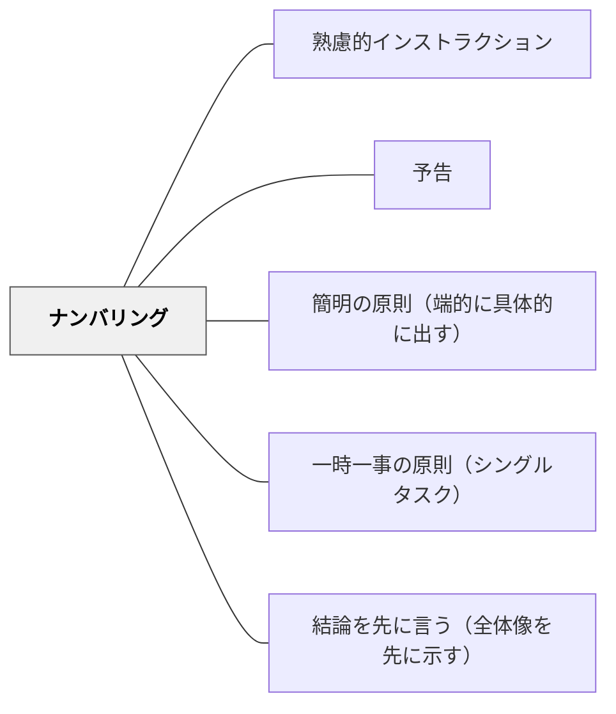

# ナンバリング

> 「今から3つ説明します」と数を示すだけで、受け手の理解の構えが整う。

## 背景（Context）
山本博樹（2019）『教師のための説明実践の心理学』ナカニシヤ出版に示される技法の一つがナンバリングである。「今から3つ説明します。1つ目は…2つ目は…3つ目は…」のように数を明示して構造的に伝えることで、受け手は全体量を把握し、どこまで来たかを自分で確認できる。

## 問題（Problem）
説明が長くなるほど、受け手はどこまで聞けばいいかわからなくなる。「まだ続くのかな」「何個あるの？」という不安が注意を散らし、内容の定着を妨げる。構造が見えない説明は聞く意欲を削ぐ。

## 力のかたち（Forces）
- 数を示すことで受け手は「3つのうち今は1つ目」という認知的な位置取りができる
- 数が多すぎる（7つ以上）と、逆に構造が見えにくくなる
- ナンバリングは情報に階層や順序がある場合に最も効果的に機能する

## 解決（Solution）
**「今から〇つのことをお伝えします」と最初に数を宣言し、「1つ目は…」「2つ目は…」のように番号を付けながら順番に伝える。**

3つ以内に収めることが理想的であり、それ以上になる場合はグルーピングして「2つのカテゴリに分けて説明します」のように階層化する。予告と組み合わせて「今日は3つのことをやります」という冒頭の全体ナンバリングも有効。

## 結果（Consequences）
- 受け手が説明の全体量と現在地を把握しながら聞ける
- 聞き漏らした部分がどこかを自分で特定しやすくなる
- 教師自身が伝える内容を整理・構造化する思考習慣が育つ

## クラスター図

## Actionable Insight

- 「今から3つのことをお伝えします」と最初に数を宣言し、「1つ目は…」「2つ目は…」のように番号を付けながら伝える——受け手が説明の全体量と現在地を把握しながら聞ける
- 3つ以内に収めることを目安にし、それ以上になる場合はグルーピングして「2つのカテゴリに分けて説明します」と階層化する——数が多すぎると逆に構造が見えにくくなる
- 授業の冒頭に「今日は3つのことをやります」と全体ナンバリングする——受け手がどこまで来たかを自分で確認できる

## 出典

- 一つの教育のパタン・ランゲージ（岩井輝久）

## 関連パタン
- [[パタン/熟慮的インストラクション]] — 親パタン
- [[パタン/予告]] — ナンバリングと組み合わせる事前の全体提示
- [[パタン/簡明の原則（端的に具体的に出す）]] — 簡明さを構造で支える
- [[パタン/一時一事の原則（シングルタスク）]] — 番号ごとに一つずつ伝える
- [[パタン/結論を先に言う（全体像を先に示す）]] — 全体を先に示す共通原則
