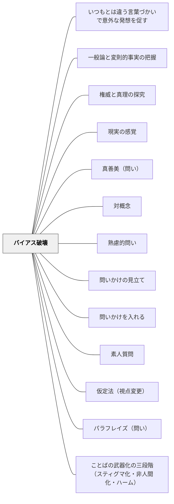

# バイアス破壊

> 特定の固定観念・思い込み・先入観に疑いをかける問い。

## Pattern Connection（安斎勇樹, 2021）

**位置づけの補強**：安斎（2021）は本パタンを「ユサブリモード」（とらわれを揺さぶる問い）の1技法として位置づけ、4つの具体的フォーミュラを提示している。既存の「なぜそれが当たり前なの？」という問いに加え、除外・代替・付加という操作を組み合わせた4形式が使える。

**安斎の4フォーミュラ**

| フォーミュラ | 例 |
|---|---|
| 「本当にXは必要ですか？」 | 「本当に宿題は必要ですか？」 |
| 「Xを除外してみると、どうなるでしょうか？」 | 「テストを除外した評価はどう変わる？」 |
| 「XでないYは考えられないでしょうか？」 | 「話し合いでない議論の方法は？」 |
| 「XにあえてYを入れると、どうなるでしょうか？」 | 「授業に遊びの要素を入れると？」 |

これらは「固定観念」の除去・代替・追加という操作であり、学習者が「そういうものだ」と思い込んでいる前提に穴を開ける。

**他のパタンへの波及**：どのタイミングでバイアス破壊を使うかは [[パタン/問いかけの見立て]] の「とらわれを感じたか」によって決まる。バイアス破壊後に生まれた新しい視点を定着させるには [[パタン/パラフレイズ（問い）]] や [[パタン/仮定法（視点変更）]] と組み合わせるとよい。

**Carruthers（2026）との接続——ステレオタイプはジェネリクス推論の産物：**

Carruthers（2026）Section 7は、ステレオタイプが**ジェネリクス（汎称文）**の形で記憶されることを指摘する。「Xな子は〜」「〜族は〜」という汎称形式は、生物カテゴリーについての本質主義的推論と同じ認知回路を使って社会集団を処理する——つまりステレオタイプは「性格の悪い人が持つ偏見」ではなく、人間の情報処理系に組み込まれたジェネリクス記憶の自然な副産物である。

**実践的含意**：バイアス破壊の「なぜそれが当たり前なの？」という問いは、ジェネリクスとして記憶された前提を命題として取り出し、検証対象にするプロセス——「XはYだ」（汎称）を「本当にすべてのXはYなのか？」（量化命題）に変換することでバイアスの認知的構造を可視化する。また評価的学習（Section 6）の観点では、ジェネリクスとして聞かれた陳述はそのまま感情的評価を変えうる——バイアスの「解除」もまた、別の評価的陳述（「実際には〜だ」「この人は〜だ」）が有効な理由がここにある。

---

## 背景（Context）
人は経験や文化・教育を通じて無数の思い込みを形成する。
それらは日常生活を効率化する一方、新しい学びや多様な視点の獲得を妨げる。
「なぜそれが当たり前なの？」という問いは、見えなくなっていた前提を意識の表面に引き上げる。
批判的思考教育において、自分のバイアスへの気づきは最も重要な目標のひとつである。

## 問題（Problem）
学習者が「こういうものだ」と思い込んでいるために、新しい概念や事実を受け入れられないことがある。
教師や教科書の権威に依存しすぎると、知識を批判的に吟味する力が育まれない。
特定の文化的背景に基づく前提が普遍的真理として扱われることで、多様な視点が排除される。

## 力のかたち（Forces）
- バイアスは無意識に作動するため、意識化するだけで思考の自由度が増す。
- 「当たり前」への問いは、問われた側に不快感を生じさせることがある。
- 問いを投げる側が批判の意図をもたず、探究の姿勢で問うことが重要となる。
- 自分のバイアスを認めることは、心理的な抵抗を伴う知的勇気の行為である。

## 解決（Solution）
「なぜそれが当たり前なの？」「それはいつ誰が決めたの？」という問いを意図的に投げかける。
普段疑わない「常識」を列挙し、そのひとつひとつに「本当にそうか？」と問うワークを設計する。
反証事例や異文化の事例を提示してから問いを立てることで、バイアスへの気づきを促しやすくする。
問いの場では「正しい・間違い」ではなく「そう考える根拠は何か」を問うことで安全な探究を実現する。

## 結果（Consequences）
学習者が自分の思い込みに気づき、それを相対化する力が育まれる。
知識を批判的に吟味する習慣が形成され、情報リテラシーの基盤ができる。
多様な視点を受け入れる柔軟性が高まり、異文化理解や協働学習に好影響をもたらす。
バイアスへの指摘が攻撃的に受け取られると対話が閉じるため、問いの語り口と場の設計が重要となる。

## 関連パタン
- [[パタン/いつもとは違う言葉づかいで意外な発想を促す]]
- [[パタン/一般論と変則的事実の把握]]
- [[パタン/権威と真理の探究]]
- [[パタン/現実の感覚]]
- [[パタン/真善美（問い）]]
- [[パタン/対概念]]
- [[パタン/熟慮的問い]] — 親パタン
- [[パタン/問いかけの見立て]] — ユサブリ（とらわれ）が必要かどうかを判断する前段
- [[パタン/問いかけを入れる]] — バイアス破壊をフカボリ/ユサブリの体系に位置づける
- [[パタン/素人質問]] — 前提を問い直すアプローチ
- [[パタン/仮定法（視点変更）]] — 別の視点から問い直す
- [[パタン/パラフレイズ（問い）]] — 破壊した後の言い換え・再構築
- [[パタン/ことばの武器化の三段階（スティグマ化・非人間化・ハーム）]] — ことばの武器化はバイアスの言語的強化装置（Pentón Herrera, 2026）。スティグマ化段階で働くラベルへの気づきがバイアス破壊の出発点になる

## クラスター図

## Actionable Insight

- 「なぜそれが当たり前なの？」という問いを1時間に一度意図的に使う——当然視している前提への問いかけが学習者の思い込みを意識の表面に引き出す
- 普段疑わない「常識」を付箋に書き出し、一つ「本当にそうか？」と問い直すワークをする——バイアスへの気づきはゆっくりした問い直しの蓄積から生まれる
- 異文化の事例や反証事例を示してから「これを見て、自分の考えは変わる？変わらない？なぜ？」と問う——反証事例との出会いがバイアスへの気づきを最も自然に促す

## 出典
- [[文献/熟慮的問いのパターンリスト（動画記録）]]
