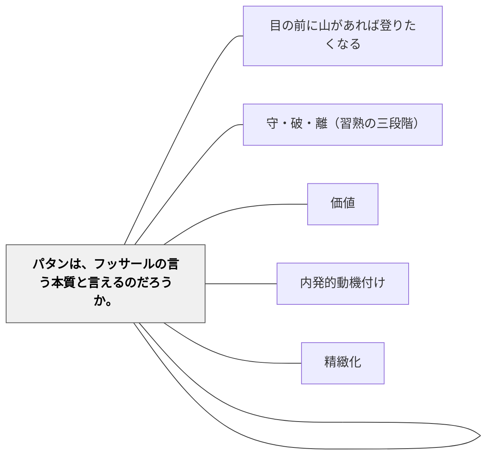

# パタンとアンチパタンの相対性

> 「よい方法」はいつもよい方法とは限らない——同じパタンが、目的と状況によってパタンにもアンチパタンにもなる。

## Pattern Connection

### 岩井輝久（2023）＋ChatGPT——「状況切替スイッチ」というメタパタン

岩井は「一つの教育のパタン・ランゲージ」の思考記録の中で次の洞察を記録し、ChatGPTとの対話を通じて整理した：

> 「復唱指導モデルも状況によってパターンにもアンチパターンにもなる。配列（シークエンス）のパターンには、単純なものから複雑なものへという配列がいい目的状況とあえて複雑な体験から構成する配列がいい目的状況がある。それぞれ違った目的状況では、パターンにもなりアンチパターンにもなる。状況が変われば違うパターンに切り替える、こういう柔軟性が教育の仕事には求められるのかもしれない。」（岩井輝久、2023）

ChatGPTはこれを受けて、次の三点に整理した：

**1. パターンとアンチパターンは目的状況に依存する**

| パタン | パタンになる場合 | アンチパタンになる場合 |
|---|---|---|
| **復唱指導** | 言語定着・発音・漢字の正確な筆順など「型を身につける」場面 | 探究や創造的思考が求められる場面——個の発想を抑圧する |
| **配列：単純→複雑** | 系統的知識の習得、手順の理解 | 全体像や問いを先に体験させたい探究型アプローチ |
| **配列：複雑→単純** | 全体像から構造理解へ導く探究型アプローチ | 積み上げが必要な段階的習得 |

**2. 教育実践は「パタンを選び直す仕事」でもある**

教育とは、「適切なタイミングで、適切なパターンを選び直す」連続である。同じ解決でも、ある子にとっては有効で、別の子には逆効果になる。ある配列が今日は機能しても、明日は通じない。教育実践ではパタンを「当てる」のではなく、**読み替える・捨てる・裏返す**という判断が問われる。

**3. メタパタン「状況切替スイッチ」**

ChatGPTはこの洞察を上位のパタンとして定式化した：

> **状況切替スイッチ**：教育のパタンや技法がそのまま機能しないとき、状況に応じて意図的に切り替える。

- **使える場面**：学習者の反応が鈍いとき、活動が硬直化しているとき
- **リスク**：判断の軸がなければ迷走する可能性がある
- **備考**：切り替えには経験と直感、そして仮説検証の思考が求められる

- **他のパタンへの波及**：[[自分のパタンを作る]]（パタンを作ること自体がこの判断力を育てる）・[[パタン/守・破・離（習熟の三段階）]]（「守」と「破・離」の判断こそ状況切替）

---

### アイスナー（Elliot Eisner）——教育とは「形式の選択」という芸術的行為

同じ対話の中で、ChatGPTはElliot Eisnerの芸術教育論との接続を示した：

- 教育は「何を教えるか」以上に「**どのように経験させるか**」が重要
- 教育の価値は「成果の測定」ではなく、「認識の鋭さや感性の広がり」にある
- 教育とは、文脈の中で柔軟に**「形式（form）」を選ぶ芸術的営み**である

「パタンを固定的に適用するのではなく、状況に応じて再選択する」という岩井の洞察は、Eisnerの芸術教育論と構造的に共鳴する。教育的判断＝「今この子、この状況にとってどうか」という問いは、技術と感性と批評性の交差点に生まれる。

> 「だからこそアイスナーは、教育を『芸術的行為』と呼んだのです。」（ChatGPT, 2023）

AIが情報提供する時代においても、「パタンにもアンチパタンにもなる関係性の見極め」は人間の教師に残るコアな仕事であり、定年後にも継続しうる「生涯的な知の仕事」でもある。

- **他のパタンへの波及**：[[パタン/価値]]（状況に応じた価値判断がパタン選択の基準）・[[パタン/内発的動機付け]]（状況を読む感性は内発的な関心から育つ）

---

### 岩井輝久（2023）——パタンは制約でなく自由の道具

> 「パタン・ランゲージのパタンは、規範性を持つので、不自由なものだと誤解している人がいるかもしれません。実際は、逆です。パタン・ランゲージによって、より柔軟に自由になることができます。なぜなら、パタンは状況に応じて存在するからです。まずはじめにパタンや方法があるのではないです。」（岩井輝久、2023）

パタンは規範性（「こうすべき」という方向性）をもちながら、同時に状況依存的であるという二重の性質がある。この二重性こそが、パタンを制約でなく自由の道具にする。「はじめに方法ありき」ではなく「はじめに状況ありき」——まず被教育者と状況を理解し、そこから重ねるパタンを選ぶ。だからこそ、同じパタンを知っていても使い手によって結果が大きく変わる。

熟達した教育者に共通するのは、状況を読んでパタンを選ぶ・捨てる・裏返す柔軟性をもっていることである。パタン・ランゲージの規範性に縛られるのではなく、その規範性を「判断の資源」として使いこなすこと——これがパタンを育てる実践の目標でもある。

- **他のパタンへの波及**：[[パタン/守・破・離（習熟の三段階）]]（「守」から「破・離」へ——型を身につけた後に状況を読んで型を超える自由）・[[自分のパタンを作る]]（パタンを作ること自体がこの状況読解力を育てる）

---

## 背景（Context）

パタン・ランゲージは「問題解決に繰り返し求められる関係」として記述されたパタンの集合体である。しかし、パタンはそのまま「当てはまる」ものではなく、常に目的と状況の中で意味をもつ。同じ技法・同じ配列・同じ指導モデルが、ある状況では効果的に機能し、別の状況では被教育者の可能性を制限する。

アレグザンダーは、パタンの普遍性には程度・レベルがあると指摘している。より普遍的なパタン（大パタン）もあれば、あまり普遍的ではない状況依存度の高いパタンもある。問題は、状況依存的なパタンを普遍的なパタンのように捉えてしまうという勘違いが起きることである。

## 問題（Problem）

パタンを「知っている」だけでは教育は改善しない。パタンを状況を問わずに適用し続ける教育者は、有効なパタンをアンチパタンとして使い続けてしまう。逆に、パタンを知らないまま「状況に応じて」動こうとすると、一貫性がなく迷走する。どのパタンを、どの状況で、どのタイミングで切り替えるかという判断力がなければ、パタンの知識は役立たない。

## 力のかたち（Forces）

- 同じパタンが「型を身につける」場面ではパタンになり、「自ら考える」場面ではアンチパタンになる
- パタンの普遍性には程度がある——より普遍的なパタンと状況依存度の高いパタンがある
- 経験の浅い教師は「これが良い方法」と固定的に信じ、状況に応じた切り替えが難しい
- 切り替えの判断には、パタンへの理解（守）と状況読解力（破・離）が必要
- 切り替えには経験と直感、そして仮説検証の思考が求められる

## 解決（Solution）

**パタンをレパートリーとして持ちながら、「今この状況でこのパタンはパタンか、アンチパタンか」を常に問い、意図的に切り替える。**

実践上の問いの形：
- 「今、子どもたちは型を身につける段階か、それとも自ら問う段階か」（[[パタン/守・破・離（習熟の三段階）]]）
- 「この指導が機能していないとき、パタンを変えるか、状況の読み方を変えるか」
- 「このパタンは大パタン（普遍的）か小パタン（状況依存的）か」

---

**実践例：配列パタンの状況判断**

| 状況 | 適切な配列 | 理由 |
|---|---|---|
| 系統的知識の習得（手順・文法・計算） | 単純→複雑（スモールステップ） | 土台を固めてから応用へ |
| 探究・問題発見型学習 | 複雑→単純（全体先行・丸ごと学ぶ） | 全体像や問いを先に体験させ、後から構造理解へ |
| 概念の深い理解（転移を目指す） | 両方を経験させる | 「なぜこうなるか」の問いは複数の経験から生まれる |

バルセロナのサッカー教育では「実際のサッカーに近い、あえて複雑から」という練習が基本である。しかし、スモールステップが適切な場合もある。どちらを選ぶかは、目的と状況の問いから始まる。

## 結果（Consequences）

- パタンを「技法の引き出し」でなく「判断の資源」として使えるようになる
- 状況読解力が育ち、パタンの適用・変更・放棄の判断が意図的になる
- 「うまくいかなかった」体験が「どのパタンが、どの状況でアンチパタンになったか」という問いに変わる
- AIが情報提供する時代においても、この判断力（批評性）は人間の教師に残るコアな仕事になる

## 関連パタン
- [[パタン/目の前に山があれば登りたくなる]]

- [[自分のパタンを作る]] — パタンを自分で作ること自体がこの判断力を育てる
- [[パタン/守・破・離（習熟の三段階）]] — 「守」は型を固めること、「破・離」は型を状況に応じて超えること
- [[パタン/価値]] — 状況に応じた価値判断がパタン選択の基準（牧口のメタパタン）
- [[パタン/内発的動機付け]] — 状況を読む感性は内発的な関心と探究心から育つ
- [[パタン/精緻化]] — 「なぜこのパタンが今この状況でアンチパタンになるか」を問うことが精緻化
- [[パタン/パタンは、フッサールの言う本質と言えるのだろうか。]] — パタンの三部構成がフッサールの本質観取と対応するかを問う哲学的検討

## クラスター図

## Actionable Insight

- 次にうまくいかなかった授業を振り返るとき、「どのパタンをアンチパタンとして使ってしまったか」を問う——「失敗」が状況読解力の訓練になる
- パタンリストを見て「このパタンが逆効果になる状況はどこか」と問う——1つのパタンにつき1つの「裏返し」を考えてみる
- 熟達者の授業を観察するとき「どのパタンをどのタイミングで切り替えたか」に注目する——切り替えの判断こそ、熟達者から学べる最重要なことの一つ

## 出典

岩井輝久（2023）「一つの教育のパタン・ランゲージ」思考断片・ChatGPT対話記録
Eisner, E. W.（2002）*The Arts and the Creation of Mind*. Yale University Press.
