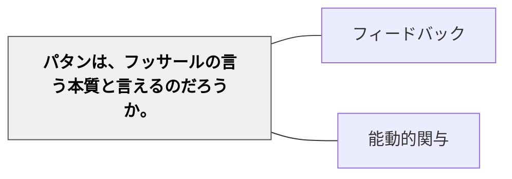

# パターン・ランゲージと本質観取

> パターンの三部構成は、本質を記述するための器（メディア）である。器を通じて示される「状況と問題と解決のダイナミックな関係性」こそが、フッサールの言う本質に対応する。

## 問いの出発点

パタンを定義するとき、それは「三つの部分で構成されるルールであり、一定の状況とそこでの問題点とその解決策の関係を表す」（アレグザンダー）。このルールとしての関係が、フッサールの言う「本質」と言えるのかという疑念が生じる。

また、ポジティブな逸脱（Positive Deviance）は統計学的な外れ値のようなものだが、それがパターンを構成するときに重要な素材となる。事実としての逸脱事例（事実学）から、他の状況でも適用可能な価値あるルール（本質学）を見出すこと——それがパターンの発見にあたる。

## フッサールの本質観取（形相的還元）

フッサール現象学における**本質観取**（essence intuition）とは：

- 個別具体的・偶然的な部分を削ぎ落とし、「同様の別の個物でも成り立つ不変な構造体系」を捉える作業
- 「想像による自由変更」（Eidetische Variation）を通じて、変更しても成り立つ不変項を「形相（Eidos）」として取り出す
- 客観的な「真理」ではなく、意識において把握された**意味の核**

例：机の本質観取では「一辺2メートルの木製の濃い茶色の机」という個別的特徴を変更しながら、「机であるために不可欠な特徴」を本質として取り出す。

### パターン・ライティングにおける本質観取

パターン・ランゲージの作成プロセスでは、あらゆるフェーズで本質観取が行われる（井庭, 2025）：

| パターン要素 | 本質観取の問い |
|---|---|
| 解法（Solution） | その解法が勧めていることの核心は何か |
| 問題（Problem） | その問題の事態の本質は何か |
| 状況（Context） | 問題が起きやすい経緯・条件の本質は何か |
| 諸力（Forces） | 問題を生じさせる要因の本質は何か |
| 結果（Consequences） | その解法を行うと生じる帰結の本質は何か |

## 事実学と本質学

フッサールは「事実学」（science of fact）と「本質学」（science of essence）を区別する：

- **事実学**：「実際にこうなっている」という現存在を追究する学問
- **本質学**：「現存在するものと可能的に現存在するもの一般の内容を形作っているところの本質」を追究する学問

パターン・ランゲージは本質学的な側面が強い。ただし「純粋数学や純粋論理学」のような**純粋な本質学**ではなく、**事実に根差した本質学**（井庭, 2025）である。

## グラウンデッド・エッセンス・アプローチ（GEA）

井庭（2025）はこのアプローチを **Grounded Essence Approach（GEA）** と名付ける：

- 本質（essence）を探究しながら、経験・事実に接地（grounding）させる
- マイニング・インタビューの逐語録との整合性チェック
- 実践者へのレビューによる妥当性確認
- 単なる「私にとってそう思える」ではなく、「他の人にもきっとそうだろう」という**間主観的還元**を追求

パターン・ランゲージは、事実に根差した「本質」記述であることと、経験則を言語化したものであることが表裏一体になったものだと言える。

## パタンは本質と言えるか

### 疑念の正体

アレグザンダーの定式化がフッサールの「本質」と言えるかには慎重な検討が必要：

- **肯定的側面**：状況・問題・解決の三項関係によって、個別の文脈を超えた「生成の原理」を記述できているなら、それは本質を捉えている
- **批判的側面**：パターンの記述が「便宜的なマニュアル」に留まり、背後にある力の均衡を捉えきれていない場合、「事実学」の延長にある「類型化」に過ぎない

### 疑念が晴れた視点：反事実的思考

「この関係（パターン）がなければ、その解決（生き生きとした状態）は生じなかった」——この反事実的な視点から考える。

パタンは命令形で表される（アレグザンダー）ため規範性を持つ。そこには問題を生じさせる力と状況があり、解決があったとき「その関係がなければそれが生じることがなかった」と考えることができる。つまりパターンで記述される三項関係そのものが、本質を指し示している。パターンの三部構成は本質を記述するための**器（メディア）**であり、器を通じて示される「状況と問題と解決のダイナミックな関係性」こそがフッサールの言う本質に対応する。

## 関連する哲学的概念との接続

### アブダクションとパターンの発見

「ポジティブな逸脱（外れ値）」を前にしたとき：

- **アブダクション（パース）**：驚くべき事実 C が観察された。仮説 A が真であれば C は当然説明される。ゆえに A が真である理由がある
- この「仮説 A」こそが、状況・問題・解決を結ぶ「関係の発見」であり、パターン記述そのものである

### 因果推論（反事実）とフッサールの「自由変更」

フッサールの**自由変更**（Eidetische Variation）は、対象の特定の要素を意識の中で変えてみたり取り去ってみたりして、それでもその対象が「そのもの」であり続けるための不変項を取り出す操作である。

「関係がなければ生じなかった」という反事実的思考は、まさに「関係」を自由変更にかけ、それが不変の本質であることを突き止める行為に他ならない。因果推論における反事実（Counterfactual）の思考は、フッサールの自由変更の一部と言えるかもしれない。

### 新カント派の「妥当」とパターンの規範性

アレグザンダーが「命令形」にこだわったのは、パターンが単なる事実の記述ではなく「価値（べき）」を伴うものだから：

- **存在（Sein）**：実際に起こった具体的な出来事
- **妥当（Geltung）**：数学的真理や論理、価値のように時空を超えて意味を持つもの（ロッツェ）

パターンは物理的な建築物（存在）の中にあるのではなく、その背後の「力の均衡」という論理（妥当）の中にある。「妥当」という概念を通すことで、パターンの持つ規範性が哲学的に基礎付けられる。

フッサールの「事実学」と「本質学」の区別は、ロッツェの「存在」と「妥当」の区別に似ている。

## 実践学としてのパターン・ランゲージ

井庭（2025）は、パターン・ランゲージを**実践学**（science of practices）の研究方法として位置づける：

- 言語学が言語そのものを研究するように、実践学は**実践そのものを研究対象**とし、その本質を追究する
- 実践を心理や身体に還元して捉えるのではなく、実践そのものを構成する要素を解明する

研究対象となる3種の「不思議な実践」：
1. その実践とはそもそも何をすることなのかが自明ではない実践
2. 他の人には「魔法」のように見えるほど巧みな実践の内実
3. 多くの人がうまくできないなかで一部の人だけがうまくできている実践（**ポジティブな逸脱**）

「教育パターン・ランゲージ・ウィキ」のような活動は、事実としての実践（事実学）から、教育における妥当な価値（本質学）を抽出する不断のプロセスと言える。また、パターン・ランゲージはグラウンデッド・セオリー（GTA）と異なり、研究成果物そのものが実践者の支援ツールとして直接使われる点に特徴がある。

## 関連パタン
- [[パタン/パタンとアンチパタンの相対性]]

- [[パタン/フィードバック]] — パターンが「本質」として機能するためにフィードバックが不可欠
- [[パタン/能動的関与]] — 実践学は実践者の主体的関与から本質を抽出する

## 出典

- 井庭崇（2025）「質的研究法としてのパターン・ランゲージ──「実践」の本質を捉え言語化する実践学の道」*質的心理学フォーラム* Vol.17, pp.55-70
- Alexander, C. (1979). *The Timeless Way of Building*. Oxford University Press.（邦訳（1993）平田翰那訳『時を超えた建設の道』鹿島出版会）
- Husserl, E. (1950). *Ideen I*. Martinus Nijhoff.（邦訳（1979）渡辺二郎訳『イデーン I』みすず書房）
- 岩井輝久（2026）個人的思索メモ（x.com/takashiiba の投稿を起点とした考察）

## クラスター図

