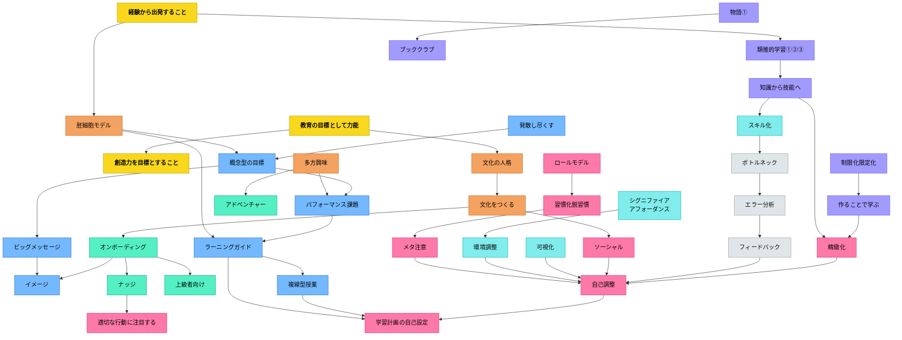

# パタン・ネットワーク図

エッジ（矢印）付きのパタン接続図。矢印は「AがBを支える・Bへと展開する」方向を示す。

---

---

## 凡例

| 色 | パタン群 |
|---|---|
| 黄 | メタパタン（哲学・原理） |
| オレンジ | 文化・基盤パタン |
| 青 | 授業骨格パタン |
| 緑（薄） | 参加・入口パタン |
| 紫 | 学習メカニズムパタン |
| ピンク | 自己調整・習慣パタン |
| シアン | 環境デザインパタン |
| グレー | フィードバックパタン |

## 読み方

- 矢印は「AがBを支える・Bへと展開する」方向
- 上層が哲学的原理、下層が具体的技術・スキル
- **オンボーディング**が入口——ここから読むと全体につながる
- **自己調整**が収束点——多くのパタンがここへ流れ込む

## 関連ページ

- [[概念/パタン・ランゲージ概論]]
- [[概念/外れ値とパタン・ランゲージ]]
- [[概念/メタパターン]]
- [[全パタン一覧]] — 全パタンの一覧と索引

## Actionable Insight

- 単元設計のとき「自己調整」へのパスが授業の中にあるか確認する——図の多くの矢印がここへ流れ込む設計が「自律した学習者を育てる授業」の構造的な特徴
- 「教育の目標として力能」→「文化の人格」→「文化をつくる」のメタパタン→文化チェーンから読む——個々のパタンより上位の原理から授業設計を点検できる
- 図の中で自分の授業に使っていないパタンを1つ選び、次の単元に取り入れてみる——ネットワーク図は「まだ試していない教育的資源の地図」として使える

## 関連パタン

- [[パタン/教育の目標として力能]]

- [[パタン/自己調整]] — 多くのパタンが収束する終点