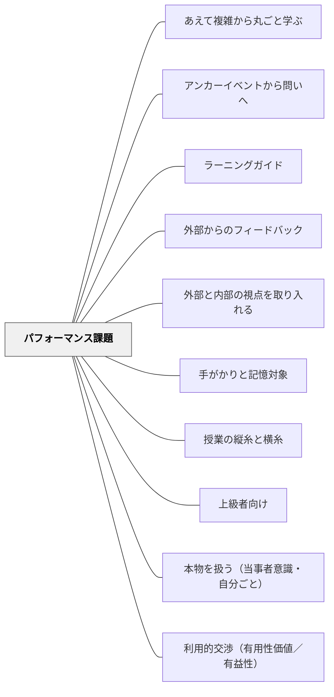

# パフォーマンス課題

**一文でいうと**：知識や技能を、現実に近い複雑な状況で使わせる課題として設計する。

## 使いどころ・使いすぎ注意

| 観点         | 内容                                             |
| ------------ | ------------------------------------------------ |
| 使いどころ   | 知識を使う複雑な課題にしたいとき。               |
| 使いすぎ注意 | 評価課題が大きすぎると、途中の学びが見えにくい。 |

> 単元終末に魅力的なゴールを設定することで、子供は「何のために学ぶか」を見通しながら学べる。

## 背景（Context）

子供たちは、「今日は○ページをやりましょう」という授業を繰り返す中で、**なぜ学んでいるのかが見えなくなる**。各時間の内容は理解していても、単元全体の意味や使い道が不明なまま学習が進む。

「ワクワク」と「資質・能力の育成」を両立したい——しかし、楽しい活動が資質・能力につながっているかどうか確かめにくい。

## 問題（Problem）

学習の目的が見えない子供は、指示待ちになる。教師が毎時間つないでいかないと学習が成立しない。子供が「自分で学ぼう」とする理由が生まれない。

## 力のかたち（Forces）

- 子供の動機付けには「何のためか（目的）」の見通しが必要
- 単元内の知識・技能の習得が、終末のゴールに向かう手段として意味を持つ必要がある
- 「資質・能力」の育成は、知識の習得だけでは不十分——実際に使う場面が必要

## 解決（Solution）

単元を設計する最初に、**社会の実際の課題解決に近い、実物の完成品・プレゼン・実技などによる課題（パフォーマンス課題）を終末に設定する**。

子供たちはこのゴールを知った上で、途中の学習（個別探究・協働）を進める。「このスキルを身に付けたら、あのゴールに近づく」という見通しが生まれる。

**戸田東小学校（実践編①）の設計:**

1. 単元終末のパフォーマンス課題を先に決める
2. 単元導入で子供の興味・関心を引き出す
3. 途中の学習で個別探究と協働を織り交ぜる
4. 終末でパフォーマンス課題に取り組む

## 結果（Consequences）

- 子供が「なぜ学ぶか」を自分の言葉で語れるようになる
- 個別学習の時間に「自分で調べよう」とする理由が生まれる（自己調整の起点）
- 「ワクワク」と「資質・能力」を両立した単元設計ができる
- 評価の場面が自然に生まれる（課題の達成度で資質・能力を測れる）

## 関連パタン
- [[パタン/あえて複雑から丸ごと学ぶ]]
- [[パタン/アンカーイベントから問いへ]]
- [[パタン/ラーニングガイド]]
- [[パタン/外部からのフィードバック]]
- [[パタン/内部と外部それぞれの視点を取り入れる]]
- [[パタン/手がかりと記憶対象]]
- [[パタン/授業の縦糸と横糸]]
- [[パタン/上級者向け]]
- [[パタン/本物を扱う（当事者意識・自分ごと）]]
- [[パタン/利用的交渉（有用性価値／有益性）]]

## このパタンが働く実践
- [[実践/個別支援級の複式算数：重さと面積をわたり・ずらしで学ぶ]]

| 実践パタン                                      | どのようにパフォーマンス課題になっているか                                         |
| ----------------------------------------------- | ---------------------------------------------------------------------------------- |
| [[実践/カエルの算数：勝ちやすさを表で考えよう]] | 表を使って勝ちやすいカエルを判断し、理由を説明することが単元の具体的なゴールになる |

- [[パタン/イメージ]] — ゴールのイメージが学びを導く（同一原理）
- [[パタン/胚細胞モデル]] — 単元を貫くBig Ideaの設定
- [[パタン/概念型の目標]] — 転移可能な理解を目指す単元設計
- [[パタン/自己調整]] — 目的が見えることで自己調整が始まる
- [[概念/個別最適な学びと協働的な学び]]

## クラスター図

## Actionable Insight

- 単元の最初の授業で「この単元の終わりには○○をします（発表・制作・実技）」と伝える——ゴールが見えることで「なぜ学ぶか」が子ども自身の問いになる
- 単元終末の課題を「実際に誰かの役に立つ・社会とつながる」形にする——本物性が当事者意識を生み、自己調整の強い動機になる
- パフォーマンス課題の評価基準を授業の最初に子どもと確認する——到達点が明確なほど途中の学習が目的を持って進む

## 出典
- [[文献/みるみる（個別最適な学び）]]

文科省「みるみる」実践編①戸田市立戸田東小学校（清水教諭の実践）（2026-04-29 vault収録）
