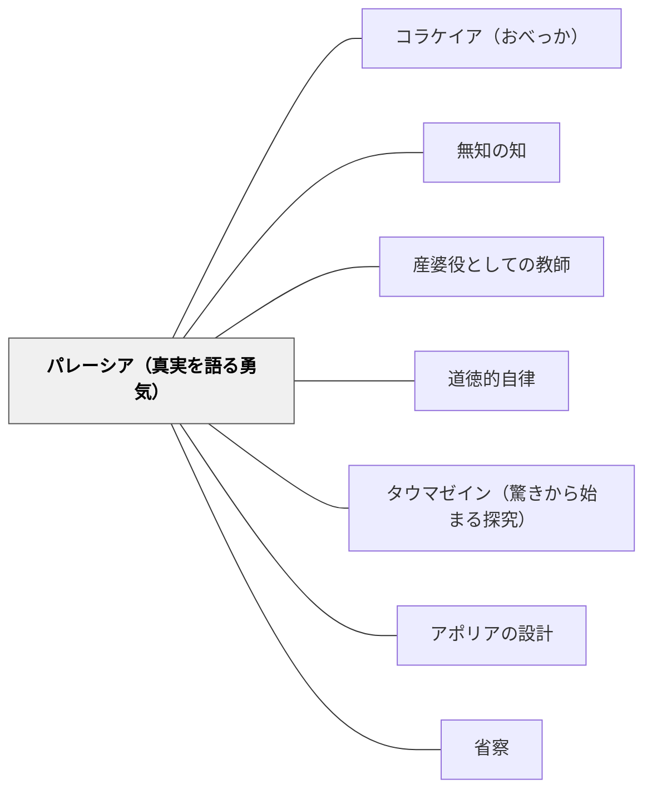

# パレーシア（真実を語る勇気）

> 語り手の徳は真実を語ること——美辞麗句でなく、真実の力そのもので相手に伝わるとき、それは最も深いところに届く。

## [Pattern Connection]

### プラトン『ソクラテスの弁明』（前390年代）——パレーシアの最高の実践例（17a–18a, 24a）

プラトン『ソクラテスの弁明』の冒頭でソクラテスは法廷の弁論スタイルを明確に拒絶する：

> 「あなた方はどなたも、これ以外の語り方を期待しないでください。……私は自分が語る中身が正しい、と信じているからです。」（17c）

> 「裁判員の徳は、語られている中身が正しいかどうかを判断し、そこに注意を向けること。弁論する者の徳は、真実を語ることなのですから。」（17b–18a）

これがパレーシア（parrhesia）の定義：語り手は真実を語ることで自分の義務を果たす。「うまく伝える」ことより「正しいことを伝える」ことが優先される。

**美辞麗句（レトリック）との対比：**

| 弁論術（修辞・レトリック） | パレーシア（真実の語り） |
|---|---|
| 相手を喜ばせるために語る | 真実を語るために語る |
| 聞き手を操作する（相手に危険） | 語り手が危険を引き受ける |
| 言葉の技術が主役 | 内容の真実が主役 |
| 上手く話せるほど有利 | 話し方が下手でも真実で伝わる |
| コラケイア（おべっか）と地続き | コラケイアの正反対 |

**「真実を語ることが憎まれる原因」（24a）：**

> 「私は、まさにこのこと、つまり真実を話すということで憎まれているのだということを、よく知っています。そして私が憎まれているというまさにそのことが、私が真実を語っていることの証拠でもあり……」（24a）

これはパレーシアの構造的特徴——真実の語りは聞き手を不快にさせ、語り手に危険を招く。しかし憎まれることが逆に真実の証明になるという逆説的な確証。

**既存パタンとの関連：**
- **補強点**：[[パタン/コラケイア（おべっか）]] の正反対として、「コラケイアを避ける」ための積極的な代替行動がパレーシアである
- **接続点**：[[パタン/無知の知]] との連関——「知らないことを知らないと思っている」を正直に認める行為はパレーシアの最も基本的な形態
- **波及するパタン**：[[パタン/産婆役としての教師]] — アテネの虻の行為（目を覚まさせるための刺し）はパレーシアを実践形態に変換したもの；[[パタン/道徳的自律]] — 自分の道徳的判断を公に語る勇気

---

### フーコー『真実の勇気』（1984年最終講義）——パレーシアの哲学的体系化

ミシェル・フーコーは死の直前（1984年2月〜3月）の最終講義でソクラテスの弁明を「パレーシアの最高の実践例」として徹底的に分析した。

**フーコーによるパレーシアの五要件：**

1. **真実性**：語り手が自分で真実だと信じることを語る（単なる意見ではない）
2. **危険の引き受け**：真実を語ることで自分が危険を負う（聞き手ではなく語り手がリスクを取る）
3. **勇気**：危険を知りながらあえて語る行為
4. **義務**：真実を語ることは語り手の義務であるという感覚
5. **批判性**：相手にとって不快な真実——「都合のいいこと」を語るのはパレーシアでない

**弁明のパレーシア的構造：**

ソクラテスは自分を死刑にする権限を持つ500人の裁判員を前に「私はあなた方を愛しているが、神に従います——哲学をやめることはありません」と語った。これはフーコーの分析では「究極のパレーシア」：

- 語ることで命を失うリスクを完全に引き受けている
- にもかかわらず語ることを選ぶ
- それが義務だと感じているから

**教育へのフーコー的示唆：**

教師はコラケイア（生徒を喜ばせること）とパレーシア（生徒に真実を伝えること）の間で常に選択を迫られる。「この子の今の答えは惜しい」より「この答えは間違っている、なぜなら……」と言うことは、関係を傷つけるリスクを引き受けるパレーシア的行為である。

**波及するパタン**：[[パタン/タウマゼイン（驚きから始まる探究）]] — タウマゼインを生む語りはパレーシアの教育的形態；[[パタン/コラケイア（おべっか）]] — フーコーのパレーシアはコラケイアの哲学的対位概念；[[文献/ソクラテスの弁明（プラトン）]] — 本統合の出典

---

## 背景（Context）

教師は日々、「本当のことを言う」と「生徒・保護者との関係を守る」の間で小さな選択をしている。「もう少し頑張れているね」という曖昧な評価か、「この部分は理解が足りていない、もう一度取り組もう」という直接的な指摘か。

アテナイの法廷に立ったソクラテス（前399年）は、修辞的な弁論を学べば助かる可能性があったのに、それを拒否して「真実のみを語る」と宣言した。死刑になることを知りながら。これは教師の日常的な「本当のことを言う」行為の極限的な形態である。

プラトンはこの場面を「弁論する者の徳は真実を語ること」（17b–18a）として定式化した。フーコーは20世紀にこれを「パレーシア（parrhesia）」と名付けて哲学的に体系化した。

## 問題（Problem）

「上手く伝えること」への圧力が「正しいことを伝えること」を圧迫する。生徒を傷つけたくない、保護者に嫌われたくない、授業の流れを止めたくない——こうした理由で、教師は「本当のことを言わない」小さな選択を積み重ねやすい。

その結果：
- 生徒は「自分は大丈夫だ」という偽の自信を持ち続ける
- 本当の弱点・理解のズレに気づかないまま進む
- 「先生は本当のことを言ってくれない」という不信が積み重なる

逆に言えば：本当のことを言ってもらった体験が、長期的な信頼と成長の基盤になる。

## 力のかたち（Forces）

- 真実を語ることは相手を不快にさせる可能性があり、語り手に関係の損傷リスクがある
- しかし「都合のいいことだけを語る」（コラケイア）は長期的に信頼を損なう
- 「うまく言う」訓練は「正しいことを言う」勇気とは別——話術は上達しても核心から遠ざかることがある
- 真実を受け取れる関係的安全（心理的安全性）がなければ、パレーシアは暴力になる
- パレーシアは「言いたいことを言う」（自己中心的な発言）ではない——相手への配慮の上で、それでも伝えることへのコミットメント

## 解決（Solution）

**「語り手の徳は真実を語ること」を自分の規範にする。話し方より内容の誠実さを優先し、相手が不快に感じるかもしれない真実を、相手への配慮を持ちながら伝える。**

---

### 授業でのパレーシアの実践

**「正直な評価」を言語化する**

「惜しかった」「よく頑張った」の代わりに「この部分は理解できている。この部分はまだ足りない。なぜなら……」と具体的に伝える。曖昧な肯定より具体的な指摘が真の助けになる。

**「わかりません」を教師自身が言う**

「先生もこれは分からない」「この問いには答えがない」を正直に言う——これはパレーシアの最も基本的な形態（無知の知）。教師が「分からない」を隠すとき、生徒も「分からない」を隠すようになる。

**心理的安全性を前提にする**

パレーシアは「安全でない環境で真実を言い放つ」ことではない。関係的な安全（この人は私を批判するためでなく助けるために言っている）を基盤に置いてからでないと、真実は暴力になる。信頼関係の上にパレーシアは成立する。

**「なぜそう思うの？」で問い返す**

生徒の答えが「あれっ、本当にそうか？」という場合、すぐに訂正せず「なぜそう思うの？」と問い返す。これは「あなたの答えは間違いだ」と言わずに「本当のことを探してほしい」と促す——ソクラテス的なパレーシアの教育的形態。

---

### 具体例1：算数の間違いに対して

「３×４＝７と答えた生徒に「惜しいね」ではなく「３×４は乗法、１２になる。なぜ7と思ったかを一緒に考えよう」——曖昧な評価より正直な指摘が学習に役立つ。ただし声のトーン・タイミング・生徒との関係が前提。

### 具体例2：授業で「先生もわからない」と言う

「この問いに対して先生も確信がない。一緒に考えてみよう」——教師の誠実な不知の宣言がパレーシアの教育的実践。生徒は「大人でも分からないことがある」という現実的な知識観を得る。

### 具体例3：通知表・保護者への説明

「よく頑張っています」で終わらせず「この点は伸びています。この点は課題があり、このように取り組んでいます」——保護者への正直な説明は関係を短期的に傷つけても長期的な信頼を作る。

---

## 結果（Consequences）

- 「真実を語る文化」が形成されると、生徒も「知らない」「分からない」を正直に表明できるようになる
- 曖昧な評価・おべっかより、具体的な指摘の方が長期的に生徒の信頼を得る
- 教師のパレーシアが産婆役としての問いかけ（「本当にそうか？」）と結びつくとき、学習に対する誠実さの文化が育つ
- ただし：パレーシアが心理的安全性なしに行われると、傷・恐怖・不信になる。パレーシアは無条件の正当化ではなく、条件付きの勇気

## 関連パタン

- [[パタン/コラケイア（おべっか）]] — パレーシアの正反対：聞き手を喜ばせることで言葉を曲げる行為
- [[パタン/無知の知]] — 「知らないと正直に言う」はパレーシアの最も基本的な形態
- [[パタン/産婆役としての教師]] — アテネの虻（30e–31a）：産婆役の「刺す」行為はパレーシアの実践
- [[パタン/道徳的自律]] — 「内から立ち上がる義務感」でパレーシアは支えられる
- [[パタン/タウマゼイン（驚きから始まる探究）]] — 驚きを生む語りはパレーシアの教育的形態
- [[パタン/アポリアの設計]] — アポリアを設計するとき「本当のことを問い返す」のがパレーシア的姿勢
- [[パタン/省察]] — 自分の行動・言葉を「本当のことを語っていたか」で省察する

## クラスター図

## Actionable Insight

- 「惜しい」「よく頑張った」という曖昧な評価を一つ選び、「この部分ができている。この部分はまだ足りない。なぜなら……」に言い換えてみる
- 「先生もこれは分からない」を授業中に一度言う機会を意識して作る——誠実な不知の宣言がパレーシアの最も安全な入り口
- 通知表・面談のコメントを「この子が不快に感じるかもしれないが必要な真実」という視点で一行見直す

## 出典

プラトン（前390年代）『ソクラテスの弁明』（納富信留訳）光文社古典新訳文庫、2012年

フーコー, M.（2009/1984）『真実の勇気——コレージュ・ド・フランス講義 1983–1984年度』（廣瀬浩司・原和之訳）筑摩書房

> 「裁判員の徳は、語られている中身が正しいかどうかを判断し、そこに注意を向けること。弁論する者の徳は、真実を語ることなのですから。」——ソクラテス（弁明 17b–18a）
