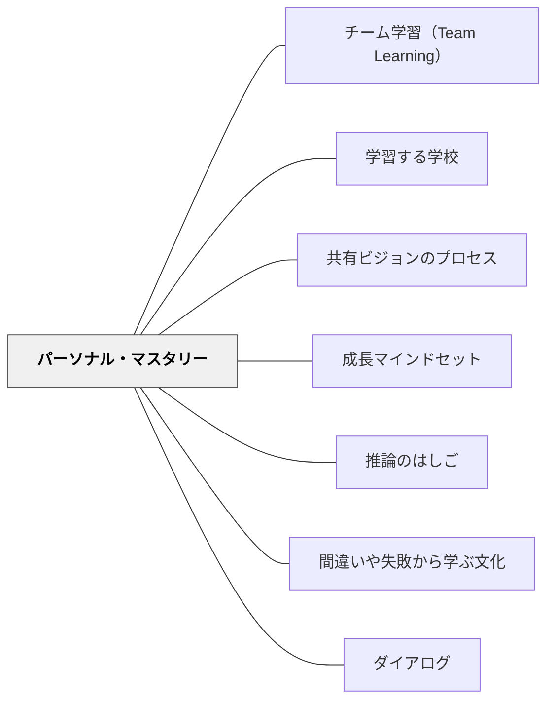

# パーソナル・マスタリー

> ビジョンと現実のギャップは失望ではなく、エネルギーだ。そのギャップを埋めようとする引力こそが、持続的な学習を生む。

## [Pattern Connection]

*Schools That Learn*（Senge et al.）の5つのディシプリンのうち、唯一「個人の実践」として位置づけられる第1のディシプリン。

- **既存パタンとの関連**：[[パタン/共有ビジョンのプロセス]] が「集団でビジョンを作る」プロセスを扱うのに対し、本パタンはその前提となる「個人がビジョンを持ち続ける能力」を扱う。個人のビジョンが明確でなければ、共有ビジョンへのコミットメントは遵守に終わる。
- **補強された点**：[[パタン/成長マインドセット]] は「努力で伸びる」という信念を扱うが、パーソナル・マスタリーはその構造的基盤を提供する——ビジョンと現実のギャップを「クリエイティブ・テンション」として体験できる人は、失敗を学習の情報として使える。失敗した後に自己効力感が下がらないのは信念だけでなく、ビジョンの明確さによる。
- **修正・拡張された点**：教師の成長・バーンアウト予防が「スキルの習得」や「環境改善」だけで解決されないことを示す。「理想と現実のギャップを感じる」こと自体が問題なのではなく、そのギャップをどのように体験するか（クリエイティブ vs. エモーショナル・テンション）が問題の核心である。
- **他のパタンへの波及**：[[パタン/学習する学校]] の第1ディシプリンの具体的実践として機能する。[[パタン/間違いや失敗から学ぶ文化]] を個人レベルで実践するための基盤ともなる。

---

## 背景（Context）

多くの教師は教職に就いたとき、ある種のビジョンを持っている——子どもが生き生きと学ぶ姿、信頼に満ちた関係、知的な喜びが響く教室。しかし、現実の教室はそのビジョンと大きく異なることが多い。

このギャップに直面したとき、教師はどちらかの反応をとる。ひとつは「ビジョンを下げる」——理想は高すぎた、現実とはこういうものだ、と期待を縮小していく。もうひとつは「ギャップを構造として保持する」——今ここに引力（テンション）がある、それが自分の次の一歩を生む、と感じる。

Sengeはこの違いを「エモーショナル・テンション」と「クリエイティブ・テンション」と呼ぶ。前者はギャップを不快として体験し、ビジョンを引き下げることで解消しようとする。後者はギャップを学習のエネルギーとして使う。パーソナル・マスタリーとは、この後者の構造を意図的に育てる実践である。

## 問題（Problem）

教師が「理想と現実のギャップ」を継続的に感じると、エモーショナル・テンションとして体験しやすくなる。その結果として：

- ビジョンを下げる（「この子たちにはそこまで期待しなくていい」「自分にはそこまでの力がない」）
- 問題を外部に帰属させる（「制度が悪い」「保護者が協力しない」）
- 日常業務をこなすことが目的化し、なぜ教えているかが見えなくなる

これはモチベーションの問題ではなく、「ビジョンを持ち続ける構造」が整っていないという設計の問題である。

## 力のかたち（Forces）

- 個人のビジョンは、明確に言語化されないと日常の負荷に押されて薄れやすい
- 「現実を正直に見る」ことは、批判・批難・絶望とは異なる——現実を直視するほど、ビジョンとのギャップが明確になりクリエイティブ・テンションが強まる
- ビジョンを「持たなければならない目標」として課すと、外的義務になり内側からの動機が消える
- 「いつかそうなれたらいい」という希望は、「そうあることを選ぶ」というビジョンとは異なる——ビジョンは未来形ではなく現在形で体験される
- 構造的葛藤（「欲しいものを持てないという信念」）が根深いと、ビジョンに近づくほど引き戻される感覚が生まれる

## 解決（Solution）

**ビジョンと現実のギャップをクリエイティブ・テンションとして体験できる構造を、意図的に育てる。**

---

### クリエイティブ・テンションの3要素

**1. 個人のビジョンを明確にする**

「どんな教室を作りたいか」ではなく「自分はどんな学びの体験を子どもに届けたいか」——目標（達成すれば終わるもの）ではなく、継続的に向かい続けたいイメージとして持つ。

実践：
- 「5年後、あなたの教室で一番印象的に学んでいる子どもの姿を、具体的に描いてください」
- ビジョンは「べき」ではなく「したい」という言語で書く——「生徒が主体的に学ぶべき」ではなく「生徒が喜びと共に学んでいる姿を見たい」
- ビジョンは公開する義務はない——自分のためのものとして持つことが先

**2. 現実を正直に見る**

ビジョンと同じくらい大切なのが「今どこにいるか」を正直に知ること。現実を小さく見ることも、大きく見ることも、クリエイティブ・テンションを弱める。

- 「今の教室は、自分のビジョンと比べてどうか？」——批判でなく観察として
- 現実を語る言語：「〜はうまくいっていない」（事実）vs.「自分は失敗している」（評価）

**3. ギャップを「引力」として保持する**

ビジョン（行きたい場所）と現実（今いる場所）の差が明確であるほど、その差を埋めようとする引力が生まれる。これが「クリエイティブ・テンション」である。

- この引力を感じるとき、モチベーションを「つくる」必要はない——ギャップ自体がエネルギーを供給する
- 引力が弱いと感じるときは、ビジョンが曖昧になっているか、現実を直視できていないことが多い
- ビジョンを達成した後は、次のビジョンが生まれる——パーソナル・マスタリーは終わりのない実践である

---

### エモーショナル・テンションを認識する

クリエイティブ・テンションとエモーショナル・テンションの違い：

| | クリエイティブ・テンション | エモーショナル・テンション |
|---|---|---|
| **体験** | ギャップが引力として感じられる | ギャップが不快・不安として感じられる |
| **対応** | ビジョンに向かって行動する | ビジョンを引き下げて不快を解消する |
| **結果** | 現実が少しずつビジョンに近づく | ビジョンが現実に合わせて縮小する |

エモーショナル・テンションの典型的なサイン：
- 「どうせ変わらない」という言葉が増える
- 日常業務のこなし方は変わらないのに、意欲だけが低下する
- 自分の教室のビジョンを語れなくなる

---

### Nelda Cambron-McCabe による教師のパーソナル・マスタリー実践

Miami University の Nelda Cambron-McCabe は、教育リーダーシップの授業でパーソナル・マスタリーを中心に置いた。

彼女の問い：「あなたはなぜ教師になったのか？その原点に、今の実践はつながっているか？」

この問いを問い続けることが、日々の業務に埋没せずビジョンとの接続を保つ実践になる。Nelda自身の経験として——制度的圧力や官僚的要求の中でビジョンを保つことは、外側からの支援ではなく内側からの明確さによってのみ可能になる、と述べている。

---

## 結果（Consequences）

- ビジョンが明確な教師は、変化・困難・失敗を「学習の材料」として使いやすくなる
- クリエイティブ・テンションを保持できると、バーンアウトの構造的リスクが下がる——疲弊は多くの場合「意味が見えなくなる」ことから来るが、ビジョンが意味の錨になる
- ただし、個人のビジョンが組織の価値観と長期的に乖離する場合、創造的な葛藤が慢性的ストレスに転化することがある——組織のビジョン構築（[[パタン/共有ビジョンのプロセス]]）との連携が重要
- パーソナル・マスタリーは「達成する」ものではなく「実践し続ける」ディシプリンである——スキルより習慣として育てる

## 関連パタン
- [[パタン/チーム学習（Team Learning）]]

- [[パタン/学習する学校]] — 5つのディシプリンの第1として、すべての組織学習の個人的基盤
- [[パタン/共有ビジョンのプロセス]] — 個人ビジョンが明確でなければ、共有ビジョンへの本当のコミットメントは生まれない
- [[パタン/成長マインドセット]] — クリエイティブ・テンションは成長マインドセットの構造的基盤
- [[パタン/推論のはしご]] — 現実を正確に観察する能力がクリエイティブ・テンションの質を決める
- [[パタン/間違いや失敗から学ぶ文化]] — ビジョンを持っている人は失敗を「情報」として使える
- [[パタン/ダイアログ]] — チームでのパーソナル・マスタリー実践の場として機能する

---

## クラスター図

## Actionable Insight

- **今週、自分のビジョンを書く**：「5年後、自分の教室で子どもが最も生き生きしている場面を、具体的に描く」——「べき」の言葉を使わず、「したい」「見たい」「届けたい」という言葉だけで書く。完成させることより、何が出てくるかを観察することが目的
- **今の現実を1行で書く**：ビジョンを書いた後、「今の教室の実態を一言で表すと？」を書く——批判でも言い訳でもなく、観察として。この2つを並べて「ギャップ」を一言で書く。そのギャップを「引力」として感じられるか確認する
- **エモーショナル・テンションの兆候に気づく**：「どうせ変わらない」「この子たちにはそこまで要らない」という言葉が自分の内側に出てきたとき、それはビジョンを引き下げようとするサインとして認識する。ビジョンを変えるのではなく、「今のギャップの大きさ」を確認し直す
- **月1回、問いに戻る**：「あなたはなぜ教師になったのか？」——答えを探すのではなく、問いを持ち続けること自体がパーソナル・マスタリーの実践になる

## 出典

Senge, P., Cambron-McCabe, N., Lucas, T., Smith, B., Dutton, J., & Kleiner, A. (2000/2012). *Schools That Learn* (Updated and Revised ed.). Crown Business. Part II: Classroom Learning.

Senge, P. M. (1990). *The Fifth Discipline: The Art and Practice of the Learning Organization*. Doubleday.

> 「個人のマスタリーとは、何かを支配する技術ではない。それは、自分が最も深いところで気にかけていることに向かって、人生を生きることを学ぶことだ」——Senge（1990/2012）

[[文献/Schools That Learn（Senge et al.）]]
