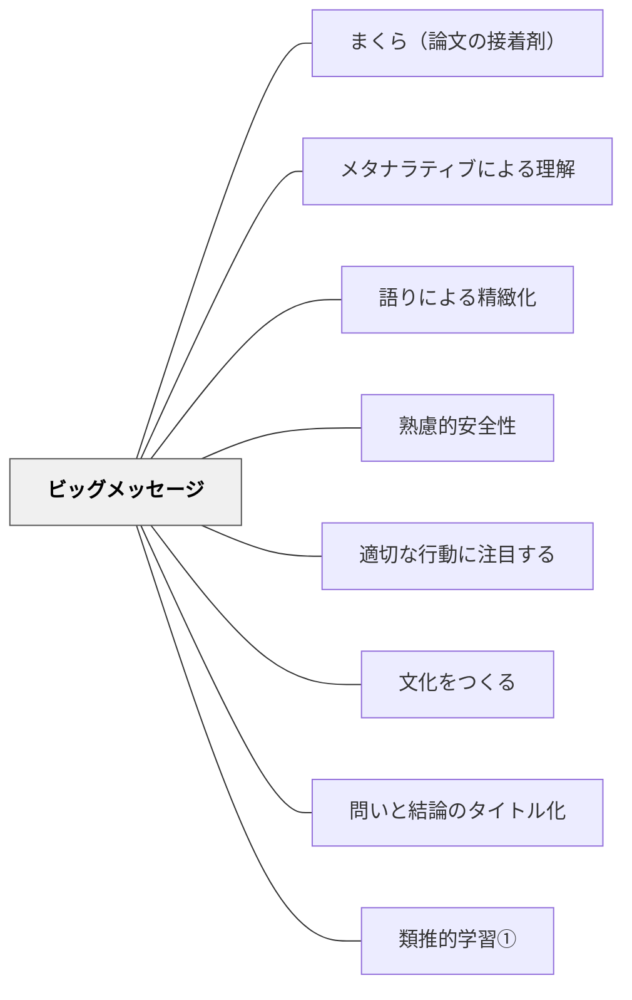

# ビッグ・メッセージ

> ビッグ・メッセージを持ち、生徒たちに伝えよ。

## 背景（Context）

熟達した教師はビッグ・メッセージを持っていて、それを非教育者に伝えている。一方で非教育者は教育者が何を期待しているのかわからない。授業の方法や内容についてなぜその方法や内容なのか分かっていない——そういう状況がある。

## 問題（Problem）

その教育経験の設計は、子どもたちにとってどのような意味があるのか。意味や価値観が伝わっていないと、学習者は「なぜこれをやるのか」が腑に落ちないまま活動するだけになってしまう。

## 力のかたち（Forces）

- 教師の意図と学習者の受け取りのあいだには大きなギャップがある
- 価値観は一度伝えるだけでは定着しない——繰り返し取り上げることで文化になる
- 言葉にして伝えることで、教師自身の実践も価値観に基づいて一貫してくる

## 解決（Solution）

**ビッグ・メッセージを持ち、生徒たちに伝えよ。**

「ビッグ・メッセージ」というパタンは、アメリカのリーディング・ワークショップの実践者**フランキ・シバーソン**の本にある言葉（原著は "Big Messages"、複数形）。シバーソンはビッグ・メッセージとは「その時間で大切なこと——その時間では何が大切なのかを子どもたちと価値観として共有するもの」だという。シバーソンの本を読み、さまざまな教師を観察して至った結論：多くの優れた教師は、価値観を共有するためのビッグ・メッセージをいくつか持っているものだ。

---

### 事例①：リーディング・ワークショップのビッグ・メッセージ（シバーソン）

リーディング・ワークショップはミニレッスン→読む時間→共有の時間というサイクルで動く。シバーソンはそれぞれの時間にビッグ・メッセージを送っている。

**ミニ・レッスンの時間に贈るビッグ・メッセージ**

- あなたがどんな読み手か知ることは、前に進むのを助けます
- あなたが読んでいるテキストについて考える方法がたくさんあります
- 読んでいる間の考えていることに注意を払うことは大切です
- 行き詰まったときの自分を助けるため、あなたはたくさんできることがあります
- テキストは読み手によって難しいかもしれないし、簡単かもしれないです
- すべての読み手は一部の種類のテキストで苦労します

**読む時間に贈るビッグ・メッセージ**

- 人々は様々な理由で本を選びます
- 個々の好みと気分は本を選ぶ時に大切です
- あなたに本をお勧めできる人たちがクラスの中にいます
- 読み手として他人を知ることは、読み手としてのあなたの成長を助けます
- あなたが最初から最後まで読めて楽しめる本を見つけることが大切です
- 人々は時々他の人が好きで読んだことが選書の理由になることがあります
- 読んだことの記録は未来の読書を助けることができます
- 人々は読んでいる間に様々な考えを持っています
- あなた自身の読書について深く考えることは、読み手としてのあなたの成長に大切です
- 先生は読み手としてあなたがどんな人か興味があります
- 読み手としての自分を知ることは、読み手としての成長を助けます
- 下読み（プレビューイング）は選書を助けます

**共有の時間に贈るビッグ・メッセージ**

- あなたが読むことについて気づいたことを共有することは、他の人の読み手としての成長を助けることができます

---

### 事例②：学級開きの6つのメッセージ（小倉勝典 2020）

小倉勝典（2020）は学級開きに次の6つのメッセージを子どもたちに伝えるという。このような学級づくりが授業づくりの前提条件になると小倉は言う。

1. **35+1** — 学級は35+1で作る。誰1人欠けてもダメだし、誰か1人で作れるものでもない。教師も含めてみんなで作っていくもの
2. **チャレンジしよう** — 人間、失敗なんて当たり前。失敗を恐れない。失敗を忘れない。失敗を繰り返さずに生かしましょう
3. **提案しよう** — 色々なアイデアを出し合って、自分たちの学級・学校生活を自分たちで作っていこう
4. **助け合い・認め合い・高め合おう**
5. **温かい言葉がけを心がけよう** — 人の心を傷つける言葉・態度は絶対に許さない。特に身体的なことは冗談でも言ってはいけない
6. **遠慮せず** — 先生が間違えたら言ってください。私も間違えます。間違えたら謝ります

（詳細は小倉勝典 2020 を参照）

---

### 事例③：岩井が伝えてきたビッグ・メッセージ

**「間違えることは悪いことではない」**  
「教室は間違うところだ」（蒔田晋治）という本を読み語ることで、どの学年の子どもたちにも「間違えることは悪いことではない、間違いから学んでいこう」というビッグ・メッセージとして伝えてきた。ジョン・ハッティの研究でも指摘されているように、このような学級経営が子どもたちの学力に与える影響は大きい。

**フルバリューコントラクトとチャレンジバイチョイス**（プロジェクトアドベンチャーの影響）  
どの学年の子どもたちにも伝えてきた価値観：

- **フルバリューコントラクト**——お互いを大切にし合うという契約。一生懸命やる・安全にやる・目標に向かう・楽しむ・参加するなど
- **チャレンジバイチョイス**——チャレンジするレベルを選べるということ。1日中の学校生活を貫く考え方として伝えてきた

チャレンジバイチョイスの具体例：
- 給食の時間——嫌いなものがあっても食べる量・チャレンジする量は子どもたちが決める（食育した上で）
- プールの学習——肩まで→顎まで→口まで→鼻まで→眉毛まで→頭までとスモールステップで潜っていく。「できるところまででいいよ、どこまでチャレンジするかは選べるよ」と伝える。子どもたちの心理的安全につながる

**「いつも読みかけの本をポケットに」**  
以前同じ学校で働いた、作文の会の先生の教室の前面右上に「いつも読みかけの本を（ポケットに）」という掲示物が貼ってあった。その先生のクラスの子どもたちは本をよく読み、日記もたくさん書いていた。このメッセージから影響を受け、自分も子どもたちに「いつも読みかけの本を持つようにしよう」ということをビッグ・メッセージとして伝えてきた。

---

ビッグ・メッセージは**掲示**することもできる。同じビッグ・メッセージを繰り返し取り上げることで、ビッグ・メッセージは学級の文化・デフォルトになっていく。

## 結果（Consequences）

- 生徒たちは教師の価値観や考え方を理解し、感情面でもよりよく学習に取り組めるようになる
- 繰り返し伝えることで、価値観が学級の当たり前（文化）として定着する
- 教師自身の実践が価値観に基づいて一貫してくる

## 関連パタン
- [[パタン/まくら（論文の接着剤）]]
- [[パタン/メタナラティブによる理解]]
- [[パタン/語りによる精緻化]]
- [[パタン/心理的安全性（コンフォートゾーン）]]
- [[パタン/適切な行動に注目する]]
- [[パタン/文化をつくる]]
- [[パタン/問いと結論のタイトル化]]
- [[パタン/類推的学習①]]

## このパタンが働く実践
- [[実践/ノート指導（読み書きハンドブック・ノート検定）]]

| 実践パタン | どのようにビッグメッセージが働くか |
|------------|------------------------------------|
| [[パタン/リーディング・ワークショップ]] | ミニ・レッスンで、読むことの意味や読み手としての構えを短く伝える |
| [[パタン/ブッククラブ]] | 読書会を「正解探し」ではなく、読みを持ち寄る場として位置づける |

## このパタンが働く教材

| 教材 | どのようにビッグメッセージが働くか |
|------|------------------------------------|
| [[教材/ブック・バズ・ノート]] | 本を短く紹介し合うことで、「読んだ本は仲間の次の読書を助ける」というメッセージを共有する |

- [[パタン/文化をつくる]] — ビッグ・メッセージは文化形成の基盤
- [[パタン/当たり前をつくる]] — 繰り返しのビッグ・メッセージが学級の当たり前になる
- [[パタン/心理的安全性（コンフォートゾーン）]] — チャレンジバイチョイスとの接続
- [[パタン/アドベンチャー]] — フルバリューコントラクト・チャレンジバイチョイスの出典
- [[パタン/フィードバック文化]] — 間違いから学ぶ文化
- [[パタン/まくら（論文の接着剤）]] — 論文全体の主張をつなぐまくらの背後にビッグ・メッセージがある
- [[パタン/問いと結論のタイトル化]] — サブタイトル（結論）はビッグ・メッセージの論文形式版

## クラスター図

## Actionable Insight

- 自分が伝えたい「ビッグ・メッセージ」を3つ書き出す——授業の中でどんな価値観を学習者と共有したいかを言語化する
- ミニレッスンや授業の締めくくりに「今日大切だったのは○○です」という一文を添える——この一言が繰り返されることで文化になる
- 子どもの行動にビッグ・メッセージが現れたときに名前をつけて称える——価値観に名前がつくと子どもたちが使えるようになる

## 出典
- [[文献/一つの教育のパタン・ランゲージ]]
- [[文献/読み書き教育における類推的学習の研究（第二版）]]

Franki Sibberson "Big Messages"（リーディング・ワークショップ実践）  
小倉勝典（2020）学級開きのビッグ・メッセージ  
蒔田晋治「教室は間違うところだ」（読み語り素材）  
ジョン・ハッティ（学級経営の学力への影響）  
プロジェクトアドベンチャー（フルバリューコントラクト・チャレンジバイチョイス）  
岩井輝久「岩井輝久『一つの教育のパタン・ランゲージ』」（2026-04-29 vault収録）  
岩井輝久「パタン　ビッグ・メッセージ（動画記録）」https://youtu.be/Rhtm4uCYWF4
