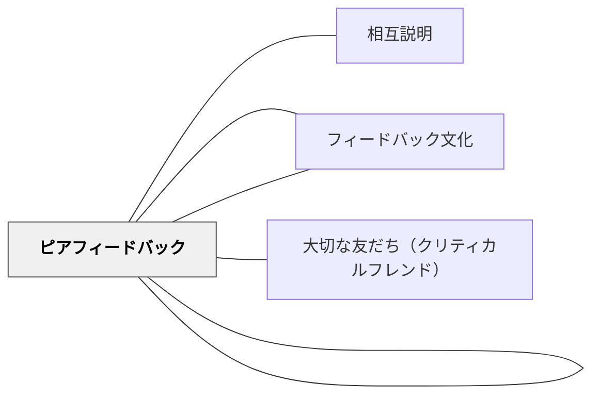

# ピアコーチング

> 一回のフィードバック交換を超えて、学習者同士が継続的に互いを支え観察し励ます関係を築く。

## 背景（Context）

[[パタン/ピアフィードバック]]が単発的なフィードバックの交換であるのに対して、ピアコーチング（Peer Coaching）は継続的な関係としてのピア支援である。コーチングは元来、スポーツや専門家の能力開発の文脈で発展した実践であり、それを学習者同士の関係に適用したものがピアコーチングである。

継続的な関係の中では、一回のフィードバックでは伝えられない観察・理解の蓄積が生まれる。コーチとしての学習者は、相手の成長のパターン・課題・強みを時間をかけて把握し、より深く具体的な支援ができるようになる。

## 問題（Problem）

学校の学習は、授業単位・課題単位で区切られることが多く、継続的なフィードバック関係が生まれにくい。教師と学習者の関係も、クラス全体への対応から個別の継続的関係まで発展させる時間が足りないことが多い。

学習者同士の継続的なコーチング関係を育てるためには、信頼と相互理解の積み重ねが必要であり、関係性の設計と十分な時間の確保が課題となる。コーチングのスキル（質問・傾聴・観察・フィードバック）を学習者自身が習得する機会も必要である。

## 力のかたち（Forces）

- 継続的な関係は一回きりの交換より深い観察と理解を可能にし、より精度の高いフィードバックが生まれる
- コーチ役の学習者自身が観察・質問・フィードバックの技術を高め、メタ認知が育つ
- 継続的関係の構築には時間と設計が必要で、短い授業単位では機能しにくい

## 解決（Solution）

単元や学期を通じて継続するペアまたは小グループのコーチング関係を設計する。ペアを固定し、定期的に互いの学習・作品・目標に関する対話の時間を設ける。コーチ役の学習者が使う質問（「今どこで詰まっている？」「前回からどう変わった？」「次に何を試す？」）を教え、実践で磨く。

コーチング記録（簡単なメモ・振り返りシート）をつけることで、関係の積み重ねが可視化される。教師はコーチングの過程を観察し、学習者のコーチングスキルへのフィードバックも行う。[[パタン/フィードバック文化]]と[[パタン/実践ジャーナル]]を組み合わせることで、ピアコーチングが学習コミュニティの習慣として根付く。

## 結果（Consequences）

- 継続的な観察により、フィードバックの精度と深さが増す
- コーチ役の学習者の観察力・傾聴力・フィードバックスキルが向上する
- 関係の設計・コーチングスキルの指導・時間の確保という複数の条件を整える必要がある

## 関連パタン
- [[パタン/相互説明]]

- [[パタン/フィードバック]] — 親パタン
- [[パタン/ピアフィードバック]] — ピアコーチングの基盤となる一回きりのフィードバック
- [[パタン/フィードバック文化]] — ピアコーチングが根付くための文化的土台
- [[パタン/大切な友だち（クリティカルフレンド）]] — ピアコーチングが目指す関係性

## クラスター図

## Actionable Insight

- 単元を通じてペアを固定し「前回からどう変わった？」「次に何を試す？」という問いで定期的に対話させる——継続的な関係の中で観察が蓄積し精度の高いフィードバックが生まれる
- コーチ役の学習者に「質問する・聴く・観察する」の3役割を教えてから実践させる——役割を知ることでコーチング関係が形式的な「教え合い」を超える
- コーチング後に「相手の学習を観察して気づいたこと」を簡単にメモさせる——記録が蓄積することでコーチ役自身のメタ認知が育つ

## 出典

Joyce, B. & Showers, B. (1982). The Coaching of Teaching. *Educational Leadership*, 40(1), 4–10.
