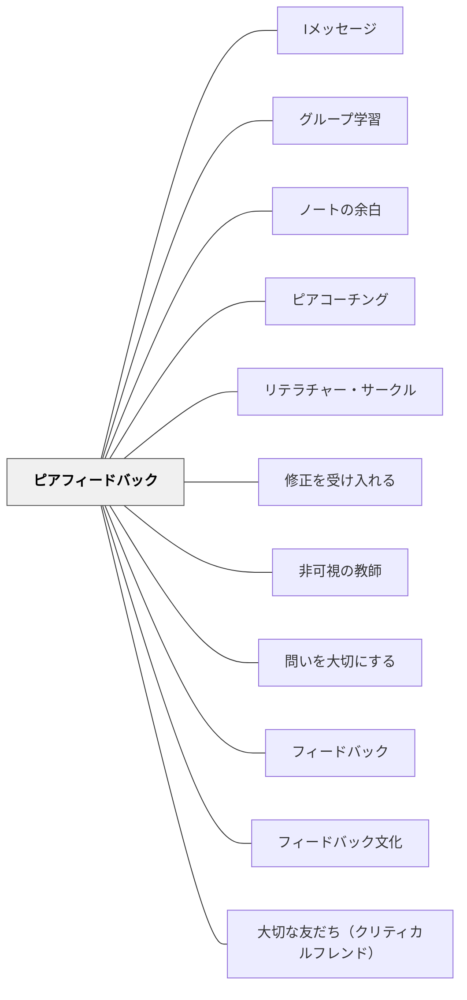

# ピアフィードバック

**一文でいうと**：学習者同士が互いの作品や考えに情報を返し合い、改善の資源にする。

## 使いどころ・使いすぎ注意

| 観点         | 内容                                             |
| ------------ | ------------------------------------------------ |
| 使いどころ   | 学習者同士で改善したいとき。                     |
| 使いすぎ注意 | 関係性や基準が弱いと、表面的な感想になりやすい。 |

> 学習者同士が互いの作品・パフォーマンスにフィードバックし合う。教えることは学ぶことであり、与える側も受け取る側も共に育つ。

## [Pattern Connection]

Bergin et al.（2012）の **Peer Feedback \*\*** パタンは、既存のピアフィードバックの根拠を「与える側の学習」という視点で補強する。

- **補強点**：「ピアフィードバックは受け取る側だけでなく与える側に、むしろより多くの学習効果がある」——フィードバックを与えるためにアーティファクトを深く読み・分析することが学習そのものになる。「When the student moves later to the world of work she will be called on to Critique the work of others, so this is good early practice.」
- **拡張点**：**エージェント技法**——チームで制作した場合、一人のメンバーがアーティファクトに「エージェント」として同行し、レビューチームに内側の視点を提供する。フィードバックフォームを用意することで構造化が容易になる。
- **他のパタンへの波及**：[[パタン/非可視の教師]] — ピアフィードバックは非可視の教師の中核的実装。[[パタン/修正を受け入れる]] — フィードバックを受けて成果物を改善するサイクルの起点。[[パタン/サンドウィッチフィードバック]] — 建設的フィードバックのプロトコルとして。

---

## 背景（Context）

教師が一人で全ての学習者に十分なフィードバックを届けることには物理的な限界がある。ピアフィードバック（Peer Feedback）は、学習者同士が互いの作品・パフォーマンス・思考にフィードバックを与え合う実践であり、フィードバックの量を増やし、学習者が評価の視点を身につけることを促す。

ピアフィードバックは単なる「友達に教えてもらう」活動ではない。評価の基準を共有し、分析的に観察し、建設的な批評を言語化するという高度な認知スキルと、心理的な安全を保つ関係性・文化を必要とする。

## 問題（Problem）

ピアフィードバックは設計なしに行うと、「よかったよ」という表面的な称賛の交換になりやすい。批評することへの抵抗感、評価する能力への不信感、関係性を傷つけることへの恐れが、誠実なフィードバックを妨げる。

また、ピアからのフィードバックの「正確さ」への懐疑（「友達の言うことが本当に正しいの？」）も、フィードバックの活用を阻む要因となる。プロトコルと文化の両方が整備されていないと機能しにくい。

## 力のかたち（Forces）

- 学習者が与え手になることで評価の視点が育ち、自己評価能力も向上する
- 心理的な安全と明確なプロトコルがなければ表面的な交換に留まる
- ピアフィードバックは受け取る側だけでなく与える側の学習にも効果がある

## 解決（Solution）

ピアフィードバックを実施する前に、評価の基準（ルーブリック・達成規準）を学習者全員で共有する。フィードバックを与えるための具体的なプロトコル（「まず良い点を一つ、次に改善の提案を一つ」など）を教え、練習する機会を設ける。

[[パタン/フィードバック文化]]の土台として、批評を「攻撃」ではなく「贈り物」として受け取る文化を育てる。[[パタン/大切な友だち（クリティカルフレンド）]]の姿勢と[[パタン/Iメッセージ]]の言語スキルをピアフィードバックの実践に組み込む。最初は教師がモデルを示し、ピアフィードバックをスキルとして段階的に教えることが重要である。

## 結果（Consequences）

- 学習者がフィードバックを与える経験を通じて、評価の視点と自己評価能力が育つ
- 教師一人では届かないフィードバックの量が増え、学習の改善機会が増える
- 文化・プロトコルの準備なしに行うと、表面的な活動に終わるリスクがある

## 関連パタン
- [[パタン/Iメッセージ]]
- [[パタン/グループ学習]]
- [[パタン/ノートの余白]]
- [[パタン/ピアコーチング]]
- [[パタン/リテラチャー・サークル]]
- [[パタン/修正を受け入れる]]
- [[パタン/非可視の教師]]
- [[パタン/問いを大切にする]]

- [[パタン/フィードバック]] — 親パタン
- [[パタン/フィードバック文化]] — ピアフィードバックが機能する文化的土台
- [[パタン/大切な友だち（クリティカルフレンド）]] — ピアフィードバックの関係性の理想
## このパタンが働く実践

| 実践パタン                                      | どのようにピアフィードバックが働くか                                     |
| ----------------------------------------------- | ------------------------------------------------------------------------ |
| [[実践/ローベルみたいな物語を書こう]]           | 相談したいことを明確にしてから交流し、友達の助言を構成表の手直しに生かす |
| [[実践/俳句と短歌を楽しもう]]                   | 句会で選んだ俳句の感想を聴き合い、修正や表現の見方へつなげる             |
| [[実践/詩を紹介する・詩を創作する]]             | 友達の紹介文や詩を読み、よいところや感想を付箋に書いて渡す               |
| [[実践/言葉をよりすぐって俳句を作ろう]]         | 俳句の表現の仕方に着目して、よいところや改善の助言を伝え合う             |
| [[パタン/ブッククラブ]]                         | 仲間の読みを聞き、問い返しや応答によって互いの解釈を深める               |
| [[パタン/大切な友だち（クリティカルフレンド）]] | 批評的でありながら友好的な関係性をフィードバックの土台にする             |

## クラスター図

## Actionable Insight

- ピアフィードバックを始める前にルーブリックや達成規準を全員で確認する——共通の基準なしにピアフィードバックを行うと「感想の交換」になる
- 最初に教師が「こうフィードバックする」というモデルを見せてから学習者に実践させる——モデルがあることでプロトコルが身体的に理解される
- フィードバックを受けた後「一つ変えること」を決めてメモする時間を3分設ける——受け取った情報が行動に変わる橋をかけることがピアフィードバックを学習に変える

## 出典

Topping, K. (1998). Peer Assessment Between Students in Colleges and Universities. _Review of Educational Research_, 68(3), 249–276.
Hattie, J. (2009). _Visible Learning_. Routledge.
